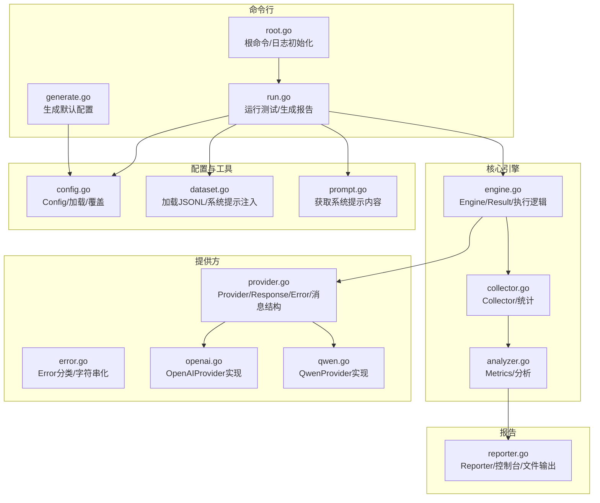
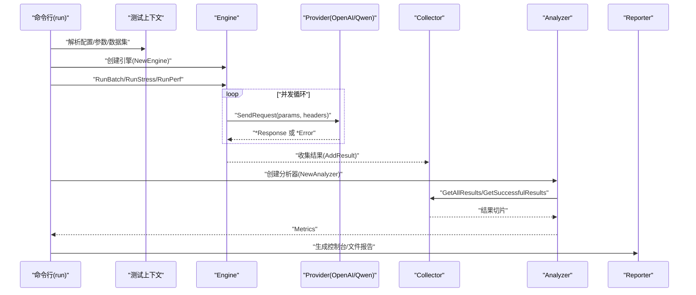
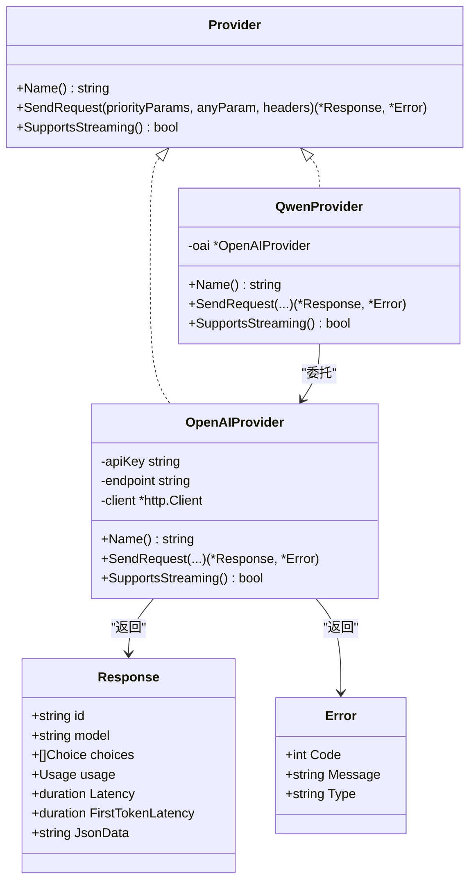
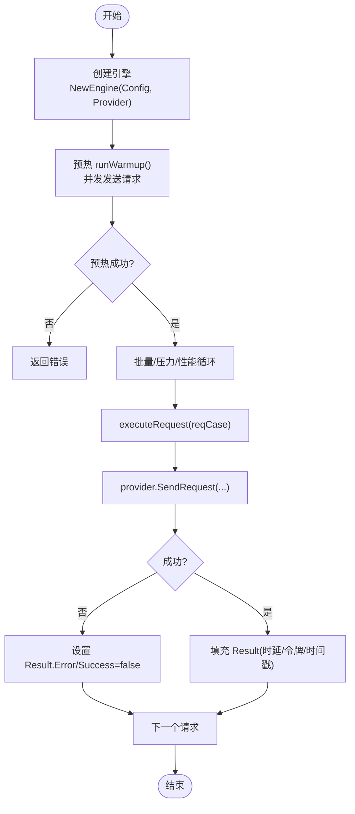
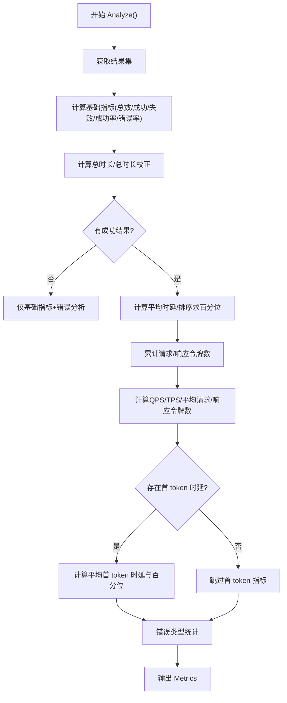
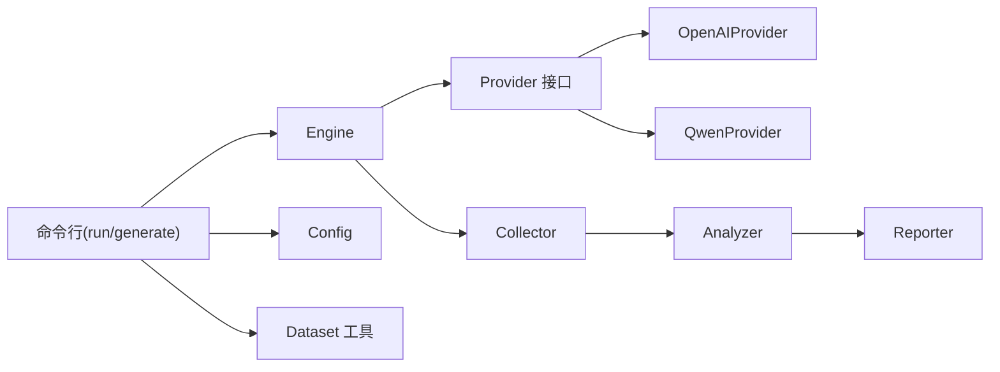

# API 参考

<cite>
**本文引用的文件**
- [internal/provider/provider.go](file://internal/provider/provider.go)
- [internal/provider/error.go](file://internal/provider/error.go)
- [internal/provider/openai.go](file://internal/provider/openai.go)
- [internal/provider/qwen.go](file://internal/provider/qwen.go)
- [internal/engine/engine.go](file://internal/engine/engine.go)
- [internal/collector/collector.go](file://internal/collector/collector.go)
- [internal/analyzer/analyzer.go](file://internal/analyzer/analyzer.go)
- [internal/config/config.go](file://internal/config/config.go)
- [internal/utils/dataset.go](file://internal/utils/dataset.go)
- [internal/utils/prompt.go](file://internal/utils/prompt.go)
- [internal/reporter/reporter.go](file://internal/reporter/reporter.go)
- [cmd/root.go](file://cmd/root.go)
- [cmd/generate.go](file://cmd/generate.go)
- [cmd/run.go](file://cmd/run.go)
- [configs/example.yaml](file://configs/example.yaml)
- [go.mod](file://go.mod)
</cite>

## 目录
1. [简介](#简介)
2. [项目结构](#项目结构)
3. [核心组件](#核心组件)
4. [架构总览](#架构总览)
5. [详细组件分析](#详细组件分析)
6. [依赖分析](#依赖分析)
7. [性能考量](#性能考量)
8. [故障排查指南](#故障排查指南)
9. [结论](#结论)
10. [附录](#附录)

## 简介
本文件为 GoLLMPerF 的 API 参考文档，聚焦于以下核心接口与数据模型：
- Provider 接口：抽象不同大模型提供商（如 OpenAI、Qwen）的统一请求能力
- Engine 接口：测试引擎，负责批量/压力/性能模式下的请求执行与结果收集
- Collector 接口：结果收集器，聚合与统计测试结果
- Analyzer 接口：分析器，基于收集结果计算性能指标
- 核心数据模型：Config、Result、Metrics 等

文档将详细说明各接口方法签名、参数定义、返回值、异常处理、接口间依赖关系与调用顺序，并提供使用场景与最佳实践。

## 项目结构
GoLLMPerF 采用分层设计：
- 命令行入口与子命令：cmd 包提供 run、generate 等命令
- 配置管理：internal/config 提供配置加载与默认生成
- 数据集与提示词工具：internal/utils 提供数据集加载与系统提示词注入
- Provider 抽象与实现：internal/provider 定义 Provider 接口及 OpenAI/Qwen 实现
- 引擎：internal/engine 负责执行测试（批量/压力/性能）
- 收集器：internal/collector 聚合结果
- 分析器：internal/analyzer 计算指标
- 报告器：internal/reporter 生成控制台/JSON/CSV/HTML 报告

图表来源
- [cmd/root.go:1-28](file://cmd/root.go#L1-L28)
- [cmd/generate.go:1-26](file://cmd/generate.go#L1-L26)
- [cmd/run.go:1-123](file://cmd/run.go#L1-L123)
- [internal/config/config.go:1-229](file://internal/config/config.go#L1-L229)
- [internal/utils/dataset.go:1-126](file://internal/utils/dataset.go#L1-L126)
- [internal/utils/prompt.go:1-42](file://internal/utils/prompt.go#L1-L42)
- [internal/engine/engine.go:1-112](file://internal/engine/engine.go#L1-L112)
- [internal/collector/collector.go:1-97](file://internal/collector/collector.go#L1-L97)
- [internal/analyzer/analyzer.go:1-198](file://internal/analyzer/analyzer.go#L1-L198)
- [internal/provider/provider.go:1-72](file://internal/provider/provider.go#L1-L72)
- [internal/provider/error.go:1-79](file://internal/provider/error.go#L1-L79)
- [internal/provider/openai.go:1-253](file://internal/provider/openai.go#L1-L253)
- [internal/provider/qwen.go:1-35](file://internal/provider/qwen.go#L1-L35)
- [internal/reporter/reporter.go:1-130](file://internal/reporter/reporter.go#L1-L130)

章节来源
- [cmd/root.go:1-28](file://cmd/root.go#L1-L28)
- [cmd/generate.go:1-26](file://cmd/generate.go#L1-L26)
- [cmd/run.go:1-123](file://cmd/run.go#L1-L123)
- [internal/config/config.go:1-229](file://internal/config/config.go#L1-L229)
- [internal/utils/dataset.go:1-126](file://internal/utils/dataset.go#L1-L126)
- [internal/utils/prompt.go:1-42](file://internal/utils/prompt.go#L1-L42)
- [internal/engine/engine.go:1-112](file://internal/engine/engine.go#L1-L112)
- [internal/collector/collector.go:1-97](file://internal/collector/collector.go#L1-L97)
- [internal/analyzer/analyzer.go:1-198](file://internal/analyzer/analyzer.go#L1-L198)
- [internal/provider/provider.go:1-72](file://internal/provider/provider.go#L1-L72)
- [internal/provider/error.go:1-79](file://internal/provider/error.go#L1-L79)
- [internal/provider/openai.go:1-253](file://internal/provider/openai.go#L1-L253)
- [internal/provider/qwen.go:1-35](file://internal/provider/qwen.go#L1-L35)
- [internal/reporter/reporter.go:1-130](file://internal/reporter/reporter.go#L1-L130)

## 核心组件
本节概述四个核心接口与关键数据模型的职责与交互。

- Provider 接口
  - 职责：抽象不同 LLM 提供商的统一请求行为，支持流式与非流式响应
  - 关键方法：Name()、SendRequest(priorityParams, anyParam, headers)、SupportsStreaming()
  - 返回值：*Response 或 *Error；错误通过自定义 Error 类型封装
  - 适用实现：OpenAIProvider、QwenProvider

- Engine 结构体
  - 职责：根据配置与数据集执行批量/压力/性能模式测试，收集单次请求结果
  - 关键方法：NewEngine(Config, Provider)、runWarmup([]AnyParams)、executeRequest(AnyParams) -> *Result
  - 结果模型：Result 包含时延、首 token 时延、令牌用量、成功标志与错误信息

- Collector 结构体
  - 职责：聚合所有 Result，提供统计查询（总数、成功数、失败数、测试时长等）

- Analyzer 结构体
  - 职责：基于 Collector 的结果计算 Metrics，包含成功率、QPS、平均/百分位时延、吞吐、令牌统计、首 token 时延与错误类型分布

- 核心数据模型
  - Config：测试、模型、数据集、输出配置
  - Result：单次请求结果
  - Metrics：性能指标集合（含 Duration/Float64 包装类型以控制 JSON 序列化精度）

章节来源
- [internal/provider/provider.go:10-72](file://internal/provider/provider.go#L10-L72)
- [internal/engine/engine.go:13-112](file://internal/engine/engine.go#L13-L112)
- [internal/collector/collector.go:9-97](file://internal/collector/collector.go#L9-L97)
- [internal/analyzer/analyzer.go:43-198](file://internal/analyzer/analyzer.go#L43-L198)
- [internal/config/config.go:81-229](file://internal/config/config.go#L81-L229)

## 架构总览
下图展示从命令行到 Provider 的端到端调用链路，以及分析与报告阶段的数据流转。

图表来源
- [cmd/run.go:97-123](file://cmd/run.go#L97-L123)
- [internal/engine/engine.go:34-112](file://internal/engine/engine.go#L34-L112)
- [internal/provider/openai.go:84-144](file://internal/provider/openai.go#L84-L144)
- [internal/provider/qwen.go:26-34](file://internal/provider/qwen.go#L26-L34)
- [internal/collector/collector.go:24-54](file://internal/collector/collector.go#L24-L54)
- [internal/analyzer/analyzer.go:89-197](file://internal/analyzer/analyzer.go#L89-L197)
- [internal/reporter/reporter.go:38-130](file://internal/reporter/reporter.go#L38-L130)

## 详细组件分析

### Provider 接口与实现
- 接口定义
  - 方法签名与语义
    - Name() string：返回提供商标识
    - SendRequest(priorityParams AnyParams, anyParam AnyParams, headers map[string]string) (*Response, *Error)：发送请求，返回响应或错误
    - SupportsStreaming() bool：是否支持流式
  - 参数说明
    - priorityParams：高优先级请求模板，用于覆盖 anyParam 中同名字段
    - anyParam：具体请求参数（如 messages、temperature 等）
    - headers：HTTP 请求头（如 Authorization、Content-Type）
  - 返回值
    - Response：包含 id、model、choices、usage、本地时延字段等
    - Error：封装 code、message、type；type 由错误分类逻辑生成
  - 异常处理
    - 网络错误、状态码非 200、解析失败等均转换为 *Error
    - 错误类型通过字符串匹配进行网络类/通用类归类

- 数据结构
  - AnyParams：map[string]any，灵活承载请求体
  - Message/Choice/Usage：与 OpenAI 兼容的结构
  - Response：包含本地时延字段（端到端时延、首 token 时延）

- 实现
  - OpenAIProvider
    - 支持流式与非流式两种路径
    - 非流式：读取完整响应体，解析 JSON，填充时延
    - 流式：逐行解析 SSE，拼接内容，记录首 token 时延
    - 合并请求体时，priorityParams 优先覆盖
  - QwenProvider
    - 复用 OpenAIProvider 的实现，仅替换 endpoint

图表来源
- [internal/provider/provider.go:10-72](file://internal/provider/provider.go#L10-L72)
- [internal/provider/openai.go:21-253](file://internal/provider/openai.go#L21-L253)
- [internal/provider/qwen.go:5-35](file://internal/provider/qwen.go#L5-L35)
- [internal/provider/error.go:9-79](file://internal/provider/error.go#L9-L79)

章节来源
- [internal/provider/provider.go:10-72](file://internal/provider/provider.go#L10-L72)
- [internal/provider/error.go:9-79](file://internal/provider/error.go#L9-L79)
- [internal/provider/openai.go:21-253](file://internal/provider/openai.go#L21-L253)
- [internal/provider/qwen.go:5-35](file://internal/provider/qwen.go#L5-L35)

### Engine 接口与执行流程
- 初始化
  - NewEngine(cfg, provider)：确保 ParamsTemplate 存在并覆盖 model 字段
- 预热阶段
  - runWarmup(dataset)：按并发数启动多个 goroutine，循环发送预热请求，遇到首个失败即记录错误并终止
- 单次请求执行
  - executeRequest(reqCase)：调用 provider.SendRequest，填充 Result（时延、首 token 时延、令牌用量、时间戳、成功/失败标记与错误）

图表来源
- [internal/engine/engine.go:34-112](file://internal/engine/engine.go#L34-L112)

章节来源
- [internal/engine/engine.go:34-112](file://internal/engine/engine.go#L34-L112)

### Collector 接口与统计
- 功能
  - AddResult：追加单次结果
  - GetAllResults/GetSuccessfulResults/GetFailedResults：筛选结果
  - GetTotalCount/GetSuccessCount/GetFailureCount：计数
  - GetTestDuration：计算首尾时间跨度
- 复杂度
  - 追加 O(1)，筛选 O(n)，时长计算 O(n)

章节来源
- [internal/collector/collector.go:9-97](file://internal/collector/collector.go#L9-L97)

### Analyzer 接口与指标计算
- 输入
  - 通过 Collector 获取全部与成功的 Result 列表
- 指标
  - 基础：总请求数、成功/失败数、成功率、错误率
  - 时延：总时长、平均时延、P50/P90/P99
  - 吞吐：QPS、每秒令牌数
  - 令牌：平均请求/响应令牌数
  - 流式：平均首 token 时延与相应百分位
  - 错误分析：按错误类型计数
- JSON 序列化
  - Duration/Float64 自定义序列化，分别输出毫秒整数与保留三位小数

图表来源
- [internal/analyzer/analyzer.go:89-197](file://internal/analyzer/analyzer.go#L89-L197)

章节来源
- [internal/analyzer/analyzer.go:43-198](file://internal/analyzer/analyzer.go#L43-L198)

### Reporter 接口与报告生成
- 功能
  - 控制台报告：打印总时长、请求量、成功率、QPS、时延、令牌、首 token 时延与错误分布
  - 文件报告：支持 JSON、CSV、HTML 三种格式
  - 并发对比：记录不同并发下的 Metrics，便于性能曲线分析
- 输出
  - 控制台日志与文件落盘

章节来源
- [internal/reporter/reporter.go:25-130](file://internal/reporter/reporter.go#L25-L130)

### 配置与数据集
- 配置 Config
  - Test：测试时长、预热、并发、每并发请求数、超时、性能并发组
  - Model：模型名、提供商、端点、头部、API Key、参数模板、系统提示模板
  - Dataset：类型、路径
  - Output：格式、报告路径、批量结果路径
  - 默认配置生成：GenerateDefaultConfig
  - 加载与环境变量替换：LoadConfig
  - 命令行覆盖：OverrideWithFlags
- 数据集
  - LoadDataset：支持 jsonl，逐行解析为 AnyParams
  - addSystemPromptToMessages：向 messages 数组开头注入 system 角色消息（若未存在则新建）

章节来源
- [internal/config/config.go:81-229](file://internal/config/config.go#L81-L229)
- [internal/utils/dataset.go:62-126](file://internal/utils/dataset.go#L62-L126)
- [internal/utils/prompt.go:13-42](file://internal/utils/prompt.go#L13-L42)

## 依赖分析
- 组件耦合
  - Engine 依赖 Provider 接口，解耦具体提供商
  - Analyzer 依赖 Collector，不直接访问 Provider
  - Reporter 依赖 Analyzer 与模板资源，独立于核心执行
- 外部依赖
  - Cobra/Viper/YAML：命令行与配置
  - qlog：日志
  - Go 标准库：HTTP、JSON、时间、映射等

图表来源
- [internal/engine/engine.go:13-112](file://internal/engine/engine.go#L13-L112)
- [internal/collector/collector.go:9-97](file://internal/collector/collector.go#L9-L97)
- [internal/analyzer/analyzer.go:77-198](file://internal/analyzer/analyzer.go#L77-L198)
- [internal/provider/provider.go:10-72](file://internal/provider/provider.go#L10-L72)
- [internal/provider/openai.go:21-253](file://internal/provider/openai.go#L21-L253)
- [internal/provider/qwen.go:5-35](file://internal/provider/qwen.go#L5-L35)
- [internal/reporter/reporter.go:25-130](file://internal/reporter/reporter.go#L25-L130)
- [cmd/run.go:97-123](file://cmd/run.go#L97-L123)
- [internal/config/config.go:136-229](file://internal/config/config.go#L136-L229)
- [internal/utils/dataset.go:62-126](file://internal/utils/dataset.go#L62-L126)

章节来源
- [go.mod:1-48](file://go.mod#L1-L48)

## 性能考量
- 并发与预热
  - 预热阶段避免冷启动影响，建议根据目标并发设置合理时长
  - 并发 goroutine 数应与 CPU/网络带宽匹配，避免过载
- 流式与非流式
  - 流式可获得首 token 时延，有助于前端体验评估
  - 非流式端到端时延等于首 token 时延
- 指标稳定性
  - 建议多次运行取中位数/百分位，剔除异常峰值
  - 批量模式适合全量覆盖，压力/性能模式用于稳定性与瓶颈定位

## 故障排查指南
- 常见错误类型
  - 网络错误：连接被拒、超时、主机不可达、I/O 超时、上下文超时等
  - HTTP 状态码非 200：检查端点、鉴权、配额
  - 解析失败：响应体不符合预期，检查流式/非流式参数一致性
- 定位手段
  - 开启 DEBUG_LLM_REQUEST/DEBUG_LLM_RESPONSE 环境变量查看请求/响应
  - 查看 Reporter 控制台输出的错误类型分布
  - 检查 Config 中的 api_key、endpoint、headers 是否正确
- 建议
  - 在预热阶段暴露问题，尽早发现配置与网络异常
  - 对比不同并发下的首 token 时延与错误率，识别瓶颈

章节来源
- [internal/provider/error.go:32-79](file://internal/provider/error.go#L32-L79)
- [internal/provider/openai.go:84-144](file://internal/provider/openai.go#L84-L144)
- [internal/reporter/reporter.go:47-83](file://internal/reporter/reporter.go#L47-L83)

## 结论
GoLLMPerF 通过 Provider 抽象屏蔽提供商差异，Engine/Collector/Analyzer/Reporter 形成清晰的测试-分析-报告流水线。该 API 设计具备良好的扩展性与可维护性，便于接入更多提供商与输出格式。

## 附录

### API 使用场景与示例路径
- 生成默认配置
  - 示例路径：[生成默认配置命令:13-20](file://cmd/generate.go#L13-L20)
  - 配置样例：[示例配置文件:1-78](file://configs/example.yaml#L1-L78)
- 运行批量测试
  - 示例路径：[运行批量/压力/性能测试:22-77](file://cmd/run.go#L22-L77)
  - 引擎调用：[创建引擎与执行:98-122](file://cmd/run.go#L98-L122)
- 自定义 Provider
  - 接口实现参考：[Provider 接口:10-20](file://internal/provider/provider.go#L10-L20)
  - OpenAI 实现参考：[OpenAIProvider:21-253](file://internal/provider/openai.go#L21-L253)
  - Qwen 实现参考：[QwenProvider:5-35](file://internal/provider/qwen.go#L5-L35)

### 数据模型定义与字段说明
- Config
  - Test：duration、warmup、concurrency、requests_per_concurrency、timeout、perf_concurrency_group
  - Model：name、provider、endpoint、headers、api_key、params_template、system_prompt_template
  - Dataset：type、path
  - Output：format、path、batch_result_path
- Result
  - request_tokens、response_tokens、latency、first_token_latency、success、error、start_time、end_time、ref_response
- Metrics
  - 基础：total_requests、successful_requests、failed_requests、success_rate、error_rate
  - 时延：total_duration、average_latency、latency_p50、latency_p90、latency_p99
  - 吞吐：qps、tokens_per_second
  - 令牌：average_request_tokens、average_response_tokens
  - 流式：average_first_token_latency、first_token_latency_p50、first_token_latency_p90、first_token_latency_p99
  - 错误：error_type_counts

章节来源
- [internal/config/config.go:81-229](file://internal/config/config.go#L81-L229)
- [internal/engine/engine.go:19-30](file://internal/engine/engine.go#L19-L30)
- [internal/analyzer/analyzer.go:43-75](file://internal/analyzer/analyzer.go#L43-L75)

### 版本兼容性与迁移指南
- 版本要求
  - Go 版本：1.23.0
- 迁移建议
  - 若从旧版本升级，优先核对配置项名称与默认值变化（如 params_template、system_prompt_template）
  - 新增 Provider 时，需实现 Provider 接口并确保与 Response/Usage 结构兼容
  - 如需调整指标输出格式，可通过修改 Duration/Float64 的序列化策略或扩展 Metrics 字段

章节来源
- [go.mod:3](file://go.mod#L3)
- [internal/provider/provider.go:30-72](file://internal/provider/provider.go#L30-L72)
- [internal/analyzer/analyzer.go:13-42](file://internal/analyzer/analyzer.go#L13-L42)