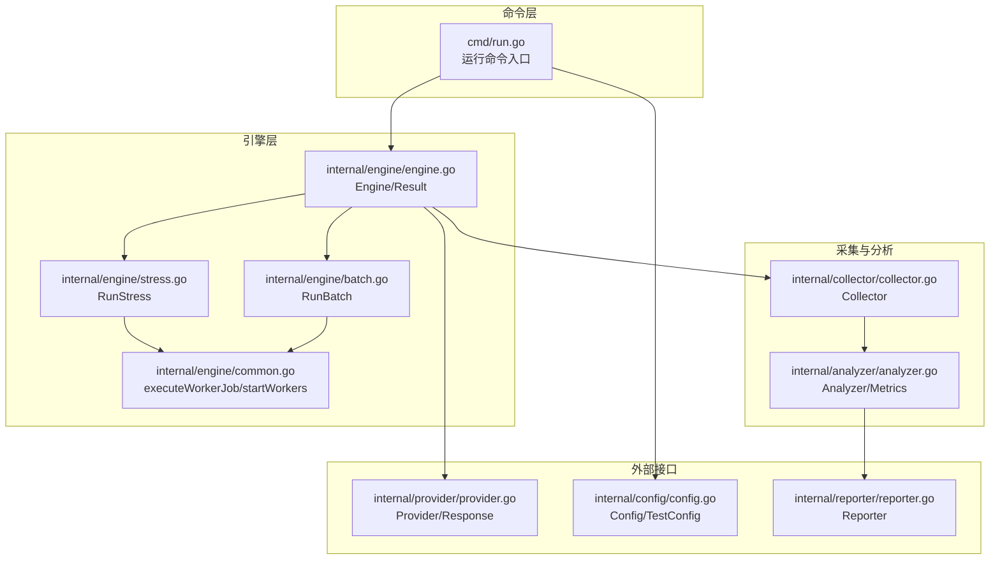
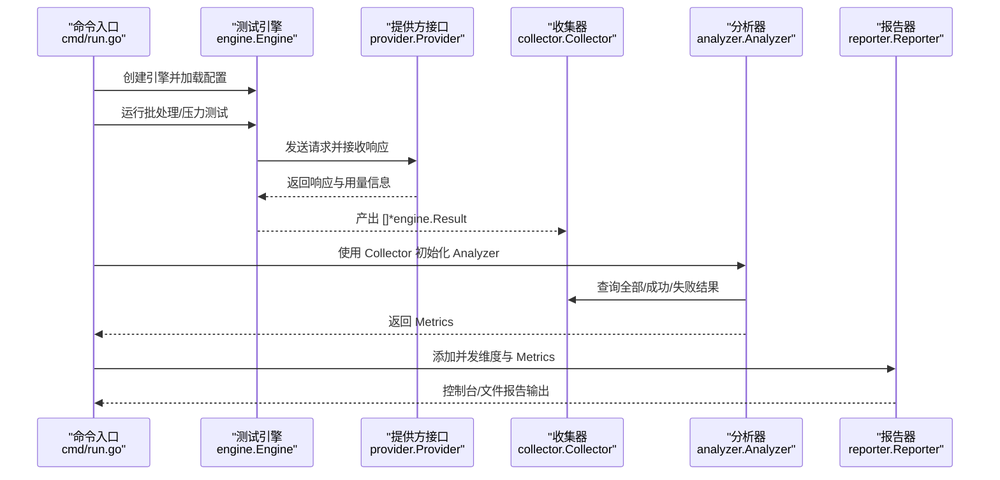
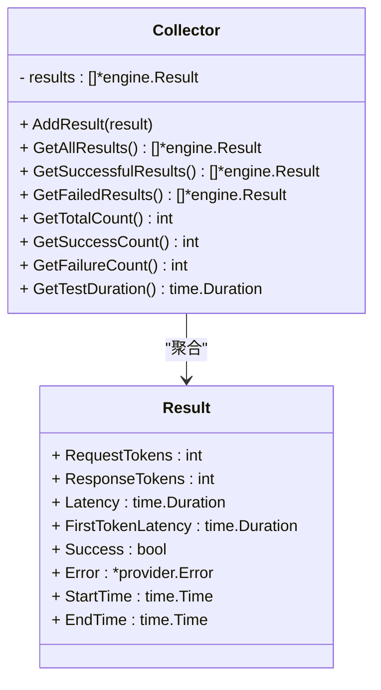
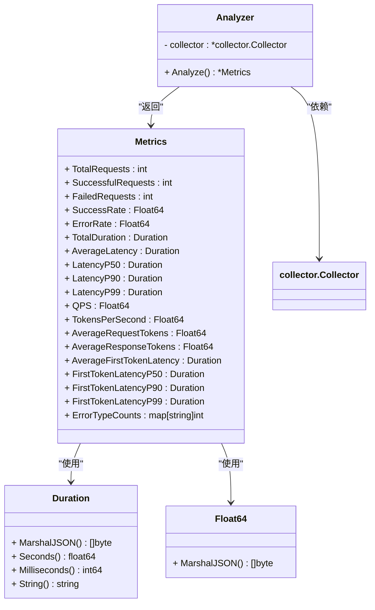
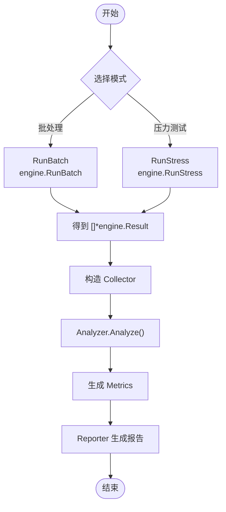
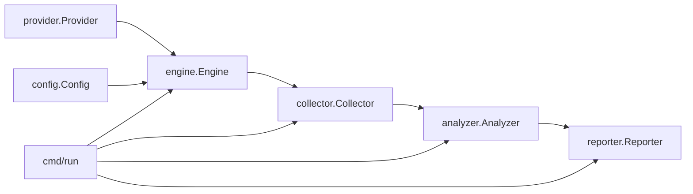

# Collector 和 Analyzer API

<cite>
**本文引用的文件**
- [internal/collector/collector.go](file://internal/collector/collector.go)
- [internal/analyzer/analyzer.go](file://internal/analyzer/analyzer.go)
- [internal/engine/engine.go](file://internal/engine/engine.go)
- [internal/engine/batch.go](file://internal/engine/batch.go)
- [internal/engine/stress.go](file://internal/engine/stress.go)
- [internal/engine/common.go](file://internal/engine/common.go)
- [internal/provider/provider.go](file://internal/provider/provider.go)
- [internal/config/config.go](file://internal/config/config.go)
- [internal/reporter/reporter.go](file://internal/reporter/reporter.go)
- [cmd/run.go](file://cmd/run.go)
- [configs/example.yaml](file://configs/example.yaml)
- [examples/test_cases.jsonl](file://examples/test_cases.jsonl)
</cite>

## 目录
1. [简介](#简介)
2. [项目结构](#项目结构)
3. [核心组件](#核心组件)
4. [架构总览](#架构总览)
5. [详细组件分析](#详细组件分析)
6. [依赖分析](#依赖分析)
7. [性能考量](#性能考量)
8. [故障排查指南](#故障排查指南)
9. [结论](#结论)
10. [附录](#附录)

## 简介
本文件面向 Collector 与 Analyzer 接口，提供完整的 API 文档与实现指南。内容涵盖：
- Collector 接口的收集方法、数据存储机制与性能考虑
- Analyzer 接口的分析算法、指标计算与统计方法
- 接口之间的数据流转与处理流程
- 具体实现示例与扩展指南（新增指标、自定义分析逻辑）
- 与 Engine、Provider、Reporter 的集成关系与调用时序

## 项目结构
围绕 Collector 与 Analyzer 的关键模块如下：
- internal/collector：结果收集器，负责聚合测试结果并提供查询接口
- internal/analyzer：分析器，基于收集器结果计算各类性能指标
- internal/engine：测试引擎，生成 Result 并通过通道回传给收集器
- internal/provider：抽象 LLM 提供方接口，统一请求发送与响应结构
- internal/reporter：报告生成器，消费 Analyzer 输出并生成控制台/文件报告
- cmd/run：命令入口，组织测试执行、收集、分析与报告生成流程

图表来源
- [cmd/run.go:1-123](file://cmd/run.go#L1-L123)
- [internal/engine/engine.go:1-112](file://internal/engine/engine.go#L1-L112)
- [internal/engine/batch.go:1-65](file://internal/engine/batch.go#L1-L65)
- [internal/engine/stress.go:1-79](file://internal/engine/stress.go#L1-L79)
- [internal/engine/common.go:1-51](file://internal/engine/common.go#L1-L51)
- [internal/collector/collector.go:1-97](file://internal/collector/collector.go#L1-L97)
- [internal/analyzer/analyzer.go:1-198](file://internal/analyzer/analyzer.go#L1-L198)
- [internal/provider/provider.go:1-72](file://internal/provider/provider.go#L1-L72)
- [internal/config/config.go:1-229](file://internal/config/config.go#L1-L229)
- [internal/reporter/reporter.go:1-130](file://internal/reporter/reporter.go#L1-L130)

章节来源
- [cmd/run.go:1-123](file://cmd/run.go#L1-L123)
- [internal/engine/engine.go:1-112](file://internal/engine/engine.go#L1-L112)
- [internal/collector/collector.go:1-97](file://internal/collector/collector.go#L1-L97)
- [internal/analyzer/analyzer.go:1-198](file://internal/analyzer/analyzer.go#L1-L198)
- [internal/provider/provider.go:1-72](file://internal/provider/provider.go#L1-L72)
- [internal/config/config.go:1-229](file://internal/config/config.go#L1-L229)
- [internal/reporter/reporter.go:1-130](file://internal/reporter/reporter.go#L1-L130)

## 核心组件
- Collector：封装 []*engine.Result 的收集与查询能力，提供总数、成功/失败计数、持续时间等基础统计，以及按条件筛选结果的能力
- Analyzer：基于 Collector 的结果计算 Metrics，包括成功率/错误率、总耗时、平均延迟与分位延迟、QPS、吞吐令牌速率、平均请求/响应令牌数、首 token 延迟及分位等；同时进行错误类型统计

章节来源
- [internal/collector/collector.go:9-97](file://internal/collector/collector.go#L9-L97)
- [internal/analyzer/analyzer.go:43-198](file://internal/analyzer/analyzer.go#L43-L198)

## 架构总览
下图展示从命令入口到分析与报告的整体流程。

图表来源
- [cmd/run.go:22-77](file://cmd/run.go#L22-L77)
- [internal/engine/engine.go:88-112](file://internal/engine/engine.go#L88-L112)
- [internal/provider/provider.go:10-20](file://internal/provider/provider.go#L10-L20)
- [internal/collector/collector.go:14-32](file://internal/collector/collector.go#L14-L32)
- [internal/analyzer/analyzer.go:82-90](file://internal/analyzer/analyzer.go#L82-L90)
- [internal/reporter/reporter.go:38-101](file://internal/reporter/reporter.go#L38-L101)

## 详细组件分析

### Collector 接口与实现
- 职责
  - 存储测试结果切片 []*engine.Result
  - 提供添加、查询全部、筛选成功/失败、统计总数/成功/失败、计算测试总时长等方法
- 数据存储机制
  - 内部以切片保存结果；GetAllResults 返回引用副本，避免外部修改内部状态
  - 成功/失败筛选通过线性扫描实现，时间复杂度 O(n)
- 性能考虑
  - 切片扩容策略由 Go 运行时管理；若批量写入频繁，建议在上层控制写入节奏或使用带缓冲通道
  - GetTestDuration 需遍历所有结果以确定首尾时间，O(n)；如需高频调用可考虑缓存首尾时间戳
  - GetSuccessCount 与 GetFailureCount 采用累加，O(n)；可按需缓存中间值以减少重复计算

图表来源
- [internal/collector/collector.go:10-97](file://internal/collector/collector.go#L10-L97)
- [internal/engine/engine.go:19-30](file://internal/engine/engine.go#L19-L30)

章节来源
- [internal/collector/collector.go:9-97](file://internal/collector/collector.go#L9-L97)
- [internal/engine/engine.go:19-30](file://internal/engine/engine.go#L19-L30)

### Analyzer 接口与实现
- 职责
  - 基于 Collector 的结果计算 Metrics，覆盖基本指标、时延指标、吞吐指标、令牌指标、流式首 token 指标与错误分析
- 关键算法与统计
  - 基本指标：总数、成功/失败计数、成功率/错误率
  - 时延指标：总时长、平均延迟、P50/P90/P99 分位延迟
  - 吞吐指标：QPS、每秒令牌数
  - 令牌指标：平均请求/响应令牌数
  - 流式指标：平均首 token 延迟与分位延迟（仅当存在首 token 延迟时）
  - 错误分析：按错误码与类型分组计数
- 数据结构与序列化
  - Duration 与 Float64 包装类型分别用于毫秒与时浮点数的 JSON 序列化精度控制
  - Metrics 结构体字段均支持 JSON 序列化，便于报告输出

图表来源
- [internal/analyzer/analyzer.go:77-198](file://internal/analyzer/analyzer.go#L77-L198)
- [internal/analyzer/analyzer.go:13-41](file://internal/analyzer/analyzer.go#L13-L41)
- [internal/analyzer/analyzer.go:43-75](file://internal/analyzer/analyzer.go#L43-L75)
- [internal/collector/collector.go:14-32](file://internal/collector/collector.go#L14-L32)

章节来源
- [internal/analyzer/analyzer.go:77-198](file://internal/analyzer/analyzer.go#L77-L198)
- [internal/analyzer/analyzer.go:13-41](file://internal/analyzer/analyzer.go#L13-L41)
- [internal/analyzer/analyzer.go:43-75](file://internal/analyzer/analyzer.go#L43-L75)

### 数据流与处理流程
- 批处理模式
  - 引擎按并发启动工作协程，从任务队列取出请求并逐个执行，结果通过带索引的通道回传，最终按原始顺序组装为 []*engine.Result
- 压力测试模式
  - 引擎在限定时长或请求数内循环发送请求，使用带缓冲通道收集结果，完成后汇总为 []*engine.Result
- 收集与分析
  - 将 []*engine.Result 交由 Collector 管理；Analyzer 读取全部/成功/失败结果，计算各项指标
- 报告生成
  - Reporter 接收当前并发下的 Metrics，并可累积多并发结果；支持控制台与多种文件格式报告输出

图表来源
- [internal/engine/batch.go:12-65](file://internal/engine/batch.go#L12-L65)
- [internal/engine/stress.go:15-79](file://internal/engine/stress.go#L15-L79)
- [cmd/run.go:98-122](file://cmd/run.go#L98-L122)
- [internal/collector/collector.go:14-32](file://internal/collector/collector.go#L14-L32)
- [internal/analyzer/analyzer.go:89-198](file://internal/analyzer/analyzer.go#L89-L198)
- [internal/reporter/reporter.go:38-101](file://internal/reporter/reporter.go#L38-L101)

章节来源
- [internal/engine/batch.go:12-65](file://internal/engine/batch.go#L12-L65)
- [internal/engine/stress.go:15-79](file://internal/engine/stress.go#L15-L79)
- [cmd/run.go:98-122](file://cmd/run.go#L98-L122)
- [internal/collector/collector.go:14-32](file://internal/collector/collector.go#L14-L32)
- [internal/analyzer/analyzer.go:89-198](file://internal/analyzer/analyzer.go#L89-L198)
- [internal/reporter/reporter.go:38-101](file://internal/reporter/reporter.go#L38-L101)

### 实现示例与扩展指南
- 新增分析指标
  - 在 Metrics 结构体中添加新字段，并在 Analyzer.Analyze 中计算赋值
  - 如需自定义序列化行为，可仿照 Duration/Float64 的包装类型实现 MarshalJSON
- 自定义分析逻辑
  - 可在 Analyzer.Analyze 中增加新的统计路径（例如按错误码细分、按请求参数维度聚合等）
  - 若需要更复杂的采样或窗口化统计，可在 Analyzer 外层引入滑动窗口或采样器
- 与 Engine/Provider 的集成
  - Engine 通过 Provider 接口发送请求并填充 Result；确保 Provider 返回的响应包含必要的用量与延迟字段
  - 若 Provider 支持流式，需保证 FirstTokenLatency 字段正确设置，以便 Analyzer 计算首 token 指标
- 与 Reporter 的对接
  - Reporter 接收 Metrics 并支持多种输出格式；如需扩展报告模板，可在 Reporter 内部增加对应渲染逻辑

章节来源
- [internal/analyzer/analyzer.go:43-75](file://internal/analyzer/analyzer.go#L43-L75)
- [internal/analyzer/analyzer.go:89-198](file://internal/analyzer/analyzer.go#L89-L198)
- [internal/engine/engine.go:88-112](file://internal/engine/engine.go#L88-L112)
- [internal/provider/provider.go:10-20](file://internal/provider/provider.go#L10-L20)
- [internal/reporter/reporter.go:38-101](file://internal/reporter/reporter.go#L38-L101)

## 依赖分析
- Collector 依赖 engine.Result 结构
- Analyzer 依赖 collector.Collector 与 engine.Result
- Engine 依赖 provider.Provider 与 config.Config
- Reporter 依赖 analyzer.Metrics
- cmd/run 组织上述组件并协调执行流程

图表来源
- [internal/engine/engine.go:13-47](file://internal/engine/engine.go#L13-L47)
- [internal/collector/collector.go:14-22](file://internal/collector/collector.go#L14-L22)
- [internal/analyzer/analyzer.go:82-87](file://internal/analyzer/analyzer.go#L82-L87)
- [internal/reporter/reporter.go:31-36](file://internal/reporter/reporter.go#L31-L36)
- [cmd/run.go:98-122](file://cmd/run.go#L98-L122)

章节来源
- [internal/engine/engine.go:13-47](file://internal/engine/engine.go#L13-L47)
- [internal/collector/collector.go:14-22](file://internal/collector/collector.go#L14-L22)
- [internal/analyzer/analyzer.go:82-87](file://internal/analyzer/analyzer.go#L82-L87)
- [internal/reporter/reporter.go:31-36](file://internal/reporter/reporter.go#L31-L36)
- [cmd/run.go:98-122](file://cmd/run.go#L98-L122)

## 性能考量
- 收集器
  - 线性扫描筛选成功/失败结果，O(n)；若结果规模较大，建议在上层减少不必要的多次筛选
  - 计算总时长需遍历所有结果，O(n)；可考虑缓存首尾时间戳以降低重复计算
- 分析器
  - 计算分位延迟前需排序，O(n log n)；对于超大数据集，可考虑近似分位算法或采样
  - QPS 与吞吐令牌数依赖总时长，注意时长为 0 的边界情况
- 引擎
  - 压力测试使用带缓冲通道，防止阻塞；可根据系统资源调整缓冲大小
  - 批处理模式按索引回填结果，避免乱序；注意内存占用与 GC 压力

章节来源
- [internal/collector/collector.go:77-97](file://internal/collector/collector.go#L77-L97)
- [internal/analyzer/analyzer.go:145-154](file://internal/analyzer/analyzer.go#L145-L154)
- [internal/engine/stress.go:34-78](file://internal/engine/stress.go#L34-L78)
- [internal/engine/batch.go:16-65](file://internal/engine/batch.go#L16-L65)

## 故障排查指南
- 常见问题
  - 结果为空：确认 Engine 是否成功执行；检查 Provider 返回是否包含错误
  - 指标异常（如 QPS 为 0）：检查 TotalDuration 是否为 0 或负值
  - 首 token 指标缺失：确认 Provider 是否支持流式且 FirstTokenLatency 已设置
  - 报告生成失败：检查输出路径权限与格式支持
- 定位手段
  - 查看命令日志级别与输出，定位执行阶段
  - 在 Analyzer.Analyze 中增加关键中间值的日志输出，辅助定位异常指标
  - 在 Engine 层打印请求/响应关键字段，验证 Provider 输出

章节来源
- [internal/analyzer/analyzer.go:112-114](file://internal/analyzer/analyzer.go#L112-L114)
- [internal/engine/engine.go:88-112](file://internal/engine/engine.go#L88-L112)
- [internal/reporter/reporter.go:103-129](file://internal/reporter/reporter.go#L103-L129)

## 结论
Collector 与 Analyzer 通过清晰的职责划分与稳定的接口契约，实现了从原始测试结果到可读指标与报告的完整链路。结合 Engine 与 Provider 的解耦设计，用户可在不改动核心逻辑的前提下扩展新的指标与分析维度，并灵活地组织不同模式的测试与报告输出。

## 附录
- 配置参考
  - 示例配置文件展示了测试、模型、数据集与输出的基本字段
- 数据集示例
  - JSONL 格式的测试用例，包含消息数组与推理参数

章节来源
- [configs/example.yaml:1-78](file://configs/example.yaml#L1-L78)
- [examples/test_cases.jsonl:1-6](file://examples/test_cases.jsonl#L1-L6)