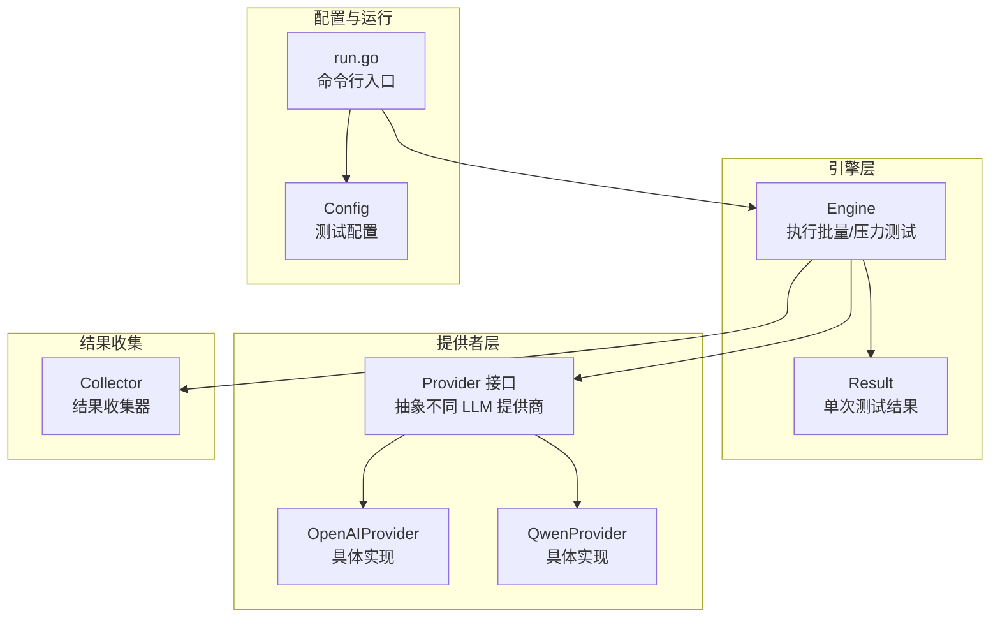
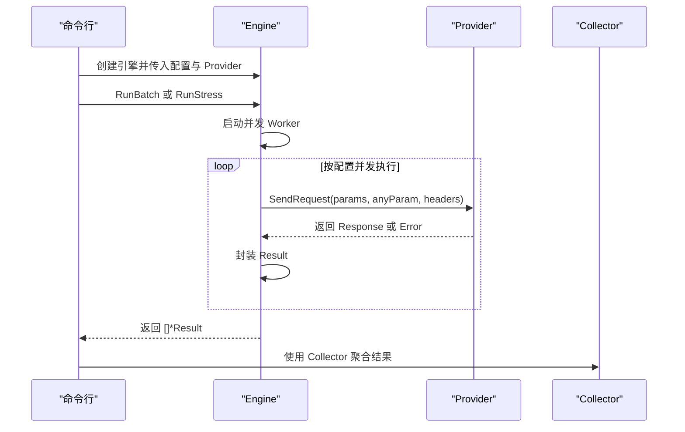
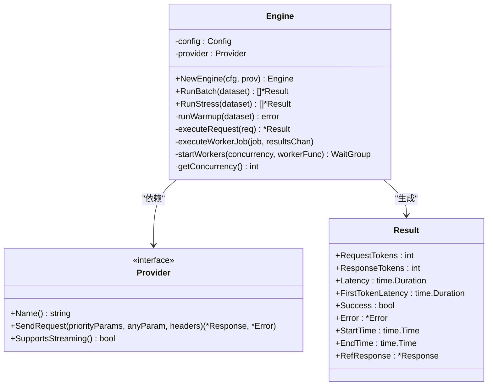
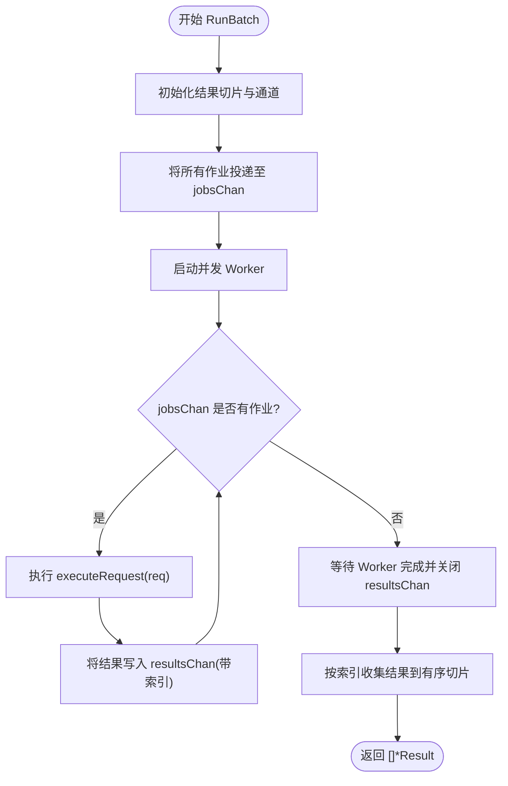
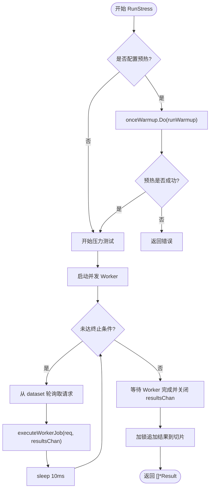
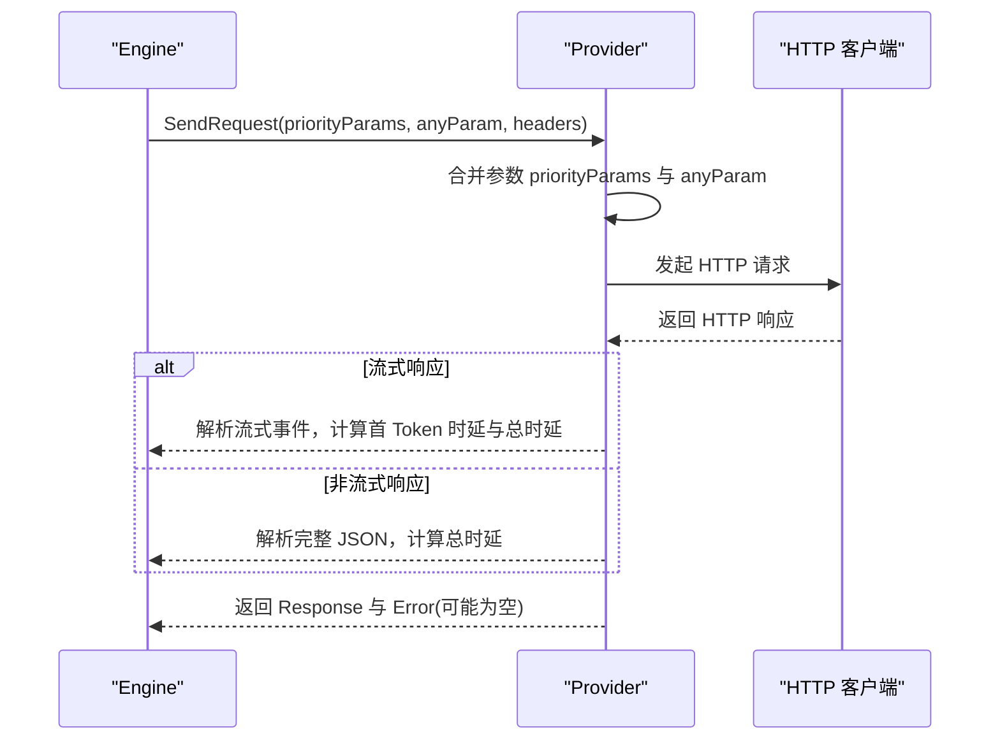
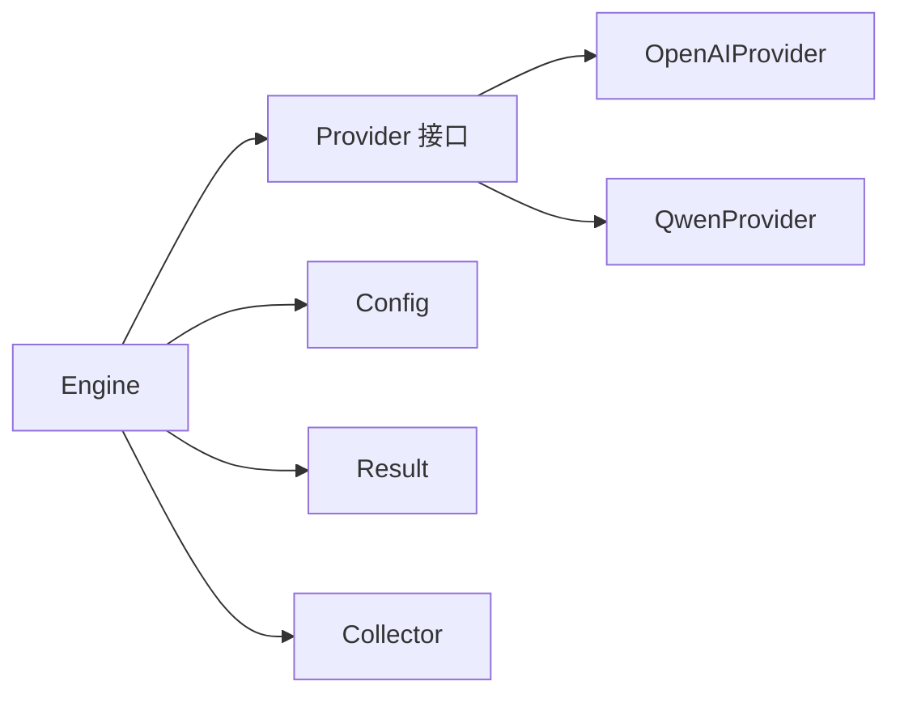

# Engine 接口

<cite>
**本文引用的文件**
- [internal/engine/engine.go](file://internal/engine/engine.go)
- [internal/engine/batch.go](file://internal/engine/batch.go)
- [internal/engine/stress.go](file://internal/engine/stress.go)
- [internal/engine/common.go](file://internal/engine/common.go)
- [internal/provider/provider.go](file://internal/provider/provider.go)
- [internal/provider/error.go](file://internal/provider/error.go)
- [internal/provider/openai.go](file://internal/provider/openai.go)
- [internal/provider/qwen.go](file://internal/provider/qwen.go)
- [internal/config/config.go](file://internal/config/config.go)
- [internal/collector/collector.go](file://internal/collector/collector.go)
- [cmd/run.go](file://cmd/run.go)
- [configs/example.yaml](file://configs/example.yaml)
</cite>

## 目录
1. [简介](#简介)
2. [项目结构](#项目结构)
3. [核心组件](#核心组件)
4. [架构总览](#架构总览)
5. [详细组件分析](#详细组件分析)
6. [依赖关系分析](#依赖关系分析)
7. [性能考虑](#性能考虑)
8. [故障排查指南](#故障排查指南)
9. [结论](#结论)
10. [附录](#附录)

## 简介
本文件为 Engine 接口的详细 API 文档，覆盖测试引擎的核心接口定义、方法签名、参数与返回值说明，以及批量测试与压力测试的实现差异。文档还解释了并发控制机制、Engine 与 Provider 的交互关系，并提供完整实现示例与性能优化建议。目标是帮助开发者快速理解并正确使用 Engine 接口进行 LLM 性能测试与稳定性评估。

## 项目结构
Engine 接口位于 internal/engine 包中，围绕 Engine 结构体及其方法展开，配合 internal/provider 提供的 Provider 接口完成对外部 LLM 服务的请求发送与响应解析；internal/config 定义测试配置；cmd/run.go 展示如何在命令行层调用 Engine 执行批量或压力测试；internal/collector 负责收集与统计结果。

图表来源
- [internal/engine/engine.go:13-112](file://internal/engine/engine.go#L13-L112)
- [internal/provider/provider.go:10-20](file://internal/provider/provider.go#L10-L20)
- [internal/provider/openai.go:21-48](file://internal/provider/openai.go#L21-L48)
- [internal/provider/qwen.go:5-35](file://internal/provider/qwen.go#L5-L35)
- [internal/config/config.go:81-130](file://internal/config/config.go#L81-L130)
- [cmd/run.go:97-123](file://cmd/run.go#L97-L123)
- [internal/collector/collector.go:9-22](file://internal/collector/collector.go#L9-L22)

章节来源
- [internal/engine/engine.go:13-112](file://internal/engine/engine.go#L13-L112)
- [internal/provider/provider.go:10-20](file://internal/provider/provider.go#L10-L20)
- [internal/config/config.go:81-130](file://internal/config/config.go#L81-L130)
- [cmd/run.go:97-123](file://cmd/run.go#L97-L123)

## 核心组件
- Engine：测试引擎主体，负责并发调度、请求执行、结果收集与统计。
- Provider 接口：抽象不同 LLM 提供商（如 OpenAI、Qwen）的统一请求接口。
- Result：单次请求的结果封装，包含时延、令牌用量、成功状态与错误信息等。
- Config：测试配置，包括并发度、持续时间、预热时间、超时等。
- Collector：结果收集器，用于聚合与统计测试结果。

章节来源
- [internal/engine/engine.go:13-112](file://internal/engine/engine.go#L13-L112)
- [internal/provider/provider.go:10-20](file://internal/provider/provider.go#L10-L20)
- [internal/config/config.go:81-130](file://internal/config/config.go#L81-L130)
- [internal/collector/collector.go:9-22](file://internal/collector/collector.go#L9-L22)

## 架构总览
Engine 通过 Provider 接口向外部 LLM 服务发送请求，内部以 goroutine 并发执行，使用通道与 WaitGroup 协调工作流，最终将结果交给 Collector 统计分析。配置由 Config 控制测试行为，命令行入口根据模式选择批量或压力测试。

图表来源
- [cmd/run.go:97-123](file://cmd/run.go#L97-L123)
- [internal/engine/engine.go:34-47](file://internal/engine/engine.go#L34-L47)
- [internal/engine/batch.go:12-65](file://internal/engine/batch.go#L12-L65)
- [internal/engine/stress.go:15-79](file://internal/engine/stress.go#L15-L79)
- [internal/engine/common.go:28-50](file://internal/engine/common.go#L28-L50)
- [internal/provider/provider.go:10-20](file://internal/provider/provider.go#L10-L20)

## 详细组件分析

### Engine 接口与方法定义
Engine 是测试引擎的核心结构体，提供以下关键能力：
- 初始化与配置注入：构造函数接收 Config 与 Provider，确保模型参数模板与名称正确设置。
- 预热阶段：runWarmup 在压力测试前执行，按并发数启动 goroutine，循环使用数据集轮询请求，失败即停止并返回错误。
- 请求执行：executeRequest 发送单次请求，封装 Result，包含开始/结束时间、时延、首 Token 时延、令牌用量与错误信息。
- 并发控制：startWorkers 启动指定数量的 Worker，getConcurrency 确保最小并发为 1。
- 批量测试：RunBatch 基于作业通道与结果通道，按并发度并行执行数据集中的所有请求，保证结果顺序。
- 压力测试：RunStress 支持按持续时间或每并发请求数限制，结合 onceWarmup 确保仅一次预热，使用带缓冲通道收集结果并加锁追加。

图表来源
- [internal/engine/engine.go:13-112](file://internal/engine/engine.go#L13-L112)
- [internal/engine/common.go:9-50](file://internal/engine/common.go#L9-L50)
- [internal/provider/provider.go:10-20](file://internal/provider/provider.go#L10-L20)

章节来源
- [internal/engine/engine.go:34-112](file://internal/engine/engine.go#L34-L112)
- [internal/engine/common.go:9-50](file://internal/engine/common.go#L9-L50)

### 批量测试（RunBatch）
- 设计要点
  - 使用固定容量切片存储结果，避免扩容带来的不确定性。
  - 作业通道 jobsChan 一次性投递全部任务，避免重复遍历。
  - 工作通道 resultsChan 以索引方式回传，保证输出顺序与输入一一对应。
  - 通过 WaitGroup 等待所有 Worker 完成后关闭结果通道，确保消费者能正常退出。
- 并发控制
  - 并发度由 getConcurrency 决定，至少为 1。
  - startWorkers 启动多个 Worker，每个 Worker 从 jobsChan 取任务执行 executeRequest 并写入 resultsChan。
- 错误处理
  - executeRequest 将 Provider 返回的错误封装到 Result.Error，Success 字段标记失败。
- 输出
  - 返回有序的 []*Result 列表，便于后续分析与报告生成。

图表来源
- [internal/engine/batch.go:12-65](file://internal/engine/batch.go#L12-L65)
- [internal/engine/common.go:28-50](file://internal/engine/common.go#L28-L50)
- [internal/engine/engine.go:88-112](file://internal/engine/engine.go#L88-L112)

章节来源
- [internal/engine/batch.go:12-65](file://internal/engine/batch.go#L12-L65)
- [internal/engine/common.go:28-50](file://internal/engine/common.go#L28-L50)

### 压力测试（RunStress）
- 设计要点
  - 预热阶段：若配置了预热时间，使用 sync.Once 确保只执行一次 runWarmup。
  - 测试阶段：Worker 循环执行，终止条件为达到持续时间或每并发请求数上限。
  - 结果收集：使用带缓冲通道 resultsChan，避免阻塞；完成后加锁追加到结果切片。
  - 限流：Worker 在每次请求后 sleep 10ms，防止系统过载。
- 并发控制
  - 并发度由 getConcurrency 决定，startWorkers 启动 Worker。
  - 每个 Worker 从 dataset 轮询取请求，避免重复。
- 错误处理
  - executeWorkerJob 对结果通道满的情况进行丢弃并告警，防止阻塞。
- 输出
  - 返回所有请求的 []*Result 列表，可用于分析吞吐、时延分布与错误率。

图表来源
- [internal/engine/stress.go:15-79](file://internal/engine/stress.go#L15-L79)
- [internal/engine/common.go:15-26](file://internal/engine/common.go#L15-L26)
- [internal/engine/engine.go:49-86](file://internal/engine/engine.go#L49-L86)

章节来源
- [internal/engine/stress.go:15-79](file://internal/engine/stress.go#L15-L79)
- [internal/engine/common.go:15-26](file://internal/engine/common.go#L15-L26)

### Engine 与 Provider 的交互
- Engine 通过 Provider 接口抽象不同提供商的请求行为，屏蔽底层差异。
- Provider 的 SendRequest 方法接收三类参数：
  - priorityParams：高优先级参数（如模型名），会覆盖 anyParam 中同名键。
  - anyParam：实际请求体参数（如 messages、temperature 等）。
  - headers：HTTP 头部（如 Content-Type、自定义头）。
- Provider 返回 Response 与 Error，Engine 将其封装为 Result 并记录时延、令牌用量等指标。
- OpenAIProvider 与 QwenProvider 均实现了 Provider 接口，支持流式与非流式响应处理。

图表来源
- [internal/engine/engine.go:88-112](file://internal/engine/engine.go#L88-L112)
- [internal/provider/provider.go:10-20](file://internal/provider/provider.go#L10-L20)
- [internal/provider/openai.go:84-144](file://internal/provider/openai.go#L84-L144)
- [internal/provider/qwen.go:26-34](file://internal/provider/qwen.go#L26-L34)

章节来源
- [internal/engine/engine.go:88-112](file://internal/engine/engine.go#L88-L112)
- [internal/provider/provider.go:10-20](file://internal/provider/provider.go#L10-L20)
- [internal/provider/openai.go:84-144](file://internal/provider/openai.go#L84-L144)
- [internal/provider/qwen.go:26-34](file://internal/provider/qwen.go#L26-L34)

### 并发控制机制
- 并发度来源：Config.Test.Concurrency，若为 0 则默认为 1。
- Worker 启动：startWorkers 根据并发度启动 goroutine，每个 Worker 独立执行任务。
- 作业分发：RunBatch 使用 jobsChan 一次性投递所有作业；RunStress 使用轮询策略从 dataset 取请求。
- 结果收集：RunBatch 使用带索引的 resultsChan 保证顺序；RunStress 使用带缓冲通道并加锁追加。
- 限流与背压：RunStress 在每次请求后 sleep 10ms；executeWorkerJob 对结果通道满时丢弃结果并告警，避免阻塞。

章节来源
- [internal/engine/common.go:28-50](file://internal/engine/common.go#L28-L50)
- [internal/engine/batch.go:37-65](file://internal/engine/batch.go#L37-L65)
- [internal/engine/stress.go:40-79](file://internal/engine/stress.go#L40-L79)

### 接口实现示例
- 批量测试示例路径
  - 创建引擎与 Provider：[internal/engine/engine.go:34-47](file://internal/engine/engine.go#L34-L47)
  - 执行批量测试：[internal/engine/batch.go:12-65](file://internal/engine/batch.go#L12-L65)
  - 命令行入口调用：[cmd/run.go:103-121](file://cmd/run.go#L103-L121)
- 压力测试示例路径
  - 执行压力测试：[internal/engine/stress.go:15-79](file://internal/engine/stress.go#L15-L79)
  - 预热与并发控制：[internal/engine/engine.go:49-86](file://internal/engine/engine.go#L49-L86)
  - 命令行入口调用：[cmd/run.go:103-121](file://cmd/run.go#L103-L121)
- Provider 实现示例路径
  - OpenAIProvider：[internal/provider/openai.go:21-48](file://internal/provider/openai.go#L21-L48)
  - QwenProvider：[internal/provider/qwen.go:5-35](file://internal/provider/qwen.go#L5-L35)

章节来源
- [internal/engine/engine.go:34-47](file://internal/engine/engine.go#L34-L47)
- [internal/engine/batch.go:12-65](file://internal/engine/batch.go#L12-L65)
- [internal/engine/stress.go:15-79](file://internal/engine/stress.go#L15-L79)
- [cmd/run.go:103-121](file://cmd/run.go#L103-L121)
- [internal/provider/openai.go:21-48](file://internal/provider/openai.go#L21-L48)
- [internal/provider/qwen.go:5-35](file://internal/provider/qwen.go#L5-L35)

## 依赖关系分析
- Engine 依赖 Provider 接口，不直接依赖具体实现，便于扩展新的提供商。
- Engine 依赖 Config 控制测试行为（并发、持续时间、预热、超时等）。
- Engine 与 Collector 解耦，结果通过 []*Result 传递，便于替换统计分析模块。
- Provider 的具体实现（OpenAI、Qwen）共享相同的 Response/Error 数据结构，便于统一处理。

图表来源
- [internal/engine/engine.go:13-112](file://internal/engine/engine.go#L13-L112)
- [internal/provider/provider.go:10-20](file://internal/provider/provider.go#L10-L20)
- [internal/config/config.go:81-130](file://internal/config/config.go#L81-L130)
- [internal/collector/collector.go:9-22](file://internal/collector/collector.go#L9-L22)
- [internal/provider/openai.go:21-48](file://internal/provider/openai.go#L21-L48)
- [internal/provider/qwen.go:5-35](file://internal/provider/qwen.go#L5-L35)

章节来源
- [internal/engine/engine.go:13-112](file://internal/engine/engine.go#L13-L112)
- [internal/provider/provider.go:10-20](file://internal/provider/provider.go#L10-L20)
- [internal/config/config.go:81-130](file://internal/config/config.go#L81-L130)
- [internal/collector/collector.go:9-22](file://internal/collector/collector.go#L9-L22)

## 性能考虑
- 并发度设置
  - 根据下游服务的速率限制与自身资源情况调整 Config.Test.Concurrency。
  - 使用 PerfConcurrencyGroup 进行多并发对比测试，定位性能拐点。
- 预热阶段
  - 合理设置预热时间，确保连接池、编译缓存等就绪，减少测量偏差。
- 结果通道缓冲
  - RunStress 使用带缓冲通道避免阻塞；当通道满时丢弃结果，需关注丢失率对统计的影响。
- 限流与抖动
  - RunStress 在每次请求后 sleep 10ms，有助于平滑流量；可根据下游服务的限速策略调整。
- 参数合并
  - Provider 的参数合并逻辑确保高优先级参数覆盖低优先级参数，避免错误覆盖导致的性能问题。
- 流式与非流式
  - 流式响应可获得首 Token 时延，有助于评估交互延迟；非流式响应时首 Token 时延等于端到端时延。

章节来源
- [internal/config/config.go:89-97](file://internal/config/config.go#L89-L97)
- [internal/engine/stress.go:30-79](file://internal/engine/stress.go#L30-L79)
- [internal/engine/common.go:15-26](file://internal/engine/common.go#L15-L26)
- [internal/provider/openai.go:55-82](file://internal/provider/openai.go#L55-L82)

## 故障排查指南
- 预热失败
  - runWarmup 在任一 Worker 失败时立即返回错误，检查 Provider 的可用性与网络连通性。
- 请求错误
  - executeRequest 将 Provider 返回的错误封装到 Result.Error，检查错误类型与消息。
- 网络相关错误分类
  - Provider 的错误分类函数会识别常见网络错误关键字，便于快速定位网络问题。
- 结果通道满
  - executeWorkerJob 在通道满时丢弃结果并告警，可能导致统计偏差，建议增大缓冲或降低并发。
- 配置校验
  - 确认 Config 中的并发、持续时间、超时、预热等参数合理；参考示例配置文件。

章节来源
- [internal/engine/engine.go:49-86](file://internal/engine/engine.go#L49-L86)
- [internal/engine/engine.go:88-112](file://internal/engine/engine.go#L88-L112)
- [internal/provider/error.go:32-78](file://internal/provider/error.go#L32-L78)
- [internal/engine/common.go:15-26](file://internal/engine/common.go#L15-L26)
- [configs/example.yaml:4-22](file://configs/example.yaml#L4-L22)

## 结论
Engine 接口提供了清晰的批量与压力测试能力，通过 Provider 抽象实现跨提供商兼容，借助并发控制与通道机制实现高效稳定的测试执行。结合合理的配置与性能优化策略，可有效评估 LLM 服务在不同负载下的性能与稳定性。

## 附录
- 配置示例文件路径：[configs/example.yaml:1-78](file://configs/example.yaml#L1-L78)
- 命令行入口与测试模式：[cmd/run.go:16-95](file://cmd/run.go#L16-L95)
- 结果收集器：[internal/collector/collector.go:9-97](file://internal/collector/collector.go#L9-L97)