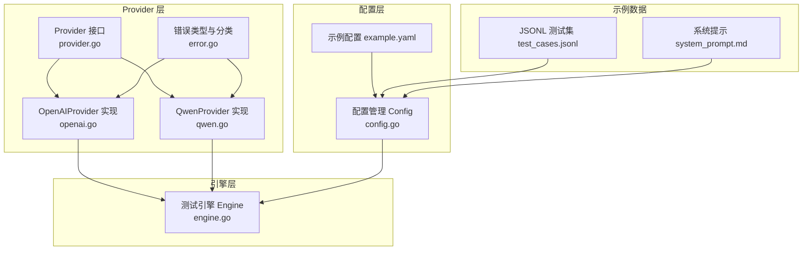
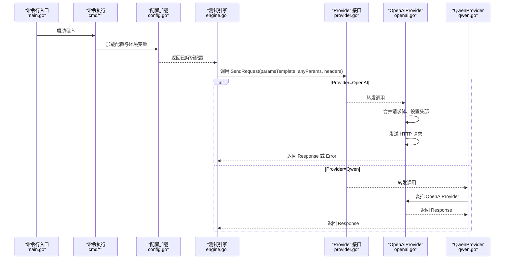
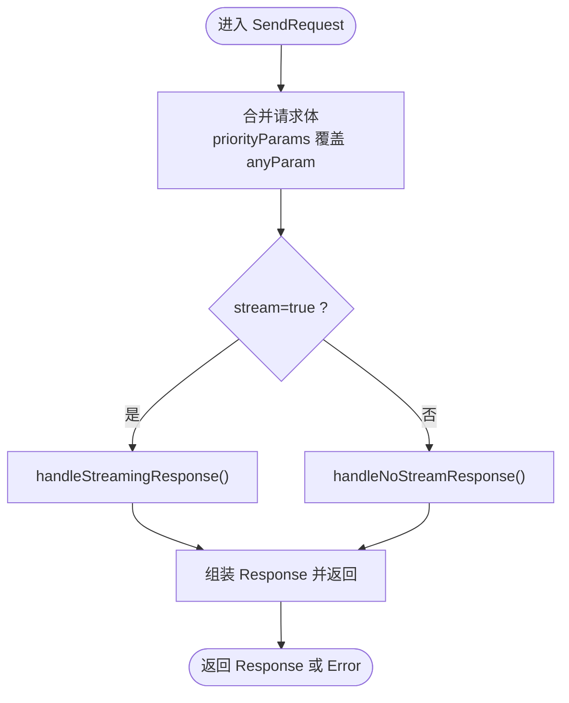
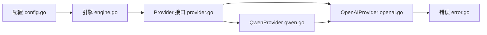

# Provider 接口

<cite>
**本文引用的文件列表**
- [provider.go](file://internal/provider/provider.go)
- [openai.go](file://internal/provider/openai.go)
- [qwen.go](file://internal/provider/qwen.go)
- [error.go](file://internal/provider/error.go)
- [engine.go](file://internal/engine/engine.go)
- [config.go](file://internal/config/config.go)
- [example.yaml](file://configs/example.yaml)
- [test_cases.jsonl](file://examples/test_cases.jsonl)
- [system_prompt.md](file://examples/system_prompt.md)
- [provider_test.go](file://internal/provider/provider_test.go)
- [README.md](file://README.md)
- [main.go](file://main.go)
</cite>

## 目录
1. [简介](#简介)
2. [项目结构](#项目结构)
3. [核心组件](#核心组件)
4. [架构总览](#架构总览)
5. [详细组件分析](#详细组件分析)
6. [依赖关系分析](#依赖关系分析)
7. [性能考量](#性能考量)
8. [故障排查指南](#故障排查指南)
9. [结论](#结论)
10. [附录](#附录)

## 简介
本文件为 Provider 接口的权威 API 文档，面向希望扩展或集成不同大模型（LLM）提供商的开发者。文档覆盖：
- Provider 接口定义与方法签名
- 实现要求与约束
- AnyParams 类型的使用说明与消息格式要求
- OpenAI 与 Qwen 具体实现的对比分析
- 完整的接口实现示例与最佳实践

## 项目结构
Provider 模块位于 internal/provider，围绕统一接口设计，支持 OpenAI 与 Qwen 的兼容实现，并通过内部引擎在测试场景中调用。



图表来源
- [provider.go:10-20](file://internal/provider/provider.go#L10-L20)
- [openai.go:21-26](file://internal/provider/openai.go#L21-L26)
- [qwen.go:5-8](file://internal/provider/qwen.go#L5-L8)
- [engine.go:14-17](file://internal/engine/engine.go#L14-L17)
- [config.go:82-116](file://internal/config/config.go#L82-L116)
- [example.yaml:1-78](file://configs/example.yaml#L1-L78)
- [test_cases.jsonl:1-6](file://examples/test_cases.jsonl#L1-L6)
- [system_prompt.md:1](file://examples/system_prompt.md#L1)

章节来源
- [provider.go:10-72](file://internal/provider/provider.go#L10-L72)
- [openai.go:21-253](file://internal/provider/openai.go#L21-L253)
- [qwen.go:5-35](file://internal/provider/qwen.go#L5-L35)
- [engine.go:14-112](file://internal/engine/engine.go#L14-L112)
- [config.go:82-229](file://internal/config/config.go#L82-L229)
- [example.yaml:1-78](file://configs/example.yaml#L1-L78)
- [test_cases.jsonl:1-6](file://examples/test_cases.jsonl#L1-L6)
- [system_prompt.md:1](file://examples/system_prompt.md#L1)

## 核心组件
- Provider 接口：定义统一的提供商抽象，包含名称、请求发送与流式能力判定。
- AnyParams：通用参数容器，用于承载请求体字段（如 messages、model、stream 等）。
- Response/Choice/Message/Usage：标准化响应结构，支持非流式与流式聚合。
- OpenAIProvider：基于 HTTP 的 OpenAI 兼容实现，支持流式与非流式处理。
- QwenProvider：基于 OpenAIProvider 的委托实现，适配阿里 DashScope 兼容端点。
- 错误类型 Error：封装状态码、消息与错误类型，并进行网络类错误识别与分类。

章节来源
- [provider.go:10-72](file://internal/provider/provider.go#L10-L72)
- [openai.go:21-253](file://internal/provider/openai.go#L21-L253)
- [qwen.go:5-35](file://internal/provider/qwen.go#L5-L35)
- [error.go:9-79](file://internal/provider/error.go#L9-L79)

## 架构总览
Provider 接口作为统一抽象，向上被引擎层调用，向下由具体提供商实现。配置层负责注入模型名、提供商、端点、头部与参数模板；示例数据用于批量测试。



图表来源
- [main.go:20-25](file://main.go#L20-L25)
- [engine.go:88-111](file://internal/engine/engine.go#L88-L111)
- [provider.go:10-20](file://internal/provider/provider.go#L10-L20)
- [openai.go:84-144](file://internal/provider/openai.go#L84-L144)
- [qwen.go:26-34](file://internal/provider/qwen.go#L26-L34)

## 详细组件分析

### Provider 接口定义与实现要求
- 接口职责
  - Name(): 获取提供商名称字符串，用于日志与报告标识。
  - SendRequest(priorityParams, anyParam, headers): 发送请求并返回响应与错误。priorityParams 优先级更高，会覆盖 anyParam 中同名键；headers 用于附加 HTTP 头部。
  - SupportsStreaming(): 判断是否支持流式输出，影响测试模式与统计指标。
- 数据模型
  - AnyParams: map[string]any，作为请求体的灵活容器。
  - Message: 角色与内容（字符串或对象），用于对话历史。
  - Choice: 非流式完整结果或流式增量 delta。
  - Response: 包含 id、model、choices、usage，以及本地计时字段（总延迟、首 token 延迟）。
  - Usage: 提示词与生成词的 token 统计。
- 错误模型
  - Error: code、message、type；支持网络类错误识别与 JSON 结构化错误分类。

章节来源
- [provider.go:10-72](file://internal/provider/provider.go#L10-L72)
- [error.go:9-79](file://internal/provider/error.go#L9-L79)

#### 类图：Provider 及其数据模型
```mermaid
classDiagram
class Provider {
+Name() string
+SendRequest(priorityParams AnyParams, anyParam AnyParams, headers map[string]string) (*Response, *Error)
+SupportsStreaming() bool
}
class OpenAIProvider {
-apiKey string
-endpoint string
-client *http.Client
+Name() string
+SendRequest(...)
+SupportsStreaming() bool
-mergeRequest(...)
-handleNoStreamResponse(...)
-handleStreamingResponse(...)
}
class QwenProvider {
-oai *OpenAIProvider
+Name() string
+SendRequest(...)
+SupportsStreaming() bool
}
class Response {
+string ID
+string Model
+[]Choice Choices
+Usage Usage
+duration Latency
+duration FirstTokenLatency
-string JsonData
}
class Choice {
+int Index
+Message Message
+string FinishReason
-Delta
}
class Message {
+string Role
+interface{} Content
}
class Usage {
+int PromptTokens
+int CompletionTokens
+int TotalTokens
}
class Error {
+int Code
+string Message
+string Type
}
Provider <|.. OpenAIProvider
Provider <|.. QwenProvider
OpenAIProvider --> Response : "返回"
OpenAIProvider --> Error : "返回"
QwenProvider --> OpenAIProvider : "委托"
Response --> Choice
Choice --> Message
Response --> Usage
```

图表来源
- [provider.go:10-72](file://internal/provider/provider.go#L10-L72)
- [openai.go:21-253](file://internal/provider/openai.go#L21-L253)
- [qwen.go:5-35](file://internal/provider/qwen.go#L5-L35)

### OpenAIProvider 实现详解
- 名称与构造
  - Name(): 返回固定字符串标识。
  - NewOpenAIProvider(): 支持自定义端点与超时；默认端点为 OpenAI 官方 chat/completions。
- 请求合并策略
  - mergeRequest(): 将 anyParam 作为基础，priorityParams 覆盖同名键；同时检测 stream 字段以决定是否流式。
- 非流式响应处理
  - handleNoStreamResponse(): 读取完整响应体，解析 JSON，填充计时信息。
- 流式响应处理
  - handleStreamingResponse(): 使用扫描器逐行解析 SSE 数据，聚合 delta 内容与角色、结束原因；记录首 token 延迟与总延迟。
- 错误处理
  - 对非 200 状态码读取响应体并封装为 Error；支持网络错误识别与 JSON 错误结构分类。



图表来源
- [openai.go:84-144](file://internal/provider/openai.go#L84-L144)
- [openai.go:147-167](file://internal/provider/openai.go#L147-L167)
- [openai.go:169-247](file://internal/provider/openai.go#L169-L247)

章节来源
- [openai.go:21-253](file://internal/provider/openai.go#L21-L253)
- [error.go:19-79](file://internal/provider/error.go#L19-L79)

### QwenProvider 实现详解
- 名称与构造
  - Name(): 返回固定字符串标识。
  - NewQwenProvider(): 默认端点为 DashScope 兼容模式，复用 OpenAIProvider 的实现逻辑。
- 委托转发
  - SendRequest()/SupportsStreaming(): 直接委托给底层 OpenAIProvider，保持行为一致。
- 适配差异
  - 通过 endpoint 差异实现对 Qwen 的兼容；其他协议细节由 OpenAIProvider 统一处理。

章节来源
- [qwen.go:5-35](file://internal/provider/qwen.go#L5-L35)

### AnyParams 类型与消息格式要求
- AnyParams 作为 map[string]any，用于承载请求体字段：
  - 必填字段：messages（数组，元素为 Message）
  - 常见字段：model、stream、max_tokens、temperature 等
  - 扩展字段：extra_body（如 enable_thinking）、stream_options（如 include_usage）
- Message 结构
  - Role: "user"/"assistant"/"system" 等
  - Content: 字符串或对象（取决于提供商）
- Response 结构
  - choices[0].message.content 为最终文本内容
  - usage 包含 prompt_tokens、completion_tokens、total_tokens
  - 首 token 延迟与总延迟用于性能分析

章节来源
- [provider.go:22-72](file://internal/provider/provider.go#L22-L72)
- [example.yaml:42-47](file://configs/example.yaml#L42-L47)
- [test_cases.jsonl:1-6](file://examples/test_cases.jsonl#L1-L6)

### OpenAI 与 Qwen 实现对比分析
- 相同点
  - 均实现 Provider 接口，遵循相同的请求/响应模型与错误处理规范。
  - 均支持流式与非流式两种模式，且均能正确计算首 token 延迟与总延迟。
- 不同点
  - 端点差异：OpenAI 默认官方端点；Qwen 默认 DashScope 兼容端点。
  - 实现方式：Qwen 通过委托 OpenAIProvider 实现，减少重复代码。
  - 参数模板：两者均可通过配置 params_template 注入额外字段（如 stream_options、extra_body）。

章节来源
- [openai.go:29-48](file://internal/provider/openai.go#L29-L48)
- [qwen.go:11-18](file://internal/provider/qwen.go#L11-L18)
- [example.yaml:42-47](file://configs/example.yaml#L42-L47)

### 接口实现示例与最佳实践
- 示例：在配置中指定 provider 为 openai 或 qwen，并设置 api_key、endpoint、model、headers 与 params_template。
- 最佳实践
  - 优先使用 params_template 作为默认参数模板，再通过 priorityParams 进行覆盖。
  - 在流式场景下启用 stream 与 stream_options.include_usage，以便统计 token 使用。
  - 通过 headers 注入必要头部（如 Content-Type），避免硬编码。
  - 使用 SupportsStreaming() 判定是否需要关注首 token 延迟。
  - 在测试前执行预热（warmup），确保结果稳定。

章节来源
- [example.yaml:24-48](file://configs/example.yaml#L24-L48)
- [engine.go:49-86](file://internal/engine/engine.go#L49-L86)
- [provider_test.go:22-144](file://internal/provider/provider_test.go#L22-L144)

## 依赖关系分析
- Provider 接口被引擎层直接依赖，用于统一调用不同提供商。
- OpenAIProvider 依赖标准库 http 与 maps，实现 HTTP 请求与参数合并。
- QwenProvider 依赖 OpenAIProvider，形成委托关系。
- 配置层通过 viper 读取 YAML 并注入到引擎，引擎再调用 Provider。



图表来源
- [config.go:137-188](file://internal/config/config.go#L137-L188)
- [engine.go:34-47](file://internal/engine/engine.go#L34-L47)
- [provider.go:10-20](file://internal/provider/provider.go#L10-L20)
- [openai.go:3-14](file://internal/provider/openai.go#L3-L14)
- [qwen.go:1-4](file://internal/provider/qwen.go#L1-L4)
- [error.go:3-7](file://internal/provider/error.go#L3-L7)

章节来源
- [config.go:137-188](file://internal/config/config.go#L137-L188)
- [engine.go:34-47](file://internal/engine/engine.go#L34-L47)
- [provider.go:10-20](file://internal/provider/provider.go#L10-L20)
- [openai.go:3-14](file://internal/provider/openai.go#L3-L14)
- [qwen.go:1-4](file://internal/provider/qwen.go#L1-L4)
- [error.go:3-7](file://internal/provider/error.go#L3-L7)

## 性能考量
- 计时精度
  - 非流式：首 token 延迟与总延迟相同。
  - 流式：首 token 延迟独立记录，更贴近真实用户体验。
- 流式聚合
  - 通过 delta 累积内容，最终组装为单个 Choice，便于后续统计。
- 网络与超时
  - http.Client 设置超时与重定向限制，避免长时间阻塞。
- 错误分类
  - 对网络类错误进行识别与分类，便于定位问题类型。

章节来源
- [openai.go:162-166](file://internal/provider/openai.go#L162-L166)
- [openai.go:208-244](file://internal/provider/openai.go#L208-L244)
- [error.go:32-78](file://internal/provider/error.go#L32-L78)

## 故障排查指南
- 常见错误类型
  - 网络错误：连接被拒、超时、主机不可达等，会被识别为网络类错误。
  - 协议错误：非 200 状态码，读取响应体并封装为 Error。
  - 解析错误：响应体 JSON 解析失败，需检查端点与参数。
- 调试建议
  - 开启 DEBUG_LLM_REQUEST/DEBUG_LLM_RESPONSE 环境变量查看请求与响应。
  - 检查 headers 与 params_template 是否正确设置。
  - 在流式场景下确认 stream 与 stream_options.include_usage 已启用。
- 单元测试参考
  - provider_test.go 提供了 OpenAI/Qwen 的基本调用示例与断言，可作为集成测试的起点。

章节来源
- [error.go:32-78](file://internal/provider/error.go#L32-L78)
- [openai.go:17-19](file://internal/provider/openai.go#L17-L19)
- [provider_test.go:22-144](file://internal/provider/provider_test.go#L22-L144)

## 结论
Provider 接口提供了统一抽象，使 OpenAI 与 Qwen 等不同提供商能在同一测试框架内无缝运行。通过 AnyParams 的灵活参数传递、标准化的响应结构与完善的错误分类机制，开发者可以快速扩展新的提供商实现，并在真实业务场景中获得准确的性能指标与可观测性数据。

## 附录
- 配置示例：参见 example.yaml，涵盖 provider、endpoint、api_key、headers、params_template、system_prompt_template、dataset 与 output。
- 示例数据：test_cases.jsonl 提供多条测试用例；system_prompt.md 提供系统提示模板。
- 项目概览：README.md 提供整体功能、技术栈与使用示例。

章节来源
- [example.yaml:1-78](file://configs/example.yaml#L1-L78)
- [test_cases.jsonl:1-6](file://examples/test_cases.jsonl#L1-L6)
- [system_prompt.md:1](file://examples/system_prompt.md#L1)
- [README.md:17-338](file://README.md#L17-L338)