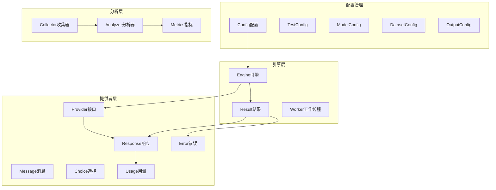
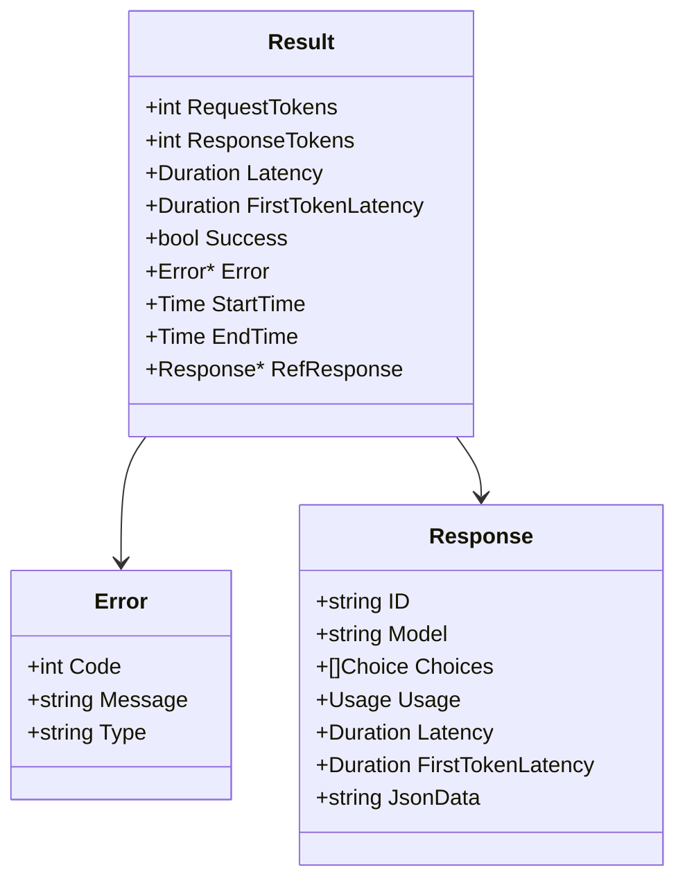
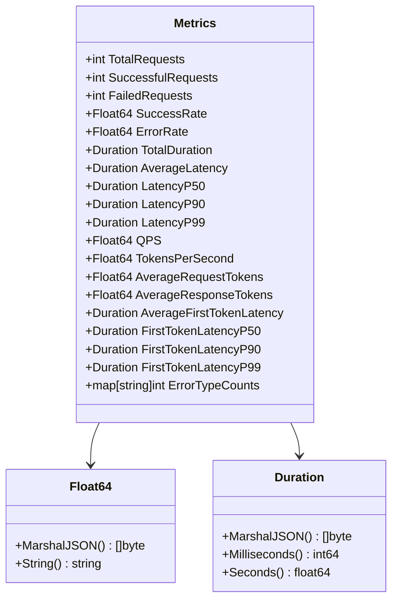
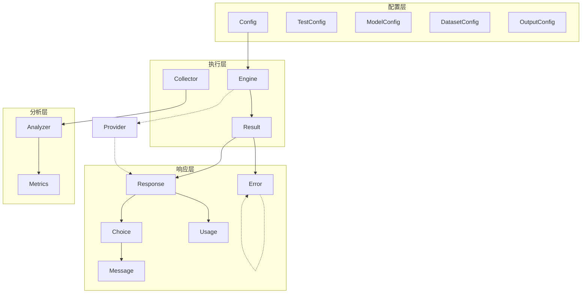
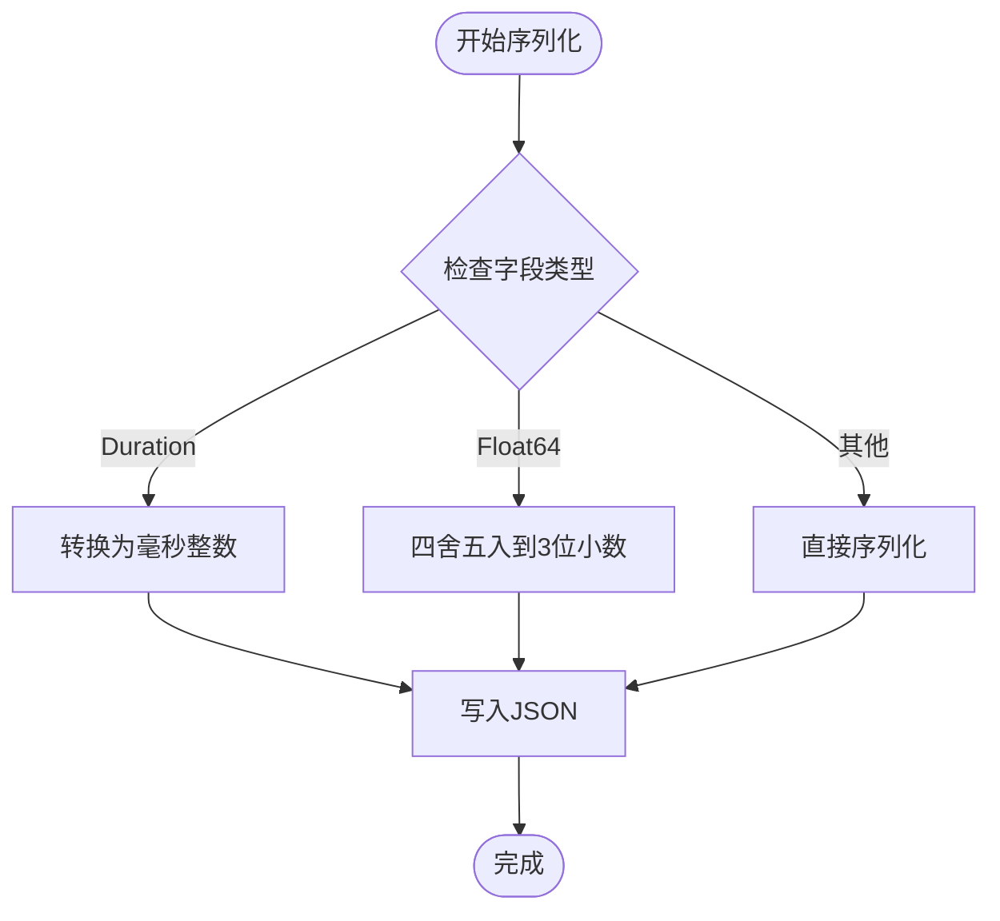

# 数据结构定义

<cite>
**本文档引用的文件**
- [config.go](file://internal/config/config.go)
- [engine.go](file://internal/engine/engine.go)
- [common.go](file://internal/engine/common.go)
- [provider.go](file://internal/provider/provider.go)
- [error.go](file://internal/provider/error.go)
- [analyzer.go](file://internal/analyzer/analyzer.go)
- [collector.go](file://internal/collector/collector.go)
- [batch_results.go](file://internal/utils/batch_results.go)
- [example.yaml](file://configs/example.yaml)
- [test_cases.jsonl](file://examples/test_cases.jsonl)
</cite>

## 目录
1. [简介](#简介)
2. [项目结构概览](#项目结构概览)
3. [核心数据结构总览](#核心数据结构总览)
4. [配置相关数据结构](#配置相关数据结构)
5. [性能结果数据结构](#性能结果数据结构)
6. [LLM响应数据结构](#llm响应数据结构)
7. [分析指标数据结构](#分析指标数据结构)
8. [数据结构关系图](#数据结构关系图)
9. [JSON序列化与反序列化](#json序列化与反序列化)
10. [使用示例与验证规则](#使用示例与验证规则)
11. [结论](#结论)

## 简介

GoLLMPerF 是一个用于评估大语言模型性能的基准测试工具。本文档详细记录了项目中的核心数据结构，包括配置、性能结果、分析指标等关键数据结构的定义和字段说明。这些数据结构构成了整个性能测试系统的基础，支撑着从配置管理到结果分析的完整流程。

## 项目结构概览

GoLLMPerF 采用模块化架构设计，主要包含以下核心模块：



**图表来源**
- [config.go:81-129](file://internal/config/config.go#L81-L129)
- [engine.go:13-30](file://internal/engine/engine.go#L13-L30)
- [provider.go:10-71](file://internal/provider/provider.go#L10-L71)
- [analyzer.go:43-75](file://internal/analyzer/analyzer.go#L43-L75)

## 核心数据结构总览

GoLLMPerF 的数据结构体系围绕以下几个核心概念构建：

1. **配置层**: 定义测试环境、模型参数、数据集和输出格式
2. **执行层**: 管理性能测试的执行过程和结果收集
3. **响应层**: 描述LLM API的响应格式和消息结构
4. **分析层**: 提供性能指标计算和统计分析功能

## 配置相关数据结构

### Config 主配置结构

Config 是整个系统的主配置结构，包含了测试、模型、数据集和输出的所有配置信息。

```mermaid
classDiagram
class Config {
+Test TestConfig
+Model ModelConfig
+Dataset DatasetConfig
+Output OutputConfig
}
class TestConfig {
+Duration Duration
+Duration Duration
+Duration Duration
+int Concurrency
+int RequestsPerConcurrency
+Duration Duration
+[]int PerfConcurrencyGroup
}
class ModelConfig {
+string Name
+string Provider
+string Endpoint
+map[string]string Headers
+string ApiKey
+map[string]interface{}] ParamsTemplate
+SystemPromptTemplate SystemPromptTemplate
}
class DatasetConfig {
+string Type
+string Path
}
class OutputConfig {
+string Format
+string Path
+string BatchResultPath
}
Config --> TestConfig
Config --> ModelConfig
Config --> DatasetConfig
Config --> OutputConfig
```

**图表来源**
- [config.go:81-129](file://internal/config/config.go#L81-L129)

#### 字段详细说明

| 字段名 | 类型 | 必填 | 默认值 | 业务含义 |
|--------|------|------|--------|----------|
| Test | TestConfig | 是 | - | 测试配置，包含持续时间、并发数等测试参数 |
| Model | ModelConfig | 是 | - | 模型配置，包含模型名称、提供商、端点等 |
| Dataset | DatasetConfig | 是 | - | 数据集配置，包含数据集类型和路径 |
| Output | OutputConfig | 是 | - | 输出配置，包含报告格式和输出路径 |

### TestConfig 测试配置

TestConfig 定义了性能测试的具体参数设置。

| 字段名 | 类型 | 必填 | 默认值 | 取值范围 | 业务含义 |
|--------|------|------|--------|----------|----------|
| Duration | time.Duration | 否 | 60s | 任意正时间值 | 测试总时长，0表示无限期测试 |
| Warmup | time.Duration | 否 | 10s | 任意非负时间值 | 预热阶段时长 |
| Concurrency | int | 否 | 10 | ≥1 | 并发请求数量 |
| RequestsPerConcurrency | int | 否 | 100 | ≥0 | 每个并发级别的请求数量，0表示无限 |
| Timeout | time.Duration | 否 | 30s | 任意正时间值 | 单个请求超时时间 |
| PerfConcurrencyGroup | []int | 否 | [1,2,4,8,16,20,32,40,48,64] | 正整数数组 | 性能测试的并发级别组 |

### ModelConfig 模型配置

ModelConfig 描述了LLM模型的连接和参数设置。

| 字段名 | 类型 | 必填 | 默认值 | 取值范围 | 业务含义 |
|--------|------|------|--------|----------|----------|
| Name | string | 是 | "${LLM_MODEL_NAME}" | 有效模型名称 | LLM模型名称 |
| Provider | string | 否 | "openai" | "openai" 或 "qwen" | LLM提供商 |
| Endpoint | string | 否 | "${LLM_API_ENDPOINT}" | 有效URL | API端点地址 |
| ApiKey | string | 否 | "${LLM_API_KEY}" | 有效API密钥 | 认证密钥 |
| Headers | map[string]string | 否 | {"Content-Type":"application/json"} | 有效的HTTP头 | 请求头设置 |
| ParamsTemplate | map[string]interface{} | 否 | 包含stream和include_usage | 任意键值对 | 请求参数模板 |
| SystemPromptTemplate | SystemPromptTemplate | 否 | - | - | 系统提示词模板 |

### DatasetConfig 数据集配置

| 字段名 | 类型 | 必填 | 默认值 | 取值范围 | 业务含义 |
|--------|------|------|--------|----------|----------|
| Type | string | 否 | "jsonl" | "jsonl" | 数据集格式类型 |
| Path | string | 否 | "./examples/test_cases.jsonl" | 有效文件路径 | 数据集文件路径 |

### OutputConfig 输出配置

| 字段名 | 类型 | 必填 | 默认值 | 取值范围 | 业务含义 |
|--------|------|------|--------|----------|----------|
| Format | string | 否 | "html" | "json"、"csv"、"html" | 报告输出格式 |
| Path | string | 否 | "./results/report.html" | 有效文件路径 | 主报告输出路径 |
| BatchResultPath | string | 否 | "./results/batch_results.jsonl" | 有效文件路径 | 批量结果输出路径 |

### SystemPromptTemplate 系统提示词模板

SystemPromptTemplate 支持直接内容或文件路径两种方式配置系统提示词。

| 字段名 | 类型 | 必填 | 默认值 | 取值范围 | 业务含义 |
|--------|------|------|--------|----------|----------|
| Enable | bool | 否 | false | true/false | 是否启用系统提示词 |
| Content | string | 否 | "You are a helpful assistant." | 任意字符串 | 直接的系统提示词内容 |
| Path | string | 否 | "./examples/system_prompt.md" | 有效文件路径 | 系统提示词文件路径 |

**章节来源**
- [config.go:81-188](file://internal/config/config.go#L81-L188)
- [example.yaml:1-78](file://configs/example.yaml#L1-L78)

## 性能结果数据结构

### Result 性能结果结构

Result 结构体记录单次性能测试的结果信息，是整个分析系统的核心数据载体。



**图表来源**
- [engine.go:19-30](file://internal/engine/engine.go#L19-L30)
- [error.go:9-13](file://internal/provider/error.go#L9-L13)

#### 字段详细说明

| 字段名 | 类型 | 必填 | JSON序列化 | 业务含义 |
|--------|------|------|------------|----------|
| RequestTokens | int | 是 | 是 | 请求中使用的令牌数量 |
| ResponseTokens | int | 是 | 是 | 响应中使用的令牌数量 |
| Latency | time.Duration | 是 | 是 | 整个请求的总延迟时间 |
| FirstTokenLatency | time.Duration | 否 | 是 | 第一个令牌的延迟时间（流式响应） |
| Success | bool | 是 | 是 | 请求是否成功 |
| Error | *Error | 否 | 是 | 错误信息（失败时存在） |
| StartTime | time.Time | 是 | 是 | 请求开始时间 |
| EndTime | time.Time | 是 | 是 | 请求结束时间 |
| RefResponse | *Response | 否 | 否 | 对原始响应的引用（不参与JSON序列化） |

### Collector 结果收集器

Collector 负责收集和管理所有测试结果，提供查询和统计功能。

| 方法名 | 参数 | 返回值 | 功能描述 |
|--------|------|--------|----------|
| AddResult | *Result | void | 添加单个结果到收集器 |
| GetAllResults | - | []*Result | 获取所有结果 |
| GetSuccessfulResults | - | []*Result | 获取成功结果 |
| GetFailedResults | - | []*Result | 获取失败结果 |
| GetTotalCount | - | int | 获取结果总数 |
| GetSuccessCount | - | int | 获取成功次数 |
| GetFailureCount | - | int | 获取失败次数 |
| GetTestDuration | - | time.Duration | 获取测试总时长 |

**章节来源**
- [engine.go:19-112](file://internal/engine/engine.go#L19-L112)
- [collector.go:9-97](file://internal/collector/collector.go#L9-L97)

## LLM响应数据结构

### Response LLM响应结构

Response 结构体描述了LLM API的标准响应格式。

```mermaid
classDiagram
class Response {
+string ID
+string Model
+[]Choice Choices
+Usage Usage
+Duration Latency
+Duration FirstTokenLatency
+string JsonData
}
class Choice {
+int Index
+Message Message
+string FinishReason
+Delta* Delta
}
class Message {
+string Role
+interface{} Content
}
class Usage {
+int PromptTokens
+int CompletionTokens
+int TotalTokens
}
Response --> Choice
Choice --> Message
Response --> Usage
```

**图表来源**
- [provider.go:30-71](file://internal/provider/provider.go#L30-L71)

#### 字段详细说明

##### Response 字段

| 字段名 | 类型 | 必填 | JSON序列化 | 业务含义 |
|--------|------|------|------------|----------|
| ID | string | 是 | 是 | 响应唯一标识符 |
| Model | string | 是 | 是 | 使用的模型名称 |
| Choices | []Choice | 是 | 是 | 生成的选择列表 |
| Usage | Usage | 是 | 是 | 令牌使用统计信息 |
| Latency | time.Duration | 否 | 否 | 响应延迟（本地计算） |
| FirstTokenLatency | time.Duration | 否 | 否 | 第一个令牌延迟（流式响应） |
| JsonData | string | 否 | 否 | 原始JSON数据（不参与序列化） |

##### Choice 字段

| 字段名 | 类型 | 必填 | JSON序列化 | 业务含义 |
|--------|------|------|------------|----------|
| Index | int | 是 | 是 | 选择项索引 |
| Message | Message | 是 | 是 | 完整的消息内容 |
| FinishReason | string | 是 | 是 | 完成原因（如"stop"、"length"等） |
| Delta | *struct | 否 | 是 | 流式响应的增量内容 |

##### Message 字段

| 字段名 | 类型 | 必填 | JSON序列化 | 业务含义 |
|--------|------|------|------------|----------|
| Role | string | 是 | 是 | 角色（如"user"、"assistant"、"system"） |
| Content | interface{} | 是 | 是 | 消息内容，可以是字符串或复杂对象 |

##### Usage 字段

| 字段名 | 类型 | 必填 | JSON序列化 | 业务含义 |
|--------|------|------|------------|----------|
| PromptTokens | int | 是 | 是 | 提示词使用的令牌数 |
| CompletionTokens | int | 是 | 是 | 补全使用的令牌数 |
| TotalTokens | int | 是 | 是 | 总令牌使用量 |

**章节来源**
- [provider.go:24-71](file://internal/provider/provider.go#L24-L71)

## 分析指标数据结构

### Metrics 性能指标结构

Metrics 结构体包含了所有计算出的性能分析指标。



**图表来源**
- [analyzer.go:43-75](file://internal/analyzer/analyzer.go#L43-L75)
- [analyzer.go:13-41](file://internal/analyzer/analyzer.go#L13-L41)

#### 字段详细说明

##### 基础指标

| 字段名 | 类型 | JSON序列化 | 业务含义 |
|--------|------|------------|----------|
| TotalRequests | int | 是 | 总请求数量 |
| SuccessfulRequests | int | 是 | 成功请求数量 |
| FailedRequests | int | 是 | 失败请求数量 |
| SuccessRate | Float64 | 是 | 成功率百分比（保留3位小数） |
| ErrorRate | Float64 | 是 | 错误率百分比（保留3位小数） |

##### 时间指标

| 字段名 | 类型 | JSON序列化 | 单位 | 业务含义 |
|--------|------|------------|------|----------|
| TotalDuration | Duration | 是 | 毫秒 | 测试总时长 |
| AverageLatency | Duration | 是 | 毫秒 | 平均响应延迟 |
| LatencyP50 | Duration | 是 | 毫秒 | 中位数延迟 |
| LatencyP90 | Duration | 是 | 毫秒 | 90分位延迟 |
| LatencyP99 | Duration | 是 | 毫秒 | 99分位延迟 |

##### 吞吐量指标

| 字段名 | 类型 | JSON序列化 | 单位 | 业务含义 |
|--------|------|------------|------|----------|
| QPS | Float64 | 是 | 请求/秒 | 每秒查询率（保留3位小数） |
| TokensPerSecond | Float64 | 是 | 令牌/秒 | 每秒处理令牌数（保留3位小数） |

##### 令牌指标

| 字段名 | 类型 | JSON序列化 | 单位 | 业务含义 |
|--------|------|------------|------|----------|
| AverageRequestTokens | Float64 | 是 | 令牌 | 平均请求令牌数（保留3位小数） |
| AverageResponseTokens | Float64 | 是 | 令牌 | 平均响应令牌数（保留3位小数） |

##### 流式响应指标

| 字段名 | 类型 | JSON序列化 | 单位 | 业务含义 |
|--------|------|------------|------|----------|
| AverageFirstTokenLatency | Duration | 是 | 毫秒 | 平均首令牌延迟 |
| FirstTokenLatencyP50 | Duration | 是 | 毫秒 | 首令牌延迟中位数 |
| FirstTokenLatencyP90 | Duration | 是 | 毫秒 | 首令牌延迟90分位 |
| FirstTokenLatencyP99 | Duration | 是 | 毫秒 | 首令牌延迟99分位 |

##### 错误分析指标

| 字段名 | 类型 | JSON序列化 | 业务含义 |
|--------|------|------------|----------|
| ErrorTypeCounts | map[string]int | 是 | 错误类型计数映射 |

### Float64 和 Duration 包装器

为了满足JSON序列化的需求，GoLLMPerF 实现了两个包装器类型：

#### Float64 包装器

- **JSON序列化**: 将浮点数四舍五入到3位小数
- **用途**: 保证指标显示的一致性和可读性

#### Duration 包装器

- **JSON序列化**: 将时间.Duration转换为毫秒整数值
- **方法**:
  - `Milliseconds()`: 返回毫秒数
  - `Seconds()`: 返回秒数（浮点）
  - `String()`: 返回标准时间格式字符串

**章节来源**
- [analyzer.go:13-75](file://internal/analyzer/analyzer.go#L13-L75)

## 数据结构关系图



**图表来源**
- [config.go:81-129](file://internal/config/config.go#L81-L129)
- [engine.go:13-30](file://internal/engine/engine.go#L13-L30)
- [provider.go:10-71](file://internal/provider/provider.go#L10-L71)
- [analyzer.go:43-87](file://internal/analyzer/analyzer.go#L43-L87)

## JSON序列化与反序列化

### 序列化规则

GoLLMPerF 在JSON序列化方面采用了特殊的处理策略：

1. **Duration 类型**: 自动转换为毫秒整数值
2. **Float64 类型**: 四舍五入到3位小数
3. **嵌套结构**: 仅序列化公共字段，忽略私有字段

### 反序列化注意事项

1. **环境变量替换**: 配置加载时会自动替换 `${VAR_NAME}` 格式的环境变量
2. **字段映射**: 使用 `mapstructure` 标签进行字段名映射
3. **默认值处理**: 缺失的配置项使用默认值填充

### 序列化流程



**图表来源**
- [analyzer.go:16-41](file://internal/analyzer/analyzer.go#L16-L41)

**章节来源**
- [config.go:137-188](file://internal/config/config.go#L137-L188)
- [analyzer.go:13-41](file://internal/analyzer/analyzer.go#L13-L41)

## 使用示例与验证规则

### 配置文件示例

参考配置文件展示了各字段的正确用法：

```yaml
test:
  duration: 60s
  warmup: 10s
  concurrency: 10
  perf_concurrency_group: [1,2,4,8,16,24,32,48,64]
  requests_per_concurrency: 10
  timeout: 30s

model:
  name: ${LLM_MODEL_NAME}
  provider: openai
  endpoint: ${LLM_API_ENDPOINT}
  api_key: ${LLM_API_KEY}
  headers:
    Content-Type: application/json
  params_template:
    stream: true
    stream_options:
      include_usage: true
    extra_body:
      enable_thinking: false
  system_prompt_template:
    enable: false
    content: "You are a helpful assistant."
    path: ./examples/system_prompt.md

dataset:
  type: jsonl
  path: ./examples/test_cases.jsonl

output:
  format: html
  path: ./results/report.html
  batch_result_path: ./results/batch_results.jsonl
```

**章节来源**
- [example.yaml:1-78](file://configs/example.yaml#L1-L78)

### 数据集格式示例

测试数据集采用JSONL格式，每行一个JSON对象：

```json
{"messages": [{"role": "user", "content": "Write a short poem about programming."}], "temperature": 0.7, "max_tokens": 100}
{"messages": [{"role": "user", "content": "Explain what is a neural network in simple terms."}], "temperature": 0.5, "max_tokens": 150}
{"messages": [{"role": "user", "content": "How to optimize a Python function for better performance?"}], "temperature": 0.3, "max_tokens": 200}
```

**章节来源**
- [test_cases.jsonl:1-6](file://examples/test_cases.jsonl#L1-L6)

### 验证规则

1. **配置验证**
   - 必填字段必须存在且非空
   - 数值字段必须在合理范围内
   - 文件路径必须可访问

2. **运行时验证**
   - 并发数必须≥1
   - 请求令牌数必须≥0
   - 延迟时间必须≥0

3. **输出验证**
   - JSON序列化后的数据必须符合预期格式
   - 指标计算必须逻辑一致

### 最佳实践

1. **配置管理**
   - 使用环境变量管理敏感信息
   - 合理设置并发数以避免资源耗尽
   - 适当配置预热时间确保稳定性能

2. **监控与调试**
   - 定期检查错误类型分布
   - 关注首令牌延迟指标
   - 监控令牌使用效率

3. **结果分析**
   - 结合多个指标进行综合评估
   - 关注延迟分布的尾部表现
   - 分析不同并发级别的性能特征

## 结论

GoLLMPerF 的数据结构设计体现了清晰的分层架构和强类型约束。通过精心设计的配置、结果、响应和指标结构，该工具能够提供准确、可重复的LLM性能基准测试。这些数据结构不仅保证了系统的稳定性，还为后续的功能扩展和性能优化奠定了坚实基础。

关键的设计亮点包括：
- 清晰的职责分离和模块化设计
- 精确的类型定义和边界控制
- 合理的JSON序列化策略
- 完善的错误处理和验证机制

这些特性使得GoLLMPerF成为了一个既易于使用又功能强大的LLM性能测试工具。