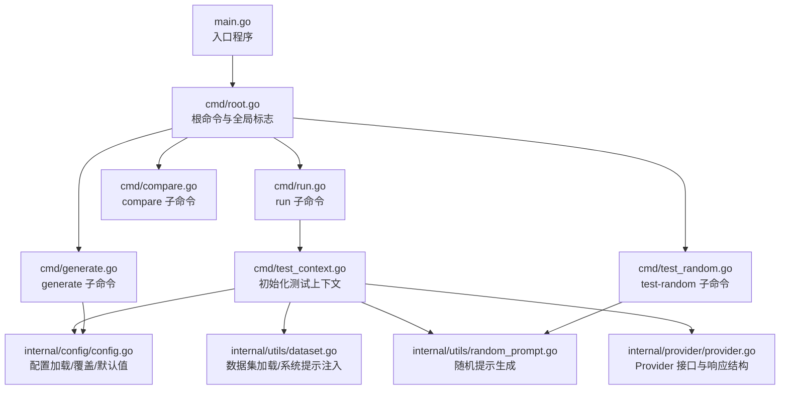
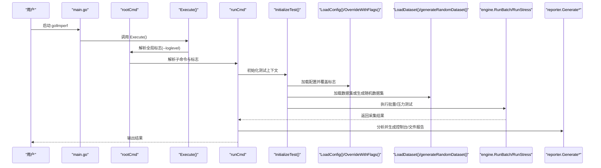
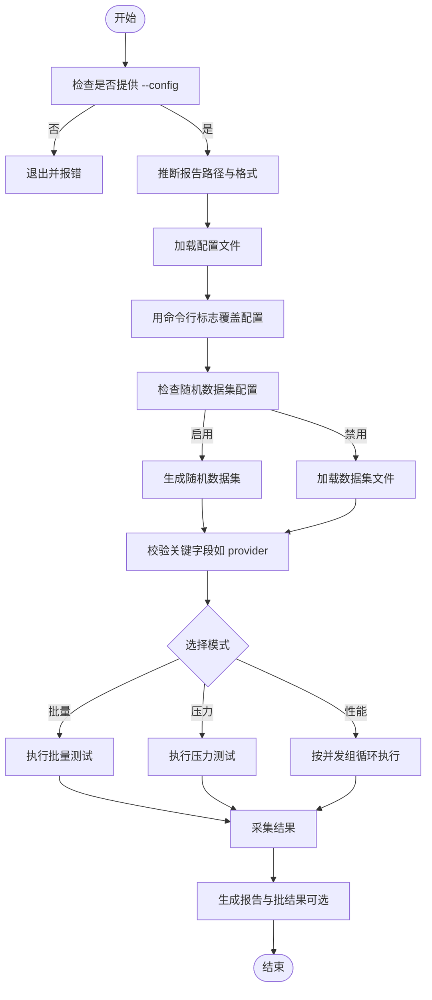
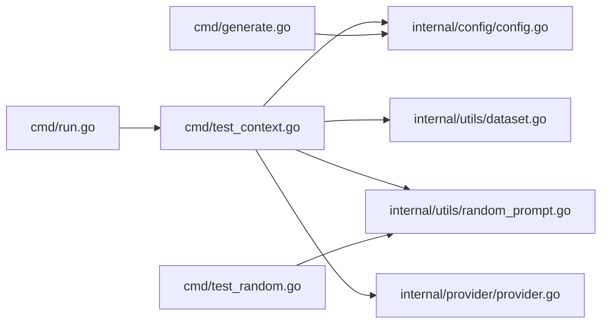

# 命令行参考

<cite>
**本文引用的文件**
- [main.go](file://main.go)
- [cmd/root.go](file://cmd/root.go)
- [cmd/run.go](file://cmd/run.go)
- [cmd/compare.go](file://cmd/compare.go)
- [cmd/generate.go](file://cmd/generate.go)
- [cmd/run_flags.go](file://cmd/run_flags.go)
- [cmd/test_context.go](file://cmd/test_context.go)
- [cmd/test_random.go](file://cmd/test_random.go)
- [internal/config/config.go](file://internal/config/config.go)
- [configs/example.yaml](file://configs/example.yaml)
- [internal/provider/provider.go](file://internal/provider/provider.go)
- [internal/utils/dataset.go](file://internal/utils/dataset.go)
- [internal/utils/random_prompt.go](file://internal/utils/random_prompt.go)
- [internal/provider/error.go](file://internal/provider/error.go)
</cite>

## 目录
1. [简介](#简介)
2. [项目结构](#项目结构)
3. [核心组件](#核心组件)
4. [架构总览](#架构总览)
5. [详细组件分析](#详细组件分析)
6. [依赖分析](#依赖分析)
7. [性能考虑](#性能考虑)
8. [故障排查指南](#故障排查指南)
9. [结论](#结论)
10. [附录](#附录)

## 简介
本文件为 GoLLMPerf 的命令行参考文档，覆盖根命令及子命令（run、compare、generate、test-random）的完整用法，包括：
- 所有命令与子命令的用途、参数与标志位
- 参数优先级规则：命令行标志覆盖配置文件，环境变量用于配置文件中的占位符替换
- 使用场景与典型示例
- 参数校验、错误处理与调试选项
- 最佳实践与常见使用模式
- **新增**：随机数据集生成功能及其相关标志位

## 项目结构
GoLLMPerf 采用 Cobra 命令框架组织 CLI，入口程序负责初始化日志与执行根命令；各子命令在 cmd 目录下实现，配置加载与覆盖逻辑集中在 internal/config 中，数据集加载与系统提示注入在 internal/utils 中，模型提供方抽象在 internal/provider 中。**新增**：随机提示生成功能位于 internal/utils/random_prompt.go，测试随机功能位于 cmd/test_random.go。

**图表来源**
- [main.go:20-25](file://main.go#L20-L25)
- [cmd/root.go:10-27](file://cmd/root.go#L10-L27)
- [cmd/run.go:16-95](file://cmd/run.go#L16-L95)
- [cmd/compare.go:7-20](file://cmd/compare.go#L7-L20)
- [cmd/generate.go:8-25](file://cmd/generate.go#L8-L25)
- [cmd/test_random.go:11-95](file://cmd/test_random.go#L11-L95)
- [cmd/test_context.go:21-81](file://cmd/test_context.go#L21-L81)
- [internal/config/config.go:136-228](file://internal/config/config.go#L136-L228)
- [internal/utils/dataset.go:62-80](file://internal/utils/dataset.go#L62-L80)
- [internal/utils/random_prompt.go:32-113](file://internal/utils/random_prompt.go#L32-113)
- [internal/provider/provider.go:10-71](file://internal/provider/provider.go#L10-L71)

**章节来源**
- [main.go:20-25](file://main.go#L20-L25)
- [cmd/root.go:10-27](file://cmd/root.go#L10-L27)

## 核心组件
- 根命令与全局标志
  - 名称：gollmperf
  - 全局标志：--loglevel/-l 指定日志级别
  - 作用：设置全局日志级别后执行子命令
- run 子命令
  - 名称：run
  - 用途：运行批量测试、压力测试或性能模式测试
  - 关键标志：--config/-c、--batch/-b、--perf/-p、--provider/-P、--model/-m、--dataset/-d、--apikey/-k、--endpoint/-e、--report/-r、--format/-f、--batch-result、--no-report/-n、--show-table/-s、**新增** --random-enable、--random-input-len、--random-output-len
  - 行为：根据标志选择模式，加载配置与数据集，调用引擎执行测试，生成报告与可选的批结果文件
- compare 子命令
  - 名称：compare
  - 用途：比较不同模型或配置的性能（预留）
  - 关键标志：--configs/-c（配置文件列表）
- generate 子命令
  - 名称：generate
  - 用途：生成默认配置文件
  - 参数：必须提供输出文件路径（位置参数）
- **新增** test-random 子命令
  - 名称：test-random
  - 用途：测试随机提示生成功能，验证目标 token 数量的准确性
  - 关键标志：--endpoint/-e、--tokens/-t、--iterations/-i、--verbose/-v

**章节来源**
- [cmd/root.go:10-27](file://cmd/root.go#L10-L27)
- [cmd/run.go:16-95](file://cmd/run.go#L16-L95)
- [cmd/compare.go:7-20](file://cmd/compare.go#L7-L20)
- [cmd/generate.go:8-25](file://cmd/generate.go#L8-L25)
- [cmd/test_random.go:11-95](file://cmd/test_random.go#L11-L95)

## 架构总览
命令行执行流程概览如下：

**图表来源**
- [main.go:20-25](file://main.go#L20-L25)
- [cmd/root.go:17-23](file://cmd/root.go#L17-L23)
- [cmd/run.go:22-77](file://cmd/run.go#L22-L77)
- [cmd/test_context.go:21-81](file://cmd/test_context.go#L21-L81)
- [cmd/test_context.go:106-143](file://cmd/test_context.go#L106-143)
- [internal/config/config.go:136-228](file://internal/config/config.go#L136-L228)
- [internal/utils/dataset.go:62-80](file://internal/utils/dataset.go#L62-L80)
- [internal/utils/random_prompt.go:32-113](file://internal/utils/random_prompt.go#L32-113)

## 详细组件分析

### 根命令（gollmperf）
- 用途：作为 CLI 入口，提供全局标志（如 --loglevel），并在执行时应用日志级别。
- 全局标志
  - --loglevel/-l：字符串类型，设置日志级别（例如 DEB/INFO/WARN/ERR）
- 执行流程
  - 读取 --loglevel 并设置全局日志级别
  - 执行子命令解析与运行

**章节来源**
- [cmd/root.go:10-27](file://cmd/root.go#L10-L27)
- [cmd/root.go:17-23](file://cmd/root.go#L17-L23)

### run 子命令（gollmperf run）
- 用途：运行批量测试、压力测试或性能模式测试，并生成报告与可选的批结果文件。
- 关键标志与参数
  - --config/-c：配置文件路径（必填）
  - --batch/-b：批量模式（默认关闭）
  - --perf/-p：性能模式（默认关闭）
  - --provider/-P：模型提供商（默认 openai）
  - --model/-m：模型名称
  - --dataset/-d：数据集路径
  - --apikey/-k：API 密钥
  - --endpoint/-e：API 端点
  - --report/-r：报告输出文件路径
  - --format/-f：报告格式（json/csv/html），默认从文件扩展名推断
  - --batch-result：批结果输出文件路径（仅批量模式有效）
  - --no-report/-n：禁用报告生成
  - --show-table/-s：在控制台显示表格形式的报告
  - **新增** --random-enable：启用 vLLM 随机数据集生成功能（布尔值，默认 false）
  - **新增** --random-input-len：随机数据集输入 token 长度（整数，默认 0）
  - **新增** --random-output-len：随机数据集输出 token 长度（整数，默认 0）
- 运行模式
  - 批量模式：一次性完成数据集中所有用例
  - 压力模式：持续发送请求以探测系统稳定性
  - 性能模式：在多个并发组中依次运行，收集不同并发下的指标
  - **新增** 随机数据集模式：当启用随机数据集生成功能时，系统会生成指定长度的随机提示进行测试
- 报告与输出
  - 控制台报告：默认生成摘要报告；若启用 --show-table，则以表格形式输出
  - 文件报告：根据 --report 与 --format 决定输出路径与格式
  - 批结果文件：仅在批量模式且设置了 --batch-result 时保存为 JSONL
- 参数优先级与覆盖
  - 配置文件为默认来源
  - 命令行标志仅在提供时才覆盖配置文件对应字段
  - **新增**：随机数据集配置的特殊处理：使用 `RandomEnableSet` 字段区分"未设置"和"显式设置为 false"的情况
  - 报告路径与格式的推断规则：若仅提供 --format 则自动补全文件名；若仅提供 --report 则自动推断格式
- 错误处理
  - 必须提供 --config
  - 不支持的提供商会报错退出
  - 数据集加载失败或配置无效会报错退出
  - **新增**：随机数据集生成失败时会发出警告但仍继续执行
- 调试与日志
  - 全局 --loglevel 控制日志级别
  - Provider 层支持通过环境变量开启请求/响应调试（见 provider/openai.go）
  - **新增**：随机数据集生成过程的日志输出

**章节来源**
- [cmd/run.go:16-95](file://cmd/run.go#L16-L95)
- [cmd/run.go:22-77](file://cmd/run.go#L22-L77)
- [cmd/run.go:98-103](file://cmd/run.go#L98-L103)
- [cmd/test_context.go:21-81](file://cmd/test_context.go#L21-L81)
- [cmd/test_context.go:47-58](file://cmd/test_context.go#L47-L58)
- [cmd/test_context.go:72-77](file://cmd/test_context.go#L72-L77)
- [internal/config/config.go:190-228](file://internal/config/config.go#L190-L228)
- [internal/config/config.go:29-34](file://internal/config/config.go#L29-L34)

#### run 子命令参数优先级流程图

**图表来源**
- [cmd/test_context.go:21-81](file://cmd/test_context.go#L21-L81)
- [cmd/test_context.go:47-58](file://cmd/test_context.go#L47-L58)
- [cmd/test_context.go:72-83](file://cmd/test_context.go#L72-L83)
- [cmd/run.go:22-77](file://cmd/run.go#L22-L77)
- [internal/config/config.go:190-228](file://internal/config/config.go#L190-L228)

### compare 子命令（gollmperf compare）
- 用途：比较不同模型或配置的性能（预留功能）
- 关键标志
  - --configs/-c：配置文件列表（多个）
- 当前行为：打印"正在运行比较测试..."，后续将实现具体比较逻辑

**章节来源**
- [cmd/compare.go:7-20](file://cmd/compare.go#L7-L20)

### generate 子命令（gollmperf generate）
- 用途：生成默认配置文件
- 参数
  - 位置参数：输出文件路径（必填）
- 默认内容要点
  - 测试配置：时长、预热、并发、每并发请求数、超时、性能并发组
  - 模型配置：名称、提供商、端点、API 密钥、请求头、参数模板、系统提示模板
  - 数据集配置：类型与路径
  - **新增** 随机数据集配置：random-enable、random-input-len、random-output-len
  - 输出配置：报告格式、路径、批结果路径
- 环境变量占位符
  - 配置文件中模型名称、API 密钥、端点支持以 ${ENV_VAR} 形式引用环境变量，加载时进行替换

**章节来源**
- [cmd/generate.go:8-25](file://cmd/generate.go#L8-L25)
- [internal/config/config.go:14-75](file://internal/config/config.go#L14-L75)
- [configs/example.yaml:67-72](file://configs/example.yaml#L67-L72)

### **新增** test-random 子命令（gollmperf test-random）
- 用途：测试随机提示生成功能，验证目标 token 数量的准确性
- 关键标志
  - --endpoint/-e：vLLM 端点 URL（例如 http://localhost:63535/v1/chat/completions），必需
  - --tokens/-t：目标 token 数量（整数，默认 1000）
  - --iterations/-i：测试迭代次数（整数，默认 3）
  - --verbose/-v：显示详细输出，包括提示预览（布尔值，默认 false）
- 工作原理
  - 调用 vLLM 的 /tokenize 端点获取实际 token 数量
  - 通过多次迭代计算成功率和平均差异
  - 使用容差机制（目标的 2% 或 10 个 token，以较大者为准）
- 输出内容
  - 每次迭代的结果：目标、实际、差异、容差
  - 汇总统计：总迭代数、成功次数、成功率、平均差异
  - 可选的详细输出：提示长度、提示预览

**章节来源**
- [cmd/test_random.go:11-95](file://cmd/test_random.go#L11-L95)
- [cmd/test_random.go:17-86](file://cmd/test_random.go#L17-L86)

## 依赖分析
- 命令层依赖
  - run 子命令依赖：测试上下文初始化、配置加载与覆盖、数据集加载、**新增**随机数据集生成、引擎执行、报告生成
  - compare 子命令当前为空实现，预留依赖于配置比较模块
  - generate 子命令依赖：配置生成器
  - **新增** test-random 子命令依赖：随机提示生成工具函数
- 配置层依赖
  - Viper 读取 YAML 配置并反序列化为结构体
  - **新增** RandomDatasetVLLMConfig 结构体支持随机数据集配置
  - 环境变量替换：对模型名称、API 密钥、端点进行占位符替换
  - 覆盖策略：命令行标志仅在提供时覆盖配置字段
- 数据集与系统提示
  - 支持 JSONL 数据集，逐行解析为请求参数
  - 可选系统提示注入到消息数组首条
  - **新增** 随机数据集生成：基于目标 token 数量生成随机提示，调用 vLLM tokenize API 验证准确性

**图表来源**
- [cmd/run.go:16-95](file://cmd/run.go#L16-L95)
- [cmd/test_context.go:21-81](file://cmd/test_context.go#L21-L81)
- [cmd/test_context.go:106-143](file://cmd/test_context.go#L106-143)
- [internal/config/config.go:136-228](file://internal/config/config.go#L136-L228)
- [internal/utils/dataset.go:62-80](file://internal/utils/dataset.go#L62-L80)
- [internal/utils/random_prompt.go:32-113](file://internal/utils/random_prompt.go#L32-113)
- [internal/provider/provider.go:10-71](file://internal/provider/provider.go#L10-L71)
- [cmd/generate.go:8-25](file://cmd/generate.go#L8-L25)
- [cmd/test_random.go:11-95](file://cmd/test_random.go#L11-L95)

**章节来源**
- [cmd/run.go:16-95](file://cmd/run.go#L16-L95)
- [cmd/test_context.go:21-81](file://cmd/test_context.go#L21-L81)
- [cmd/test_context.go:106-143](file://cmd/test_context.go#L106-143)
- [internal/config/config.go:136-228](file://internal/config/config.go#L136-L228)
- [internal/utils/dataset.go:62-80](file://internal/utils/dataset.go#L62-L80)
- [internal/utils/random_prompt.go:32-113](file://internal/utils/random_prompt.go#L32-113)
- [internal/provider/provider.go:10-71](file://internal/provider/provider.go#L10-L71)
- [cmd/generate.go:8-25](file://cmd/generate.go#L8-L25)
- [cmd/test_random.go:11-95](file://cmd/test_random.go#L11-L95)

## 性能考虑
- 并发与吞吐
  - 批量模式：适合一次性跑完全部用例，便于对比与复现
  - 压力模式：持续高并发请求，用于评估系统稳定性与峰值能力
  - 性能模式：在多个并发组上迭代，定位系统性能拐点
  - **新增** 随机数据集模式：适合测试 vLLM 等推理引擎在不同 token 长度下的性能表现
- 报告与输出
  - 控制台报告与文件报告可分别满足即时反馈与归档需求
  - 批结果文件可用于离线分析与二次处理
- 日志与调试
  - 通过 --loglevel 调整日志级别，有助于定位问题
  - Provider 层可通过环境变量开启请求/响应调试（如 DEBUG_LLM_REQUEST/DEBUG_LLM_RESPONSE）
  - **新增** 随机数据集生成过程的日志输出，便于调试 token 数量准确性

## 故障排查指南
- 常见错误与处理
  - 缺少配置文件：必须提供 --config，否则直接退出
  - 不支持的提供商：当前支持 openai 与 qwen，其他值会报错退出
  - 数据集加载失败：文件不存在或 JSONL 行解析错误会报错退出
  - 配置无效：如 provider 未指定等，会报错退出
  - **新增** 随机数据集生成失败：vLLM tokenize API 调用失败时会发出警告但仍继续执行
- 错误分类与诊断
  - 网络类错误：连接被拒、超时、主机不可达等会被识别并分类
  - 其他错误：原始错误信息保留，便于进一步诊断
- 调试技巧
  - 提升日志级别：--loglevel 设置为更详细级别
  - 开启 Provider 调试：通过环境变量开启请求/响应调试
  - 逐步缩小范围：先用小并发与短时长验证配置正确性
  - **新增** 使用 test-random 子命令验证随机提示生成的准确性

**章节来源**
- [cmd/test_context.go:21-81](file://cmd/test_context.go#L21-L81)
- [cmd/test_context.go:109-112](file://cmd/test_context.go#L109-L112)
- [internal/provider/error.go:32-78](file://internal/provider/error.go#L32-L78)

## 结论
GoLLMPerf 的命令行接口清晰地将"配置文件"作为主数据源，"命令行标志"作为可选覆盖层，并通过"环境变量占位符"实现敏感信息的安全注入。run 子命令提供了三种测试模式以覆盖从批量到性能极限的多种场景；compare 与 generate 子命令为比较与初始配置提供基础能力。**新增**的随机数据集生成功能为 vLLM 等推理引擎的性能测试提供了灵活的工具，允许用户在不同 token 长度下进行精确的性能评估。遵循本文的参数优先级与最佳实践，可高效、稳定地开展 LLM 性能测试。

## 附录

### 参数优先级与覆盖规则
- 配置文件为默认来源
- 命令行标志仅在提供时覆盖配置文件对应字段
- **新增**：随机数据集配置的特殊处理
  - 使用 `RandomEnableSet` 字段区分"未设置"和"显式设置为 false"的情况
  - 仅当通过命令行显式设置 `--random-enable` 时才覆盖配置文件中的值
- 报告路径与格式的推断规则：
  - 仅提供 --format：自动生成文件名（默认前缀与格式）
  - 仅提供 --report：自动从扩展名推断格式
- 环境变量占位符替换：
  - 配置文件中 ${ENV_VAR} 将在加载时替换为环境变量值

**章节来源**
- [cmd/test_context.go:29-34](file://cmd/test_context.go#L29-L34)
- [cmd/test_context.go:47-58](file://cmd/test_context.go#L47-L58)
- [internal/config/config.go:190-228](file://internal/config/config.go#L190-L228)
- [internal/config/config.go:157-179](file://internal/config/config.go#L157-L179)

### 使用示例（基于命令与配置）
- 生成默认配置文件
  - gollmperf generate ./my-config.yaml
- 基于配置运行批量测试
  - gollmperf run --config ./my-config.yaml --batch
- 基于配置运行压力测试
  - gollmperf run --config ./my-config.yaml --perf
- 覆盖部分配置项
  - gollmperf run --config ./my-config.yaml --provider qwen --model qwen-plus --apikey ${QWEN_API_KEY} --endpoint https://dashscope.aliyuncs.com/api...
- 指定报告输出与格式
  - gollmperf run --config ./my-config.yaml --report ./results/perf.csv --format csv
- 仅生成报告（不执行测试）
  - gollmperf run --config ./my-config.yaml --no-report
- 在控制台显示表格报告
  - gollmperf run --config ./my-config.yaml --show-table
- **新增** 使用随机数据集进行测试
  - gollmperf run --config ./my-config.yaml --random-enable --random-input-len 1000 --random-output-len 100
- **新增** 测试随机提示生成功能
  - gollmperf test-random --endpoint http://localhost:63535/v1/chat/completions --tokens 1000 --iterations 5 --verbose

**章节来源**
- [cmd/generate.go:13-20](file://cmd/generate.go#L13-L20)
- [cmd/run.go:82-95](file://cmd/run.go#L82-L95)
- [cmd/run.go:98-103](file://cmd/run.go#L98-L103)
- [cmd/test_random.go:89-95](file://cmd/test_random.go#L89-L95)
- [internal/config/config.go:14-75](file://internal/config/config.go#L14-L75)

### 配置文件要点（来自示例）
- 测试配置：duration、warmup、concurrency、requests_per_concurrency、timeout、perf_concurrency_group
- 模型配置：name、provider、endpoint、api_key、headers、params_template、system_prompt_template
- 数据集配置：type、path
- **新增** 随机数据集配置：random-enable、random-input-len、random-output-len
- 输出配置：format、path、batch_result_path

**章节来源**
- [configs/example.yaml:1-84](file://configs/example.yaml#L1-L84)

### **新增** 随机数据集配置详解
- random-enable：布尔值，控制是否启用随机数据集生成功能
- random-input-len：整数，指定随机输入提示的目标 token 长度
- random-output-len：整数，指定随机输出的最大 token 长度
- 工作机制：
  - 调用 vLLM /tokenize 端点获取实际 token 数量
  - 通过多次迭代调整提示内容，使实际 token 数量接近目标值
  - 容差范围：目标的 2% 或 10 个 token，以较大者为准
- 使用场景：
  - 测试 vLLM 在不同输入长度下的性能表现
  - 验证推理引擎的 token 计数准确性
  - 生成标准化的测试数据集

**章节来源**
- [configs/example.yaml:67-72](file://configs/example.yaml#L67-L72)
- [internal/config/config.go:130-135](file://internal/config/config.go#L130-L135)
- [cmd/test_context.go:106-143](file://cmd/test_context.go#L106-L143)
- [internal/utils/random_prompt.go:32-113](file://internal/utils/random_prompt.go#L32-113)