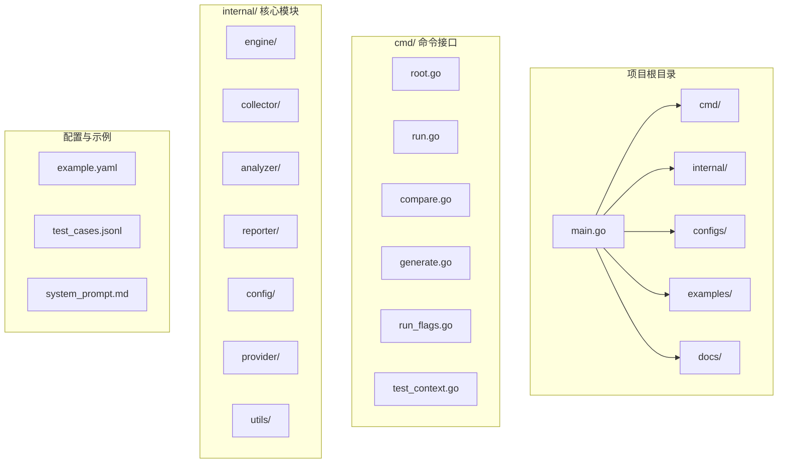
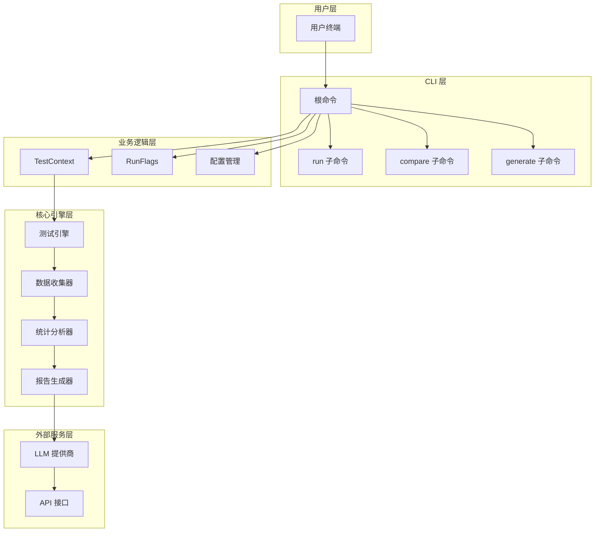
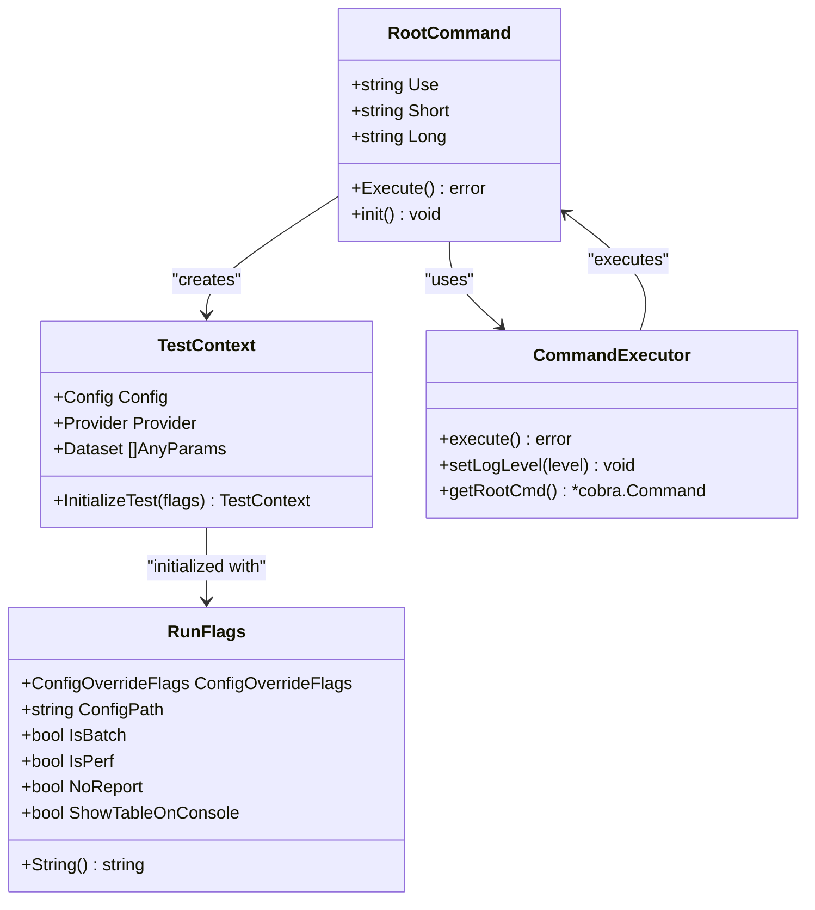
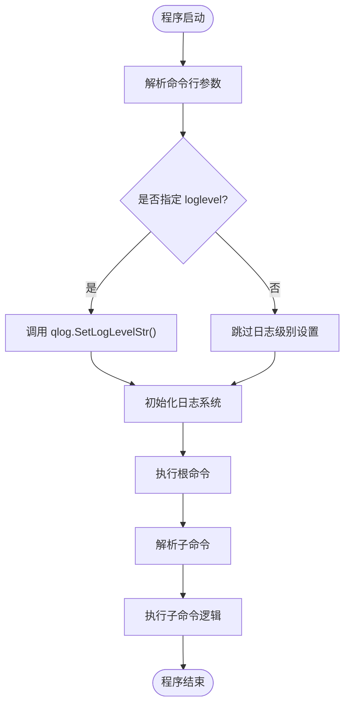
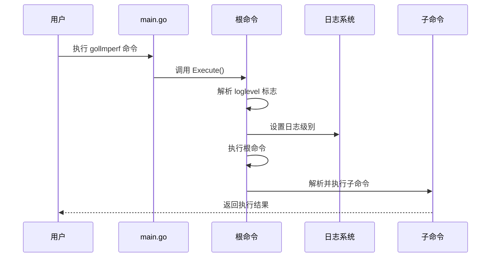
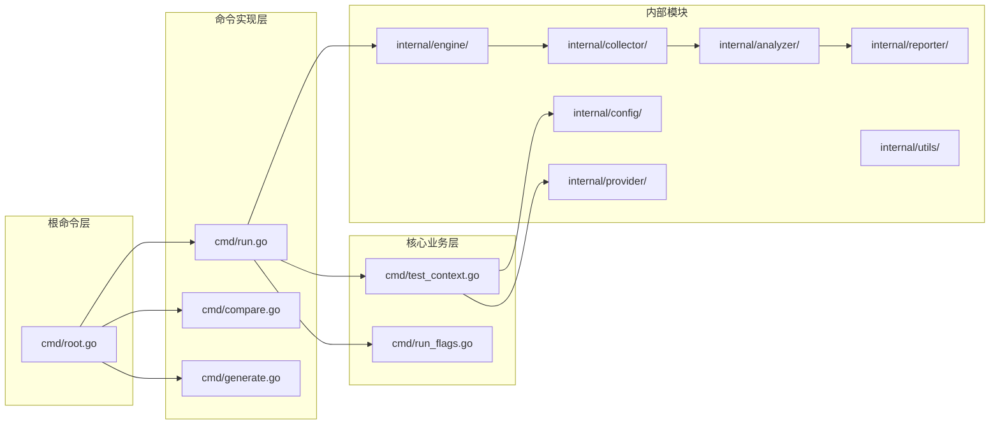

# 根命令

<cite>
**本文档引用的文件**
- [main.go](file://main.go)
- [root.go](file://cmd/root.go)
- [run.go](file://cmd/run.go)
- [compare.go](file://cmd/compare.go)
- [generate.go](file://cmd/generate.go)
- [test_context.go](file://cmd/test_context.go)
- [run_flags.go](file://cmd/run_flags.go)
- [README.md](file://README.md)
</cite>

## 目录
1. [简介](#简介)
2. [项目结构](#项目结构)
3. [核心组件](#核心组件)
4. [架构概览](#架构概览)
5. [详细组件分析](#详细组件分析)
6. [依赖关系分析](#依赖关系分析)
7. [性能考虑](#性能考虑)
8. [故障排除指南](#故障排除指南)
9. [结论](#结论)

## 简介

GoLLMPerf 是一个专业的大型语言模型（LLM）API 性能测试工具，专门用于评估和基准测试 LLM 的性能表现。该工具支持多种测试模式，包括批量测试、压力测试、性能测试和稳定性测试，并提供多维度的性能指标分析。

根命令作为整个 CLI 工具的入口点，负责初始化全局配置、设置日志级别，并建立命令树结构。它是所有子命令的基础，为用户提供统一的交互界面和一致的参数传递机制。

## 项目结构

GoLLMPerf 采用模块化的项目结构设计，主要包含以下关键目录：

**图表来源**
- [main.go:1-26](file://main.go#L1-L26)
- [root.go:1-28](file://cmd/root.go#L1-L28)

**章节来源**
- [main.go:1-26](file://main.go#L1-L26)
- [README.md:92-109](file://README.md#L92-L109)

## 核心组件

### 根命令执行器

根命令的核心功能由 `Execute()` 函数实现，该函数负责：

1. **日志级别处理**：从持久化标志中读取 `loglevel` 参数
2. **动态日志配置**：根据用户输入设置全局日志级别
3. **命令树执行**：启动 Cobra 命令框架并执行相应的子命令

### 全局标志位系统

根命令定义了以下全局标志位：

| 标志位 | 短格式 | 长格式 | 类型 | 默认值 | 描述 |
|--------|--------|--------|------|--------|------|
| loglevel | -l | --loglevel | 字符串 | 空字符串 | 设置全局日志级别 |
| help | -h | --help | 布尔值 | false | 显示帮助信息 |
| version | -v | --version | 布尔值 | false | 显示版本信息 |

### 子命令注册

根命令通过 `AddCommand()` 方法注册所有可用的子命令：

- **run**：执行批量或压力测试
- **compare**：比较不同模型或配置的性能
- **generate**：生成默认配置文件

**章节来源**
- [root.go:10-27](file://cmd/root.go#L10-L27)
- [run.go:80-81](file://cmd/run.go#L80-L81)
- [compare.go:17-18](file://cmd/compare.go#L17-L18)
- [generate.go:23-24](file://cmd/generate.go#L23-L24)

## 架构概览

GoLLMPerf 采用分层架构设计，根命令位于架构的最顶层，为整个系统提供统一的入口点：

**图表来源**
- [root.go:10-15](file://cmd/root.go#L10-L15)
- [test_context.go:14-19](file://cmd/test_context.go#L14-L19)
- [run.go:16-78](file://cmd/run.go#L16-L78)

## 详细组件分析

### 根命令类图

**图表来源**
- [root.go:10-27](file://cmd/root.go#L10-L27)
- [test_context.go:14-81](file://cmd/test_context.go#L14-L81)
- [run_flags.go:9-24](file://cmd/run_flags.go#L9-L24)

### 日志级别处理流程

**图表来源**
- [root.go:17-23](file://cmd/root.go#L17-L23)

### 命令执行序列

**图表来源**
- [main.go:20-25](file://main.go#L20-L25)
- [root.go:17-23](file://cmd/root.go#L17-L23)

**章节来源**
- [root.go:17-23](file://cmd/root.go#L17-L23)
- [main.go:11-18](file://main.go#L11-L18)

## 依赖关系分析

### 外部依赖

GoLLMPerf 主要依赖以下外部库：

| 依赖库 | 版本 | 用途 |
|--------|------|------|
| github.com/FortuneW/qlog | v0.3.0 | 日志记录和级别控制 |
| github.com/spf13/cobra | - | CLI 命令框架 |
| github.com/spf13/viper | - | 配置管理 |
| gopkg.in/yaml.v2 | - | YAML 文件解析 |

### 内部模块依赖

**图表来源**
- [root.go:1-6](file://cmd/root.go#L1-L6)
- [run.go:3-14](file://cmd/run.go#L3-L14)
- [test_context.go:3-12](file://cmd/test_context.go#L3-L12)

**章节来源**
- [root.go:1-6](file://cmd/root.go#L1-L6)
- [run.go:3-14](file://cmd/run.go#L3-L14)

## 性能考虑

### 日志级别对性能的影响

日志级别设置对系统性能有直接影响：

- **DEBUG 级别**：产生大量调试信息，适合开发和问题诊断
- **INFO 级别**：记录主要操作和状态变化
- **WARN 级别**：仅记录警告信息
- **ERROR 级别**：仅记录错误信息

在生产环境中建议使用 INFO 或更高级别，以减少日志写入开销。

### 内存和 CPU 使用优化

- **延迟初始化**：日志系统在根命令执行时才进行配置
- **按需加载**：子命令只在需要时加载相关模块
- **资源管理**：测试完成后及时释放内存和连接资源

## 故障排除指南

### 常见问题及解决方案

| 问题类型 | 症状 | 可能原因 | 解决方案 |
|----------|------|----------|----------|
| 命令未找到 | `unknown command` 错误 | 子命令拼写错误 | 检查命令名称和大小写 |
| 配置文件缺失 | 配置加载失败 | 配置路径不正确 | 确认配置文件存在且路径正确 |
| API 密钥错误 | 请求被拒绝 | 认证失败 | 检查 API 密钥和权限设置 |
| 网络连接超时 | 请求超时 | 网络不稳定 | 检查网络连接和防火墙设置 |

### 调试技巧

1. **启用详细日志**：使用 `--loglevel DEBUG` 获取完整调试信息
2. **验证配置**：使用 `--help` 查看命令参数说明
3. **检查环境变量**：确认必要的环境变量已正确设置

**章节来源**
- [root.go:17-23](file://cmd/root.go#L17-L23)
- [test_context.go:21-27](file://cmd/test_context.go#L21-L27)

## 结论

GoLLMPerf 的根命令作为整个 CLI 工具的核心入口，提供了简洁而强大的命令行接口。通过精心设计的标志位系统和模块化的架构，它为用户提供了灵活的配置选项和丰富的功能特性。

根命令的主要优势包括：

1. **统一的入口点**：所有子命令都通过根命令访问
2. **灵活的日志控制**：支持动态调整日志级别
3. **清晰的命令结构**：符合 Cobra 框架的最佳实践
4. **可扩展的设计**：易于添加新的子命令和功能

对于开发者而言，根命令的设计体现了良好的软件工程原则，为后续的功能扩展和维护奠定了坚实的基础。