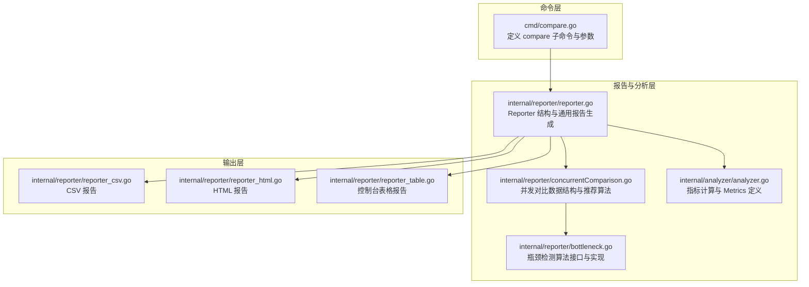
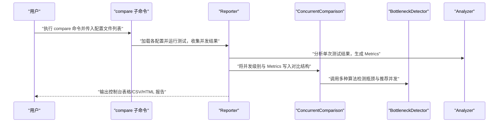
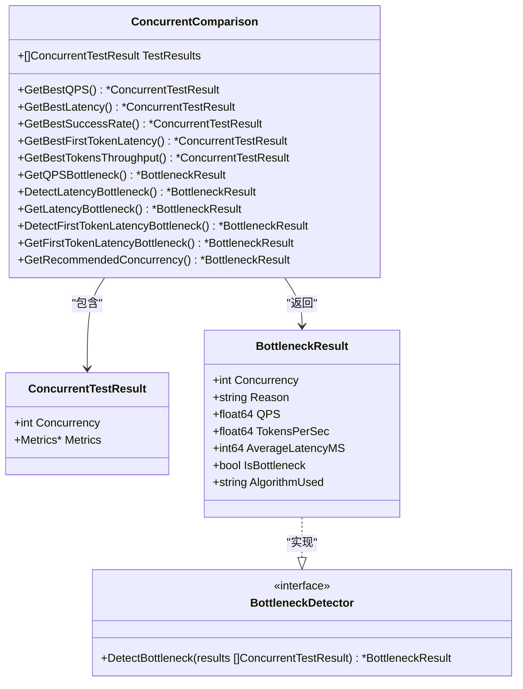
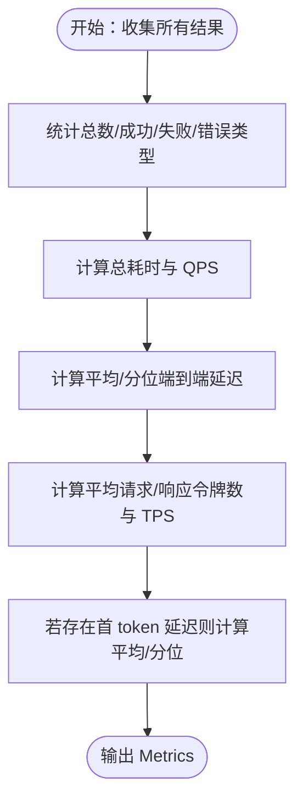
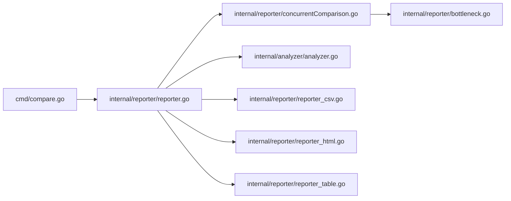

# 比较命令

<cite>
**本文引用的文件**
- [cmd/compare.go](file://cmd/compare.go)
- [internal/reporter/concurrentComparison.go](file://internal/reporter/concurrentComparison.go)
- [internal/analyzer/analyzer.go](file://internal/analyzer/analyzer.go)
- [internal/reporter/bottleneck.go](file://internal/reporter/bottleneck.go)
- [internal/reporter/reporter.go](file://internal/reporter/reporter.go)
- [internal/reporter/reporter_csv.go](file://internal/reporter/reporter_csv.go)
- [internal/reporter/reporter_html.go](file://internal/reporter/reporter_html.go)
- [internal/reporter/reporter_table.go](file://internal/reporter/reporter_table.go)
- [internal/utils/batch_results.go](file://internal/utils/batch_results.go)
- [configs/example.yaml](file://configs/example.yaml)
- [examples/test_cases.jsonl](file://examples/test_cases.jsonl)
- [README.md](file://README.md)
</cite>

## 目录
1. [简介](#简介)
2. [项目结构](#项目结构)
3. [核心组件](#核心组件)
4. [架构总览](#架构总览)
5. [详细组件分析](#详细组件分析)
6. [依赖分析](#依赖分析)
7. [性能考虑](#性能考虑)
8. [故障排查指南](#故障排查指南)
9. [结论](#结论)
10. [附录](#附录)

## 简介
本节介绍 compare 命令的目标与定位：用于在多组测试结果之间进行对比，帮助用户评估不同模型或不同配置下的性能差异。compare 命令当前处于占位状态，但其设计目标明确：支持通过配置文件列表进行对比，并基于内置的统计与瓶颈检测算法生成可读性强的报告（控制台表格、CSV、HTML）。

根据项目文档，compare 属于“专业特性”之一，未来将完善“压力测试”和“比较测试”的能力。因此，本文件在现有实现基础上，给出可落地的使用建议、参数规划与最佳实践，便于后续扩展。

章节来源
- [README.md: 324-324:324-324](file://README.md#L324-L324)

## 项目结构
compare 命令位于 CLI 子系统中，其核心数据结构与分析逻辑集中在 reporter/analyzer 模块，围绕并发测试结果进行统计与可视化输出。

图表来源
- [cmd/compare.go: 7-20:7-20](file://cmd/compare.go#L7-L20)
- [internal/reporter/reporter.go: 26-45:26-45](file://internal/reporter/reporter.go#L26-L45)
- [internal/reporter/concurrentComparison.go: 9-18:9-18](file://internal/reporter/concurrentComparison.go#L9-L18)
- [internal/reporter/bottleneck.go: 8-36:8-36](file://internal/reporter/bottleneck.go#L8-L36)
- [internal/analyzer/analyzer.go: 43-75:43-75](file://internal/analyzer/analyzer.go#L43-L75)
- [internal/reporter/reporter_csv.go: 8-53:8-53](file://internal/reporter/reporter_csv.go#L8-L53)
- [internal/reporter/reporter_html.go: 15-75:15-75](file://internal/reporter/reporter_html.go#L15-L75)
- [internal/reporter/reporter_table.go: 11-87:11-87](file://internal/reporter/reporter_table.go#L11-L87)

章节来源
- [cmd/compare.go: 1-21:1-21](file://cmd/compare.go#L1-L21)
- [internal/reporter/reporter.go: 1-130:1-130](file://internal/reporter/reporter.go#L1-L130)

## 核心组件
- compare 子命令：定义命令名、简短描述、长描述与参数（当前仅暴露配置文件列表参数），初始化时注册到根命令。
- Reporter：封装并发对比数据与报告生成，支持控制台、JSON、CSV、HTML 输出；负责将并发测试结果写入对比结构。
- ConcurrentComparison：承载多并发级别的测试结果，提供最优指标选择与推荐并发级别等高级分析。
- BottleneckDetector：定义瓶颈检测接口，提供梯度法、统计法、延迟法等多种算法实现。
- Analyzer：从采集器汇总的结果中计算 Metrics，包括成功率、QPS、吞吐、端到端与首 token 延迟及分位数等。

章节来源
- [cmd/compare.go: 7-20:7-20](file://cmd/compare.go#L7-L20)
- [internal/reporter/reporter.go: 26-45:26-45](file://internal/reporter/reporter.go#L26-L45)
- [internal/reporter/concurrentComparison.go: 9-18:9-18](file://internal/reporter/concurrentComparison.go#L9-L18)
- [internal/reporter/bottleneck.go: 8-36:8-36](file://internal/reporter/bottleneck.go#L8-L36)
- [internal/analyzer/analyzer.go: 43-75:43-75](file://internal/analyzer/analyzer.go#L43-L75)

## 架构总览
compare 命令的执行流程（概念性示意）：

说明
- 当前 compare 的 Run 回调为占位实现，后续需在此处接入配置解析、测试执行与结果聚合。
- 报告生成由 Reporter 统一调度，ConcurrentComparison 提供高层统计与推荐。

图表来源
- [cmd/compare.go: 11-14:11-14](file://cmd/compare.go#L11-L14)
- [internal/reporter/reporter.go: 38-45:38-45](file://internal/reporter/reporter.go#L38-L45)
- [internal/reporter/concurrentComparison.go: 20-109:20-109](file://internal/reporter/concurrentComparison.go#L20-L109)
- [internal/reporter/bottleneck.go: 51-124:51-124](file://internal/reporter/bottleneck.go#L51-L124)
- [internal/analyzer/analyzer.go: 89-197:89-197](file://internal/analyzer/analyzer.go#L89-L197)

## 详细组件分析

### compare 子命令
- 功能：对比不同模型或配置的性能表现。
- 参数：
  - --configs/-c：配置文件列表，用于加载多组测试配置并进行对比。
- 初始化：注册到根命令，绑定参数。

章节来源
- [cmd/compare.go: 7-20:7-20](file://cmd/compare.go#L7-L20)

### Reporter 与报告生成
- 职责：接收并发测试结果，构建对比数据，生成控制台表格、CSV、HTML 报告。
- 数据入口：AddNewMetrics 将并发级别与 Metrics 追加到对比结构。
- 输出格式：
  - 控制台表格：适合快速浏览多并发下的关键指标。
  - CSV：便于导入电子表格或进一步分析。
  - HTML：嵌入模板与脚本，生成可视化报告。

章节来源
- [internal/reporter/reporter.go: 26-45:26-45](file://internal/reporter/reporter.go#L26-L45)
- [internal/reporter/reporter.go: 103-129:103-129](file://internal/reporter/reporter.go#L103-L129)
- [internal/reporter/reporter_table.go: 11-87:11-87](file://internal/reporter/reporter_table.go#L11-L87)
- [internal/reporter/reporter_csv.go: 8-53:8-53](file://internal/reporter/reporter_csv.go#L8-L53)
- [internal/reporter/reporter_html.go: 15-75:15-75](file://internal/reporter/reporter_html.go#L15-L75)

### ConcurrentComparison 与推荐算法
- 数据结构：按并发级别组织测试结果，便于横向对比。
- 最优指标选择：提供按 QPS、延迟、成功率、首 token 延迟、吞吐等维度的最优值选取。
- 推荐并发：综合 QPS 瓶颈、延迟瓶颈与最佳性能指标，给出推荐并发并附带理由。
- 瓶颈检测：封装多种算法（梯度法、统计法、延迟法），支持端到端与首 token 延迟两种视角。

图表来源
- [internal/reporter/concurrentComparison.go: 9-18:9-18](file://internal/reporter/concurrentComparison.go#L9-L18)
- [internal/reporter/concurrentComparison.go: 20-109:20-109](file://internal/reporter/concurrentComparison.go#L20-L109)
- [internal/reporter/concurrentComparison.go: 111-136:111-136](file://internal/reporter/concurrentComparison.go#L111-L136)
- [internal/reporter/concurrentComparison.go: 138-287:138-287](file://internal/reporter/concurrentComparison.go#L138-L287)
- [internal/reporter/bottleneck.go: 8-36:8-36](file://internal/reporter/bottleneck.go#L8-L36)
- [internal/reporter/bottleneck.go: 38-124:38-124](file://internal/reporter/bottleneck.go#L38-L124)
- [internal/reporter/bottleneck.go: 126-165:126-165](file://internal/reporter/bottleneck.go#L126-L165)
- [internal/reporter/bottleneck.go: 243-347:243-347](file://internal/reporter/bottleneck.go#L243-L347)

章节来源
- [internal/reporter/concurrentComparison.go: 9-287:9-287](file://internal/reporter/concurrentComparison.go#L9-L287)
- [internal/reporter/bottleneck.go: 8-355:8-355](file://internal/reporter/bottleneck.go#L8-L355)

### Analyzer 与 Metrics
- 职责：从采集器结果中计算成功率、QPS、吞吐、端到端与首 token 延迟及其分位数、错误分布等。
- 关键字段：请求总数、成功/失败数、成功率、错误率、总耗时、平均/分位延迟、每秒请求与令牌数、首 token 延迟与分位数、错误类型计数。

图表来源
- [internal/analyzer/analyzer.go: 89-197:89-197](file://internal/analyzer/analyzer.go#L89-L197)

章节来源
- [internal/analyzer/analyzer.go: 43-197:43-197](file://internal/analyzer/analyzer.go#L43-L197)

### 使用示例与工作流
以下示例展示如何使用 compare 命令进行多配置对比（概念性步骤，非现有代码实现）：
- 准备多个配置文件，分别指向不同模型或同一模型的不同参数组合。
- 执行 compare 命令，传入配置文件列表，工具依次加载配置并运行测试。
- 收集各并发级别的结果，Reporter 生成对比报告（控制台表格/CSV/HTML）。
- 参考推荐并发与瓶颈检测结果，确定生产环境的并发策略。

章节来源
- [cmd/compare.go: 19-19:19-19](file://cmd/compare.go#L19-L19)
- [internal/reporter/reporter.go: 103-129:103-129](file://internal/reporter/reporter.go#L103-L129)

## 依赖分析
- 命令层依赖：compare 子命令依赖 cobra 注册到根命令。
- 报告层依赖：Reporter 依赖 Analyzer 生成 Metrics，依赖 concurrentComparison 进行对比与推荐。
- 分析层依赖：Analyzer 依赖 collector（未在本文件中直接出现）汇总结果。
- 输出层依赖：CSV/HTML 报告依赖模板文件（HTML 报告通过内嵌文件系统读取）。

图表来源
- [cmd/compare.go: 7-20:7-20](file://cmd/compare.go#L7-L20)
- [internal/reporter/reporter.go: 26-45:26-45](file://internal/reporter/reporter.go#L26-L45)
- [internal/reporter/concurrentComparison.go: 9-18:9-18](file://internal/reporter/concurrentComparison.go#L9-L18)
- [internal/reporter/bottleneck.go: 8-36:8-36](file://internal/reporter/bottleneck.go#L8-L36)
- [internal/analyzer/analyzer.go: 43-75:43-75](file://internal/analyzer/analyzer.go#L43-L75)
- [internal/reporter/reporter_csv.go: 8-53:8-53](file://internal/reporter/reporter_csv.go#L8-L53)
- [internal/reporter/reporter_html.go: 15-75:15-75](file://internal/reporter/reporter_html.go#L15-L75)
- [internal/reporter/reporter_table.go: 11-87:11-87](file://internal/reporter/reporter_table.go#L11-L87)

章节来源
- [cmd/compare.go: 1-21:1-21](file://cmd/compare.go#L1-L21)
- [internal/reporter/reporter.go: 1-130:1-130](file://internal/reporter/reporter.go#L1-L130)

## 性能考虑
- 并发扫描范围：perf 模式下通常以配置中的并发组进行扫描，建议从较小并发起步，逐步扩大，避免过早触发系统瓶颈。
- 测试时长与预热：较长的测试时长与预热阶段有助于减少波动，提高对比稳定性。
- 报告生成开销：CSV/HTML 报告在大规模并发对比时可能产生较多 IO，建议按需选择输出格式。
- 瓶颈检测阈值：不同算法的阈值会影响瓶颈判定，应结合业务 SLA 选择合适的检测策略。

章节来源
- [configs/example.yaml: 14-15:14-15](file://configs/example.yaml#L14-L15)
- [internal/reporter/bottleneck.go: 40-48:40-48](file://internal/reporter/bottleneck.go#L40-L48)
- [internal/reporter/bottleneck.go: 127-133:127-133](file://internal/reporter/bottleneck.go#L127-L133)
- [internal/reporter/bottleneck.go: 135-165:135-165](file://internal/reporter/bottleneck.go#L135-L165)

## 故障排查指南
- 配置文件路径无效：检查 --configs/-c 传入的路径是否正确，确保文件可读。
- 报告格式不支持：GenerateFileReport 仅支持 json、csv、html，若传入其他格式会报错。
- 空结果或单并发：当测试结果为空或仅一个并发级别时，推荐并发逻辑会返回默认提示，需增加并发组或延长测试时长。
- 瓶颈检测异常：若 QPS 或延迟为零，相关检测会跳过；请确认测试已产生有效请求。

章节来源
- [internal/reporter/reporter.go: 103-129:103-129](file://internal/reporter/reporter.go#L103-L129)
- [internal/reporter/concurrentComparison.go: 159-202:159-202](file://internal/reporter/concurrentComparison.go#L159-L202)
- [internal/reporter/bottleneck.go: 54-68:54-68](file://internal/reporter/bottleneck.go#L54-L68)
- [internal/reporter/bottleneck.go: 244-267:244-267](file://internal/reporter/bottleneck.go#L244-L267)

## 结论
compare 命令旨在为多模型或多配置的性能对比提供统一入口。尽管当前实现为占位，但其与 Reporter、ConcurrentComparison、BottleneckDetector、Analyzer 的耦合关系清晰，具备良好的扩展性。建议在后续版本中完善 compare 的 Run 回调，使其能够：
- 解析 --configs 列表并逐个加载配置；
- 执行测试并收集各并发级别的结果；
- 将结果写入 Reporter/ConcurrentComparison；
- 输出控制台表格、CSV、HTML 报告；
- 基于推荐算法与瓶颈检测给出优化建议。

章节来源
- [cmd/compare.go: 11-14:11-14](file://cmd/compare.go#L11-L14)
- [README.md: 324-324:324-324](file://README.md#L324-L324)

## 附录
- 示例配置与数据集：可参考 example.yaml 与 test_cases.jsonl，用于验证 compare 命令的输入准备与输出格式。
- 批量结果保存：如需将批量测试结果保存为 JSONL，可参考批量结果工具函数。

章节来源
- [configs/example.yaml: 1-78:1-78](file://configs/example.yaml#L1-L78)
- [examples/test_cases.jsonl: 1-6:1-6](file://examples/test_cases.jsonl#L1-L6)
- [internal/utils/batch_results.go: 11-39:11-39](file://internal/utils/batch_results.go#L11-L39)