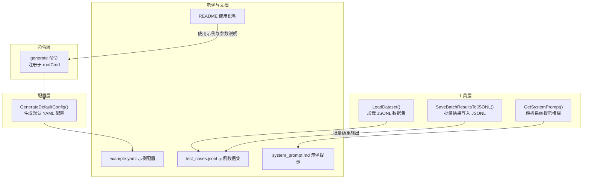
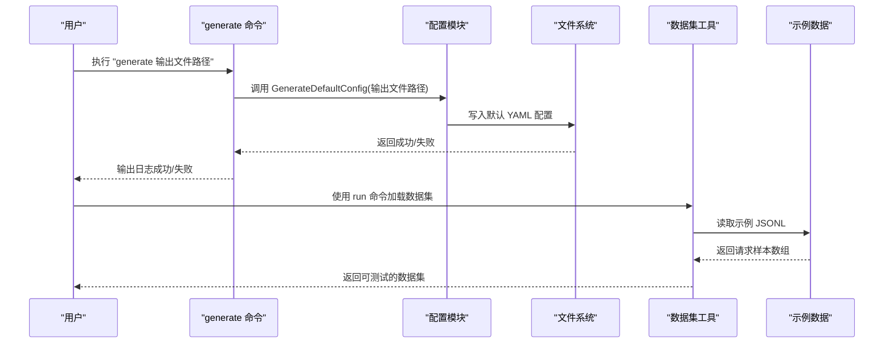
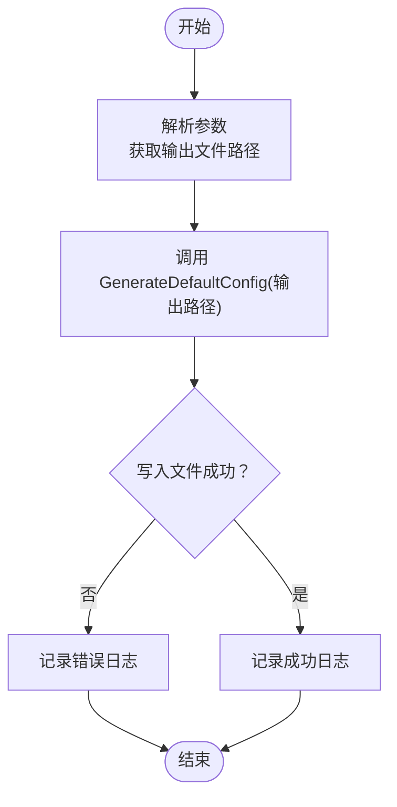
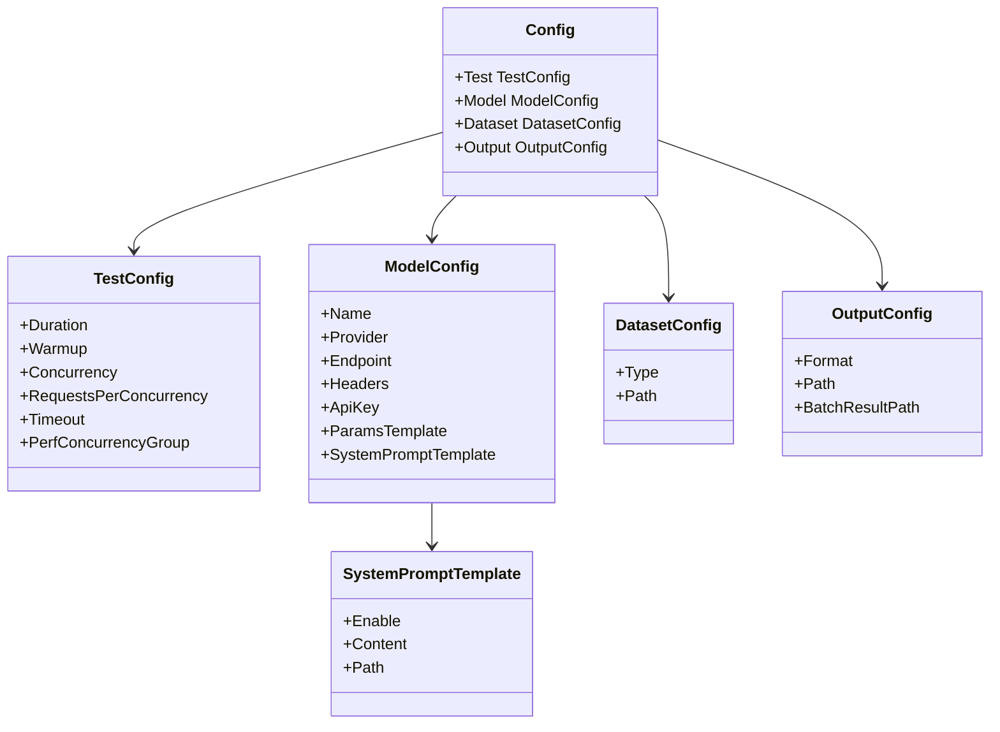
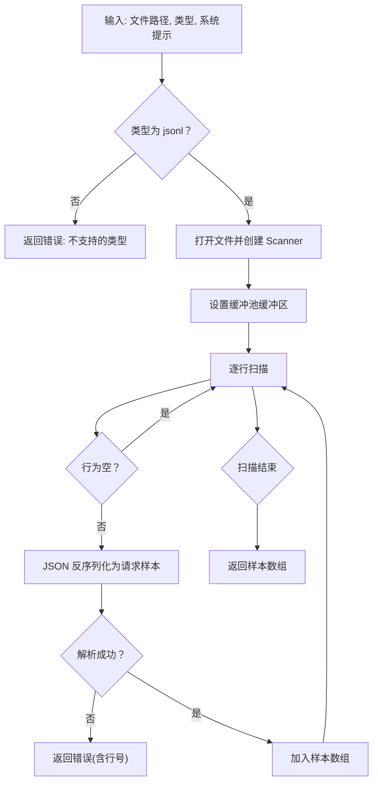
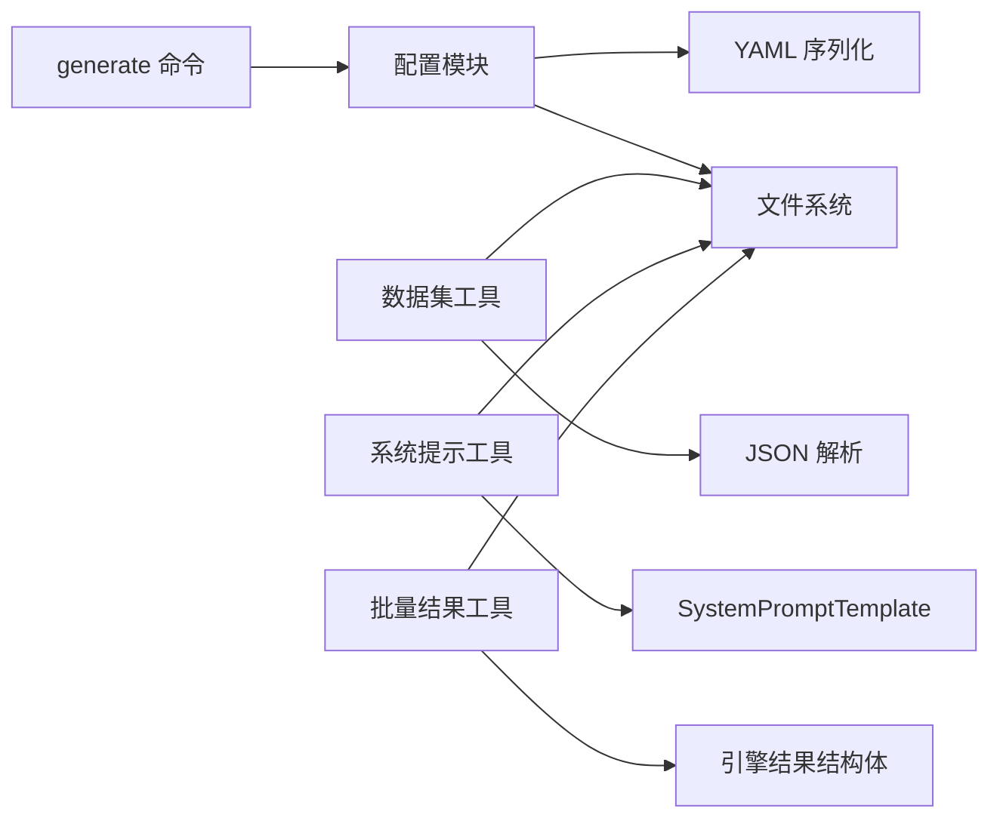

# 生成命令

<cite>
**本文引用的文件列表**
- [cmd/generate.go](file://cmd/generate.go)
- [internal/config/config.go](file://internal/config/config.go)
- [internal/utils/dataset.go](file://internal/utils/dataset.go)
- [internal/utils/prompt.go](file://internal/utils/prompt.go)
- [internal/utils/batch_results.go](file://internal/utils/batch_results.go)
- [configs/example.yaml](file://configs/example.yaml)
- [examples/test_cases.jsonl](file://examples/test_cases.jsonl)
- [examples/system_prompt.md](file://examples/system_prompt.md)
- [README.md](file://README.md)
</cite>

## 目录
1. [简介](#简介)
2. [项目结构](#项目结构)
3. [核心组件](#核心组件)
4. [架构总览](#架构总览)
5. [详细组件分析](#详细组件分析)
6. [依赖分析](#依赖分析)
7. [性能考虑](#性能考虑)
8. [故障排查指南](#故障排查指南)
9. [结论](#结论)
10. [附录](#附录)

## 简介
本节面向“生成命令”的使用与实现，目标是帮助用户快速理解并正确使用 generate 子命令，用于生成默认配置文件（YAML），以便后续在 run 命令中直接使用。同时，文档还解释了生成命令的参数、默认值来源、以及与数据集（JSONL）加载的关系，并给出最佳实践与常见场景建议。

## 项目结构
generate 命令位于 CLI 层，通过 Cobra 注册；实际的“默认配置生成”逻辑由配置模块完成；数据集加载与系统提示注入能力由工具模块提供，这些能力在 run 测试执行时会被调用。

图表来源
- [cmd/generate.go:8-25](file://cmd/generate.go#L8-L25)
- [internal/config/config.go:14-75](file://internal/config/config.go#L14-L75)
- [internal/utils/dataset.go:62-125](file://internal/utils/dataset.go#L62-L125)
- [internal/utils/prompt.go:13-41](file://internal/utils/prompt.go#L13-L41)
- [internal/utils/batch_results.go:11-39](file://internal/utils/batch_results.go#L11-L39)
- [configs/example.yaml:1-78](file://configs/example.yaml#L1-L78)
- [examples/test_cases.jsonl:1-6](file://examples/test_cases.jsonl#L1-L6)
- [examples/system_prompt.md:1-1](file://examples/system_prompt.md#L1-L1)
- [README.md:111-179](file://README.md#L111-L179)

章节来源
- [cmd/generate.go:8-25](file://cmd/generate.go#L8-L25)
- [internal/config/config.go:14-75](file://internal/config/config.go#L14-L75)
- [README.md:111-179](file://README.md#L111-L179)

## 核心组件
- generate 命令：负责接收输出路径参数，调用配置模块生成默认 YAML 文件。
- 配置模块：提供 GenerateDefaultConfig 函数，填充默认测试、模型、数据集、输出等字段，并写入文件。
- 工具模块：
  - LoadDataset：从 JSONL 文件加载请求样本，支持为每个样本注入系统提示。
  - GetSystemPrompt：根据配置选择内容或文件路径读取系统提示。
  - SaveBatchResultsToJSONL：将批量测试结果按行写入 JSONL 文件（与生成命令无直接耦合，但属于数据处理链路的一部分）。

章节来源
- [cmd/generate.go:8-25](file://cmd/generate.go#L8-L25)
- [internal/config/config.go:14-75](file://internal/config/config.go#L14-L75)
- [internal/utils/dataset.go:62-125](file://internal/utils/dataset.go#L62-L125)
- [internal/utils/prompt.go:13-41](file://internal/utils/prompt.go#L13-L41)
- [internal/utils/batch_results.go:11-39](file://internal/utils/batch_results.go#L11-L39)

## 架构总览
下图展示了 generate 命令到配置生成再到示例数据集加载的整体流程。

图表来源
- [cmd/generate.go:13-20](file://cmd/generate.go#L13-L20)
- [internal/config/config.go:14-75](file://internal/config/config.go#L14-L75)
- [internal/utils/dataset.go:62-125](file://internal/utils/dataset.go#L62-L125)
- [examples/test_cases.jsonl:1-6](file://examples/test_cases.jsonl#L1-L6)

## 详细组件分析

### 生成命令（generate）
- 功能定位：生成一个包含合理默认值的 YAML 配置文件，便于直接运行测试。
- 参数与行为：
  - 位置参数：输出文件路径（必填）。generate 命令要求精确一个参数。
  - 执行流程：解析参数 -> 调用配置模块生成默认配置 -> 写入文件 -> 记录日志。
- 默认值来源：配置模块在生成函数中直接填充测试、模型、数据集、输出等字段的默认值。
- 错误处理：若生成或写入失败，记录错误并返回；成功则记录成功信息。

图表来源
- [cmd/generate.go:13-20](file://cmd/generate.go#L13-L20)
- [internal/config/config.go:14-75](file://internal/config/config.go#L14-L75)

章节来源
- [cmd/generate.go:8-25](file://cmd/generate.go#L8-L25)
- [internal/config/config.go:14-75](file://internal/config/config.go#L14-L75)

### 配置生成（GenerateDefaultConfig）
- 默认值覆盖范围：
  - 测试配置：时长、预热、并发、每并发请求数、超时、性能并发组。
  - 模型配置：名称、提供商、端点、头部、参数模板、系统提示模板。
  - 数据集配置：类型（jsonl）、路径。
  - 输出配置：报告格式（默认 html）、报告路径、批量结果路径。
- 环境变量替换：加载 YAML 后对模型名、API Key、端点进行环境变量替换。
- 文件写入：将结构体序列化为 YAML 并写入指定路径。

图表来源
- [internal/config/config.go:82-129](file://internal/config/config.go#L82-L129)

章节来源
- [internal/config/config.go:14-75](file://internal/config/config.go#L14-L75)
- [internal/config/config.go:131-188](file://internal/config/config.go#L131-L188)

### 数据集加载（LoadDataset 与 JSONL 解析）
- 支持类型：当前仅支持 jsonl 类型。
- 加载流程：
  - 打开文件并逐行扫描。
  - 跳过空行。
  - 对每一行进行 JSON 解析，构建请求样本数组。
  - 若提供系统提示，会为每个样本注入系统消息（若已有系统消息则替换）。
- 错误处理：打开文件失败、解析行失败、读取错误均返回带行号的错误信息。

图表来源
- [internal/utils/dataset.go:62-125](file://internal/utils/dataset.go#L62-L125)

章节来源
- [internal/utils/dataset.go:62-125](file://internal/utils/dataset.go#L62-L125)

### 系统提示模板（GetSystemPrompt）
- 优先级：启用开关开启后，若内容字段非空则直接使用；否则尝试从文件路径读取；两者都为空则返回空字符串。
- 日志：在读取文件时记录调试日志，失败时记录错误并返回空字符串。

章节来源
- [internal/utils/prompt.go:13-41](file://internal/utils/prompt.go#L13-L41)

### 批量结果输出（SaveBatchResultsToJSONL）
- 作用：将批量测试结果按行写入 JSONL 文件，便于离线分析。
- 行对应性：输出文件中第 i 行与输入数据集中第 i 行测试用例一一对应。
- 容错：成功且存在响应时写入响应 JSON；失败时写入错误 JSON；若无结果则跳过。

章节来源
- [internal/utils/batch_results.go:11-39](file://internal/utils/batch_results.go#L11-L39)

## 依赖分析
- generate 命令依赖配置模块的 GenerateDefaultConfig。
- 配置模块依赖 YAML 编解码库与文件系统。
- 数据集工具依赖 JSON 解析与文件读取。
- 系统提示工具依赖配置结构体与文件系统。
- 批量结果工具依赖引擎结果结构体与文件系统。

图表来源
- [cmd/generate.go:13-20](file://cmd/generate.go#L13-L20)
- [internal/config/config.go:63-74](file://internal/config/config.go#L63-L74)
- [internal/utils/dataset.go:110-117](file://internal/utils/dataset.go#L110-L117)
- [internal/utils/prompt.go:29-38](file://internal/utils/prompt.go#L29-L38)
- [internal/utils/batch_results.go:13-36](file://internal/utils/batch_results.go#L13-L36)

章节来源
- [cmd/generate.go:8-25](file://cmd/generate.go#L8-L25)
- [internal/config/config.go:14-75](file://internal/config/config.go#L14-L75)
- [internal/utils/dataset.go:62-125](file://internal/utils/dataset.go#L62-L125)
- [internal/utils/prompt.go:13-41](file://internal/utils/prompt.go#L13-L41)
- [internal/utils/batch_results.go:11-39](file://internal/utils/batch_results.go#L11-L39)

## 性能考虑
- JSONL 读取采用缓冲扫描器，减少内存占用并提升大文件读取效率。
- 缓冲池复用：通过 sync.Pool 提供固定上限的缓冲区，避免频繁分配。
- 空行跳过：减少无效解析，提高吞吐。
- YAML 写入：一次性序列化并写入，避免多次 IO。

章节来源
- [internal/utils/dataset.go:14-29](file://internal/utils/dataset.go#L14-L29)
- [internal/utils/dataset.go:90-98](file://internal/utils/dataset.go#L90-L98)
- [internal/config/config.go:63-74](file://internal/config/config.go#L63-L74)

## 故障排查指南
- 生成失败
  - 检查输出路径是否存在权限问题。
  - 确认未传入多余参数（generate 要求精确一个参数）。
- 加载数据集失败
  - 确认文件路径正确且可读。
  - 检查 JSONL 行是否为合法 JSON。
  - 查看行号错误提示以定位问题行。
- 系统提示未生效
  - 确认配置中的系统提示模板已启用。
  - 若同时设置了内容与文件路径，优先使用内容字段。
- 批量结果缺失
  - 确认 run 命令确实启用了批量模式并指定了输出路径。
  - 检查结果是否因错误而未写入。

章节来源
- [cmd/generate.go:13-20](file://cmd/generate.go#L13-L20)
- [internal/utils/dataset.go:110-117](file://internal/utils/dataset.go#L110-L117)
- [internal/utils/prompt.go:18-41](file://internal/utils/prompt.go#L18-L41)
- [internal/utils/batch_results.go:13-36](file://internal/utils/batch_results.go#L13-L36)

## 结论
generate 命令提供了快速生成默认配置的能力，配合配置模块的默认值与工具模块的数据集加载能力，用户可以迅速搭建起一套可用的测试环境。通过遵循本文的最佳实践与参数说明，可以在不同场景下高效地生成、验证与使用测试数据集。

## 附录

### 生成命令参数与示例
- 基本语法
  - generate 输出文件路径
- 典型用法
  - 生成默认配置文件：generate ./configs/default.yaml
  - 生成后直接运行测试：run --config ./configs/default.yaml
- 参数校验
  - generate 要求精确一个参数（输出文件路径）。

章节来源
- [cmd/generate.go:8-25](file://cmd/generate.go#L8-L25)
- [README.md:111-179](file://README.md#L111-L179)

### 默认配置字段说明
- 测试配置（test）
  - duration：测试时长，默认 60s
  - warmup：预热时间，默认 10s
  - concurrency：并发数，默认 10
  - requests_per_concurrency：每并发请求数，默认 100
  - timeout：请求超时，默认 30s
  - perf_concurrency_group：性能测试并发组，默认 [1,2,4,8,16,20,32,40,48,64]
- 模型配置（model）
  - name：模型名，默认占位符（可被环境变量替换）
  - provider：提供商，默认 openai
  - endpoint：API 端点，默认占位符（可被环境变量替换）
  - api_key：API Key，默认占位符（可被环境变量替换）
  - headers：HTTP 头，默认 Content-Type: application/json
  - params_template：请求参数模板，默认启用流式输出并包含用量统计
  - system_prompt_template：系统提示模板，默认禁用，内容为“你是一个乐于助人的助手”，路径指向示例文件
- 数据集配置（dataset）
  - type：数据集类型，默认 jsonl
  - path：数据集文件路径，默认 ./examples/test_cases.jsonl
- 输出配置（output）
  - format：报告格式，默认 html
  - path：报告文件路径，默认 ./results/report.html
  - batch_result_path：批量结果文件路径，默认 ./results/batch_results.jsonl

章节来源
- [internal/config/config.go:14-75](file://internal/config/config.go#L14-L75)
- [configs/example.yaml:1-78](file://configs/example.yaml#L1-L78)

### JSONL 数据集格式与示例
- 格式要求
  - 每行一条 JSON 对象，表示一次请求样本。
  - 至少包含 messages 字段（数组），其中至少包含一条用户消息。
  - 可选字段如 temperature、max_tokens 等。
- 示例参考
  - examples/test_cases.jsonl 包含多条用户消息样本，适合直接作为测试数据集使用。

章节来源
- [internal/utils/dataset.go:62-125](file://internal/utils/dataset.go#L62-L125)
- [examples/test_cases.jsonl:1-6](file://examples/test_cases.jsonl#L1-L6)

### 数据质量保证机制
- JSONL 解析严格校验：逐行解析并返回带行号的错误信息，便于快速定位问题。
- 系统提示注入：自动为每个样本添加系统提示（若已存在系统消息则替换），确保一致性。
- 环境变量替换：在加载配置时对关键字段进行环境变量替换，避免硬编码风险。
- 批量结果输出：按行一一对应保存，便于回溯与审计。

章节来源
- [internal/utils/dataset.go:110-117](file://internal/utils/dataset.go#L110-L117)
- [internal/utils/dataset.go:32-60](file://internal/utils/dataset.go#L32-L60)
- [internal/config/config.go:157-180](file://internal/config/config.go#L157-L180)
- [internal/utils/batch_results.go:13-36](file://internal/utils/batch_results.go#L13-L36)

### 最佳实践与常见场景
- 快速起步
  - 使用 generate 生成默认配置，然后根据需要修改模型、端点、密钥等。
- 数据集设计
  - 将不同业务场景的消息样本放入 JSONL 文件，每行一条。
  - 为每个样本提供合理的 temperature、max_tokens 等参数，以覆盖不同负载与质量需求。
- 系统提示策略
  - 在配置中启用 system_prompt_template，并优先使用内容字段；如需动态内容可使用文件路径。
- 报告与结果
  - 根据场景选择报告格式（html/json/csv），批量结果建议保存为 JSONL 以便后续分析。
- 环境变量管理
  - 使用环境变量统一管理敏感信息（如 API Key、模型名、端点），避免泄露。

章节来源
- [internal/config/config.go:14-75](file://internal/config/config.go#L14-L75)
- [internal/utils/dataset.go:62-125](file://internal/utils/dataset.go#L62-L125)
- [internal/utils/prompt.go:13-41](file://internal/utils/prompt.go#L13-L41)
- [README.md:111-179](file://README.md#L111-L179)