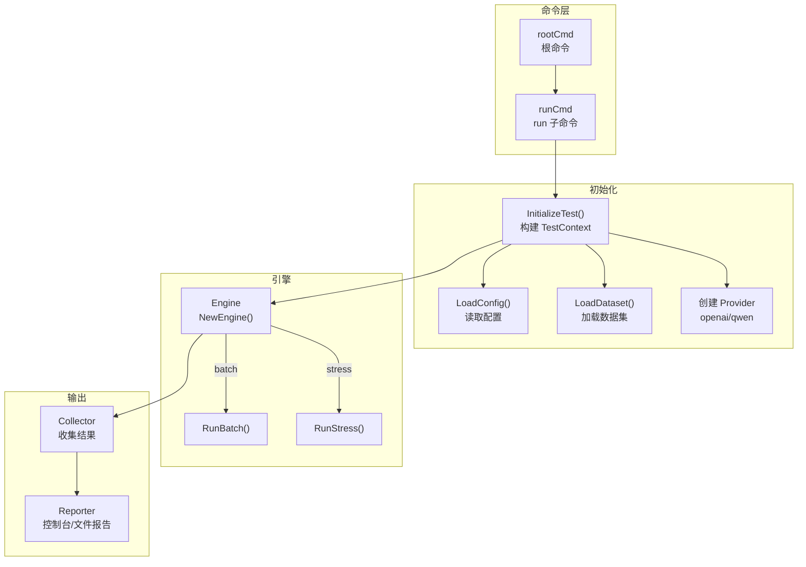
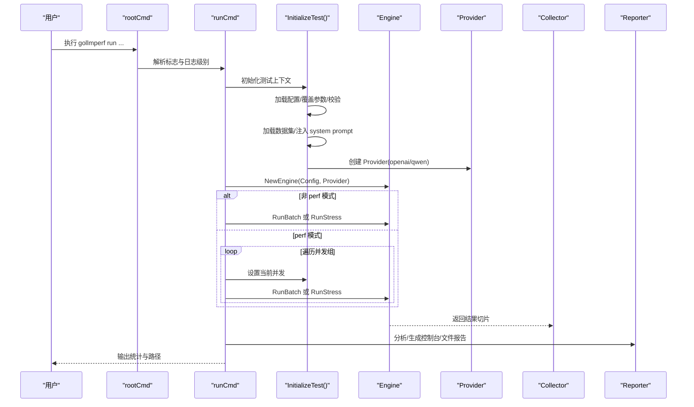
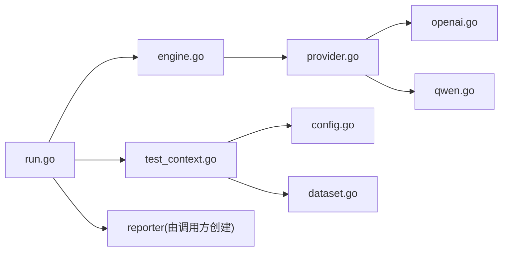

# 运行命令

<cite>
**本文引用的文件**
- [run.go](file://cmd/run.go)
- [run_flags.go](file://cmd/run_flags.go)
- [root.go](file://cmd/root.go)
- [test_context.go](file://cmd/test_context.go)
- [engine.go](file://internal/engine/engine.go)
- [batch.go](file://internal/engine/batch.go)
- [stress.go](file://internal/engine/stress.go)
- [provider.go](file://internal/provider/provider.go)
- [openai.go](file://internal/provider/openai.go)
- [qwen.go](file://internal/provider/qwen.go)
- [config.go](file://internal/config/config.go)
- [dataset.go](file://internal/utils/dataset.go)
- [example.yaml](file://configs/example.yaml)
- [README.md](file://README.md)
</cite>

## 目录
1. [简介](#简介)
2. [项目结构](#项目结构)
3. [核心组件](#核心组件)
4. [架构总览](#架构总览)
5. [详细组件分析](#详细组件分析)
6. [依赖关系分析](#依赖关系分析)
7. [性能考量](#性能考量)
8. [故障排查指南](#故障排查指南)
9. [结论](#结论)
10. [附录](#附录)

## 简介
本文件为 GoLLMPerf 的 run 命令提供系统化、可操作的使用与技术文档。内容覆盖：
- 测试模式：batch、stress、performance（perf）、stability（通过 stress 模式实现）
- 并发参数、超时设置、并发组、数据集与输出路径等配置项
- 参数作用、默认值、取值范围与相互依赖关系
- 使用示例、最佳实践、参数校验与错误处理机制、调试选项

## 项目结构
run 命令位于 cmd 子目录，核心流程如下：
- 解析命令行参数与配置文件
- 初始化测试上下文（加载配置、数据集、提供商）
- 根据模式执行批处理或压力测试
- 收集结果、生成报告与批量结果（JSONL）

图表来源
- [run.go:16-123](file://cmd/run.go#L16-L123)
- [test_context.go:21-82](file://cmd/test_context.go#L21-L82)
- [engine.go:34-112](file://internal/engine/engine.go#L34-L112)
- [batch.go:12-65](file://internal/engine/batch.go#L12-L65)
- [stress.go:15-79](file://internal/engine/stress.go#L15-L79)

章节来源
- [run.go:16-123](file://cmd/run.go#L16-L123)
- [test_context.go:21-82](file://cmd/test_context.go#L21-L82)
- [engine.go:34-112](file://internal/engine/engine.go#L34-L112)

## 核心组件
- 命令行参数与标志
  - runFlags：封装 run 命令的全部标志位与覆盖字段
  - 关键标志：--config/-c、--batch/-b、--perf/-p、--provider/-P、--model/-m、--dataset/-d、--apikey/-k、--endpoint/-e、--report/-r、--format/-f、--batch-result、--no-report/-n、--show-table/-s
- 配置系统
  - Config：test/model/dataset/output 四大块
  - 默认值：duration、warmup、concurrency、requests_per_concurrency、timeout、perf_concurrency_group、model.provider、model.params_template、dataset.type/path、output.format/path/batch_result_path
- 引擎与模式
  - Engine：统一调度 batch/stress；支持预热 runWarmup
  - RunBatch：按并发度顺序执行所有数据集条目
  - RunStress：在时间或请求数约束下持续压测
- 提供商接口
  - Provider 接口：Name/SendRequest/SupportsStreaming
  - OpenAIProvider/QwenProvider：基于 OpenAI 兼容接口实现
- 数据集加载
  - 支持 JSONL；可注入 system prompt

章节来源
- [run_flags.go:9-25](file://cmd/run_flags.go#L9-L25)
- [config.go:81-134](file://internal/config/config.go#L81-L134)
- [config.go:14-75](file://internal/config/config.go#L14-L75)
- [engine.go:13-47](file://internal/engine/engine.go#L13-L47)
- [batch.go:12-65](file://internal/engine/batch.go#L12-L65)
- [stress.go:15-79](file://internal/engine/stress.go#L15-L79)
- [provider.go:10-20](file://internal/provider/provider.go#L10-L20)
- [openai.go:21-48](file://internal/provider/openai.go#L21-L48)
- [qwen.go:5-35](file://internal/provider/qwen.go#L5-L35)
- [dataset.go:62-80](file://internal/utils/dataset.go#L62-L80)

## 架构总览
run 命令执行序列（含模式切换与报告生成）：

图表来源
- [run.go:22-78](file://cmd/run.go#L22-L78)
- [test_context.go:21-82](file://cmd/test_context.go#L21-L82)
- [engine.go:34-112](file://internal/engine/engine.go#L34-L112)
- [batch.go:12-65](file://internal/engine/batch.go#L12-L65)
- [stress.go:15-79](file://internal/engine/stress.go#L15-L79)

## 详细组件分析

### 命令行参数与行为
- 基本用法
  - 必选：--config/-c 指向配置文件
  - 可选：--batch/-b、--perf/-p 控制模式；--provider/-P、--model/-m、--dataset/-d、--apikey/-k、--endpoint/-e 覆盖配置
  - 报告：--report/-r、--format/-f 控制输出格式与路径；--no-report/-n 禁用报告；--show-table/-s 控制控制台表格显示
  - 批量结果：--batch-result 指定 JSONL 输出路径（仅 batch 模式有效）
- 行为要点
  - 若未指定 --config，直接退出
  - 若仅提供 --report-format 且未指定 --report-file，则自动推导文件名后缀
  - perf 模式会遍历配置中的并发组逐个执行
  - batch 模式保存批量结果到 JSONL 文件（若提供 --batch-result）

章节来源
- [run.go:80-95](file://cmd/run.go#L80-L95)
- [test_context.go:21-34](file://cmd/test_context.go#L21-L34)
- [run.go:67-76](file://cmd/run.go#L67-L76)
- [run.go:56-63](file://cmd/run.go#L56-L63)

### 配置文件与默认值
- 配置结构
  - test：duration、warmup、concurrency、requests_per_concurrency、timeout、perf_concurrency_group
  - model：name、provider、endpoint、headers、api_key、params_template、system_prompt_template
  - dataset：type、path
  - output：format、path、batch_result_path
- 默认值（来自生成器与示例）
  - test.duration=60s、warmup=10s、concurrency=10、requests_per_concurrency=100、timeout=30s、perf_concurrency_group=[1,2,4,8,16,20,32,40,48,64]
  - model.provider=openai、params_template.stream=true、include_usage=true、extra_body.enable_thinking=false
  - dataset.type=jsonl、path=./examples/test_cases.jsonl
  - output.format=html、path=./results/report.html、batch_result_path=./results/batch_results.jsonl

章节来源
- [config.go:14-75](file://internal/config/config.go#L14-L75)
- [config.go:89-129](file://internal/config/config.go#L89-L129)
- [example.yaml:4-77](file://configs/example.yaml#L4-L77)

### 测试模式与并发控制
- batch 模式
  - 以并发度启动工作协程，依次从数据集中取样执行请求，结果按原始索引有序返回
  - 适合全量跑完数据集，便于离线分析
- stress 模式
  - 支持预热阶段；在 duration 或 requests_per_concurrency 任一条件满足时停止
  - 通过并发度与请求配额控制负载强度
- perf 模式
  - 遍历 perf_concurrency_group 中的并发值，逐个执行 batch 或 stress
  - 用于寻找系统性能拐点与稳定区间

章节来源
- [batch.go:12-65](file://internal/engine/batch.go#L12-L65)
- [stress.go:15-79](file://internal/engine/stress.go#L15-L79)
- [engine.go:49-86](file://internal/engine/engine.go#L49-L86)
- [run.go:67-76](file://cmd/run.go#L67-L76)

### 提供商与网络交互
- Provider 接口
  - Name()/SendRequest()/SupportsStreaming()
- OpenAIProvider
  - 默认 endpoint 与 Authorization 头；支持流式与非流式响应解析
  - 流式响应中提取首 token 时间与累计消息
- QwenProvider
  - 基于 OpenAIProvider 的兼容实现，默认 endpoint 指向 DashScope

章节来源
- [provider.go:10-20](file://internal/provider/provider.go#L10-L20)
- [openai.go:21-48](file://internal/provider/openai.go#L21-L48)
- [openai.go:84-144](file://internal/provider/openai.go#L84-L144)
- [openai.go:169-247](file://internal/provider/openai.go#L169-L247)
- [qwen.go:5-35](file://internal/provider/qwen.go#L5-L35)

### 数据集加载与 system prompt 注入
- 支持 JSONL；逐行解析为 AnyParams
- 若配置启用 system_prompt_template，会在每条消息数组开头注入 system 角色的消息，或替换首个 system 消息

章节来源
- [dataset.go:62-80](file://internal/utils/dataset.go#L62-L80)
- [dataset.go:31-60](file://internal/utils/dataset.go#L31-L60)

### 报告与批量结果
- 报告生成
  - 控制台：可选表格样式
  - 文件：根据 --format 或 --report 推断格式，支持 html/json/csv
- 批量结果
  - batch 模式下可将完整结果写入 JSONL 文件（--batch-result）

章节来源
- [run.go:37-64](file://cmd/run.go#L37-L64)
- [config.go:218-229](file://internal/config/config.go#L218-L229)

## 依赖关系分析
- 命令层依赖配置与工具模块
- 引擎依赖提供商接口，屏蔽具体实现差异
- 报告与分析依赖采集器（由 runTest 返回）

图表来源
- [run.go:16-123](file://cmd/run.go#L16-L123)
- [test_context.go:21-82](file://cmd/test_context.go#L21-L82)
- [engine.go:13-47](file://internal/engine/engine.go#L13-L47)
- [provider.go:10-20](file://internal/provider/provider.go#L10-L20)
- [openai.go:21-48](file://internal/provider/openai.go#L21-L48)
- [qwen.go:5-35](file://internal/provider/qwen.go#L5-L35)
- [config.go:136-188](file://internal/config/config.go#L136-L188)
- [dataset.go:62-80](file://internal/utils/dataset.go#L62-L80)

## 性能考量
- 并发与吞吐
  - concurrency 控制并发度；requests_per_concurrency 限制单并发最大请求数
  - perf 模式通过并发组扫描，定位系统瓶颈
- 预热
  - warmup 阶段减少冷启动影响，提升指标稳定性
- 流式与非流式
  - params_template 中 stream=true 时，首 token 与端到端延迟分离统计
- 资源占用
  - JSONL 扫描使用缓冲池优化内存；通道缓冲避免阻塞

章节来源
- [config.go:14-75](file://internal/config/config.go#L14-L75)
- [engine.go:49-86](file://internal/engine/engine.go#L49-L86)
- [openai.go:169-247](file://internal/provider/openai.go#L169-L247)

## 故障排查指南
- 常见错误与处理
  - 缺少 --config：直接退出
  - 不支持的 provider：列出受支持列表并退出
  - 数据集加载失败：检查路径与格式
  - 请求失败：查看 Provider 返回的错误类型（网络类/业务类）
- 日志与调试
  - --loglevel/-l 设置全局日志级别
  - DEBUG_LLM_REQUEST/DEBUG_LLM_RESPONSE 环境变量开启请求/响应调试
- 结果与报告
  - --no-report 关闭报告生成；--show-table 控制控制台表格
  - --batch-result 指定批量结果 JSONL 路径

章节来源
- [test_context.go:21-34](file://cmd/test_context.go#L21-L34)
- [test_context.go:65-74](file://cmd/test_context.go#L65-L74)
- [openai.go:16-19](file://internal/provider/openai.go#L16-L19)
- [root.go:17-27](file://cmd/root.go#L17-L27)

## 结论
run 命令提供了灵活的测试模式与强大的参数覆盖能力。通过配置文件与命令行标志的组合，可在不同场景下快速完成批处理、压力、性能扫描与稳定性验证，并输出多格式报告与批量结果，满足工程化的性能评估需求。

## 附录

### 参数清单与说明
- --config/-c
  - 类型：字符串
  - 必填：是
  - 作用：指定配置文件路径
  - 默认值：无
  - 取值范围：合法文件路径
- --batch/-b
  - 类型：布尔
  - 必填：否
  - 作用：启用批处理模式（全量执行数据集）
  - 默认值：false
- --perf/-p
  - 类型：布尔
  - 必填：否
  - 作用：启用性能模式（遍历并发组）
  - 默认值：false
- --provider/-P
  - 类型：字符串
  - 必填：否
  - 作用：提供商（openai、qwen 等）
  - 默认值：openai
- --model/-m
  - 类型：字符串
  - 必填：否
  - 作用：模型名称
  - 默认值：空
- --dataset/-d
  - 类型：字符串
  - 必填：否
  - 作用：数据集路径（JSONL）
  - 默认值：示例路径
- --apikey/-k
  - 类型：字符串
  - 必填：否
  - 作用：API 密钥
  - 默认值：空
- --endpoint/-e
  - 类型：字符串
  - 必填：否
  - 作用：API 端点
  - 默认值：OpenAI/Qwen 默认端点
- --report/-r
  - 类型：字符串
  - 必填：否
  - 作用：报告文件路径
  - 默认值：根据 format 或扩展名推断
- --format/-f
  - 类型：字符串
  - 必填：否
  - 作用：报告格式（json/csv/html）
  - 默认值：html
- --batch-result
  - 类型：字符串
  - 必填：否
  - 作用：批量结果 JSONL 输出路径（仅 batch 模式）
  - 默认值：示例路径
- --no-report/-n
  - 类型：布尔
  - 必填：否
  - 作用：禁用报告生成
  - 默认值：false
- --show-table/-s
  - 类型：布尔
  - 必填：否
  - 作用：控制台显示表格
  - 默认值：false

章节来源
- [run.go:80-95](file://cmd/run.go#L80-L95)
- [config.go:218-229](file://internal/config/config.go#L218-L229)
- [example.yaml:4-77](file://configs/example.yaml#L4-L77)

### 参数验证与冲突
- 必需项
  - --config 必须提供
  - provider 必须在受支持列表内
- 报告格式推断
  - 若仅提供 --format 且未提供 --report，则自动以该格式命名输出文件
  - 若仅提供 --report 且未提供 --format，则从文件扩展名推断格式
- 模式互斥
  - --batch 与 --perf 同时出现时，--perf 会遍历并发组逐次执行；--batch 时可追加 --batch-result 输出 JSONL
- 超时与并发
  - timeout 为单请求超时；concurrency 控制并发度；requests_per_concurrency 限制单并发上限

章节来源
- [test_context.go:21-34](file://cmd/test_context.go#L21-L34)
- [test_context.go:65-74](file://cmd/test_context.go#L65-L74)
- [run.go:67-76](file://cmd/run.go#L67-L76)

### 使用示例
- 基础压力测试
  - gollmperf run --config ./configs/example.yaml
- 批处理模式
  - gollmperf run --config ./configs/example.yaml --batch
- 性能模式
  - gollmperf run --perf --config ./configs/example.yaml
- 覆盖配置参数
  - gollmperf run --config ./configs/example.yaml --model MODEL --dataset PATH --report RESULT.json --format json
- 批量结果输出
  - gollmperf run --config ./configs/example.yaml --batch --batch-result OTHERS.jsonl

章节来源
- [README.md:113-164](file://README.md#L113-L164)
- [run.go:80-95](file://cmd/run.go#L80-L95)

### 最佳实践
- 在生产环境前先进行 warmup，确保缓存与连接稳定
- 使用 perf 模式先粗筛并发组，再在关键点细化
- 对长时压力测试设置合理的 requests_per_concurrency，避免资源耗尽
- 使用 --show-table 查看关键指标变化趋势
- 将 --report 与 --format 组合，生成多格式报告以便分享与归档
- 批处理完成后使用 --batch-result 保留原始明细，便于二次分析

章节来源
- [config.go:14-75](file://internal/config/config.go#L14-L75)
- [README.md:113-164](file://README.md#L113-L164)