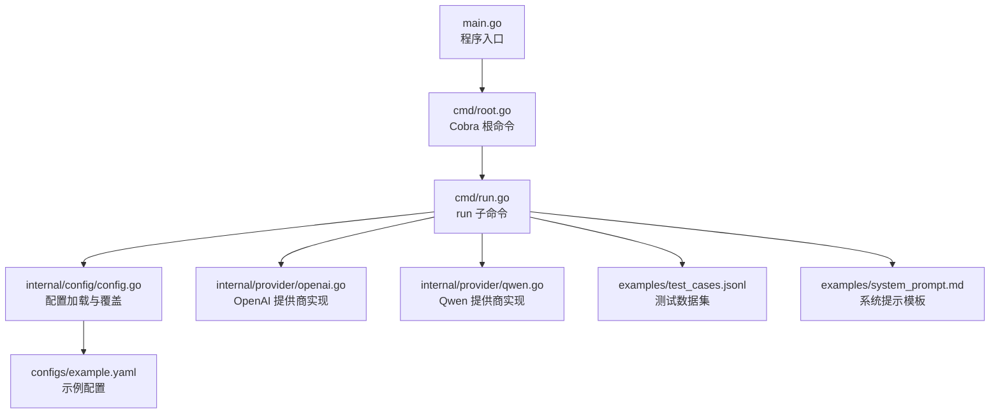
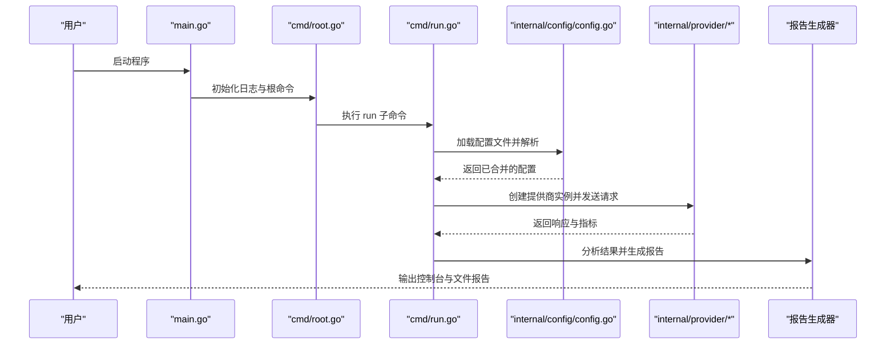
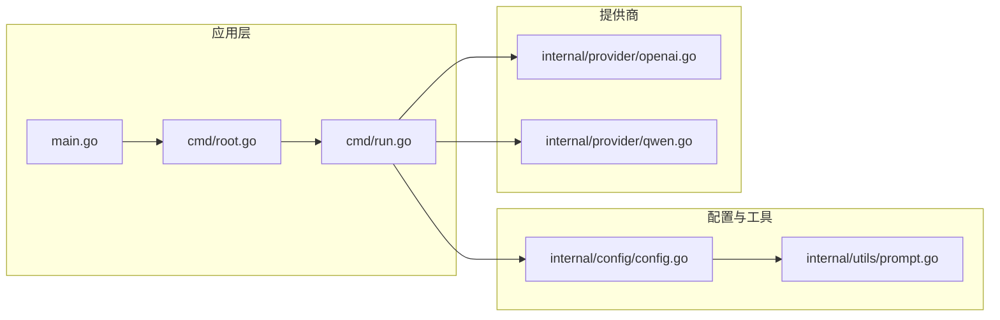

# 安装与配置

<cite>
**本文引用的文件列表**
- [README.md](file://README.md)
- [go.mod](file://go.mod)
- [build.sh](file://build.sh)
- [main.go](file://main.go)
- [cmd/root.go](file://cmd/root.go)
- [cmd/run.go](file://cmd/run.go)
- [cmd/run_flags.go](file://cmd/run_flags.go)
- [internal/config/config.go](file://internal/config/config.go)
- [configs/example.yaml](file://configs/example.yaml)
- [examples/test_cases.jsonl](file://examples/test_cases.jsonl)
- [examples/system_prompt.md](file://examples/system_prompt.md)
- [internal/provider/openai.go](file://internal/provider/openai.go)
- [internal/provider/qwen.go](file://internal/provider/qwen.go)
</cite>

## 目录
1. [简介](#简介)
2. [项目结构](#项目结构)
3. [核心组件](#核心组件)
4. [架构总览](#架构总览)
5. [详细组件分析](#详细组件分析)
6. [依赖关系分析](#依赖关系分析)
7. [性能注意事项](#性能注意事项)
8. [故障排查指南](#故障排查指南)
9. [结论](#结论)
10. [附录](#附录)

## 简介
本指南面向希望在本地或生产环境中安装与配置 GoLLMPerf 的用户，涵盖系统环境要求、安装步骤（源码编译与二进制下载）、配置文件系统（YAML 格式、环境变量支持与优先级）、基础配置示例与常见场景、安装验证方法以及生产部署最佳实践与安全建议。

## 项目结构
GoLLMPerf 采用模块化设计，命令行入口位于根目录，核心业务逻辑分布在 internal 子包中，配置与示例文件位于 configs 与 examples 目录。整体结构清晰，便于二次开发与扩展。

图表来源
- [main.go:1-26](file://main.go#L1-L26)
- [cmd/root.go:1-28](file://cmd/root.go#L1-L28)
- [cmd/run.go:1-123](file://cmd/run.go#L1-L123)
- [internal/config/config.go:1-229](file://internal/config/config.go#L1-L229)
- [configs/example.yaml:1-78](file://configs/example.yaml#L1-L78)
- [examples/test_cases.jsonl:1-6](file://examples/test_cases.jsonl#L1-L6)
- [examples/system_prompt.md:1-1](file://examples/system_prompt.md#L1-L1)
- [internal/provider/openai.go:1-253](file://internal/provider/openai.go#L1-L253)
- [internal/provider/qwen.go:1-35](file://internal/provider/qwen.go#L1-L35)

章节来源
- [README.md:92-109](file://README.md#L92-L109)
- [main.go:1-26](file://main.go#L1-L26)
- [cmd/root.go:1-28](file://cmd/root.go#L1-L28)
- [cmd/run.go:1-123](file://cmd/run.go#L1-L123)
- [internal/config/config.go:1-229](file://internal/config/config.go#L1-L229)
- [configs/example.yaml:1-78](file://configs/example.yaml#L1-L78)
- [examples/test_cases.jsonl:1-6](file://examples/test_cases.jsonl#L1-L6)
- [examples/system_prompt.md:1-1](file://examples/system_prompt.md#L1-L1)
- [internal/provider/openai.go:1-253](file://internal/provider/openai.go#L1-L253)
- [internal/provider/qwen.go:1-35](file://internal/provider/qwen.go#L1-L35)

## 核心组件
- 命令行框架：使用 Cobra 构建子命令（如 run），支持日志级别参数与全局标志。
- 配置管理：基于 Viper 读取 YAML 配置文件，并支持环境变量占位符替换；命令行参数可覆盖配置字段。
- 提供商接口：统一 OpenAI 与 Qwen 的请求封装，支持流式与非流式响应处理。
- 测试引擎与报告：run 子命令驱动测试执行，生成控制台与文件报告（HTML/JSON/CSV）。

章节来源
- [cmd/root.go:10-27](file://cmd/root.go#L10-L27)
- [cmd/run.go:16-95](file://cmd/run.go#L16-L95)
- [internal/config/config.go:136-188](file://internal/config/config.go#L136-L188)
- [internal/provider/openai.go:21-48](file://internal/provider/openai.go#L21-L48)
- [internal/provider/qwen.go:5-34](file://internal/provider/qwen.go#L5-L34)

## 架构总览
下图展示从命令行到配置加载、提供商调用与报告输出的整体流程。

图表来源
- [main.go:20-25](file://main.go#L20-L25)
- [cmd/root.go:17-27](file://cmd/root.go#L17-L27)
- [cmd/run.go:22-77](file://cmd/run.go#L22-L77)
- [internal/config/config.go:136-188](file://internal/config/config.go#L136-L188)
- [internal/provider/openai.go:84-144](file://internal/provider/openai.go#L84-L144)
- [internal/provider/qwen.go:26-34](file://internal/provider/qwen.go#L26-L34)

## 详细组件分析

### 系统环境要求
- Go 版本：项目要求 Go 1.23.0 及以上。
- 平台：脚本支持 Linux、macOS、Windows 三大平台的 amd64/arm64 架构构建。
- 运行时依赖：通过 go.mod 指定的第三方库（如 Cobra、Viper、YAML 解析等）自动拉取。

章节来源
- [go.mod:3](file://go.mod#L3)
- [build.sh:158-175](file://build.sh#L158-L175)

### 安装步骤

#### 方式一：源码编译安装
- 克隆仓库后进入项目目录，执行依赖整理与编译：
  - go mod tidy
  - go build
- 编译完成后会在当前目录生成可执行文件（Linux/macOS: gollmperf；Windows: gollmperf.exe）。

章节来源
- [README.md:168-179](file://README.md#L168-L179)
- [build.sh:108-113](file://build.sh#L108-L113)

#### 方式二：二进制文件下载
- 使用构建脚本打包发布版本，支持多平台压缩包：
  - 调用脚本并传入 release 参数以构建所有平台包
  - 或传入 pack 参数仅打包当前平台
- 包内包含示例配置、示例数据与文档资源，便于快速上手。

章节来源
- [build.sh:158-175](file://build.sh#L158-L175)
- [build.sh:133-154](file://build.sh#L133-L154)

### 配置文件系统

#### YAML 配置文件格式
- 支持的顶层键：test、model、dataset、output。
- 关键字段说明（节选）：
  - test.duration：测试时长
  - test.warmup：预热时长
  - test.concurrency：并发数
  - test.timeout：单次请求超时
  - test.perf_concurrency_group：性能模式下的并发组
  - model.name：模型名称（支持环境变量占位符）
  - model.provider：提供商（openai、qwen 等）
  - model.endpoint：API 端点（支持环境变量占位符）
  - model.api_key：API 密钥（支持环境变量占位符）
  - model.headers：自定义请求头
  - model.params_template：请求参数模板（如 stream、stream_options、extra_body）
  - model.system_prompt_template：系统提示模板（支持 content 或 path，二者同时存在时 content 优先）
  - dataset.type：数据集类型（如 jsonl）
  - dataset.path：数据集路径
  - output.format：报告格式（json、csv、html）
  - output.path：报告输出路径
  - output.batch_result_path：批量测试结果输出路径（JSONL）

章节来源
- [configs/example.yaml:4-78](file://configs/example.yaml#L4-L78)
- [internal/config/config.go:82-129](file://internal/config/config.go#L82-L129)
- [internal/config/config.go:157-185](file://internal/config/config.go#L157-L185)

#### 环境变量支持与优先级
- 占位符语法：${ENV_VAR}，在加载配置时会被对应环境变量值替换。
- 生效范围：
  - model.name、model.api_key、model.endpoint 支持占位符替换
- 命令行参数覆盖优先级高于配置文件字段：
  - run 子命令支持覆盖 provider、model、dataset、apikey、endpoint、report、format、batch-result 等字段
- 系统提示模板：当同时设置 content 与 path 时，content 优先

章节来源
- [internal/config/config.go:157-185](file://internal/config/config.go#L157-L185)
- [internal/config/config.go:190-216](file://internal/config/config.go#L190-L216)
- [internal/utils/prompt.go:13-41](file://internal/utils/prompt.go#L13-L41)
- [cmd/run.go:88-95](file://cmd/run.go#L88-L95)

#### 基础配置示例与常见场景
- 示例配置文件位置：configs/example.yaml
- 常见场景：
  - OpenAI：设置 provider=openai，endpoint 为空则使用默认端点
  - Qwen：设置 provider=qwen，默认端点为兼容模式
  - 流式与非流式：通过 params_template 控制 stream 与 stream_options
  - 系统提示：启用 system_prompt_template 并指定 content 或 path

章节来源
- [configs/example.yaml:23-58](file://configs/example.yaml#L23-L58)
- [internal/provider/openai.go:28-48](file://internal/provider/openai.go#L28-L48)
- [internal/provider/qwen.go:10-19](file://internal/provider/qwen.go#L10-L19)
- [internal/utils/prompt.go:13-41](file://internal/utils/prompt.go#L13-L41)

### 验证安装
- 成功运行示例命令后，将在当前目录生成报告文件（默认 HTML），并在控制台输出关键指标摘要。
- 建议先在小规模并发与短时长下运行，确认网络连通性与凭据正确性后再扩大规模。

章节来源
- [README.md:111-202](file://README.md#L111-L202)

### 故障排查
- 日志级别：可通过根命令的 loglevel 参数调整日志详细程度。
- 调试提供商请求/响应：通过环境变量开启 DEBUG_LLM_REQUEST 与 DEBUG_LLM_RESPONSE，以便查看原始请求与响应内容。
- 常见问题定位：
  - API 凭据错误：检查 api_key 是否正确，以及是否被配置文件中的占位符正确替换
  - 端点不可达：确认 endpoint 正确且网络可达
  - 数据集路径：确保 dataset.path 指向有效文件
  - 报告生成失败：检查 output.path 权限与路径是否存在

章节来源
- [cmd/root.go:17-27](file://cmd/root.go#L17-L27)
- [internal/provider/openai.go:16-19](file://internal/provider/openai.go#L16-L19)
- [internal/config/config.go:157-185](file://internal/config/config.go#L157-L185)
- [cmd/run.go:52-64](file://cmd/run.go#L52-L64)

## 依赖关系分析

图表来源
- [main.go:1-26](file://main.go#L1-L26)
- [cmd/root.go:1-28](file://cmd/root.go#L1-L28)
- [cmd/run.go:1-123](file://cmd/run.go#L1-L123)
- [internal/config/config.go:1-229](file://internal/config/config.go#L1-L229)
- [internal/utils/prompt.go:1-41](file://internal/utils/prompt.go#L1-L41)
- [internal/provider/openai.go:1-253](file://internal/provider/openai.go#L1-L253)
- [internal/provider/qwen.go:1-35](file://internal/provider/qwen.go#L1-L35)

章节来源
- [main.go:1-26](file://main.go#L1-L26)
- [cmd/root.go:1-28](file://cmd/root.go#L1-L28)
- [cmd/run.go:1-123](file://cmd/run.go#L1-L123)
- [internal/config/config.go:1-229](file://internal/config/config.go#L1-L229)
- [internal/utils/prompt.go:1-41](file://internal/utils/prompt.go#L1-L41)
- [internal/provider/openai.go:1-253](file://internal/provider/openai.go#L1-L253)
- [internal/provider/qwen.go:1-35](file://internal/provider/qwen.go#L1-L35)

## 性能注意事项
- 并发与吞吐：合理设置 test.concurrency 与 test.timeout，避免过高的并发导致上游限流或超时。
- 流式响应：根据提供商支持情况启用流式传输，有助于降低首 token 延迟感知。
- 预热阶段：使用 test.warmup 保证 JVM/GC 稳定（若在容器中运行，建议预热后再开始计时）。
- 报告生成：在大规模测试时，适当减少控制台输出频率，优先使用文件报告以降低 I/O 开销。

## 故障排查指南
- 环境变量未生效：确认配置文件中使用了正确的占位符语法，并在运行前导出对应环境变量。
- 命令行覆盖无效：检查 run 子命令的参数是否正确传入，覆盖顺序为“命令行 > 配置文件”。
- 报告缺失：确认 output.path 是否可写，格式是否正确。
- 网络异常：检查 endpoint 与代理设置，必要时开启 DEBUG_LLM_REQUEST/RESPONSE 查看细节。

章节来源
- [internal/config/config.go:157-185](file://internal/config/config.go#L157-L185)
- [cmd/run.go:88-95](file://cmd/run.go#L88-L95)
- [internal/provider/openai.go:16-19](file://internal/provider/openai.go#L16-L19)

## 结论
通过本指南，您可以在本地或生产环境中完成 GoLLMPerf 的安装与配置。建议先以示例配置与小规模测试验证环境，再逐步扩展到更复杂的并发与性能场景。结合命令行覆盖与环境变量，可灵活适配不同部署与测试需求。

## 附录

### 常用命令速查
- 源码编译：go build
- 运行示例：./gollmperf run -c configs/example.yaml
- 性能模式：./gollmperf run -p -c configs/example.yaml
- 批量模式：./gollmperf run -b -c configs/example.yaml
- 指定输出格式：./gollmperf run -f json -c configs/example.yaml

章节来源
- [README.md:111-156](file://README.md#L111-L156)