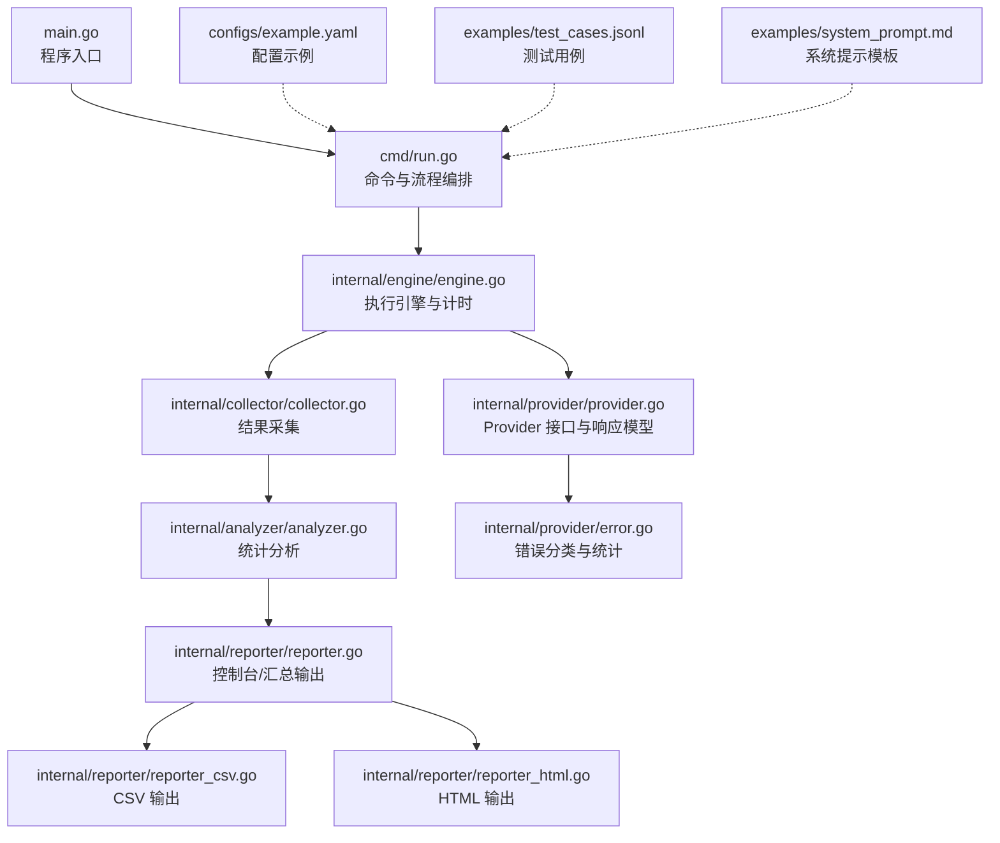
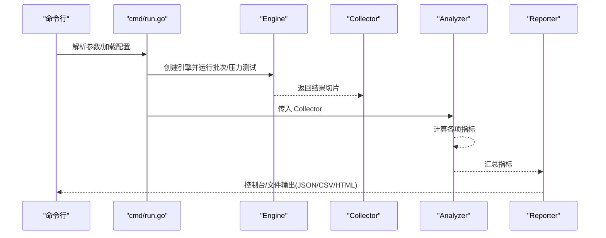
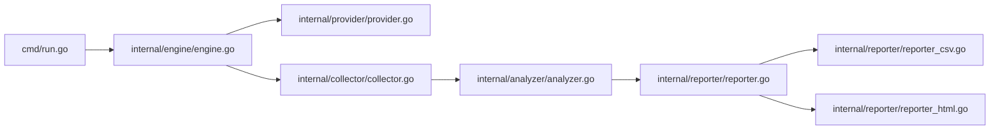

# 性能指标解读

<cite>
**本文引用的文件**
- [main.go](file://main.go)
- [cmd/run.go](file://cmd/run.go)
- [internal/analyzer/analyzer.go](file://internal/analyzer/analyzer.go)
- [internal/collector/collector.go](file://internal/collector/collector.go)
- [internal/engine/engine.go](file://internal/engine/engine.go)
- [internal/reporter/reporter.go](file://internal/reporter/reporter.go)
- [internal/reporter/reporter_csv.go](file://internal/reporter/reporter_csv.go)
- [internal/reporter/reporter_html.go](file://internal/reporter/reporter_html.go)
- [internal/provider/provider.go](file://internal/provider/provider.go)
- [internal/provider/error.go](file://internal/provider/error.go)
- [configs/example.yaml](file://configs/example.yaml)
- [examples/test_cases.jsonl](file://examples/test_cases.jsonl)
- [examples/system_prompt.md](file://examples/system_prompt.md)
</cite>

## 目录
1. [简介](#简介)
2. [项目结构](#项目结构)
3. [核心组件](#核心组件)
4. [架构总览](#架构总览)
5. [详细组件分析](#详细组件分析)
6. [依赖分析](#依赖分析)
7. [性能考量](#性能考量)
8. [故障排查指南](#故障排查指南)
9. [结论](#结论)
10. [附录](#附录)

## 简介
本指南面向使用 GoLLMPerf 进行 LLM API 性能测试的工程师与测试人员，系统性讲解各类性能指标的含义、计算方法与分析要点，并结合代码实现给出可操作的解读路径与判断标准。重点覆盖以下指标：
- QPS（每秒查询数）
- 延迟分布（P50/P90/P99）
- 吞吐量（Tokens/Second）
- 错误率与错误类型分布
- 首 token 延迟（TTFT）及其分布
- 请求/响应平均 token 数

通过本指南，您可以基于工具输出的控制台、JSON、CSV、HTML 报告，快速定位性能瓶颈、识别异常模式并制定优化策略。

## 项目结构
GoLLMPerf 采用模块化分层设计：命令入口负责参数解析与流程编排；引擎执行具体请求与计时；采集器收集结果；分析器计算指标；报告器输出多格式报告。配置文件支持 YAML，示例数据提供 JSONL 测试集。

**图表来源**
- [main.go:1-26](file://main.go#L1-L26)
- [cmd/run.go:1-123](file://cmd/run.go#L1-L123)
- [internal/engine/engine.go:1-112](file://internal/engine/engine.go#L1-L112)
- [internal/collector/collector.go:1-97](file://internal/collector/collector.go#L1-L97)
- [internal/analyzer/analyzer.go:1-198](file://internal/analyzer/analyzer.go#L1-L198)
- [internal/reporter/reporter.go:1-130](file://internal/reporter/reporter.go#L1-L130)
- [internal/reporter/reporter_csv.go:1-54](file://internal/reporter/reporter_csv.go#L1-L54)
- [internal/reporter/reporter_html.go:1-76](file://internal/reporter/reporter_html.go#L1-L76)
- [internal/provider/provider.go:1-72](file://internal/provider/provider.go#L1-L72)
- [internal/provider/error.go:1-78](file://internal/provider/error.go#L1-L78)
- [configs/example.yaml:1-78](file://configs/example.yaml#L1-L78)
- [examples/test_cases.jsonl:1-6](file://examples/test_cases.jsonl#L1-L6)
- [examples/system_prompt.md:1-1](file://examples/system_prompt.md#L1-L1)

**章节来源**
- [main.go:1-26](file://main.go#L1-L26)
- [cmd/run.go:1-123](file://cmd/run.go#L1-L123)
- [configs/example.yaml:1-78](file://configs/example.yaml#L1-L78)
- [examples/test_cases.jsonl:1-6](file://examples/test_cases.jsonl#L1-L6)
- [examples/system_prompt.md:1-1](file://examples/system_prompt.md#L1-L1)

## 核心组件
- 执行引擎（Engine）：封装单次请求执行、计时与结果封装，记录请求/响应 token 数、总延迟与首 token 延迟。
- 数据采集器（Collector）：聚合所有结果，按成功/失败分类，计算测试总时长。
- 统计分析器（Analyzer）：计算基础指标（总数、成功率/错误率）、QPS、平均/百分位延迟、吞吐量、首 token 延迟及分布、错误类型统计。
- 报告器（Reporter）：控制台输出、JSON、CSV、HTML 多格式报告生成。
- 提供商接口（Provider）：抽象不同 LLM 提供商的请求发送与响应模型，统一错误类型与使用量统计。

**章节来源**
- [internal/engine/engine.go:19-30](file://internal/engine/engine.go#L19-L30)
- [internal/collector/collector.go:9-97](file://internal/collector/collector.go#L9-L97)
- [internal/analyzer/analyzer.go:43-75](file://internal/analyzer/analyzer.go#L43-L75)
- [internal/reporter/reporter.go:25-130](file://internal/reporter/reporter.go#L25-L130)
- [internal/provider/provider.go:10-72](file://internal/provider/provider.go#L10-L72)

## 架构总览
下图展示一次完整测试从命令到报告的关键调用链路与数据流。

**图表来源**
- [cmd/run.go:22-77](file://cmd/run.go#L22-L77)
- [internal/engine/engine.go:88-112](file://internal/engine/engine.go#L88-L112)
- [internal/collector/collector.go:14-22](file://internal/collector/collector.go#L14-L22)
- [internal/analyzer/analyzer.go:89-197](file://internal/analyzer/analyzer.go#L89-L197)
- [internal/reporter/reporter.go:38-130](file://internal/reporter/reporter.go#L38-L130)

## 详细组件分析

### 指标定义与计算方法
- 基础指标
  - 总请求数、成功/失败请求数、成功率、错误率
  - 成功请求数与总时长决定 QPS
- 延迟指标
  - 平均延迟、P50/P90/P99 延迟（基于排序后的延迟序列）
- 吞吐量
  - TPS（每秒生成 token 数）= 响应 token 总数 / 测试总时长
  - 请求/响应平均 token 数
- 首 token 延迟（TTFT）
  - 平均 TTFT 与 P50/P90/P99 分布
- 错误分析
  - 错误类型计数（含网络类与非网络类）

上述指标在分析器中集中计算，详见以下小节。

**章节来源**
- [internal/analyzer/analyzer.go:90-197](file://internal/analyzer/analyzer.go#L90-L197)

### QPS（每秒查询数）
- 定义：单位时间内成功完成的请求数。
- 计算：QPS = 成功请求数 / 测试总时长（秒）
- 关键点：
  - 使用“成功请求数”而非“总请求数”，避免失败请求拉低 QPS
  - 测试总时长由首个结束时间到最晚结束时间的跨度决定，排除了冷启动/预热阶段影响
- 判断标准：
  - 若 QPS 显著低于预期，优先检查并发设置、限流策略、上游服务 SLA 与网络质量
  - 在并发提升时，若 QPS 不增反降，可能存在资源争用或队列阻塞

**章节来源**
- [internal/analyzer/analyzer.go:116-119](file://internal/analyzer/analyzer.go#L116-L119)
- [internal/collector/collector.go:77-96](file://internal/collector/collector.go#L77-L96)

### 延迟分布（P50/P90/P99）
- 定义：延迟的分位数，反映尾部延迟表现。
- 计算：对成功延迟进行升序排序后取对应位置
- 关键点：
  - P99 更敏感地暴露尾部异常，适合稳定性评估
  - 平均延迟受极端值影响较大，需结合 P90/P99 综合判断
- 判断标准：
  - P50/P90/P99 同步上升通常指示系统整体拥塞
  - P99 明显高于 P90 可能存在偶发长尾（如 GC、IO、上游抖动）

**章节来源**
- [internal/analyzer/analyzer.go:145-153](file://internal/analyzer/analyzer.go#L145-L153)

### 吞吐量（Tokens/Second）
- 定义：单位时间内生成的 token 数。
- 计算：TPS = 响应 token 总数 / 测试总时长（秒）
- 关键点：
  - 与 QPS 协同分析，TPS 高但 QPS 低可能意味着单请求输出较长
  - 结合平均请求/响应 token 数，评估模型与提示词长度对吞吐的影响
- 判断标准：
  - TPS 下降伴随 P99 上升，通常为资源瓶颈或上游限速

**章节来源**
- [internal/analyzer/analyzer.go:159-162](file://internal/analyzer/analyzer.go#L159-L162)

### 错误率与错误类型分布
- 定义：失败请求数占总请求数的比例；错误类型用于归因。
- 计算：错误率 = 100 - 成功率；错误类型计数来自失败结果的错误对象
- 关键点：
  - 将错误按“网络类/非网络类”进行归类，便于定位是网络波动还是服务端限制
  - “unknown”类别用于缺失错误类型的异常结果
- 判断标准：
  - 网络类错误（如超时、连接被拒）多发，优先检查网络与上游可用性
  - 非网络类错误（如鉴权失败、参数非法）多发，优先检查配置与输入合法性

**章节来源**
- [internal/analyzer/analyzer.go:184-194](file://internal/analyzer/analyzer.go#L184-L194)
- [internal/provider/error.go:32-78](file://internal/provider/error.go#L32-L78)

### 首 token 延迟（TTFT）与分布
- 定义：从发起请求到收到第一个 token 的耗时。
- 计算：平均 TTFT 与 P50/P90/P99
- 关键点：
  - 体现“感知速度”，对用户体验影响显著
  - 与总延迟差异可反映模型推理与流式传输的相对开销
- 判断标准：
  - TTFT 显著升高可能由模型预热、缓存未命中、上游排队导致
  - TTFT 与总延迟差距过大，需关注上游是否提前返回首 token

**章节来源**
- [internal/analyzer/analyzer.go:164-181](file://internal/analyzer/analyzer.go#L164-L181)
- [internal/engine/engine.go:20-30](file://internal/engine/engine.go#L20-L30)

### 请求/响应平均 token 数
- 定义：单次请求 prompt token 与单次响应 completion token 的平均值。
- 计算：分别对成功结果求和后除以成功次数
- 关键点：
  - 有助于评估提示词长度与生成长度对 QPS/TPS 的影响
  - 与 TPS 联合分析，可判断是否存在“长输出”拖累吞吐

**章节来源**
- [internal/analyzer/analyzer.go:155-157](file://internal/analyzer/analyzer.go#L155-L157)

### 报告输出与解读路径
- 控制台报告：一次性打印关键指标，便于快速审阅
- JSON 报告：结构化数据，便于二次处理与自动化集成
- CSV 抏告：横向对比不同并发下的指标，适合绘制趋势图
- HTML 报告：可视化表格与图表，便于团队分享与归档

**章节来源**
- [internal/reporter/reporter.go:47-130](file://internal/reporter/reporter.go#L47-L130)
- [internal/reporter/reporter_csv.go:8-54](file://internal/reporter/reporter_csv.go#L8-L54)
- [internal/reporter/reporter_html.go:15-76](file://internal/reporter/reporter_html.go#L15-L76)

## 依赖分析
- 命令层依赖执行引擎与分析器，形成“执行—采集—分析—报告”的闭环
- 引擎依赖提供商接口，屏蔽不同供应商差异
- 分析器依赖采集器，保证指标计算的准确性与时序一致性
- 报告器依赖分析器与模板，输出多格式报告

**图表来源**
- [cmd/run.go:16-77](file://cmd/run.go#L16-L77)
- [internal/engine/engine.go:14-47](file://internal/engine/engine.go#L14-L47)
- [internal/provider/provider.go:10-72](file://internal/provider/provider.go#L10-L72)
- [internal/collector/collector.go:9-97](file://internal/collector/collector.go#L9-L97)
- [internal/analyzer/analyzer.go:77-87](file://internal/analyzer/analyzer.go#L77-L87)
- [internal/reporter/reporter.go:25-45](file://internal/reporter/reporter.go#L25-L45)
- [internal/reporter/reporter_csv.go:8-54](file://internal/reporter/reporter_csv.go#L8-L54)
- [internal/reporter/reporter_html.go:15-76](file://internal/reporter/reporter_html.go#L15-L76)

**章节来源**
- [cmd/run.go:16-77](file://cmd/run.go#L16-L77)
- [internal/engine/engine.go:14-47](file://internal/engine/engine.go#L14-L47)
- [internal/analyzer/analyzer.go:77-87](file://internal/analyzer/analyzer.go#L77-L87)
- [internal/reporter/reporter.go:25-45](file://internal/reporter/reporter.go#L25-L45)

## 性能考量
- 并发与 QPS：在并发提升时，QPS 应随之线性增长；若出现平台期或下降，需排查限流、GC、CPU/IO 抖动与上游 SLA
- 延迟分布：P99 是稳定性“安全边界”，应优先保障 P99 在可接受范围
- 吞吐与延迟：高 TPS 通常伴随较低延迟；若 TPS 低且 P99 高，需检查模型实例能力与网络带宽
- 首 token 延迟：对交互体验至关重要，应与总延迟对比，识别推理与传输的瓶颈
- 错误率：错误率上升往往先于 QPS 下降，应作为预警信号

## 故障排查指南
- 网络类错误（如超时、连接被拒、主机不可达）频发
  - 表现：错误率上升、P99 显著升高、QPS 波动
  - 建议：检查网络连通性、防火墙策略、DNS 解析、TLS 握手；必要时启用重试与熔断
- 鉴权/配额类错误
  - 表现：错误类型集中在“鉴权失败/配额不足”
  - 建议：核对 API Key、配额与速率限制；调整并发或增加配额
- 输入参数错误
  - 表现：错误类型为“参数非法/模型不支持”
  - 建议：校验提示词长度、消息格式、模型名称与参数模板
- 上游限流/过载
  - 表现：QPS 无法达到目标、P90/P99 急剧上升
  - 建议：降低并发、引入指数退避与自适应节流；升级上游实例规格
- 模型预热/缓存未命中
  - 表现：首次测试 TTFT 明显高于后续
  - 建议：启用预热阶段或固定实例；观察 TTFT 分布变化

**章节来源**
- [internal/provider/error.go:32-78](file://internal/provider/error.go#L32-L78)
- [internal/analyzer/analyzer.go:184-194](file://internal/analyzer/analyzer.go#L184-L194)

## 结论
通过对 GoLLMPerf 的指标体系与实现机制进行深入解析，可以建立一套完整的性能分析闭环：以 QPS、延迟分布、吞吐量、TTFT 与错误类型为核心观测维度，结合并发对比与报告输出，快速定位瓶颈并指导优化。建议在日常测试中：
- 固定基线：稳定并发与数据集，确保可比性
- 多维交叉验证：将 QPS 与 P99/T99、TPS 与 TTFT、错误类型分布联动分析
- 自动化回归：将 CSV/JSON 报告接入 CI，持续监控关键指标

## 附录

### 指标对照表
- 总请求数：所有请求计数
- 成功/失败请求数：成功/失败计数
- 成功率/错误率：百分比
- 测试总时长：首个结束时间到最晚结束时间的跨度
- QPS：成功请求数 / 总时长（秒）
- 平均/分位延迟：平均延迟、P50/P90/P99
- TPS：响应 token 总数 / 总时长（秒）
- 平均请求/响应 token 数：平均请求/响应 token 数
- TTFT：平均/分位首 token 延迟
- 错误类型分布：按错误类型计数

**章节来源**
- [internal/analyzer/analyzer.go:43-75](file://internal/analyzer/analyzer.go#L43-L75)
- [internal/analyzer/analyzer.go:116-162](file://internal/analyzer/analyzer.go#L116-L162)
- [internal/analyzer/analyzer.go:164-181](file://internal/analyzer/analyzer.go#L164-L181)
- [internal/analyzer/analyzer.go:184-194](file://internal/analyzer/analyzer.go#L184-L194)

### 常见问题与指标特征
- 并发提升 QPS 不增反降
  - 特征：QPS 下降、P90/P99 急剧上升、错误率上升
  - 诊断：检查限流、CPU/内存/IO 抖动、上游 SLA
- TTFT 明显偏高
  - 特征：TTFT 高、P90/P99 相对较高
  - 诊断：预热不足、模型实例冷启动、上游排队
- TPS 低但 QPS 不低
  - 特征：TPS 低、平均/分位延迟正常
  - 诊断：单请求输出过长、提示词过长
- 错误率上升
  - 特征：错误率上升、错误类型集中
  - 诊断：网络波动、鉴权/配额问题、参数非法

**章节来源**
- [internal/analyzer/analyzer.go:116-162](file://internal/analyzer/analyzer.go#L116-L162)
- [internal/analyzer/analyzer.go:164-181](file://internal/analyzer/analyzer.go#L164-L181)
- [internal/provider/error.go:32-78](file://internal/provider/error.go#L32-L78)