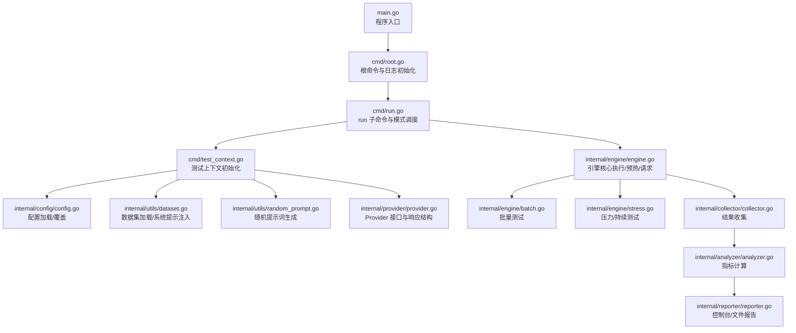
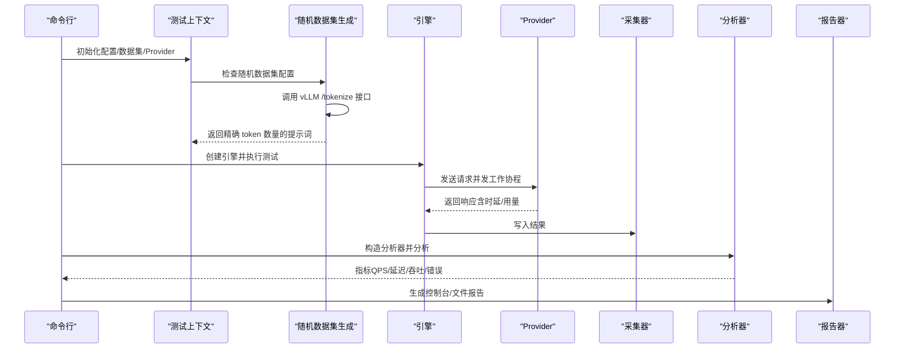
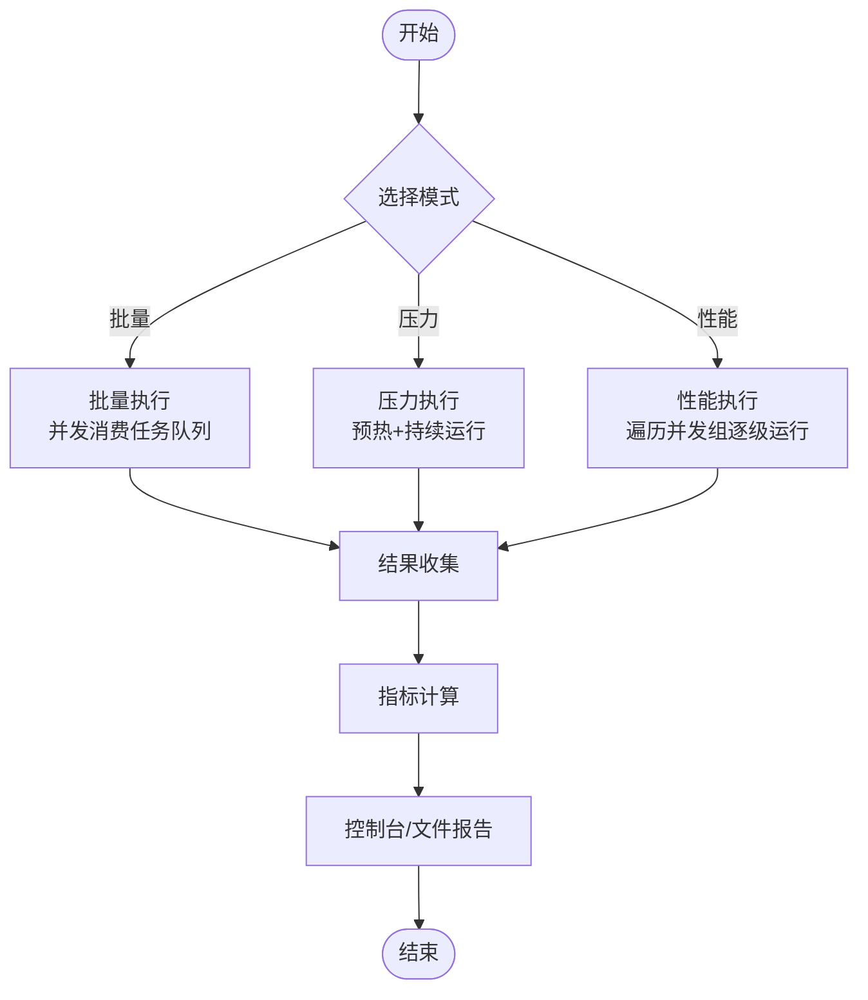
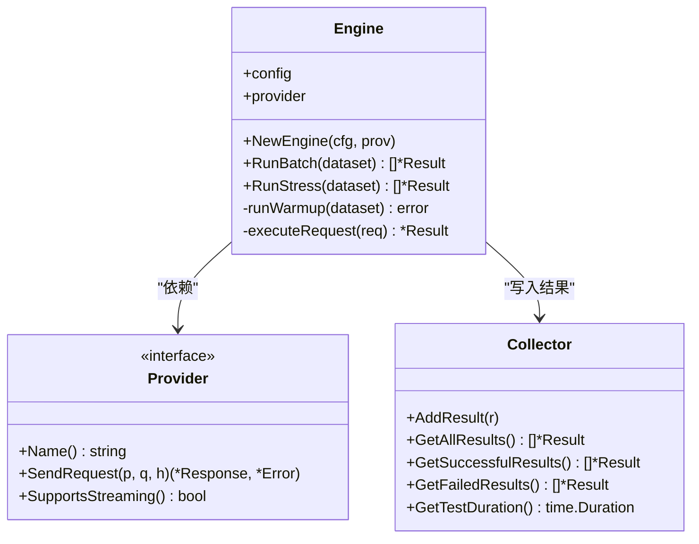
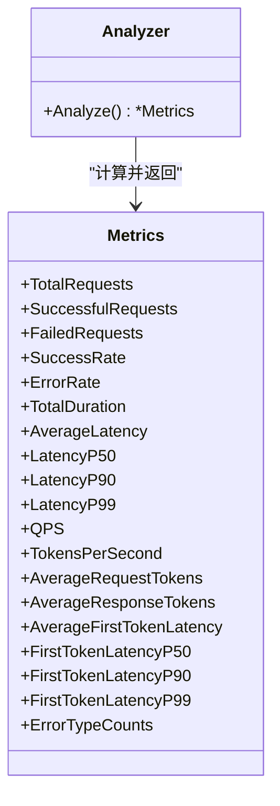
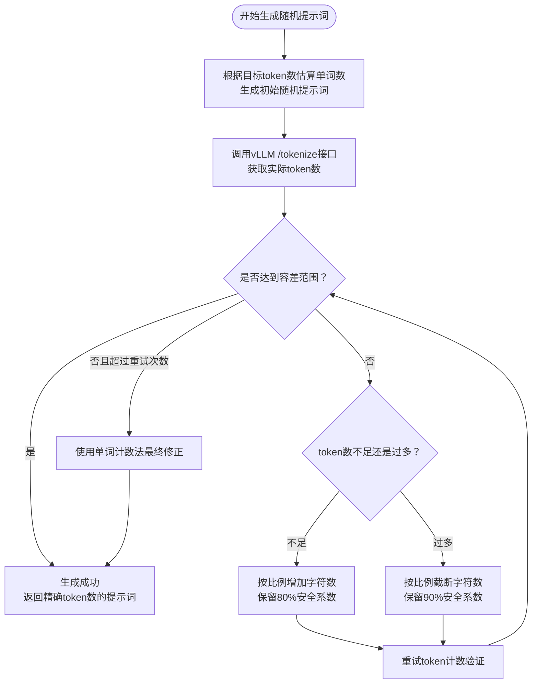
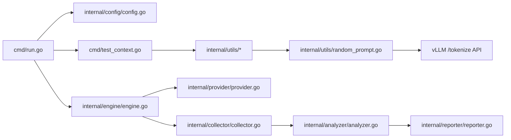

# 性能测试指南

<cite>
**本文引用的文件**
- [main.go](file://main.go)
- [cmd/root.go](file://cmd/root.go)
- [cmd/run.go](file://cmd/run.go)
- [cmd/test_context.go](file://cmd/test_context.go)
- [cmd/generate.go](file://cmd/generate.go)
- [cmd/test_random.go](file://cmd/test_random.go)
- [internal/engine/engine.go](file://internal/engine/engine.go)
- [internal/engine/batch.go](file://internal/engine/batch.go)
- [internal/engine/stress.go](file://internal/engine/stress.go)
- [internal/collector/collector.go](file://internal/collector/collector.go)
- [internal/analyzer/analyzer.go](file://internal/analyzer/analyzer.go)
- [internal/config/config.go](file://internal/config/config.go)
- [configs/example.yaml](file://configs/example.yaml)
- [internal/reporter/reporter.go](file://internal/reporter/reporter.go)
- [internal/provider/provider.go](file://internal/provider/provider.go)
- [internal/utils/dataset.go](file://internal/utils/dataset.go)
- [internal/utils/batch_results.go](file://internal/utils/batch_results.go)
- [internal/utils/random_prompt.go](file://internal/utils/random_prompt.go)
- [examples/test_cases.jsonl](file://examples/test_cases.jsonl)
- [README.md](file://README.md)
</cite>

## 目录
1. [简介](#简介)
2. [项目结构](#项目结构)
3. [核心组件](#核心组件)
4. [架构总览](#架构总览)
5. [详细组件分析](#详细组件分析)
6. [依赖关系分析](#依赖关系分析)
7. [性能考虑与调优](#性能考虑与调优)
8. [故障排查指南](#故障排查指南)
9. [结论](#结论)
10. [附录：测试场景设计与最佳实践](#附录测试场景设计与最佳实践)

## 简介
本指南面向使用 GoLLMPerf 进行大语言模型（LLM）API 性能测试的工程师与测试人员，系统阐述四种测试模式的设计原理与适用场景：批量测试、压力测试、性能测试（压测寻优）、稳定性测试，并给出并发级别、负载模式与测试时长的规划建议；同时详解关键性能指标（QPS、延迟分布、吞吐量、错误率等）的含义与解读方法，提供调优与问题诊断路径，并结合真实测试案例与结果分析示例帮助快速落地。

**新增功能**：本版本增加了随机数据集生成功能，支持基于 vLLM 的随机提示词生成，用于大规模性能测试和基准测试场景。

## 项目结构
GoLLMPerf 采用模块化分层设计，命令入口通过 CLI 子命令驱动测试执行，核心流程由"配置加载—上下文构建—引擎执行—采集统计—分析输出"组成，支持多提供商（OpenAI/Qwen）与多格式报告输出。新增的随机数据集生成功能通过 vLLM 的 /tokenize 接口精确控制提示词的 token 数量。



**图示来源**
- [main.go:1-26](file://main.go#L1-L26)
- [cmd/root.go:1-28](file://cmd/root.go#L1-L28)
- [cmd/run.go:1-131](file://cmd/run.go#L1-L131)
- [cmd/test_context.go:1-143](file://cmd/test_context.go#L1-L143)
- [internal/engine/engine.go:1-112](file://internal/engine/engine.go#L1-L112)
- [internal/engine/batch.go:1-65](file://internal/engine/batch.go#L1-L65)
- [internal/engine/stress.go:1-79](file://internal/engine/stress.go#L1-L79)
- [internal/collector/collector.go:1-97](file://internal/collector/collector.go#L1-L97)
- [internal/analyzer/analyzer.go:1-198](file://internal/analyzer/analyzer.go#L1-L198)
- [internal/reporter/reporter.go:1-130](file://internal/reporter/reporter.go#L1-L130)
- [internal/config/config.go:1-245](file://internal/config/config.go#L1-L245)
- [internal/utils/dataset.go:1-126](file://internal/utils/dataset.go#L1-L126)
- [internal/utils/random_prompt.go:1-197](file://internal/utils/random_prompt.go#L1-L197)
- [internal/provider/provider.go:1-72](file://internal/provider/provider.go#L1-L72)

**章节来源**
- [README.md:92-109](file://README.md#L92-L109)
- [main.go:1-26](file://main.go#L1-L26)
- [cmd/root.go:1-28](file://cmd/root.go#L1-L28)
- [cmd/run.go:16-78](file://cmd/run.go#L16-L78)
- [cmd/test_context.go:21-82](file://cmd/test_context.go#L21-L82)
- [internal/config/config.go:136-188](file://internal/config/config.go#L136-L188)

## 核心组件
- 命令行与入口
  - 入口程序初始化日志并交由 CLI 执行。
  - 根命令提供全局日志级别开关，run 子命令负责模式调度与报告生成。
- 配置管理
  - 支持 YAML 配置文件加载与命令行参数覆盖；默认值涵盖测试时长、并发、预热、超时、性能并发组等。
  - 新增随机数据集配置项：random-enable、random-input-len、random-output-len。
- 数据集与系统提示
  - 支持 JSONL 数据集加载，可按配置注入系统提示消息。
  - **新增**：支持随机数据集生成，通过 vLLM /tokenize 接口精确控制 token 数量。
- 引擎与执行
  - 统一的执行器封装请求发送、预热、并发工作协程与结果收集。
- 结果采集与分析
  - 采集器聚合所有结果，分析器计算基础/时延/吞吐/首 token 等指标并进行错误分类统计。
- 报告器
  - 控制台实时输出与多种格式文件报告（JSON/CSV/HTML），支持并发对比视图。

**章节来源**
- [main.go:11-25](file://main.go#L11-L25)
- [cmd/root.go:10-27](file://cmd/root.go#L10-L27)
- [cmd/run.go:16-95](file://cmd/run.go#L16-L95)
- [internal/config/config.go:14-75](file://internal/config/config.go#L14-L75)
- [internal/utils/dataset.go:62-80](file://internal/utils/dataset.go#L62-L80)
- [internal/engine/engine.go:34-47](file://internal/engine/engine.go#L34-L47)
- [internal/collector/collector.go:14-22](file://internal/collector/collector.go#L14-L22)
- [internal/analyzer/analyzer.go:77-87](file://internal/analyzer/analyzer.go#L77-L87)
- [internal/reporter/reporter.go:31-45](file://internal/reporter/reporter.go#L31-L45)

## 架构总览
下图展示从命令到执行再到分析与报告的整体流程，以及各模块间的依赖关系。新增的随机数据集生成流程通过 vLLM 的 /tokenize 接口实现精确的 token 计数。



**图示来源**
- [cmd/run.go:97-122](file://cmd/run.go#L97-L122)
- [cmd/test_context.go:72-85](file://cmd/test_context.go#L72-L85)
- [internal/engine/engine.go:88-111](file://internal/engine/engine.go#L88-L111)
- [internal/utils/random_prompt.go:34-113](file://internal/utils/random_prompt.go#L34-L113)
- [internal/provider/provider.go:10-20](file://internal/provider/provider.go#L10-L20)
- [internal/collector/collector.go:24-27](file://internal/collector/collector.go#L24-L27)
- [internal/analyzer/analyzer.go:89-197](file://internal/analyzer/analyzer.go#L89-L197)
- [internal/reporter/reporter.go:47-83](file://internal/reporter/reporter.go#L47-L83)

## 详细组件分析

### 测试模式与控制流
- 批量测试（--batch）
  - 面向"完成全部用例"的场景，适合回归与一致性验证。
  - 引擎以固定并发拉取任务队列，逐条执行并保持顺序写回，保证结果与输入一一对应。
- 压力测试（非批且非性能）
  - 面向"逐步加压直至系统极限"，关注稳定性与极限承载能力。
  - 引擎在预热后按配置的时长或每并发请求数限制持续运行，收集全量结果。
- 性能测试（--perf）
  - 面向"在多个并发水平上寻找性能拐点"，自动遍历 perf 并发组并输出对比。
  - 每个并发水平独立运行一次，报告器维护并发对比视图。
- 稳定性测试
  - 可通过延长测试时长与并发策略实现长期连续运行，观察成功率与延迟漂移。



**图示来源**
- [cmd/run.go:16-78](file://cmd/run.go#L16-L78)
- [internal/engine/batch.go:12-65](file://internal/engine/batch.go#L12-L65)
- [internal/engine/stress.go:15-79](file://internal/engine/stress.go#L15-L79)
- [internal/analyzer/analyzer.go:89-197](file://internal/analyzer/analyzer.go#L89-L197)
- [internal/reporter/reporter.go:38-83](file://internal/reporter/reporter.go#L38-L83)

**章节来源**
- [cmd/run.go:16-78](file://cmd/run.go#L16-L78)
- [internal/engine/batch.go:12-65](file://internal/engine/batch.go#L12-L65)
- [internal/engine/stress.go:15-79](file://internal/engine/stress.go#L15-L79)
- [README.md:34-41](file://README.md#L34-L41)

### 引擎与执行逻辑
- 预热阶段
  - 在压力测试前按并发数启动工作协程，循环使用数据集轮询请求，失败即中止预热，确保测量稳定。
- 请求执行
  - 统一封装发送请求、记录时延与用量、标记成功/失败与错误类型。
- 并发控制
  - 使用 goroutine + channel 实现高并发与背压控制，避免阻塞。
- 结果收集
  - 通过带缓冲通道收集结果并在所有工作协程结束后关闭通道，主协程汇总。



**图示来源**
- [internal/engine/engine.go:13-112](file://internal/engine/engine.go#L13-L112)
- [internal/provider/provider.go:10-20](file://internal/provider/provider.go#L10-L20)
- [internal/collector/collector.go:9-97](file://internal/collector/collector.go#L9-L97)

**章节来源**
- [internal/engine/engine.go:49-86](file://internal/engine/engine.go#L49-L86)
- [internal/engine/engine.go:88-111](file://internal/engine/engine.go#L88-L111)
- [internal/engine/batch.go:12-65](file://internal/engine/batch.go#L12-L65)
- [internal/engine/stress.go:15-79](file://internal/engine/stress.go#L15-L79)

### 指标体系与解读
- 基础指标
  - 总请求数、成功/失败请求数、成功率、错误率。
- 时延指标
  - 总时长、平均时延、P50/P90/P99 响应时延；对流式响应额外提供首 token 时延与分位。
- 吞吐指标
  - QPS（每秒查询数）、每秒生成 token 数（TPS）。
- 错误分析
  - 按错误码与类型统计分布，辅助定位系统瓶颈或限流问题。



**图示来源**
- [internal/analyzer/analyzer.go:43-75](file://internal/analyzer/analyzer.go#L43-L75)
- [internal/analyzer/analyzer.go:89-197](file://internal/analyzer/analyzer.go#L89-L197)

**章节来源**
- [internal/analyzer/analyzer.go:89-197](file://internal/analyzer/analyzer.go#L89-L197)
- [internal/reporter/reporter.go:47-83](file://internal/reporter/reporter.go#L47-L83)

### 报告与可视化
- 控制台报告：实时输出关键指标，便于快速判断。
- 文件报告：支持 JSON/CSV/HTML 三种格式，HTML 报告包含图表与对比视图，便于归档与分享。
- 并发对比：性能模式下将不同并发下的指标统一呈现，辅助决策。

**章节来源**
- [internal/reporter/reporter.go:47-130](file://internal/reporter/reporter.go#L47-L130)
- [cmd/run.go:26-65](file://cmd/run.go#L26-L65)

### 随机数据集生成功能
**新增功能**：GoLLMPerf 现已支持基于 vLLM 的随机数据集生成功能，用于大规模性能测试和基准测试。

#### 功能概述
- **精确 token 控制**：通过 vLLM 的 /tokenize 接口精确控制提示词的 token 数量。
- **自适应算法**：支持多次重试和自适应调整，确保达到目标 token 数量。
- **容差机制**：默认容差为目标数量的 2% 或至少 10 个 token。
- **兼容性设计**：即使无法精确达到目标，也会使用最佳努力策略生成近似匹配的提示词。

#### 核心算法
1. **初始生成**：基于目标 token 数量估算单词数量并生成随机英文单词。
2. **token 计数验证**：调用 vLLM /tokenize 接口获取实际 token 数量。
3. **自适应调整**：
   - 如果 token 数量不足：按比例增加字符数（保留 80% 的安全系数）
   - 如果 token 数量过多：按比例截断字符数（保留 90% 的安全系数）
4. **最终修正**：超过最大重试次数后，使用单词计数法进行最终调整。



**图示来源**
- [internal/utils/random_prompt.go:34-113](file://internal/utils/random_prompt.go#L34-L113)
- [internal/utils/random_prompt.go:154-178](file://internal/utils/random_prompt.go#L154-L178)

#### 配置选项
- **random-enable**：启用随机数据集生成功能（默认 false）
- **random-input-len**：输入提示词的 token 长度（默认 1000）
- **random-output-len**：输出响应的最大 token 长度（默认 100）

#### 使用方法
1. **命令行方式**：
   ```bash
   # 启用随机数据集并设置参数
   ./gollmperf run -c config.yaml --random-enable --random-input-len 2000 --random-output-len 150
   
   # 测试随机生成功能
   ./gollmperf test-random -e http://localhost:63535/v1/chat/completions -t 1000 -i 5 -v
   ```

2. **配置文件方式**：
   ```yaml
   random_dataset_vllm:
     random-enable: true
     random-input-len: 2000
     random-output-len: 150
   ```

3. **环境变量方式**：
   ```bash
   export LLM_API_ENDPOINT="http://localhost:63535/v1/chat/completions"
   ./gollmperf test-random -t 1000 -i 3
   ```

#### 测试工具
- **test-random 命令**：专门用于测试随机提示词生成功能
- **容差测试**：支持多次迭代测试，验证生成结果的准确性
- **详细日志**：显示每次迭代的结果、差异和容差范围

**章节来源**
- [internal/utils/random_prompt.go:1-197](file://internal/utils/random_prompt.go#L1-L197)
- [cmd/test_random.go:1-110](file://cmd/test_random.go#L1-L110)
- [internal/config/config.go:130-135](file://internal/config/config.go#L130-L135)
- [configs/example.yaml:67-71](file://configs/example.yaml#L67-L71)

## 依赖关系分析
- 组件内聚与耦合
  - 引擎与 Provider 解耦，便于扩展新提供商；配置与上下文解耦，便于命令行覆盖。
  - 分析器仅依赖采集器接口，便于替换统计算法。
  - **新增**：随机数据集生成模块与 vLLM 服务解耦，通过 HTTP API 交互。
- 外部依赖
  - CLI 框架、配置解析、日志框架、HTTP 客户端等均为标准库或社区成熟组件。
  - **新增**：依赖 vLLM 的 /tokenize 接口进行精确的 token 计数。
- 循环依赖
  - 未发现直接或间接循环依赖。



**图示来源**
- [cmd/run.go:16-95](file://cmd/run.go#L16-L95)
- [cmd/test_context.go:21-82](file://cmd/test_context.go#L21-L82)
- [internal/engine/engine.go:13-112](file://internal/engine/engine.go#L13-L112)
- [internal/provider/provider.go:10-20](file://internal/provider/provider.go#L10-L20)
- [internal/collector/collector.go:9-97](file://internal/collector/collector.go#L9-L97)
- [internal/analyzer/analyzer.go:77-87](file://internal/analyzer/analyzer.go#L77-L87)
- [internal/reporter/reporter.go:25-45](file://internal/reporter/reporter.go#L25-L45)
- [internal/utils/random_prompt.go:124-178](file://internal/utils/random_prompt.go#L124-L178)

## 性能考虑与调优
- 并发与资源
  - 初始并发从低到高递增，观察 QPS 与 P99 延迟变化；当 P99 显著上升或错误率升高时，说明接近系统瓶颈。
  - 合理设置预热时长与并发，避免冷启动抖动影响测量。
- 负载模式
  - 批量测试用于一致性校验；压力测试用于极限探测；性能测试用于寻优；稳定性测试用于长时间观测。
  - **新增**：随机数据集测试适用于大规模基准测试，可模拟真实场景的 token 分布。
- 时长规划
  - 至少覆盖 1~3 个完整采样周期，确保统计指标稳定；压力/稳定性测试建议覆盖业务高峰时段。
- 指标阈值
  - QPS：目标并发下的稳定 QPS；P99：SLA 关键指标；TPS：衡量生成效率；错误率：零容忍或设定上限。
- 调优建议
  - 优化网络与上游限流策略；调整并发与请求体大小；启用/优化流式返回；监控上游可用性与配额。
  - **新增**：对于随机数据集测试，建议使用更长的测试时长以获得稳定的 token 分布。
- 工具与实践
  - 使用性能模式多并发组对比，绘制 QPS/P99/TPS 随并发变化曲线，识别拐点。
  - **新增**：利用 test-random 命令验证随机生成功能的准确性，确保测试结果的有效性。

**章节来源**
- [internal/config/config.go:20-25](file://internal/config/config.go#L20-L25)
- [internal/analyzer/analyzer.go:116-162](file://internal/analyzer/analyzer.go#L116-L162)
- [README.md:275-297](file://README.md#L275-L297)

## 故障排查指南
- 常见问题与定位
  - 配置缺失：检查配置文件路径、提供商、模型名、API Key、Endpoint 是否正确。
  - 数据集异常：确认 JSONL 行是否合法，是否存在空行；系统提示注入是否生效。
  - 预热失败：若预热阶段报错，需先修复上游服务或凭据再进行正式测试。
  - 错误类型统计：根据错误码与类型分布定位限流、鉴权、网络或上游异常。
  - **新增**：随机数据集生成失败：检查 vLLM 服务是否可用、/tokenize 接口是否正常响应。
- 日志与输出
  - 使用 --loglevel 调整日志级别；关注 run 子命令中的执行阶段日志与错误信息。
  - **新增**：随机数据集生成过程的日志，包括 token 计数、容差范围和调整策略。
- 快速恢复
  - 缩小并发、延长预热、减少单次请求复杂度、检查上游配额与速率限制。
  - **新增**：对于随机数据集问题，检查 vLLM 服务状态、网络连接和 /tokenize 接口权限。

**章节来源**
- [cmd/test_context.go:22-82](file://cmd/test_context.go#L22-L82)
- [internal/utils/dataset.go:62-80](file://internal/utils/dataset.go#L62-L80)
- [internal/analyzer/analyzer.go:184-194](file://internal/analyzer/analyzer.go#L184-L194)
- [cmd/run.go:97-122](file://cmd/run.go#L97-L122)

## 结论
GoLLMPerf 提供了从配置、执行、采集、分析到报告的完整链路，支持多种测试模式与丰富的指标维度。**新增的随机数据集生成功能**进一步增强了工具的实用性，特别适用于大规模性能测试和基准测试场景。通过合理的并发规划、负载设计与时长安排，可高效识别系统瓶颈、评估性能边界并指导优化。建议在生产环境部署前至少完成批量、性能与稳定性三类测试，并形成标准化报告模板以便复盘与对比。

## 附录：测试场景设计与最佳实践

### 四种测试模式的选择标准
- 批量测试
  - 适用：回归验证、一致性比对、离线评测。
  - 关注：成功率、平均/分位延迟、TPS、首 token 时延。
- 压力测试
  - 适用：极限探测、稳定性验证、容量规划。
  - 关注：P99/P999 延迟、错误率、系统资源占用。
- 性能测试（压测寻优）
  - 适用：确定最优并发、评估扩容收益、制定 SLA。
  - 关注：QPS/P99/TPS 随并发变化趋势。
- 稳定性测试
  - 适用：长时运行、峰值/谷值波动、资源泄漏检测。
  - 关注：成功率随时间衰减、延迟漂移、错误类型分布。

**章节来源**
- [README.md:34-41](file://README.md#L34-L41)
- [cmd/run.go:67-76](file://cmd/run.go#L67-L76)

### 并发级别与负载模式设置
- 并发起点：从 1/2/4/8 等倍数起步，观察 QPS 与 P99 变化。
- 负载模式：固定并发（压力/稳定性）、阶梯并发（性能）、随机/热点（场景模拟）。
- 时长建议：批量≥1 个周期；压力/稳定性≥10 分钟；性能模式每个并发至少 1 分钟。
- **新增**：随机数据集测试建议使用更长的测试时长（如 30-60 分钟）以获得稳定的 token 分布。

**章节来源**
- [internal/config/config.go:20-25](file://internal/config/config.go#L20-L25)
- [configs/example.yaml:4-21](file://configs/example.yaml#L4-L21)

### 关键指标的含义与解读
- QPS：单位时间内成功请求数，反映系统承载能力。
- 延迟分布（P50/P90/P99）：P99 更贴近尾部用户体验，是 SLA 关键指标。
- TPS：单位时间内生成 token 数，衡量生成效率。
- 成功率/错误率：零容忍场景下必须为 100%，否则需定位错误类型。
- 首 token 时延：流式场景下用户感知的关键指标。

**章节来源**
- [internal/analyzer/analyzer.go:43-75](file://internal/analyzer/analyzer.go#L43-L75)
- [internal/reporter/reporter.go:47-83](file://internal/reporter/reporter.go#L47-L83)

### 随机数据集生成最佳实践
**新增章节**：随机数据集生成功能为性能测试提供了强大的工具，以下是使用该功能的最佳实践：

#### 配置策略
1. **基础配置**
   ```yaml
   random_dataset_vllm:
     random-enable: true
     random-input-len: 1000
     random-output-len: 100
   ```

2. **不同场景的配置**
   - **大规模基准测试**：`random-input-len: 2000-5000`，`random-output-len: 200-500`
   - **内存敏感测试**：`random-input-len: 500-1000`，`random-output-len: 50-100`
   - **网络延迟测试**：`random-input-len: 1000-2000`，`random-output-len: 100-200`

#### 测试流程
1. **功能验证**
   ```bash
   # 使用 test-random 命令验证生成功能
   ./gollmperf test-random -e $LLM_API_ENDPOINT -t 1000 -i 5 -v
   ```

2. **性能测试**
   ```bash
   # 批量测试
   ./gollmperf run -c config.yaml --batch --random-enable
   
   # 压力测试
   ./gollmperf run -c config.yaml --stress --random-enable
   
   # 性能测试
   ./gollmperf run -c config.yaml --perf --random-enable
   ```

#### 参数调优
1. **token 数量控制**
   - 容差范围：`max(10, target_tokens/50)`
   - 最大重试次数：10 次
   - 自适应调整系数：增加 80%，截断 90%

2. **质量保证**
   - 确保 vLLM 服务正常运行
   - 验证 /tokenize 接口的可用性
   - 监控生成过程中的错误率

#### 结果分析
1. **准确性验证**
   - 比较生成提示词的实际 token 数与目标值
   - 分析容差范围内的成功率
   - 评估不同 token 数量下的性能表现

2. **性能基准**
   - 建立不同 token 数量的性能基线
   - 分析 token 数量对延迟的影响
   - 识别性能瓶颈和优化机会

**章节来源**
- [internal/utils/random_prompt.go:14-17](file://internal/utils/random_prompt.go#L14-L17)
- [internal/utils/random_prompt.go:34-113](file://internal/utils/random_prompt.go#L34-L113)
- [cmd/test_random.go:17-86](file://cmd/test_random.go#L17-L86)
- [cmd/test_context.go:106-142](file://cmd/test_context.go#L106-L142)

### 实际测试案例与结果分析示例
- 示例：使用默认配置与示例数据集运行一次批量测试，得到如下典型指标（数值来自日志输出）：
  - 总时长、总请求数、成功/失败请求数、成功率、QPS、TPS、平均/分位延迟、首 token 时延与分布。
- 分析要点：
  - 若 P99 明显高于 P90，建议检查上游限流或缓存命中率。
  - 若错误率升高，结合错误类型统计定位具体错误码与发生时段。
  - 性能模式下绘制并发-指标曲线，识别拐点与饱和点。

**章节来源**
- [README.md:181-202](file://README.md#L181-L202)
- [examples/test_cases.jsonl:1-6](file://examples/test_cases.jsonl#L1-L6)
- [configs/example.yaml:60-77](file://configs/example.yaml#L60-L77)