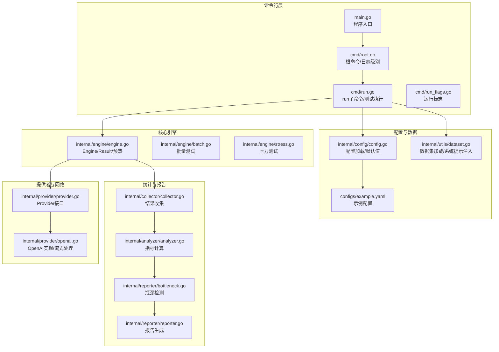
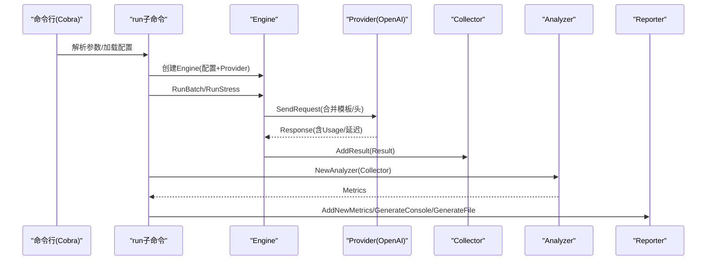
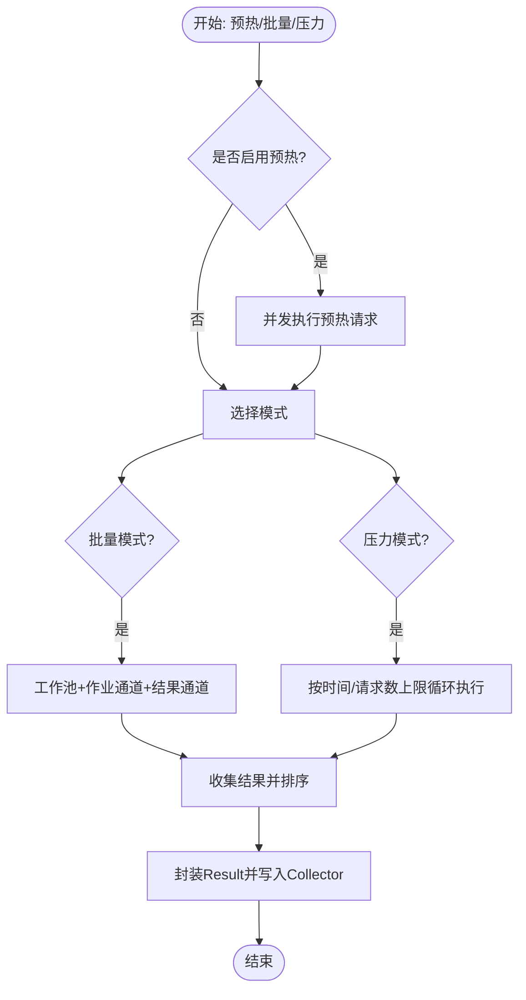
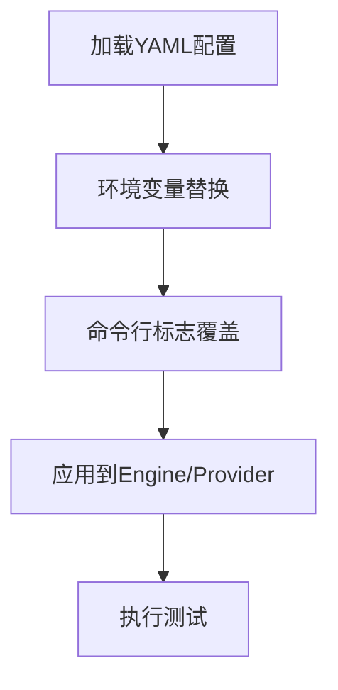
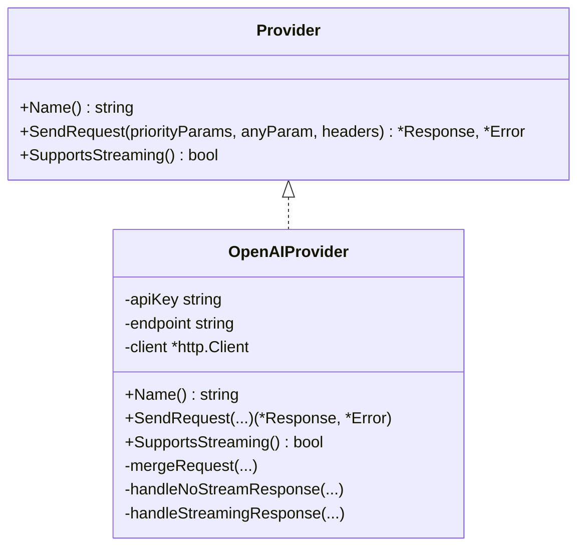
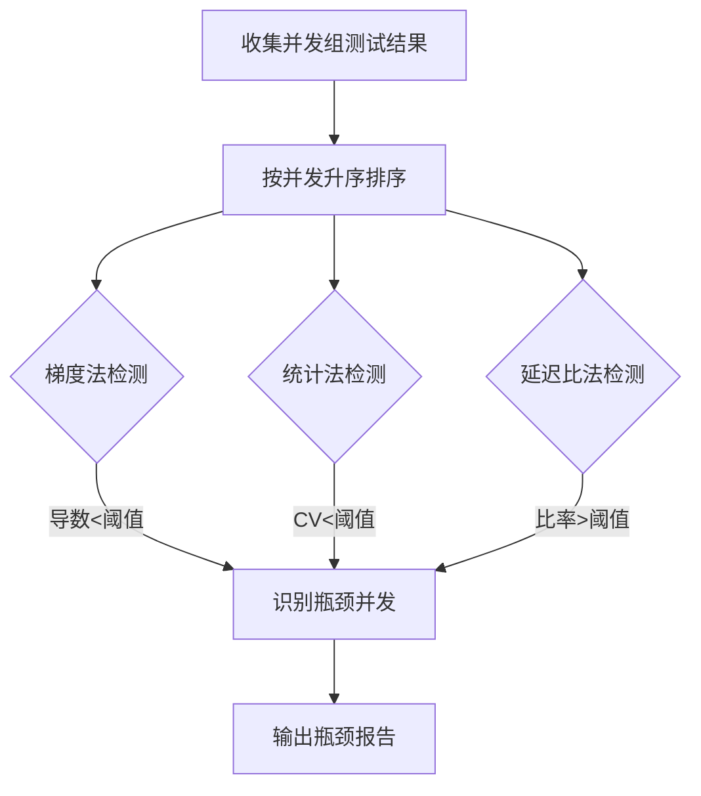
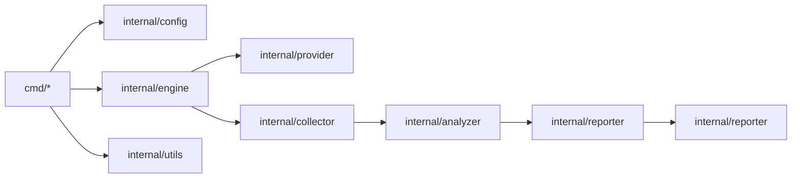

# 性能调优指南

<cite>
**本文档引用的文件**
- [main.go](file://main.go)
- [root.go](file://cmd/root.go)
- [run.go](file://cmd/run.go)
- [run_flags.go](file://cmd/run_flags.go)
- [engine.go](file://internal/engine/engine.go)
- [batch.go](file://internal/engine/batch.go)
- [stress.go](file://internal/engine/stress.go)
- [config.go](file://internal/config/config.go)
- [openai.go](file://internal/provider/openai.go)
- [provider.go](file://internal/provider/provider.go)
- [collector.go](file://internal/collector/collector.go)
- [analyzer.go](file://internal/analyzer/analyzer.go)
- [bottleneck.go](file://internal/reporter/bottleneck.go)
- [reporter.go](file://internal/reporter/reporter.go)
- [dataset.go](file://internal/utils/dataset.go)
- [example.yaml](file://configs/example.yaml)
- [README.md](file://README.md)
</cite>

## 目录
1. [简介](#简介)
2. [项目结构](#项目结构)
3. [核心组件](#核心组件)
4. [架构总览](#架构总览)
5. [详细组件分析](#详细组件分析)
6. [依赖关系分析](#依赖关系分析)
7. [性能考虑因素](#性能考虑因素)
8. [故障排查指南](#故障排查指南)
9. [结论](#结论)
10. [附录](#附录)

## 简介
本指南面向使用 GoLLMPerf 进行大语言模型（LLM）性能测试与调优的工程师，系统性阐述如何在硬件资源、网络连接、并发参数与内存使用等维度进行优化，并提供瓶颈识别方法、基准测试与对比分析流程以及持续优化实践路径。文档基于仓库现有实现进行深入解析，帮助读者快速定位性能瓶颈并制定针对性优化策略。

## 项目结构
GoLLMPerf 采用模块化分层设计：命令行入口负责参数解析与执行调度；引擎模块负责批量与压力测试的并发控制与结果收集；配置模块管理测试参数与环境变量替换；提供者模块抽象不同 LLM 提供商的请求发送逻辑；分析器与报告模块负责指标计算与输出。

**图表来源**
- [main.go:1-26](file://main.go#L1-L26)
- [root.go:1-28](file://cmd/root.go#L1-L28)
- [run.go:1-123](file://cmd/run.go#L1-L123)
- [engine.go:1-112](file://internal/engine/engine.go#L1-L112)
- [batch.go:1-65](file://internal/engine/batch.go#L1-L65)
- [stress.go:1-79](file://internal/engine/stress.go#L1-L79)
- [config.go:1-229](file://internal/config/config.go#L1-L229)
- [openai.go:1-253](file://internal/provider/openai.go#L1-L253)
- [provider.go:1-72](file://internal/provider/provider.go#L1-L72)
- [collector.go:1-97](file://internal/collector/collector.go#L1-L97)
- [analyzer.go:1-198](file://internal/analyzer/analyzer.go#L1-L198)
- [bottleneck.go:1-355](file://internal/reporter/bottleneck.go#L1-L355)
- [reporter.go:1-130](file://internal/reporter/reporter.go#L1-L130)
- [dataset.go:1-126](file://internal/utils/dataset.go#L1-L126)
- [example.yaml:1-78](file://configs/example.yaml#L1-L78)

**章节来源**
- [README.md:92-109](file://README.md#L92-L109)
- [root.go:10-27](file://cmd/root.go#L10-L27)
- [run.go:16-95](file://cmd/run.go#L16-L95)
- [engine.go:13-47](file://internal/engine/engine.go#L13-L47)
- [config.go:14-75](file://internal/config/config.go#L14-L75)

## 核心组件
- 命令行与执行调度：通过 Cobra 构建 run 子命令，支持批处理、压力测试与性能模式（多并发组），并可覆盖配置项。
- 引擎与并发：Engine 负责预热、请求执行与结果封装；批量与压力模式分别采用工作池与通道模型，保证高并发下的稳定性。
- 配置管理：Viper+YAML 支持默认配置生成、环境变量替换与命令行覆盖。
- 提供者抽象：统一 Provider 接口，OpenAI 实现支持流式与非流式响应，内置超时与重定向限制。
- 数据采集与分析：Collector 汇总结果，Analyzer 计算成功率、QPS、延迟分位数、首 token 延迟与 TPS 等指标。
- 瓶颈检测：提供基于梯度、统计波动与延迟增长比的多种算法，自动识别并发瓶颈点。
- 报告输出：支持控制台、JSON、CSV、HTML 多格式输出，便于对比分析与归档。

**章节来源**
- [run.go:22-77](file://cmd/run.go#L22-L77)
- [engine.go:49-111](file://internal/engine/engine.go#L49-L111)
- [batch.go:12-64](file://internal/engine/batch.go#L12-L64)
- [stress.go:15-78](file://internal/engine/stress.go#L15-L78)
- [config.go:136-229](file://internal/config/config.go#L136-L229)
- [provider.go:10-72](file://internal/provider/provider.go#L10-L72)
- [openai.go:84-144](file://internal/provider/openai.go#L84-L144)
- [collector.go:9-97](file://internal/collector/collector.go#L9-L97)
- [analyzer.go:43-198](file://internal/analyzer/analyzer.go#L43-L198)
- [bottleneck.go:8-355](file://internal/reporter/bottleneck.go#L8-L355)
- [reporter.go:25-130](file://internal/reporter/reporter.go#L25-L130)

## 架构总览
下图展示从命令行到测试执行、指标计算与报告输出的完整链路，以及与提供者的交互关系。

**图表来源**
- [run.go:98-122](file://cmd/run.go#L98-L122)
- [engine.go:88-111](file://internal/engine/engine.go#L88-L111)
- [openai.go:84-144](file://internal/provider/openai.go#L84-L144)
- [collector.go:14-22](file://internal/collector/collector.go#L14-L22)
- [analyzer.go:89-198](file://internal/analyzer/analyzer.go#L89-L198)
- [reporter.go:38-83](file://internal/reporter/reporter.go#L38-L83)

## 详细组件分析

### 引擎与并发控制
- 预热阶段：按并发数启动多个 goroutine，循环执行数据集中的请求，失败即记录首个错误并终止该 worker，确保冷启动影响被消除。
- 批量测试：使用带索引的通道收集结果，避免乱序；工作协程从作业通道消费请求，完成后写回结果通道，最终按原始顺序组装。
- 压力测试：支持按持续时间或每并发请求数上限两种停止条件；每个 worker 以轮询方式取样数据集，小休眠防止过载。
- 结果封装：Result 包含请求/响应 token 数、端到端与首 token 延迟、成功标记与错误信息，便于后续分析。

**图表来源**
- [engine.go:49-111](file://internal/engine/engine.go#L49-L111)
- [batch.go:12-64](file://internal/engine/batch.go#L12-L64)
- [stress.go:15-78](file://internal/engine/stress.go#L15-L78)

**章节来源**
- [engine.go:49-111](file://internal/engine/engine.go#L49-L111)
- [batch.go:12-64](file://internal/engine/batch.go#L12-L64)
- [stress.go:15-78](file://internal/engine/stress.go#L15-L78)

### 配置与参数调优
- 默认配置：包含测试时长、预热时长、并发数、每并发请求数、超时、性能并发组等；模型参数模板默认开启流式与包含用量统计。
- 环境变量替换：支持对模型名、API Key、端点进行环境变量占位符替换，便于在不同环境间切换。
- 命令行覆盖：run 子命令提供丰富标志位，可直接覆盖配置文件字段，便于快速实验。

**图表来源**
- [config.go:136-229](file://internal/config/config.go#L136-L229)
- [run_flags.go:9-25](file://cmd/run_flags.go#L9-L25)
- [run.go:190-216](file://cmd/run.go#L190-L216)

**章节来源**
- [config.go:14-75](file://internal/config/config.go#L14-L75)
- [config.go:136-229](file://internal/config/config.go#L136-L229)
- [run_flags.go:9-25](file://cmd/run_flags.go#L9-L25)
- [run.go:80-95](file://cmd/run.go#L80-L95)

### 提供者与网络优化
- OpenAI 实现：支持流式与非流式响应；流式场景下逐块解析 SSE，记录首 token 延迟；非流式直接解析响应体并计算端到端延迟。
- 超时与重定向：设置 HTTP 客户端超时与最多三次重定向限制，避免长时间阻塞。
- 请求合并：优先参数与附加参数合并，流式开关动态判断，便于统一模板与灵活覆盖。

**图表来源**
- [provider.go:10-72](file://internal/provider/provider.go#L10-L72)
- [openai.go:21-48](file://internal/provider/openai.go#L21-L48)
- [openai.go:84-144](file://internal/provider/openai.go#L84-L144)
- [openai.go:169-247](file://internal/provider/openai.go#L169-L247)

**章节来源**
- [openai.go:28-48](file://internal/provider/openai.go#L28-L48)
- [openai.go:84-144](file://internal/provider/openai.go#L84-L144)
- [openai.go:169-247](file://internal/provider/openai.go#L169-L247)

### 指标计算与瓶颈检测
- 指标体系：包含总请求数、成功/失败数、成功率、错误率、总时长、平均/分位延迟、QPS、TPS、首 token 平均与分位延迟、错误类型分布。
- 瓶颈检测：提供三种算法
  - 梯度法：监控 QPS 对并发的导数变化，低于阈值判定为瓶颈。
  - 统计法：滑动窗口内系数变异小于阈值视为不稳定，进入瓶颈区间。
  - 延迟比法：并发增长导致延迟增长比率超过阈值，判定为瓶颈。
- 自动识别：在性能模式下遍历并发组，Reporter 收集各并发下的指标，自动输出瓶颈结果。

**图表来源**
- [bottleneck.go:51-124](file://internal/reporter/bottleneck.go#L51-L124)
- [bottleneck.go:167-241](file://internal/reporter/bottleneck.go#L167-L241)
- [bottleneck.go:243-348](file://internal/reporter/bottleneck.go#L243-L348)
- [analyzer.go:89-198](file://internal/analyzer/analyzer.go#L89-L198)

**章节来源**
- [analyzer.go:43-198](file://internal/analyzer/analyzer.go#L43-L198)
- [bottleneck.go:8-355](file://internal/reporter/bottleneck.go#L8-L355)

### 报告与可视化
- 控制台报告：实时打印关键指标，便于快速审阅。
- 文件报告：支持 JSON、CSV、HTML 三类输出，便于自动化集成与二次分析。
- 并发对比：Reporter 维护并发-指标映射，便于横向比较与趋势分析。

**章节来源**
- [reporter.go:47-130](file://internal/reporter/reporter.go#L47-L130)
- [run.go:37-65](file://cmd/run.go#L37-L65)

## 依赖关系分析
- 模块耦合：命令行层仅负责编排，核心逻辑集中在引擎、配置、提供者与分析模块；耦合度低，便于扩展新提供者与测试模式。
- 外部依赖：标准库 net/http、encoding/json、bufio；第三方 Cobra/Viper/YAML；日志框架 qlog。
- 循环依赖：未发现循环导入；模块边界清晰。

**图表来源**
- [run.go:16-95](file://cmd/run.go#L16-L95)
- [engine.go:1-112](file://internal/engine/engine.go#L1-L112)
- [config.go:1-229](file://internal/config/config.go#L1-L229)
- [provider.go:1-72](file://internal/provider/provider.go#L1-L72)
- [collector.go:1-97](file://internal/collector/collector.go#L1-L97)
- [analyzer.go:1-198](file://internal/analyzer/analyzer.go#L1-L198)
- [bottleneck.go:1-355](file://internal/reporter/bottleneck.go#L1-L355)
- [reporter.go:1-130](file://internal/reporter/reporter.go#L1-L130)

**章节来源**
- [run.go:16-95](file://cmd/run.go#L16-L95)
- [engine.go:1-112](file://internal/engine/engine.go#L1-L112)
- [provider.go:1-72](file://internal/provider/provider.go#L1-L72)

## 性能考虑因素

### 硬件资源配置优化
- CPU/内存：批量与压力测试中 goroutine 数与通道缓冲大小直接影响内存占用与上下文切换开销。建议根据机器核数与可用内存设置合理并发上限，避免过多 goroutine 导致调度抖动。
- IO 与网络：JSONL 数据集读取使用 Scanner 并配合 sync.Pool 缓冲，减少频繁分配；网络请求超时与重定向限制有助于避免资源泄露。
- 磁盘：批量结果输出为 JSONL，建议使用高性能存储介质，避免磁盘成为瓶颈。

**章节来源**
- [dataset.go:14-30](file://internal/utils/dataset.go#L14-L30)
- [openai.go:38-47](file://internal/provider/openai.go#L38-L47)

### 网络连接优化
- 超时策略：HTTP 客户端设置超时，避免请求悬挂；结合压力测试的休眠间隔，平衡吞吐与资源占用。
- 流式响应：流式场景下按 SSE 块解析，首 token 延迟更贴近真实体验；非流式则端到端延迟即首 token 延迟。
- 重定向限制：最多三次重定向，防止代理/CDN 层级导致的额外延迟。

**章节来源**
- [openai.go:38-47](file://internal/provider/openai.go#L38-L47)
- [openai.go:169-247](file://internal/provider/openai.go#L169-L247)

### 并发参数调优
- 并发组设计：性能模式下通过配置文件的并发组逐步扩大并发，结合瓶颈检测算法自动识别拐点。
- 工作池与通道：批量模式使用带索引的结果通道，避免排序成本；压力模式使用缓冲通道与互斥锁收集结果，兼顾吞吐与一致性。
- 预热策略：启用预热可显著降低冷启动误差，提高测试稳定性。

**章节来源**
- [config.go:20-25](file://internal/config/config.go#L20-L25)
- [engine.go:49-86](file://internal/engine/engine.go#L49-L86)
- [batch.go:19-64](file://internal/engine/batch.go#L19-L64)
- [stress.go:34-78](file://internal/engine/stress.go#L34-L78)

### 内存使用优化
- 对象复用：dataset 加载使用 sync.Pool 获取/归还缓冲，减少 GC 压力。
- 结果收集：Collector 以切片存储，按需扩容；Analyzer 在成功样本上计算统计量，避免无效数据参与运算。
- 输出格式：JSON/CSV/HTML 三类输出，可根据需求选择最小化开销的格式。

**章节来源**
- [dataset.go:14-30](file://internal/utils/dataset.go#L14-L30)
- [collector.go:9-97](file://internal/collector/collector.go#L9-L97)
- [analyzer.go:89-198](file://internal/analyzer/analyzer.go#L89-L198)
- [reporter.go:103-130](file://internal/reporter/reporter.go#L103-L130)

## 故障排查指南
- 预热失败：若预热阶段出现首个错误，会立即终止该 worker 并返回错误；检查数据集、API Key、端点与网络连通性。
- 请求失败：Provider 返回错误码与错误类型，Analyzer 会统计错误类型分布；结合报告查看失败占比与错误分类。
- 延迟异常：若平均延迟或首 token 延迟异常升高，结合瓶颈检测结果定位并发拐点；必要时降低并发或优化上游服务。
- 报告生成：确认输出目录存在且有写权限；不支持的格式会报错；JSON/CSV/HTML 三类均可用于问题复现与对比。

**章节来源**
- [engine.go:49-86](file://internal/engine/engine.go#L49-L86)
- [openai.go:117-144](file://internal/provider/openai.go#L117-L144)
- [analyzer.go:184-198](file://internal/analyzer/analyzer.go#L184-L198)
- [reporter.go:103-130](file://internal/reporter/reporter.go#L103-L130)

## 结论
GoLLMPerf 通过模块化架构与完善的指标体系，为 LLM 性能测试提供了系统化的工具链。结合本文档的硬件、网络、并发与内存优化策略，以及瓶颈识别与持续优化方法，用户可在不同场景下稳定地评估与提升 LLM API 的性能表现。

## 附录

### 基准测试与对比分析实践
- 设计对比维度：并发组、请求模板（流式/非流式）、系统提示注入、超时与重试策略。
- 重复性保障：固定数据集与参数，多次运行取均值与方差；使用 JSON/CSV 保存中间结果以便复盘。
- 可视化：HTML 报告便于展示趋势与差异；结合瓶颈检测结果标注拐点。

**章节来源**
- [example.yaml:14-21](file://configs/example.yaml#L14-L21)
- [bottleneck.go:350-355](file://internal/reporter/bottleneck.go#L350-L355)
- [reporter.go:103-130](file://internal/reporter/reporter.go#L103-L130)