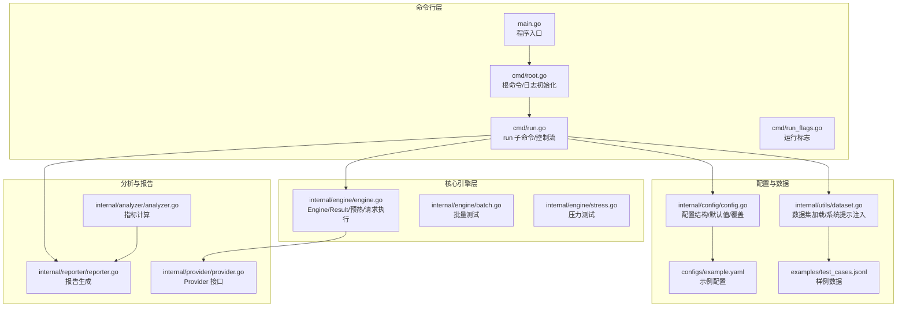
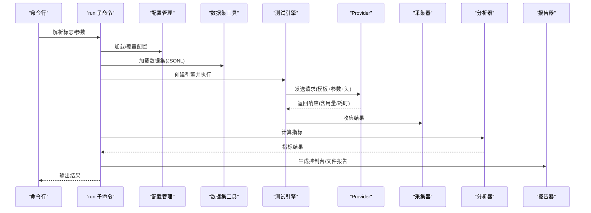
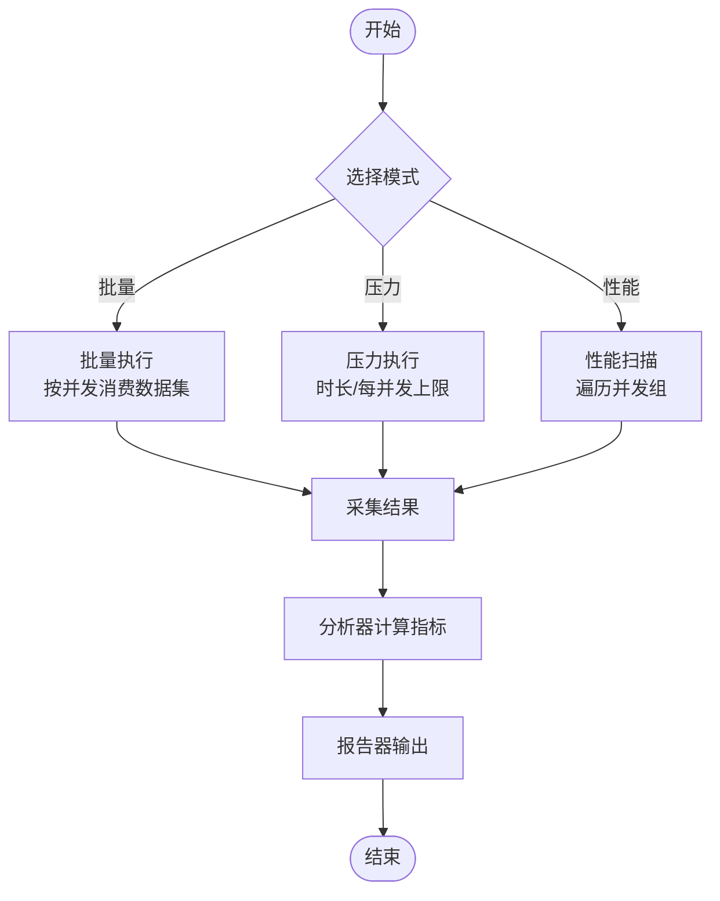
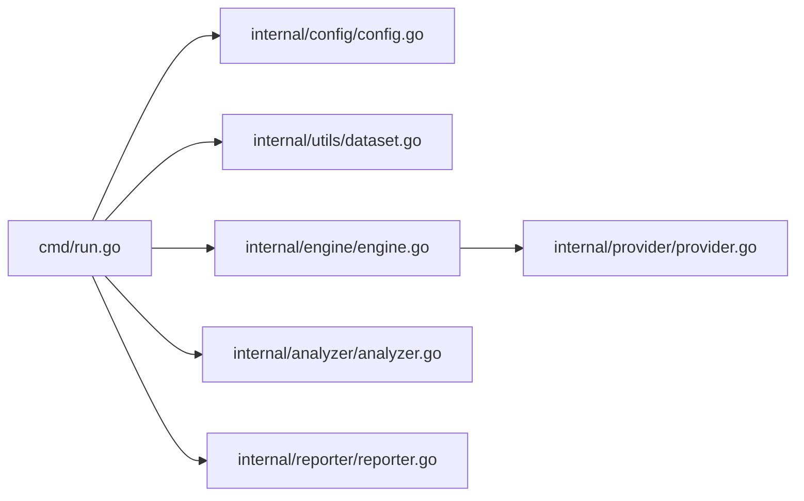

# 测试场景设计

<cite>
**本文引用的文件**
- [main.go](file://main.go)
- [root.go](file://cmd/root.go)
- [run.go](file://cmd/run.go)
- [run_flags.go](file://cmd/run_flags.go)
- [engine.go](file://internal/engine/engine.go)
- [batch.go](file://internal/engine/batch.go)
- [stress.go](file://internal/engine/stress.go)
- [config.go](file://internal/config/config.go)
- [example.yaml](file://configs/example.yaml)
- [provider.go](file://internal/provider/provider.go)
- [dataset.go](file://internal/utils/dataset.go)
- [analyzer.go](file://internal/analyzer/analyzer.go)
- [reporter.go](file://internal/reporter/reporter.go)
- [test_cases.jsonl](file://examples/test_cases.jsonl)
- [README.md](file://README.md)
</cite>

## 目录
1. [简介](#简介)
2. [项目结构](#项目结构)
3. [核心组件](#核心组件)
4. [架构总览](#架构总览)
5. [详细组件分析](#详细组件分析)
6. [依赖分析](#依赖分析)
7. [性能考虑](#性能考虑)
8. [故障排查指南](#故障排查指南)
9. [结论](#结论)
10. [附录](#附录)

## 简介
本指南面向使用 GoLLMPerf 进行 LLM 性能测试的工程团队，系统化阐述“测试场景设计”的最佳实践：如何依据不同测试目标（稳定性、吞吐、延迟、质量）设计合适的并发级别、负载模式与测试时长；如何为 API 服务、模型推理、批处理任务等典型场景制定可落地的测试方案；以及测试数据准备、参数调优与结果验证的完整流程。文档以仓库现有模块与配置为依据，结合命令行入口、测试引擎、配置管理、分析器与报告器的协作关系，给出可操作的设计建议。

## 项目结构
GoLLMPerf 采用分层清晰的模块化架构：命令行入口负责参数解析与子命令调度；内部模块按职责拆分为引擎（执行）、采集（收集）、分析（统计）、报告（输出）、配置（参数）、提供者（对接 LLM）、工具（数据集加载）等。整体结构如下：

图示来源
- [main.go:1-26](file://main.go#L1-L26)
- [root.go:10-27](file://cmd/root.go#L10-L27)
- [run.go:16-95](file://cmd/run.go#L16-L95)
- [engine.go:14-47](file://internal/engine/engine.go#L14-L47)
- [batch.go:12-65](file://internal/engine/batch.go#L12-L65)
- [stress.go:15-79](file://internal/engine/stress.go#L15-L79)
- [config.go:82-134](file://internal/config/config.go#L82-L134)
- [example.yaml:4-77](file://configs/example.yaml#L4-L77)
- [dataset.go:62-126](file://internal/utils/dataset.go#L62-L126)
- [analyzer.go:77-198](file://internal/analyzer/analyzer.go#L77-L198)
- [reporter.go:25-130](file://internal/reporter/reporter.go#L25-L130)
- [provider.go:10-72](file://internal/provider/provider.go#L10-L72)

章节来源
- [README.md:92-109](file://README.md#L92-L109)
- [main.go:20-25](file://main.go#L20-L25)
- [root.go:10-27](file://cmd/root.go#L10-L27)
- [run.go:16-95](file://cmd/run.go#L16-L95)

## 核心组件
- 命令行入口与根命令：初始化日志、注册根命令与持久标志（如日志级别），并交由 Cobra 执行。
- run 子命令：解析运行标志、构建测试上下文、创建报告器、按模式执行测试、收集与分析结果、生成报告与批量结果。
- 引擎 Engine：封装并发执行、预热、单次请求执行、结果聚合；支持批量与压力两种模式。
- 配置管理：提供默认配置生成、YAML 加载、环境变量替换、命令行覆盖。
- 数据集工具：从 JSONL 文件加载请求样本，支持在消息序列前注入系统提示。
- 分析器：基于采集结果计算成功率、QPS、延迟（均值/P50/P90/P99）、令牌速率、首 token 延迟等，并进行错误类型统计。
- 报告器：支持控制台、JSON、CSV、HTML 多格式输出，支持并发对比视图。
- 提供者接口：抽象不同 LLM 提供商的统一调用方式，便于扩展。

章节来源
- [root.go:10-27](file://cmd/root.go#L10-L27)
- [run.go:16-95](file://cmd/run.go#L16-L95)
- [engine.go:14-47](file://internal/engine/engine.go#L14-L47)
- [config.go:131-229](file://internal/config/config.go#L131-L229)
- [dataset.go:62-126](file://internal/utils/dataset.go#L62-L126)
- [analyzer.go:77-198](file://internal/analyzer/analyzer.go#L77-L198)
- [reporter.go:25-130](file://internal/reporter/reporter.go#L25-L130)
- [provider.go:10-72](file://internal/provider/provider.go#L10-L72)

## 架构总览
下图展示一次完整测试的端到端流程：命令行解析 → 配置加载与覆盖 → 数据集加载 → 引擎执行（批量/压力/性能）→ 结果采集 → 统计分析 → 报告输出。

图示来源
- [run.go:22-77](file://cmd/run.go#L22-L77)
- [engine.go:88-112](file://internal/engine/engine.go#L88-L112)
- [provider.go:15-20](file://internal/provider/provider.go#L15-L20)
- [analyzer.go:89-198](file://internal/analyzer/analyzer.go#L89-L198)
- [reporter.go:103-130](file://internal/reporter/reporter.go#L103-L130)

## 详细组件分析

### 测试模式与控制流
- 批量测试（--batch）：按并发度逐个发送数据集中的请求，保证顺序与完整性，适合离线评估与回归验证。
- 压力测试（默认）：在指定时长或每并发请求数限制内持续施压，适合发现系统瓶颈与稳定性边界。
- 性能测试（--perf）：遍历配置中的并发组，自动对比不同并发下的指标，定位性能拐点与最优并发。

图示来源
- [run.go:67-77](file://cmd/run.go#L67-L77)
- [batch.go:12-65](file://internal/engine/batch.go#L12-L65)
- [stress.go:15-79](file://internal/engine/stress.go#L15-L79)
- [analyzer.go:89-198](file://internal/analyzer/analyzer.go#L89-L198)
- [reporter.go:103-130](file://internal/reporter/reporter.go#L103-L130)

章节来源
- [run.go:16-95](file://cmd/run.go#L16-L95)
- [README.md:111-134](file://README.md#L111-L134)

### 并发级别设置策略
- 初步范围：参考示例配置中的并发组，从低到高逐步扩大，观察指标变化趋势。
- 观察指标：QPS、延迟 P90/P99、失败率、首 token 延迟。当 P99 显著上升或失败率升高时，即为拐点。
- 调整原则：
  - 稳定性优先：先在较低并发下验证系统稳定，再逐步提升。
  - 资源约束：结合 CPU/内存/GPU 资源占用与网络带宽，避免过载。
  - 场景适配：推理类任务可适当提高并发；批处理更关注吞吐与资源利用率。

章节来源
- [example.yaml:14-18](file://configs/example.yaml#L14-L18)
- [config.go:25](file://internal/config/config.go#L25)

### 负载模式选择原则
- API 服务（高并发短请求）：优先压力测试，设定较短时长与较小并发步进，重点观察 P90/P99 与错误率。
- 模型推理（长请求/大上下文）：可采用性能测试，扩大并发组跨度，关注 TPS 与首 token 延迟。
- 批处理任务（离线/后台）：使用批量测试，确保全量执行与结果可回放，关注吞吐与资源占用。

章节来源
- [README.md:34-41](file://README.md#L34-L41)
- [stress.go:38-41](file://internal/engine/stress.go#L38-L41)

### 测试时长规划方法
- 基于稳定性：至少覆盖 2~3 个完整“抖动周期”，以排除瞬时干扰。
- 基于收敛：观察指标在一段时间内的波动幅度，当 P50/P90/P99 稳定后可提前结束。
- 基于预算：结合并发与资源成本，设定最大时长上限，避免长时间空跑。

章节来源
- [stress.go:38-41](file://internal/engine/stress.go#L38-L41)
- [example.yaml:6](file://configs/example.yaml#L6)

### 应用场景测试方案设计

#### 场景一：API 服务稳定性与延迟
- 目标：识别系统在峰值并发下的 P99 延迟与失败率阈值。
- 方案：
  - 使用压力测试，时长中等，起始并发 10，步进 10~20，观察 P99 延迟与错误率。
  - 若存在限流/熔断，需降低并发步进，延长时长以捕捉异常。
- 关键指标：QPS、P90/P99 延迟、失败率、首 token 延迟。

章节来源
- [stress.go:15-79](file://internal/engine/stress.go#L15-L79)
- [analyzer.go:116-182](file://internal/analyzer/analyzer.go#L116-L182)

#### 场景二：模型推理性能与吞吐
- 目标：寻找最大 TPS 与稳定并发区间。
- 方案：
  - 使用性能测试，遍历并发组，记录各并发下的 QPS、TPS、P99 延迟。
  - 对比不同模型/端点，评估硬件与参数对性能的影响。
- 关键指标：TPS、P90/P99 延迟、平均首 token 延迟。

章节来源
- [run.go:69-76](file://cmd/run.go#L69-L76)
- [analyzer.go:159-181](file://internal/analyzer/analyzer.go#L159-L181)

#### 场景三：批处理任务离线评估
- 目标：验证全量数据处理的吞吐与一致性。
- 方案：
  - 使用批量测试，设置合理并发，确保所有样本均被执行且结果可回放。
  - 保存批量结果至 JSONL 文件，便于后续审计与重放。
- 关键指标：总耗时、QPS、成功/失败数、令牌用量。

章节来源
- [batch.go:12-65](file://internal/engine/batch.go#L12-L65)
- [run.go:56-64](file://cmd/run.go#L56-L64)

### 测试数据准备
- 数据格式：JSONL，每行一条请求样本，字段包含对话历史与推理参数（温度、最大 token 数等）。
- 系统提示：可通过配置启用并在消息数组开头注入系统提示，便于标准化提示词。
- 数据集路径：通过配置或命令行覆盖，支持多轮对话与多样化输入。

章节来源
- [dataset.go:62-126](file://internal/utils/dataset.go#L62-L126)
- [test_cases.jsonl:1-6](file://examples/test_cases.jsonl#L1-L6)
- [example.yaml:59-66](file://configs/example.yaml#L59-L66)

### 参数调优与配置覆盖
- 默认配置：包含测试时长、预热时长、并发、每并发请求数、超时、并发组等。
- 环境变量：模型名、端点、密钥支持通过环境变量注入。
- 命令行覆盖：运行时标志可覆盖配置文件中的对应字段，便于快速迭代。

章节来源
- [config.go:14-75](file://internal/config/config.go#L14-L75)
- [config.go:136-188](file://internal/config/config.go#L136-L188)
- [config.go:190-229](file://internal/config/config.go#L190-L229)
- [run_flags.go:9-24](file://cmd/run_flags.go#L9-L24)

### 结果验证与报告
- 控制台报告：实时输出关键指标，便于快速判断。
- 文件报告：支持 JSON、CSV、HTML 三种格式，便于归档与可视化。
- 并发对比：性能模式下可对比不同并发下的指标，辅助决策。

章节来源
- [reporter.go:47-130](file://internal/reporter/reporter.go#L47-L130)
- [analyzer.go:89-198](file://internal/analyzer/analyzer.go#L89-L198)

## 依赖分析
- 模块耦合：
  - run 子命令依赖配置、数据集、引擎、分析器与报告器，形成主控制流。
  - 引擎依赖提供者接口，解耦具体提供商实现。
  - 分析器与报告器独立于引擎，便于扩展新的统计维度与输出格式。
- 外部依赖：
  - Cobra（命令行框架）、Viper/YAML（配置管理）、标准库（HTTP、时间、JSON）。

图示来源
- [run.go:16-95](file://cmd/run.go#L16-L95)
- [engine.go:14-47](file://internal/engine/engine.go#L14-L47)
- [provider.go:10-72](file://internal/provider/provider.go#L10-L72)
- [analyzer.go:77-198](file://internal/analyzer/analyzer.go#L77-L198)
- [reporter.go:25-130](file://internal/reporter/reporter.go#L25-L130)

## 性能考虑
- 并发与通道缓冲：压力测试使用有缓冲的结果通道，避免阻塞；批量测试按索引有序回填，减少乱序影响。
- 预热阶段：通过一次性预热减少冷启动与缓存影响，提升测试稳定性。
- 时间精度：微秒级计时，分离网络与处理耗时，降低 GC 干扰。
- 资源池：JSONL 读取使用缓冲池，降低内存分配开销。

章节来源
- [stress.go:34](file://internal/engine/stress.go#L34)
- [batch.go:17-20](file://internal/engine/batch.go#L17-L20)
- [engine.go:49-86](file://internal/engine/engine.go#L49-L86)
- [dataset.go:14-29](file://internal/utils/dataset.go#L14-L29)

## 故障排查指南
- 常见问题与定位：
  - 请求失败率高：检查提供者凭据、端点可达性、模型名与参数模板是否正确。
  - 延迟异常偏高：确认是否存在预热不足、并发过高导致的排队与限流。
  - 报告生成失败：检查输出路径权限与格式支持。
- 日志与诊断：
  - 通过日志级别调整（--loglevel）与控制台报告，定位异常。
  - 使用批量结果 JSONL 回放与对比，辅助问题复现。

章节来源
- [root.go:17-27](file://cmd/root.go#L17-L27)
- [reporter.go:103-130](file://internal/reporter/reporter.go#L103-L130)
- [analyzer.go:184-195](file://internal/analyzer/analyzer.go#L184-L195)

## 结论
通过将测试目标、并发策略、负载模式与时长规划有机结合，并配合规范的数据准备、参数覆盖与结果验证流程，GoLLMPerf 能够为 API 服务、模型推理与批处理任务提供系统化的性能评估能力。建议在实际工程中以“小步快跑”的方式迭代并发组与时长，结合多指标综合判断，逐步逼近系统真实性能边界。

## 附录

### A. 测试场景设计清单
- 明确目标：稳定性/延迟/吞吐/质量
- 设定并发组：从低到高，观察拐点
- 选择模式：压力/性能/批量
- 规划时长：覆盖抖动周期，关注收敛
- 准备数据：JSONL 格式，必要时注入系统提示
- 调参覆盖：命令行覆盖配置字段
- 验证结果：控制台与文件报告双轨校验

### B. 关键配置要点
- 测试时长、预热时长、并发、每并发请求数、超时、并发组
- 模型名、提供者、端点、密钥、请求头与参数模板
- 数据集类型与路径、输出格式与路径

章节来源
- [example.yaml:4-77](file://configs/example.yaml#L4-L77)
- [config.go:136-229](file://internal/config/config.go#L136-L229)