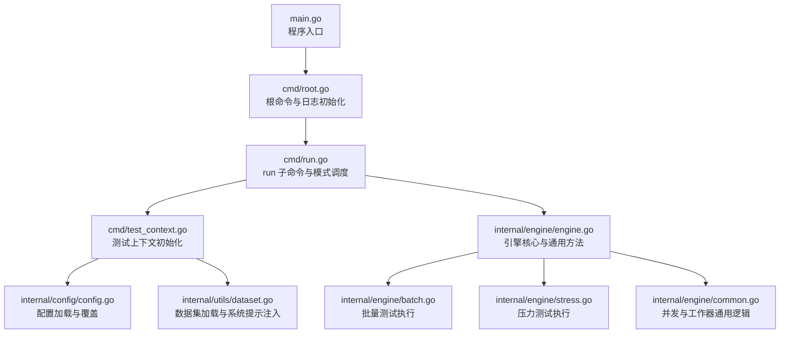
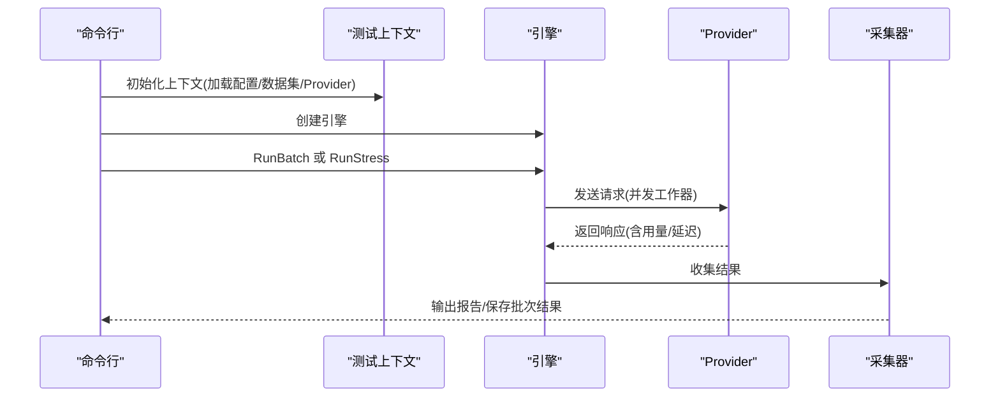
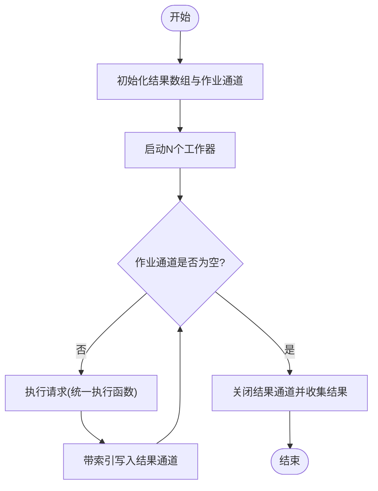
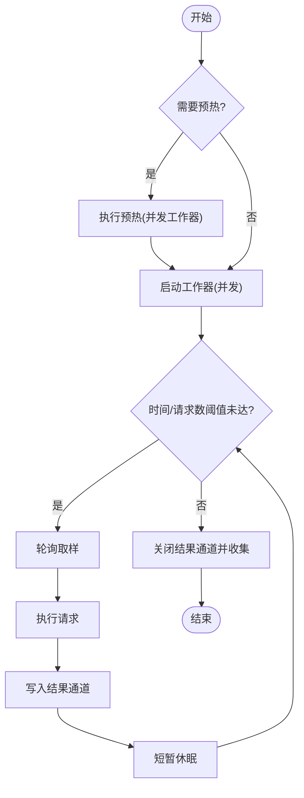
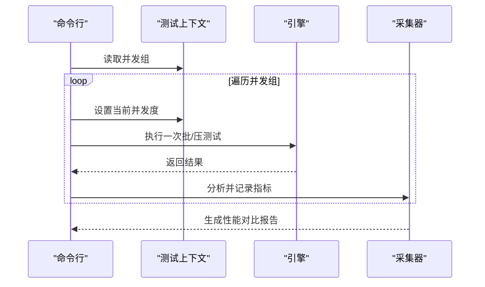
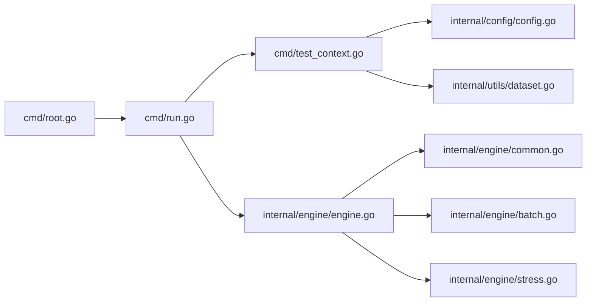

# 测试模式详解

<cite>
**本文引用的文件列表**
- [main.go](file://main.go)
- [cmd/root.go](file://cmd/root.go)
- [cmd/run.go](file://cmd/run.go)
- [cmd/test_context.go](file://cmd/test_context.go)
- [cmd/run_flags.go](file://cmd/run_flags.go)
- [internal/engine/engine.go](file://internal/engine/engine.go)
- [internal/engine/batch.go](file://internal/engine/batch.go)
- [internal/engine/stress.go](file://internal/engine/stress.go)
- [internal/engine/common.go](file://internal/engine/common.go)
- [internal/config/config.go](file://internal/config/config.go)
- [configs/example.yaml](file://configs/example.yaml)
- [internal/utils/dataset.go](file://internal/utils/dataset.go)
- [README.md](file://README.md)
</cite>

## 目录
1. [简介](#简介)
2. [项目结构](#项目结构)
3. [核心组件](#核心组件)
4. [架构总览](#架构总览)
5. [详细组件分析](#详细组件分析)
6. [依赖关系分析](#依赖关系分析)
7. [性能考量](#性能考量)
8. [故障排查指南](#故障排查指南)
9. [结论](#结论)
10. [附录](#附录)

## 简介
本文件面向 GoLLMPerf 的使用者与维护者，系统性阐述四种测试模式：批量测试（Batch）、压力测试（Stress）、性能测试（Perf）与稳定性测试（Stability）。文档从设计原理、适用场景、选择标准、工作机制（并发控制、负载生成、执行流程）、参数配置建议与注意事项等方面进行深入解析，并结合源码路径给出可追溯的参考位置，帮助用户在不同测试目标下做出正确决策。

## 项目结构
GoLLMPerf 采用模块化分层设计：
- 命令行入口与命令定义位于 cmd 目录，负责参数解析、上下文初始化与模式调度
- 核心引擎位于 internal/engine，封装并发执行、请求发送、结果收集与统计
- 配置管理位于 internal/config，支持 YAML 加载与环境变量替换
- 数据集加载位于 internal/utils，支持 JSONL 数据集与系统提示注入
- 报告与分析位于 internal/reporter 与 internal/analyzer，输出多格式报告

图表来源
- [main.go:1-26](file://main.go#L1-L26)
- [cmd/root.go:10-27](file://cmd/root.go#L10-L27)
- [cmd/run.go:16-95](file://cmd/run.go#L16-L95)
- [cmd/test_context.go:21-81](file://cmd/test_context.go#L21-L81)
- [internal/config/config.go:136-188](file://internal/config/config.go#L136-L188)
- [internal/utils/dataset.go:62-80](file://internal/utils/dataset.go#L62-L80)
- [internal/engine/engine.go:13-47](file://internal/engine/engine.go#L13-L47)
- [internal/engine/batch.go:12-64](file://internal/engine/batch.go#L12-L64)
- [internal/engine/stress.go:15-78](file://internal/engine/stress.go#L15-L78)
- [internal/engine/common.go:28-50](file://internal/engine/common.go#L28-L50)

章节来源
- [main.go:1-26](file://main.go#L1-L26)
- [cmd/root.go:10-27](file://cmd/root.go#L10-L27)
- [cmd/run.go:16-95](file://cmd/run.go#L16-L95)
- [cmd/test_context.go:21-81](file://cmd/test_context.go#L21-L81)
- [internal/config/config.go:136-188](file://internal/config/config.go#L136-L188)
- [internal/utils/dataset.go:62-80](file://internal/utils/dataset.go#L62-L80)
- [internal/engine/engine.go:13-47](file://internal/engine/engine.go#L13-L47)
- [internal/engine/batch.go:12-64](file://internal/engine/batch.go#L12-L64)
- [internal/engine/stress.go:15-78](file://internal/engine/stress.go#L15-L78)
- [internal/engine/common.go:28-50](file://internal/engine/common.go#L28-L50)

## 核心组件
- 命令行与上下文
  - run 子命令解析模式标志位（批量、性能），并按模式调度执行
  - 初始化测试上下文：加载配置、覆盖参数、加载数据集、创建 Provider
- 引擎与并发
  - 统一的请求执行与结果封装
  - 并发工作器启动、结果通道收集、预热阶段
- 配置与数据
  - YAML 配置加载、环境变量替换、并发组与超时等关键参数
  - JSONL 数据集加载与系统提示注入

章节来源
- [cmd/run.go:16-95](file://cmd/run.go#L16-L95)
- [cmd/test_context.go:21-81](file://cmd/test_context.go#L21-L81)
- [internal/engine/engine.go:13-47](file://internal/engine/engine.go#L13-L47)
- [internal/engine/common.go:28-50](file://internal/engine/common.go#L28-L50)
- [internal/config/config.go:136-188](file://internal/config/config.go#L136-L188)
- [internal/utils/dataset.go:62-80](file://internal/utils/dataset.go#L62-L80)

## 架构总览
四种测试模式共享同一引擎与通用并发框架，差异在于：
- 批量测试：按数据集顺序并发执行，保证每个样本被完整处理一次
- 压力测试：在给定时间或请求数限制内持续施压，观察系统极限
- 性能测试：遍历并发组，逐级评估吞吐与延迟表现
- 稳定性测试：长时间运行以验证系统鲁棒性（通常通过压力测试的长时配置实现）

图表来源
- [cmd/run.go:97-122](file://cmd/run.go#L97-L122)
- [internal/engine/engine.go:88-111](file://internal/engine/engine.go#L88-L111)
- [internal/engine/batch.go:12-64](file://internal/engine/batch.go#L12-L64)
- [internal/engine/stress.go:15-78](file://internal/engine/stress.go#L15-L78)

## 详细组件分析

### 批量测试（Batch）
- 设计原理
  - 面向“全量覆盖”的测试目标，确保数据集中每个样本均被执行一次
  - 通过固定并发度与有序结果通道，保证结果顺序与输入一一对应
- 并发控制策略
  - 使用固定并发数启动工作器，每个工作器从作业队列取样执行
  - 结果通过带索引的通道回传，最终按原始索引写入结果数组
- 负载生成方式
  - 将数据集长度作为作业总数，每个样本对应一个作业
  - 工作器从作业通道取出样本后直接调用统一请求执行函数
- 执行流程
  1) 初始化结果切片与作业通道
  2) 启动工作器 goroutine 并行消费作业
  3) 通过带索引的结果通道收集并按序写入
  4) 返回完整结果集
- 适用场景
  - 需要对数据集进行一次性全量评估
  - 对结果顺序有要求的回归测试
- 参数要点
  - 并发度由配置决定；若为 0 则默认为 1
  - 可选输出批次结果到 JSONL 文件

图表来源
- [internal/engine/batch.go:12-64](file://internal/engine/batch.go#L12-L64)
- [internal/engine/common.go:28-50](file://internal/engine/common.go#L28-L50)
- [internal/engine/engine.go:88-111](file://internal/engine/engine.go#L88-L111)

章节来源
- [internal/engine/batch.go:12-64](file://internal/engine/batch.go#L12-L64)
- [internal/engine/common.go:28-50](file://internal/engine/common.go#L28-L50)
- [internal/engine/engine.go:88-111](file://internal/engine/engine.go#L88-L111)

### 压力测试（Stress）
- 设计原理
  - 在限定时间内或达到指定请求数后停止，用于发现系统在持续高负载下的极限与退化点
  - 支持预热阶段，减少冷启动影响
- 并发控制策略
  - 固定并发度启动工作器，每个工作器在时间或请求数阈值内循环取样
  - 通过小休眠避免瞬时过载
- 负载生成方式
  - 循环从数据集轮询取样，保证样本均匀分布
  - 结果通过缓冲通道收集，必要时丢弃以避免阻塞
- 执行流程
  1) 可选预热阶段（仅首次执行）
  2) 启动工作器，按时间或请求数阈值循环执行
  3) 收集结果并返回
- 适用场景
  - 探测系统在峰值负载下的稳定性与性能拐点
  - 验证限流、熔断与降级策略的有效性
- 参数要点
  - 持续时间与每并发请求数共同决定负载强度
  - 并发度与超时需与服务端能力匹配

图表来源
- [internal/engine/stress.go:15-78](file://internal/engine/stress.go#L15-L78)
- [internal/engine/engine.go:49-86](file://internal/engine/engine.go#L49-L86)
- [internal/engine/common.go:15-26](file://internal/engine/common.go#L15-L26)

章节来源
- [internal/engine/stress.go:15-78](file://internal/engine/stress.go#L15-L78)
- [internal/engine/engine.go:49-86](file://internal/engine/engine.go#L49-L86)
- [internal/engine/common.go:15-26](file://internal/engine/common.go#L15-L26)

### 性能测试（Perf）
- 设计原理
  - 通过并发组（多个并发级别）逐步施压，定位系统的吞吐与延迟拐点，识别最优并发区间
- 并发控制策略
  - 逐级遍历并发组，每次测试独立设置并发度并执行一次完整批/压测试
- 负载生成方式
  - 与批量/压力一致，但由并发组驱动多次迭代
- 执行流程
  1) 读取并发组
  2) 逐级设置并发度并执行一次批/压测试
  3) 生成并汇总各并发级别的指标
- 适用场景
  - 定位系统在不同并发下的性能边界
  - 为容量规划与资源配额提供依据
- 参数要点
  - 并发组应覆盖从低到高的典型场景，避免步长过大导致错过拐点

图表来源
- [cmd/run.go:67-76](file://cmd/run.go#L67-L76)
- [configs/example.yaml:14-15](file://configs/example.yaml#L14-L15)
- [internal/config/config.go:96](file://internal/config/config.go#L96)

章节来源
- [cmd/run.go:67-76](file://cmd/run.go#L67-L76)
- [configs/example.yaml:14-15](file://configs/example.yaml#L14-L15)
- [internal/config/config.go:96](file://internal/config/config.go#L96)

### 稳定性测试（Stability）
- 设计原理
  - 通过长时间运行（压力测试的长时配置）观察系统在持续高负载下的稳定性
- 实现方式
  - 使用压力测试的执行路径，将测试时长设为较长值，不设置请求数上限
- 适用场景
  - 验证系统在长时间运行中的内存泄漏、连接池耗尽、错误累积等问题
- 参数要点
  - 建议开启预热，合理设置并发度与超时，避免过早触发限流或熔断

章节来源
- [internal/engine/stress.go:15-78](file://internal/engine/stress.go#L15-L78)
- [configs/example.yaml:5-6](file://configs/example.yaml#L5-L6)

## 依赖关系分析
- 命令行层依赖配置与数据工具，向上调度引擎
- 引擎层依赖 Provider 接口，向下协调并发与结果收集
- 配置层支持环境变量替换与参数覆盖，确保灵活性
- 数据工具负责数据集加载与系统提示注入

图表来源
- [cmd/root.go:10-27](file://cmd/root.go#L10-L27)
- [cmd/run.go:16-95](file://cmd/run.go#L16-L95)
- [cmd/test_context.go:21-81](file://cmd/test_context.go#L21-L81)
- [internal/config/config.go:136-188](file://internal/config/config.go#L136-L188)
- [internal/utils/dataset.go:62-80](file://internal/utils/dataset.go#L62-L80)
- [internal/engine/engine.go:13-47](file://internal/engine/engine.go#L13-L47)
- [internal/engine/common.go:28-50](file://internal/engine/common.go#L28-L50)
- [internal/engine/batch.go:12-64](file://internal/engine/batch.go#L12-L64)
- [internal/engine/stress.go:15-78](file://internal/engine/stress.go#L15-L78)

章节来源
- [cmd/root.go:10-27](file://cmd/root.go#L10-L27)
- [cmd/run.go:16-95](file://cmd/run.go#L16-L95)
- [cmd/test_context.go:21-81](file://cmd/test_context.go#L21-L81)
- [internal/config/config.go:136-188](file://internal/config/config.go#L136-L188)
- [internal/utils/dataset.go:62-80](file://internal/utils/dataset.go#L62-L80)
- [internal/engine/engine.go:13-47](file://internal/engine/engine.go#L13-L47)
- [internal/engine/common.go:28-50](file://internal/engine/common.go#L28-L50)
- [internal/engine/batch.go:12-64](file://internal/engine/batch.go#L12-L64)
- [internal/engine/stress.go:15-78](file://internal/engine/stress.go#L15-L78)

## 性能考量
- 并发度与资源
  - 并发度过高可能导致服务端限流或客户端资源耗尽，建议从较小并发起步，逐步增加
  - 注意工作器数量与 CPU/网络资源的平衡
- 预热阶段
  - 预热有助于消除冷启动与缓存影响，建议在压力测试中启用
- 结果通道与背压
  - 压力测试使用缓冲通道并具备丢弃策略，防止阻塞；批量测试使用带索引通道保证顺序
- 时间与请求数
  - 合理设置测试时长与每并发请求数，避免过短导致统计不稳或过长导致资源浪费
- 系统提示注入
  - 若启用系统提示模板，注意其对请求体大小与延迟的影响

章节来源
- [internal/engine/stress.go:34-36](file://internal/engine/stress.go#L34-L36)
- [internal/engine/common.go:15-26](file://internal/engine/common.go#L15-L26)
- [internal/engine/batch.go:19-26](file://internal/engine/batch.go#L19-L26)
- [internal/engine/engine.go:49-86](file://internal/engine/engine.go#L49-L86)
- [internal/utils/dataset.go:31-60](file://internal/utils/dataset.go#L31-L60)

## 故障排查指南
- 配置缺失
  - 必须提供配置文件路径；Provider 必须在配置中指定
- 数据集加载失败
  - 确认数据集类型与路径正确；JSONL 行必须为合法 JSON
- Provider 不支持
  - 当前支持 openai 与 qwen；如使用其他提供商需扩展接口
- 结果通道阻塞
  - 压力测试已内置丢弃策略；如仍出现阻塞，检查并发度与缓冲区大小
- 预热失败
  - 预热阶段任一请求失败会终止后续测试；检查网络、密钥与端点
- 报告生成失败
  - 检查输出路径权限与格式；确认分析器与报告器可用

章节来源
- [cmd/test_context.go:24-27](file://cmd/test_context.go#L24-L27)
- [cmd/test_context.go:48-51](file://cmd/test_context.go#L48-L51)
- [cmd/test_context.go:66-74](file://cmd/test_context.go#L66-L74)
- [internal/utils/dataset.go:82-80](file://internal/utils/dataset.go#L82-L80)
- [internal/engine/stress.go:19-27](file://internal/engine/stress.go#L19-L27)
- [internal/engine/common.go:15-26](file://internal/engine/common.go#L15-L26)

## 结论
GoLLMPerf 的四种测试模式围绕“并发控制、负载生成、执行流程”三大维度展开，既满足批量评估的准确性，也兼顾压力与性能探索的深度。通过合理的参数配置与场景选择，用户可以高效定位系统瓶颈、验证稳定性并为容量规划提供数据支撑。建议在实际使用中先以小并发与短时长验证流程，再逐步扩大规模。

## 附录

### 测试模式选择标准
- 批量测试：需要对数据集进行一次性全量评估且关注结果顺序
- 压力测试：希望发现系统在持续高负载下的极限与退化点
- 性能测试：需要在多个并发级别上评估吞吐与延迟，寻找最优并发区间
- 稳定性测试：通过长时间运行验证系统在持续负载下的鲁棒性

章节来源
- [README.md:34-41](file://README.md#L34-L41)
- [cmd/run.go:19-21](file://cmd/run.go#L19-L21)

### 关键参数配置建议
- 并发度
  - 从 1 开始，逐步增加至并发组上限，避免一次性过高导致失败
- 测试时长
  - 建议至少 30 秒以上，以降低统计波动
- 预热时长
  - 建议 10–30 秒，用于消除冷启动影响
- 请求上限
  - 压力测试可设置每并发请求数，避免无限增长
- 超时
  - 与服务端能力匹配，避免过短导致误判
- 报告格式
  - 控制台快速查看可选文本表格；批量分析建议 JSON/CSV；可视化展示推荐 HTML

章节来源
- [configs/example.yaml:5-21](file://configs/example.yaml#L5-L21)
- [configs/example.yaml:14-15](file://configs/example.yaml#L14-L15)
- [internal/config/config.go:190-216](file://internal/config/config.go#L190-L216)

### 使用场景示例
- 批量测试：对 1000 条对话样本进行一致性评估，输出完整 JSONL 结果以便离线分析
- 压力测试：在 60 秒内以 50 并发持续施压，观察系统在峰值下的成功率与延迟变化
- 性能测试：在并发组 [1, 4, 16, 32, 64] 上分别运行，绘制吞吐与延迟曲线
- 稳定性测试：以 12 小时长时运行，监控内存与错误趋势

章节来源
- [cmd/run.go:67-76](file://cmd/run.go#L67-L76)
- [configs/example.yaml:5-21](file://configs/example.yaml#L5-L21)
- [README.md:113-134](file://README.md#L113-L134)