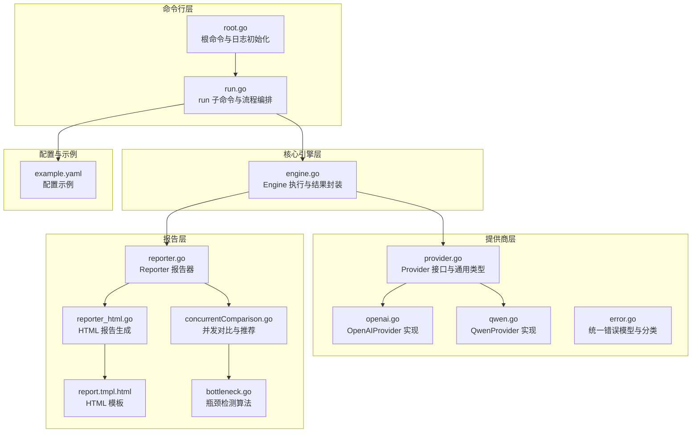
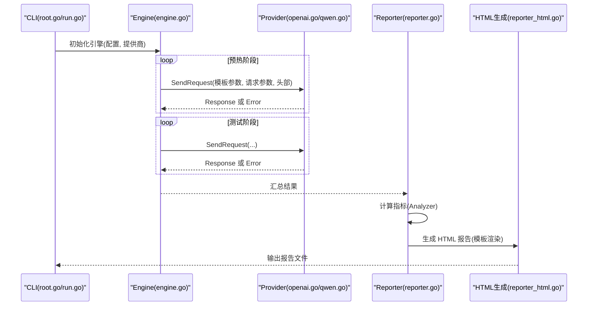
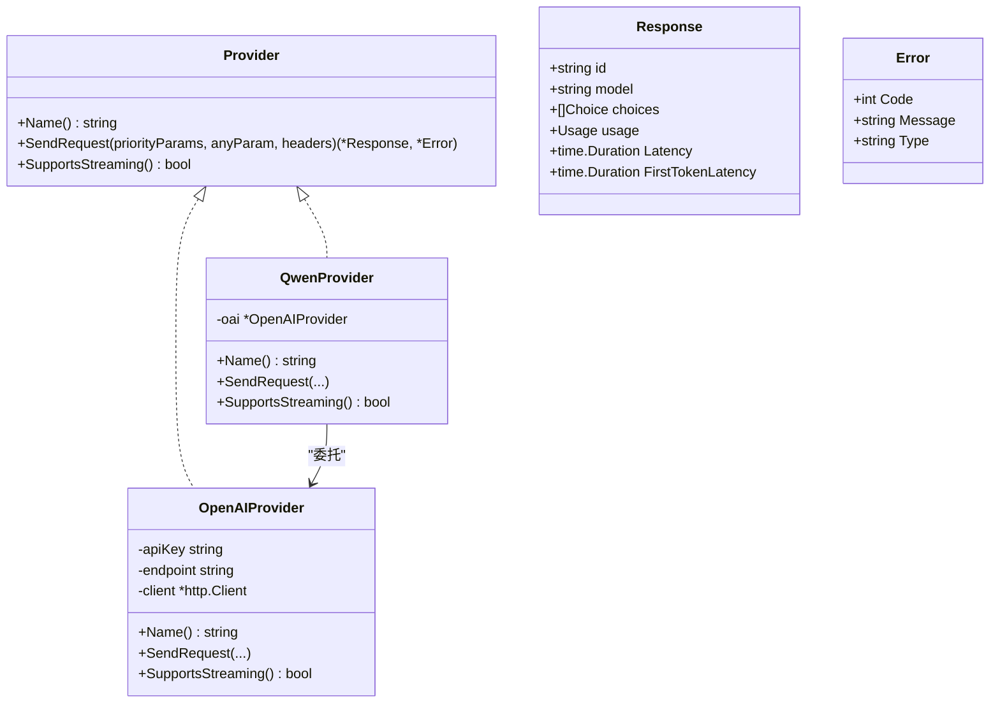
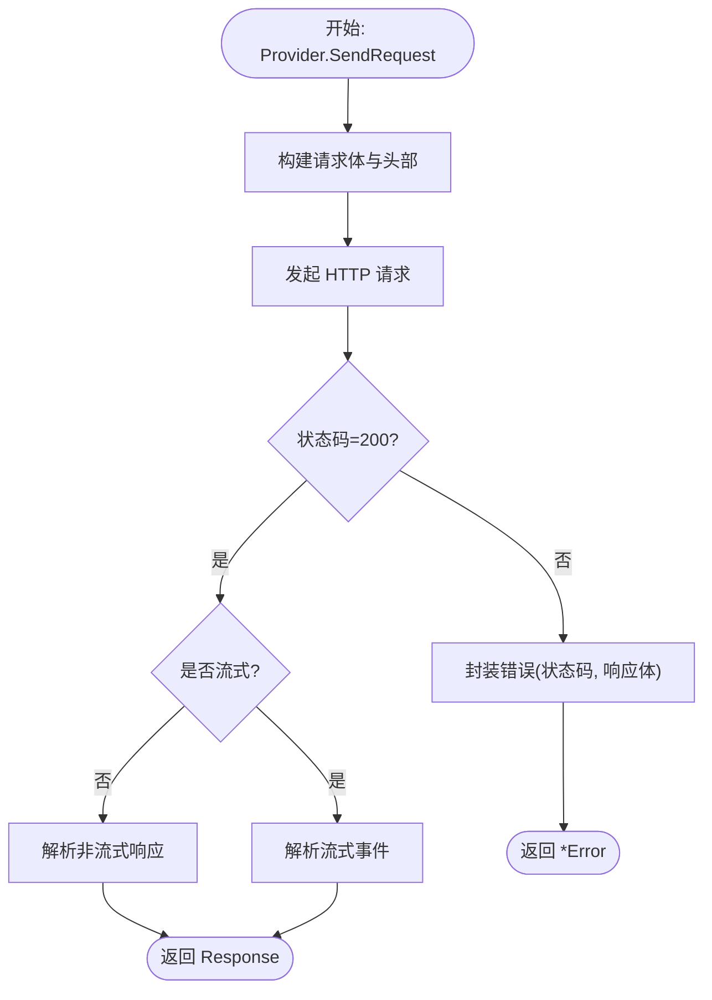
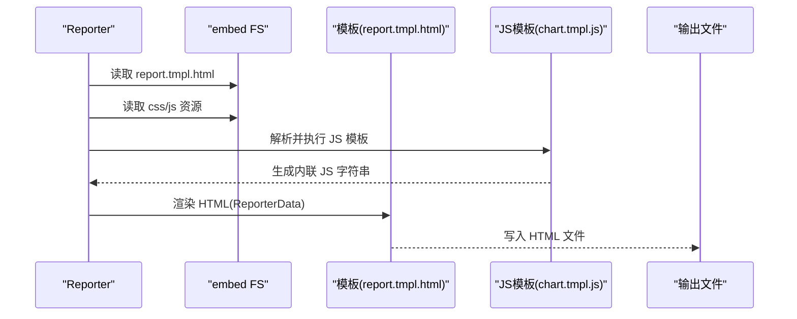
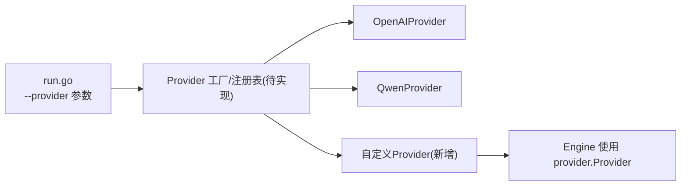
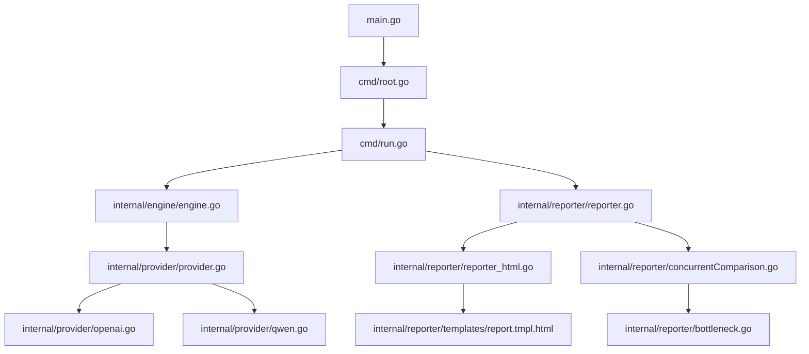

# 扩展开发

<cite>
**本文引用的文件**
- [main.go](file://main.go)
- [root.go](file://cmd/root.go)
- [run.go](file://cmd/run.go)
- [provider.go](file://internal/provider/provider.go)
- [openai.go](file://internal/provider/openai.go)
- [qwen.go](file://internal/provider/qwen.go)
- [error.go](file://internal/provider/error.go)
- [engine.go](file://internal/engine/engine.go)
- [reporter.go](file://internal/reporter/reporter.go)
- [reporter_html.go](file://internal/reporter/reporter_html.go)
- [report.tmpl.html](file://internal/reporter/templates/report.tmpl.html)
- [concurrentComparison.go](file://internal/reporter/concurrentComparison.go)
- [bottleneck.go](file://internal/reporter/bottleneck.go)
- [example.yaml](file://configs/example.yaml)
- [provider_test.go](file://internal/provider/provider_test.go)
- [go.mod](file://go.mod)
- [README.md](file://README.md)
- [CONTRIBUTING.md](file://CONTRIBUTING.md)
</cite>

## 目录
1. [简介](#简介)
2. [项目结构](#项目结构)
3. [核心组件](#核心组件)
4. [架构总览](#架构总览)
5. [详细组件分析](#详细组件分析)
6. [依赖分析](#依赖分析)
7. [性能考虑](#性能考虑)
8. [故障排查指南](#故障排查指南)
9. [结论](#结论)
10. [附录](#附录)

## 简介
本指南面向希望为 GoLLMPerf 开发“新 LLM 提供商接口”、“自定义报告格式”以及“插件化能力”的扩展开发者。文档从接口规范、认证与错误处理、报告模板与渲染机制、插件化架构与集成方式、开发与测试实践、代码规范与发布维护等方面，给出可操作的步骤与最佳实践。

## 项目结构
GoLLMPerf 采用模块化分层设计：命令行入口通过 CLI 子系统驱动引擎执行测试；引擎调用 Provider 接口访问不同 LLM；结果由收集器汇总，分析器计算指标，报告器生成多格式输出。配置管理支持 YAML 文件与命令行参数覆盖。

**图表来源**
- [root.go:10-27](file://cmd/root.go#L10-L27)
- [run.go:16-95](file://cmd/run.go#L16-L95)
- [engine.go:14-47](file://internal/engine/engine.go#L14-L47)
- [provider.go:10-71](file://internal/provider/provider.go#L10-L71)
- [openai.go:21-53](file://internal/provider/openai.go#L21-L53)
- [qwen.go:5-34](file://internal/provider/qwen.go#L5-L34)
- [reporter.go:26-129](file://internal/reporter/reporter.go#L26-L129)
- [reporter_html.go:15-75](file://internal/reporter/reporter_html.go#L15-L75)
- [report.tmpl.html:1-204](file://internal/reporter/templates/report.tmpl.html#L1-L204)
- [concurrentComparison.go:15-136](file://internal/reporter/concurrentComparison.go#L15-L136)
- [bottleneck.go:8-36](file://internal/reporter/bottleneck.go#L8-L36)
- [example.yaml:1-78](file://configs/example.yaml#L1-L78)

**章节来源**
- [README.md:92-109](file://README.md#L92-L109)
- [go.mod:1-48](file://go.mod#L1-L48)

## 核心组件
- Provider 接口与响应模型：定义统一的提供商抽象、消息体、响应体与使用量统计，并提供字符串化与本地时延字段。
- OpenAI/Qwen 提供商实现：封装 HTTP 客户端、请求合并、流式与非流式响应处理、超时控制与调试开关。
- 错误模型与分类：统一错误结构，按网络类与 JSON 结构进行分类，便于报告与分析。
- 引擎：负责预热、并发执行、请求计时与结果封装。
- 报告器：支持控制台、JSON、CSV、HTML 多格式输出；HTML 报告通过嵌入模板与 JS/CSS 渲染。
- 并发对比与瓶颈检测：提供多算法（梯度、统计、延迟比）识别 QPS 与延迟瓶颈，给出推荐并发。

**章节来源**
- [provider.go:10-71](file://internal/provider/provider.go#L10-L71)
- [openai.go:21-144](file://internal/provider/openai.go#L21-L144)
- [qwen.go:5-34](file://internal/provider/qwen.go#L5-L34)
- [error.go:9-78](file://internal/provider/error.go#L9-L78)
- [engine.go:14-111](file://internal/engine/engine.go#L14-L111)
- [reporter.go:26-129](file://internal/reporter/reporter.go#L26-L129)
- [reporter_html.go:15-75](file://internal/reporter/reporter_html.go#L15-L75)
- [concurrentComparison.go:15-287](file://internal/reporter/concurrentComparison.go#L15-L287)
- [bottleneck.go:8-354](file://internal/reporter/bottleneck.go#L8-L354)

## 架构总览
下图展示一次 run 命令的端到端流程：CLI 解析参数与配置 → 创建引擎 → 调用 Provider 发送请求 → 收集结果 → 分析指标 → 生成报告。

**图表来源**
- [run.go:22-77](file://cmd/run.go#L22-L77)
- [engine.go:49-111](file://internal/engine/engine.go#L49-L111)
- [openai.go:84-144](file://internal/provider/openai.go#L84-L144)
- [reporter.go:103-129](file://internal/reporter/reporter.go#L103-L129)
- [reporter_html.go:15-75](file://internal/reporter/reporter_html.go#L15-L75)

## 详细组件分析

### Provider 接口与实现规范
- 接口职责
  - 名称标识：Name 返回提供商名称，用于日志与报告。
  - 请求发送：SendRequest(priorityParams, anyParam, headers) 返回响应与错误。
  - 流式支持：SupportsStreaming 决定是否启用流式。
- 参数与头部
  - priorityParams 优先级更高，用于覆盖模板参数；anyParam 为单次请求参数；headers 为额外 HTTP 头。
- 响应与使用量
  - Response 包含 id、model、choices、usage；同时记录端到端延迟与首 token 延迟；JsonData 用于快速序列化。
- 错误处理
  - 统一返回 *Error，包含 code、message、type；type 可能是网络关键字或 JSON 错误结构。
- 认证机制
  - OpenAI/Qwen 默认在 Authorization 头设置 Bearer Token；可通过 headers 注入其他鉴权头。

**图表来源**
- [provider.go:10-71](file://internal/provider/provider.go#L10-L71)
- [openai.go:21-144](file://internal/provider/openai.go#L21-L144)
- [qwen.go:5-34](file://internal/provider/qwen.go#L5-L34)

**章节来源**
- [provider.go:10-71](file://internal/provider/provider.go#L10-L71)
- [openai.go:21-144](file://internal/provider/openai.go#L21-L144)
- [qwen.go:5-34](file://internal/provider/qwen.go#L5-L34)
- [error.go:9-78](file://internal/provider/error.go#L9-L78)

### 认证机制与错误处理
- 认证
  - OpenAI/Qwen 在 Authorization 设置 Bearer Token；可通过 headers 注入额外头。
  - 超时控制：HTTP 客户端超时在提供商构造时注入。
- 错误分类
  - 网络错误关键词匹配；若错误文本可解析为 JSON error 对象，则直接透传该结构作为类型。
  - 非网络错误则保留原始消息字符串。
- 错误传播
  - 引擎将 Provider 返回的错误写入 Result.Error，标记失败；报告器据此统计错误分布。

**图表来源**
- [openai.go:84-144](file://internal/provider/openai.go#L84-L144)
- [openai.go:146-247](file://internal/provider/openai.go#L146-L247)
- [error.go:19-78](file://internal/provider/error.go#L19-L78)

**章节来源**
- [openai.go:84-144](file://internal/provider/openai.go#L84-L144)
- [error.go:19-78](file://internal/provider/error.go#L19-L78)

### 自定义报告格式与模板系统
- 报告器接口
  - 控制台：GenerateConsoleReport
  - 文件：GenerateFileReport，支持 json/csv/html，默认根据后缀选择格式
- HTML 报告
  - 使用 go:embed 嵌入模板与资源；先渲染 JS 模板，再渲染 HTML 主模板；模板中包含 CSS/JS 片段与数据绑定。
- 模板数据结构
  - ReporterData 将 ConcurrentComparison 与样式/脚本片段打包，供模板渲染。
- 并发对比与推荐
  - ConcurrentComparison 收集多并发下的指标，提供最佳 QPS、最佳吞吐、最佳延迟、首 Token 最佳等查询。
  - GetRecommendedConcurrency 综合 QPS 与延迟瓶颈，给出推荐并发与理由。

**图表来源**
- [reporter.go:103-129](file://internal/reporter/reporter.go#L103-L129)
- [reporter_html.go:15-75](file://internal/reporter/reporter_html.go#L15-L75)
- [report.tmpl.html:1-204](file://internal/reporter/templates/report.tmpl.html#L1-L204)
- [concurrentComparison.go:15-136](file://internal/reporter/concurrentComparison.go#L15-L136)

**章节来源**
- [reporter.go:26-129](file://internal/reporter/reporter.go#L26-L129)
- [reporter_html.go:15-75](file://internal/reporter/reporter_html.go#L15-L75)
- [report.tmpl.html:1-204](file://internal/reporter/templates/report.tmpl.html#L1-L204)
- [concurrentComparison.go:15-287](file://internal/reporter/concurrentComparison.go#L15-L287)

### 插件系统架构与集成方式
- Provider 插件化
  - 通过 Provider 接口抽象，新增提供商只需实现 Name、SendRequest、SupportsStreaming 三方法。
  - 引擎以 provider.Provider 注入，不关心具体实现细节。
- CLI 集成
  - run 子命令通过参数选择 provider 名称（如 openai、qwen），并在运行时注入对应 Provider 实例。
- 配置驱动
  - example.yaml 中 model.provider 指定提供商；也可通过命令行 -P/--provider 覆盖。

**图表来源**
- [run.go:88-95](file://cmd/run.go#L88-L95)
- [provider.go:10-20](file://internal/provider/provider.go#L10-L20)
- [engine.go:34-47](file://internal/engine/engine.go#L34-L47)

**章节来源**
- [provider.go:10-20](file://internal/provider/provider.go#L10-L20)
- [run.go:88-95](file://cmd/run.go#L88-L95)
- [engine.go:34-47](file://internal/engine/engine.go#L34-L47)

### 开发示例与测试方法
- 新增提供商步骤
  - 实现 Provider 接口；在构造函数中设置 endpoint、headers、超时；在 SendRequest 中合并参数、设置 Authorization、处理流式/非流式响应。
  - 参考实现路径：[openai.go:21-144](file://internal/provider/openai.go#L21-L144)、[qwen.go:5-34](file://internal/provider/qwen.go#L5-L34)
- 单元测试
  - provider_test.go 展示了如何使用真实 API Key 进行 OpenAI/Qwen 的端到端测试，验证响应内容、流式行为与时延字段。
  - 参考路径：[provider_test.go:22-143](file://internal/provider/provider_test.go#L22-L143)
- 集成测试
  - 使用 example.yaml 配置文件与 run 子命令进行批量/压力/性能模式测试，验证引擎、分析器与报告器链路。
  - 参考路径：[run.go:22-77](file://cmd/run.go#L22-L77)、[example.yaml:1-78](file://configs/example.yaml#L1-L78)

**章节来源**
- [openai.go:21-144](file://internal/provider/openai.go#L21-L144)
- [qwen.go:5-34](file://internal/provider/qwen.go#L5-L34)
- [provider_test.go:22-143](file://internal/provider/provider_test.go#L22-L143)
- [run.go:22-77](file://cmd/run.go#L22-L77)
- [example.yaml:1-78](file://configs/example.yaml#L1-L78)

## 依赖分析
- 外部依赖
  - CLI：spf13/cobra
  - 配置：spf13/viper
  - 日志：FortuneW/qlog
  - 断言与测试：stretchr/testify
  - YAML：gopkg.in/yaml.v2
- 内部模块耦合
  - cmd 仅依赖 internal/engine 与 internal/reporter；engine 依赖 internal/provider；reporter 依赖 analyzer 与模板。
  - provider 与 reporter 之间无直接耦合，通过 engine 间接交互。

**图表来源**
- [main.go:3-9](file://main.go#L3-L9)
- [root.go:10-27](file://cmd/root.go#L10-L27)
- [run.go:16-95](file://cmd/run.go#L16-L95)
- [engine.go:14-47](file://internal/engine/engine.go#L14-L47)
- [provider.go:3-8](file://internal/provider/provider.go#L3-L8)
- [openai.go:3-14](file://internal/provider/openai.go#L3-L14)
- [qwen.go:3-4](file://internal/provider/qwen.go#L3-L4)
- [reporter.go:3-12](file://internal/reporter/reporter.go#L3-L12)
- [reporter_html.go:3-10](file://internal/reporter/reporter_html.go#L3-L10)
- [report.tmpl.html:1-14](file://internal/reporter/templates/report.tmpl.html#L1-L14)
- [concurrentComparison.go:3-7](file://internal/reporter/concurrentComparison.go#L3-L7)
- [bottleneck.go:3-6](file://internal/reporter/bottleneck.go#L3-L6)

**章节来源**
- [go.mod:5-19](file://go.mod#L5-L19)

## 性能考虑
- 并发与预热
  - 引擎在每个 worker 中循环执行预热请求，避免重复；预热时长与并发数可配置。
- 流式与非流式
  - 流式响应需逐行解析 SSE 数据，注意首 Token 延迟与端到端延迟的区分。
- 超时与重定向
  - HTTP 客户端设置超时与重定向限制，避免长时间阻塞。
- 报告渲染
  - HTML 报告通过嵌入模板减少外部依赖；JS/CSS 与数据分离，利于缓存与增量更新。

**章节来源**
- [engine.go:49-86](file://internal/engine/engine.go#L49-L86)
- [openai.go:38-47](file://internal/provider/openai.go#L38-L47)
- [reporter_html.go:15-75](file://internal/reporter/reporter_html.go#L15-L75)

## 故障排查指南
- 常见错误类型
  - 网络错误：连接被拒、超时、主机不可达等；错误类型会自动识别为网络关键字。
  - JSON 错误：若响应体可解析为包含 error 字段的对象，类型将直接使用该结构。
- 日志与调试
  - 通过环境变量开启请求/响应调试输出，定位异常。
- 报告与分析
  - 若存在失败请求，报告器会统计错误类型分布；结合瓶颈检测结果定位并发阈值。

**章节来源**
- [error.go:32-78](file://internal/provider/error.go#L32-L78)
- [openai.go:16-19](file://internal/provider/openai.go#L16-L19)
- [reporter.go:75-81](file://internal/reporter/reporter.go#L75-L81)
- [bottleneck.go:243-347](file://internal/reporter/bottleneck.go#L243-L347)

## 结论
通过 Provider 接口与引擎解耦、CLI 与配置驱动、报告器多格式输出与模板系统，GoLLMPerf 提供了清晰的扩展点。新增提供商只需遵循接口规范，复用现有分析与报告能力；自定义报告格式可基于嵌入模板与数据模型扩展；未来可在 CLI 层引入 Provider 工厂/注册表，进一步增强插件化能力。

## 附录

### 代码规范与测试要求
- 代码风格
  - 遵循 Gofmt；函数短小清晰；注释简洁明确。
- 单元测试
  - 新功能需配套测试；参考 provider_test.go 的端到端测试模式。
- 集成测试
  - 使用 example.yaml 与 run 子命令验证完整链路；覆盖批量、压力、性能模式。
- 文档更新
  - 更新 README 与贡献指南中的新增提供商/报告格式说明。

**章节来源**
- [CONTRIBUTING.md:34-49](file://CONTRIBUTING.md#L34-L49)
- [provider_test.go:22-143](file://internal/provider/provider_test.go#L22-L143)
- [README.md:111-179](file://README.md#L111-L179)

### 发布与维护指导
- 版本与依赖
  - 使用 go.mod 管理版本与依赖；确保第三方库版本兼容。
- 行为一致性
  - 新增提供商需保证与现有 Response/Result 字段一致，避免破坏报告器与分析器。
- 兼容性
  - 保持 Provider 接口稳定；如需变更，提供迁移指南与兼容层。

**章节来源**
- [go.mod:1-48](file://go.mod#L1-L48)
- [provider.go:10-71](file://internal/provider/provider.go#L10-L71)