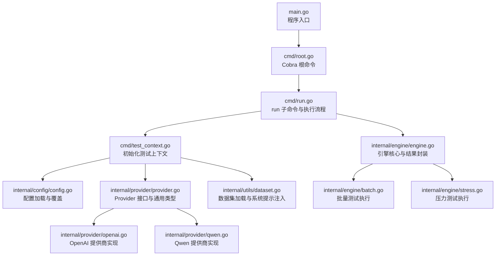
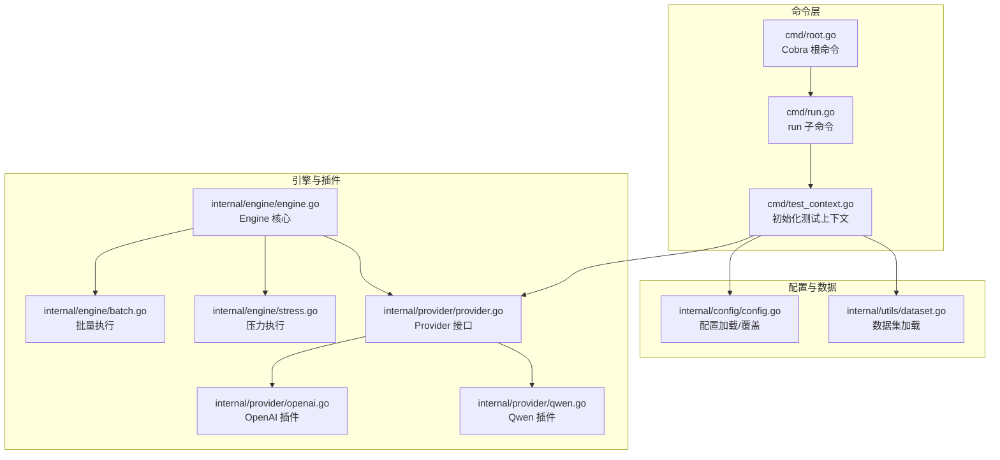
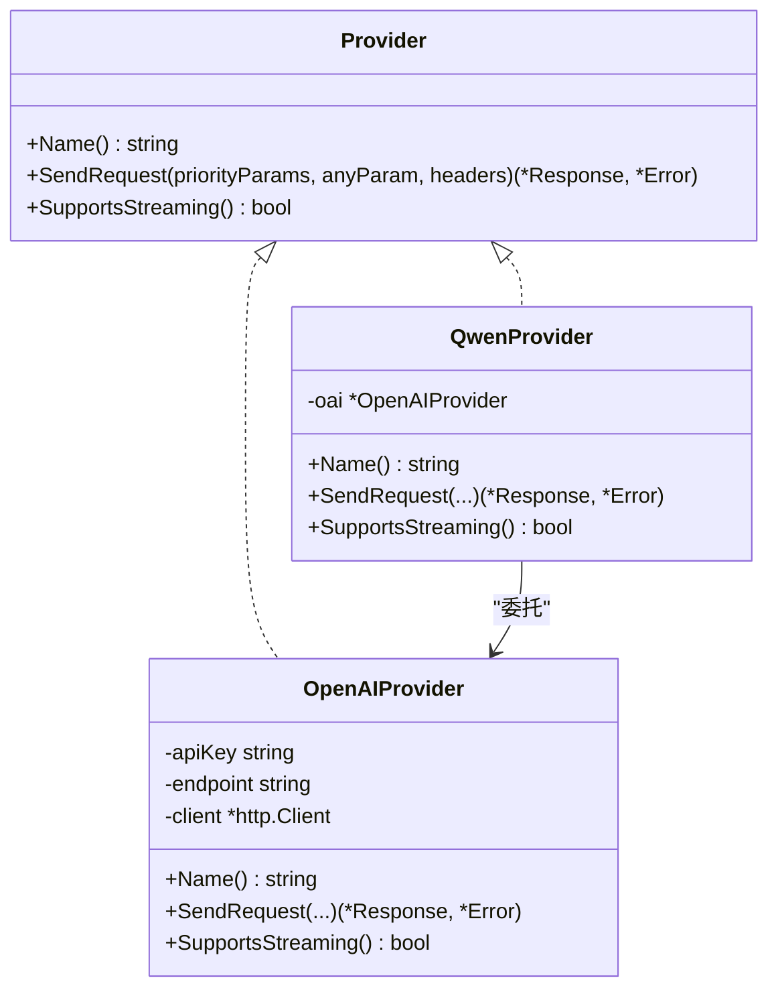
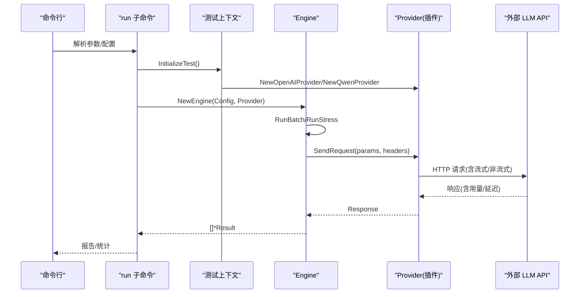
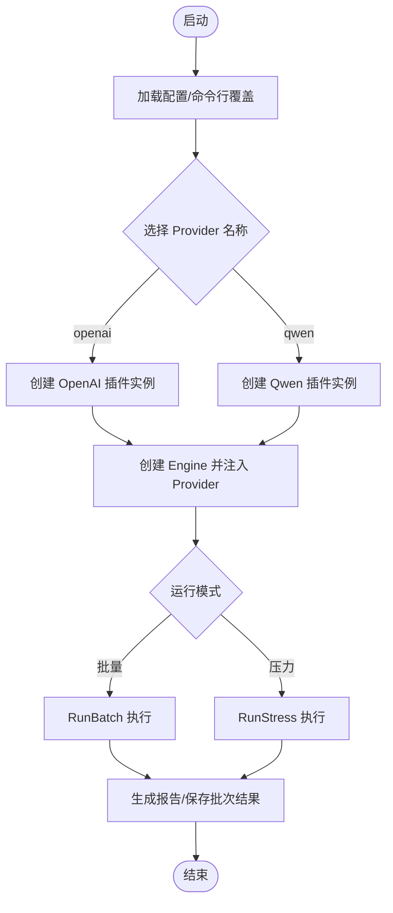
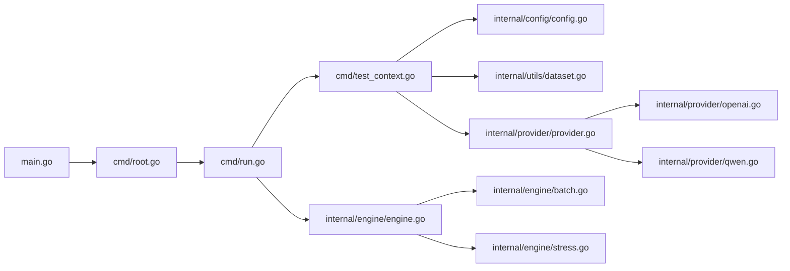

# 插件系统架构

<cite>
**本文引用的文件**
- [main.go](file://main.go)
- [root.go](file://cmd/root.go)
- [run.go](file://cmd/run.go)
- [test_context.go](file://cmd/test_context.go)
- [provider.go](file://internal/provider/provider.go)
- [openai.go](file://internal/provider/openai.go)
- [qwen.go](file://internal/provider/qwen.go)
- [error.go](file://internal/provider/error.go)
- [engine.go](file://internal/engine/engine.go)
- [batch.go](file://internal/engine/batch.go)
- [stress.go](file://internal/engine/stress.go)
- [config.go](file://internal/config/config.go)
- [dataset.go](file://internal/utils/dataset.go)
- [go.mod](file://go.mod)
- [README.md](file://README.md)
</cite>

## 目录
1. [引言](#引言)
2. [项目结构](#项目结构)
3. [核心组件](#核心组件)
4. [架构总览](#架构总览)
5. [详细组件分析](#详细组件分析)
6. [依赖分析](#依赖分析)
7. [性能考量](#性能考量)
8. [故障排查指南](#故障排查指南)
9. [结论](#结论)
10. [附录：插件开发与测试规范](#附录插件开发与测试规范)

## 引言
本文件面向 GoLLMPerf 的“插件系统”扩展能力，基于现有 Provider 接口与引擎交互模式，给出可落地的插件化架构设计与实施建议。当前仓库已具备清晰的 Provider 抽象（统一不同大模型供应商的请求发送与流式处理），以及通过命令行参数与配置文件驱动的运行时选择机制。本文在不改变现有实现的前提下，提出一套“插件即 Provider”的扩展思路：以 Provider 接口为核心插件契约，通过工厂函数与运行时选择实现“插件注册、发现与加载”，并通过统一的 Engine 执行路径完成“插件生命周期管理”。同时，补充插件间通信、安全与沙箱隔离、开发规范与测试策略等。

## 项目结构
从入口到执行链路的关键文件如下所示：

图表来源
- [main.go:1-26](file://main.go#L1-L26)
- [root.go:10-27](file://cmd/root.go#L10-L27)
- [run.go:16-95](file://cmd/run.go#L16-L95)
- [test_context.go:21-81](file://cmd/test_context.go#L21-L81)
- [config.go:136-188](file://internal/config/config.go#L136-L188)
- [provider.go:10-71](file://internal/provider/provider.go#L10-L71)
- [openai.go:21-53](file://internal/provider/openai.go#L21-L53)
- [qwen.go:5-34](file://internal/provider/qwen.go#L5-L34)
- [dataset.go:62-80](file://internal/utils/dataset.go#L62-L80)
- [engine.go:13-47](file://internal/engine/engine.go#L13-L47)
- [batch.go:12-64](file://internal/engine/batch.go#L12-L64)
- [stress.go:15-78](file://internal/engine/stress.go#L15-L78)

章节来源
- [main.go:1-26](file://main.go#L1-L26)
- [root.go:10-27](file://cmd/root.go#L10-L27)
- [run.go:16-95](file://cmd/run.go#L16-L95)
- [test_context.go:21-81](file://cmd/test_context.go#L21-L81)
- [config.go:136-188](file://internal/config/config.go#L136-L188)
- [provider.go:10-71](file://internal/provider/provider.go#L10-L71)
- [openai.go:21-53](file://internal/provider/openai.go#L21-L53)
- [qwen.go:5-34](file://internal/provider/qwen.go#L5-L34)
- [dataset.go:62-80](file://internal/utils/dataset.go#L62-L80)
- [engine.go:13-47](file://internal/engine/engine.go#L13-L47)
- [batch.go:12-64](file://internal/engine/batch.go#L12-L64)
- [stress.go:15-78](file://internal/engine/stress.go#L15-L78)

## 核心组件
- Provider 接口：定义统一的“名称”、“发送请求”、“是否支持流式”等能力，作为插件契约。
- OpenAI/Qwen 实现：遵循 Provider 接口的具体插件实现，负责 HTTP 请求构建、流式/非流式响应解析、首 token 延迟统计等。
- Engine：持有 Provider 并编排批量/压力测试，封装统一的结果结构。
- 配置与上下文：通过配置文件与命令行标志加载与覆盖，动态选择 Provider 实例。
- 数据集工具：加载 JSONL 测试用例，并按需注入系统提示。

章节来源
- [provider.go:10-71](file://internal/provider/provider.go#L10-L71)
- [openai.go:21-53](file://internal/provider/openai.go#L21-L53)
- [qwen.go:5-34](file://internal/provider/qwen.go#L5-L34)
- [engine.go:13-47](file://internal/engine/engine.go#L13-L47)
- [config.go:136-188](file://internal/config/config.go#L136-L188)
- [dataset.go:62-80](file://internal/utils/dataset.go#L62-L80)

## 架构总览
下图展示“插件即 Provider”的扩展架构：Engine 仅依赖 Provider 接口；通过 TestContext 在运行时根据配置选择具体 Provider 实现；Provider 内部封装网络调用、流式解析与延迟统计；Engine 将 Provider 返回的响应转换为统一的 Result 结构，供后续收集、分析与报告。

图表来源
- [root.go:10-27](file://cmd/root.go#L10-L27)
- [run.go:16-95](file://cmd/run.go#L16-L95)
- [test_context.go:21-81](file://cmd/test_context.go#L21-L81)
- [config.go:136-188](file://internal/config/config.go#L136-L188)
- [dataset.go:62-80](file://internal/utils/dataset.go#L62-L80)
- [engine.go:13-47](file://internal/engine/engine.go#L13-L47)
- [batch.go:12-64](file://internal/engine/batch.go#L12-L64)
- [stress.go:15-78](file://internal/engine/stress.go#L15-L78)
- [provider.go:10-71](file://internal/provider/provider.go#L10-L71)
- [openai.go:21-53](file://internal/provider/openai.go#L21-L53)
- [qwen.go:5-34](file://internal/provider/qwen.go#L5-L34)

## 详细组件分析

### Provider 接口与插件契约
- 设计要点
  - 统一抽象：Name/SendRequest/SupportsStreaming 三要素，屏蔽底层差异。
  - 参数与响应：使用 AnyParams 传递请求参数，Response 统一封装返回与用量信息。
  - 错误模型：Error 类型用于统一错误码、消息与分类，便于上层统计与报告。
- 生命周期
  - 发现与加载：由 TestContext 根据配置选择具体 Provider 实例（如 openai/qwen）。
  - 执行期：Engine 调用 Provider.SendRequest 完成一次请求；Provider 内部处理流式/非流式与延迟统计。
  - 卸载：当前未实现显式卸载逻辑，Provider 实例随进程生命周期结束而销毁。

图表来源
- [provider.go:10-71](file://internal/provider/provider.go#L10-L71)
- [openai.go:21-53](file://internal/provider/openai.go#L21-L53)
- [qwen.go:5-34](file://internal/provider/qwen.go#L5-L34)

章节来源
- [provider.go:10-71](file://internal/provider/provider.go#L10-L71)
- [openai.go:21-53](file://internal/provider/openai.go#L21-L53)
- [qwen.go:5-34](file://internal/provider/qwen.go#L5-L34)

### Engine 与执行流程
- 批量测试（RunBatch）
  - 使用带索引的通道收集结果，保证输出顺序与输入一一对应。
  - 工作协程并发消费任务，避免阻塞。
- 压力测试（RunStress）
  - 支持预热阶段，确保系统稳定后再开始正式测试。
  - 按时长或请求数上限控制测试周期，协程自适应退出。
- 结果封装
  - 将 Provider 返回的 Response 映射为统一 Result，包含请求/响应用量、端到端与首 token 延迟、成功与否及错误信息。

图表来源
- [run.go:98-122](file://cmd/run.go#L98-L122)
- [test_context.go:64-81](file://cmd/test_context.go#L64-L81)
- [engine.go:34-47](file://internal/engine/engine.go#L34-L47)
- [batch.go:12-64](file://internal/engine/batch.go#L12-L64)
- [stress.go:15-78](file://internal/engine/stress.go#L15-L78)
- [openai.go:84-144](file://internal/provider/openai.go#L84-L144)

章节来源
- [run.go:98-122](file://cmd/run.go#L98-L122)
- [test_context.go:64-81](file://cmd/test_context.go#L64-L81)
- [engine.go:34-47](file://internal/engine/engine.go#L34-L47)
- [batch.go:12-64](file://internal/engine/batch.go#L12-L64)
- [stress.go:15-78](file://internal/engine/stress.go#L15-L78)
- [openai.go:84-144](file://internal/provider/openai.go#L84-L144)

### 插件注册机制与生命周期
- 注册与发现
  - 当前通过 switch 分支在运行时选择 Provider 实例，属于“静态注册”。
  - 扩展建议：引入 Provider 工厂映射（字符串到构造函数），在初始化阶段注册，运行时按名称查找，实现“动态注册/发现”。
- 加载与卸载
  - 加载：InitializeTest 中依据配置创建 Provider 实例。
  - 卸载：当前未实现显式卸载；可在插件实现中暴露 Close/Shutdown 方法，并在 Engine 或 CLI 层触发。
- 生命周期事件
  - 初始化：读取配置、校验参数、加载数据集。
  - 运行：执行批量/压力测试，收集结果。
  - 结束：生成报告、保存批次结果（批量模式）。

图表来源
- [test_context.go:64-81](file://cmd/test_context.go#L64-L81)
- [engine.go:34-47](file://internal/engine/engine.go#L34-L47)
- [batch.go:12-64](file://internal/engine/batch.go#L12-L64)
- [stress.go:15-78](file://internal/engine/stress.go#L15-L78)

章节来源
- [test_context.go:64-81](file://cmd/test_context.go#L64-L81)
- [engine.go:34-47](file://internal/engine/engine.go#L34-L47)
- [batch.go:12-64](file://internal/engine/batch.go#L12-L64)
- [stress.go:15-78](file://internal/engine/stress.go#L15-L78)

### 插件间通信与数据交换
- Engine 与 Provider 的交互
  - 输入：Engine 向 Provider 传入“模板参数 + 具体请求 + 头部”。
  - 输出：Provider 返回 Response（含用量、延迟等），Engine 转换为 Result。
- Provider 内部的数据处理
  - OpenAI/Qwen 插件内部负责合并参数、设置头部、发起 HTTP 请求、解析流式/非流式响应，并计算端到端与首 token 延迟。
- 插件间共享
  - 当前插件间无直接通信；若需跨插件协作，可在 Engine 层注入共享上下文（如日志、指标采集器），或通过配置注入共享策略。

章节来源
- [engine.go:88-111](file://internal/engine/engine.go#L88-L111)
- [openai.go:84-144](file://internal/provider/openai.go#L84-L144)
- [qwen.go:26-34](file://internal/provider/qwen.go#L26-L34)

### 安全与沙箱隔离
- 现状
  - 插件通过标准库 HTTP 客户端访问外部 API，未见专用沙箱隔离。
- 建议
  - 网络限制：在插件层增加超时、重定向限制、主机白名单等策略。
  - 输入校验：对 AnyParams 进行白名单/Schema 校验，避免注入非法字段。
  - 日志脱敏：对敏感头（如 Authorization）与响应内容进行脱敏记录。
  - 进程隔离：如需更强隔离，可考虑通过子进程/容器承载插件，通过 IPC 通信（如 JSON/RPC）。

章节来源
- [openai.go:38-47](file://internal/provider/openai.go#L38-L47)
- [openai.go:94-105](file://internal/provider/openai.go#L94-L105)
- [error.go:19-26](file://internal/provider/error.go#L19-L26)

## 依赖分析
- 外部依赖
  - Cobra/Viper/YAML：命令行与配置管理。
  - qlog：统一日志。
  - testify/YAML：测试与配置序列化。
- 内部耦合
  - cmd 层依赖 internal/config、internal/provider、internal/utils、internal/engine。
  - engine 依赖 provider 与 config。
  - provider 之间存在 Qwen 对 OpenAI 的委托关系，降低重复实现。

图表来源
- [main.go:1-26](file://main.go#L1-L26)
- [root.go:10-27](file://cmd/root.go#L10-L27)
- [run.go:16-95](file://cmd/run.go#L16-L95)
- [test_context.go:21-81](file://cmd/test_context.go#L21-L81)
- [config.go:136-188](file://internal/config/config.go#L136-L188)
- [dataset.go:62-80](file://internal/utils/dataset.go#L62-L80)
- [provider.go:10-71](file://internal/provider/provider.go#L10-L71)
- [openai.go:21-53](file://internal/provider/openai.go#L21-L53)
- [qwen.go:5-34](file://internal/provider/qwen.go#L5-L34)
- [engine.go:13-47](file://internal/engine/engine.go#L13-L47)
- [batch.go:12-64](file://internal/engine/batch.go#L12-L64)
- [stress.go:15-78](file://internal/engine/stress.go#L15-L78)

章节来源
- [go.mod:5-12](file://go.mod#L5-L12)
- [README.md:54-82](file://README.md#L54-L82)

## 性能考量
- 并发与吞吐
  - Engine 通过 goroutine 与带缓冲通道实现高并发请求与结果收集，避免阻塞。
- 延迟测量
  - Provider 记录端到端与首 token 延迟，Engine 将其纳入统一结果结构，便于统计分析。
- 资源复用
  - OpenAI 插件复用 HTTP 客户端与连接，减少握手开销。
- 可扩展优化
  - 插件侧可引入连接池、重试策略、背压控制等，以适配不同供应商的限流与稳定性特征。

章节来源
- [batch.go:12-64](file://internal/engine/batch.go#L12-L64)
- [stress.go:15-78](file://internal/engine/stress.go#L15-L78)
- [openai.go:38-47](file://internal/provider/openai.go#L38-L47)

## 故障排查指南
- 常见错误分类
  - 网络类错误：连接被拒、超时、DNS 解析失败等，错误分类器会识别并归类。
  - 服务端错误：HTTP 非 200 状态码，Body 解析失败等。
- 定位步骤
  - 开启调试环境变量查看请求/响应体。
  - 检查配置文件中的 API Key、Endpoint、模型名是否正确。
  - 查看 Engine 的 Result 中的 Error 字段与分类，结合 Provider 的错误包装定位问题。
- 建议
  - 在 Provider 层增加更细粒度的日志与追踪 ID，便于跨组件关联。
  - 对于流式响应，关注 SSE 数据行解析与 EOF 处理。

章节来源
- [error.go:32-78](file://internal/provider/error.go#L32-L78)
- [openai.go:84-144](file://internal/provider/openai.go#L84-L144)
- [openai.go:169-247](file://internal/provider/openai.go#L169-L247)

## 结论
当前 GoLLMPerf 已具备清晰的 Provider 抽象与可扩展的运行时选择机制。通过将“插件即 Provider”的理念落地，可以在不破坏现有架构的前提下，实现插件的动态注册、发现与生命周期管理。建议下一步完善插件工厂注册、卸载钩子、安全与沙箱策略，并补充插件间通信与共享上下文方案，以支撑更复杂的测试场景与企业级部署需求。

## 附录：插件开发与测试规范

### 插件开发标准规范
- 接口实现
  - 必须实现 Provider 接口的所有方法：Name、SendRequest、SupportsStreaming。
  - 请求参数 AnyParams 应尽量遵循已有模板约定（如 stream、headers、params_template），保持与 Engine 的兼容。
- 依赖管理
  - 优先使用标准库与受控第三方依赖，避免引入与主程序无关的重型库。
  - 如需网络访问，设置合理的超时与重定向策略。
- 版本兼容性
  - 保持 Provider 接口稳定，避免破坏性变更。
  - 若确需变更，提供迁移指南与兼容层。

章节来源
- [provider.go:10-71](file://internal/provider/provider.go#L10-L71)
- [openai.go:38-47](file://internal/provider/openai.go#L38-L47)

### 插件开发示例（概念性）
- 简单插件（非流式）
  - 步骤：实现 Provider 接口，构造请求体与头部，发送 HTTP 请求，解析响应，填充 Response 与延迟字段。
  - 关注点：参数合并、错误分类、日志与追踪。
- 复杂插件（流式）
  - 步骤：除上述外，还需处理 SSE 流式数据，逐块解析，累计内容与首 token 延迟，最终组装为统一 Response。
  - 关注点：流式解析健壮性、异常中断恢复、内存与缓冲区管理。

章节来源
- [openai.go:84-144](file://internal/provider/openai.go#L84-L144)
- [openai.go:169-247](file://internal/provider/openai.go#L169-L247)

### 插件测试策略与调试技巧
- 单元测试
  - Provider 层：模拟 HTTP 响应，验证参数合并、头部设置、错误分类与延迟计算。
  - Engine 层：构造小规模数据集，验证批量/压力执行路径与结果聚合。
- 集成测试
  - 使用真实但受限的 API 端点进行端到端验证，控制并发与时长，避免对上游造成压力。
- 调试技巧
  - 设置 DEBUG_LLM_REQUEST/DEBUG_LLM_RESPONSE 环境变量查看请求/响应体。
  - 利用 qlog 的日志级别与模块化日志，定位 Provider 与 Engine 的执行路径。
  - 在 Provider 层增加追踪 ID，贯穿日志与错误对象，便于跨组件关联。

章节来源
- [openai.go:16-19](file://internal/provider/openai.go#L16-L19)
- [root.go:17-22](file://cmd/root.go#L17-L22)
- [README.md:111-156](file://README.md#L111-L156)