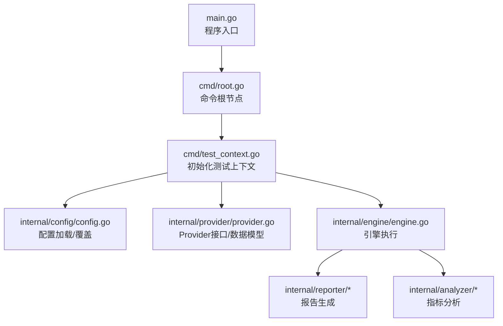
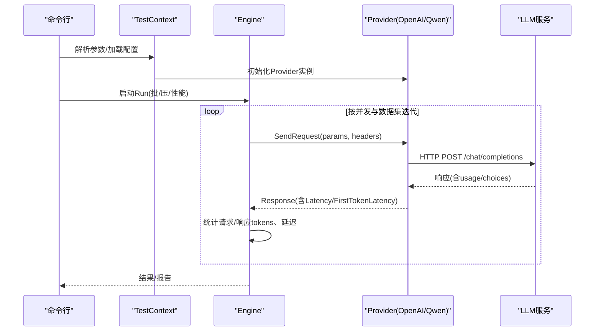
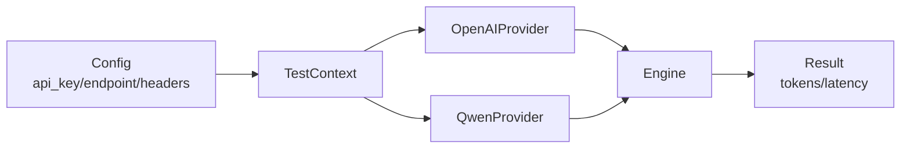

# 新提供商集成

<cite>
**本文引用的文件**
- [internal/provider/provider.go](file://internal/provider/provider.go)
- [internal/provider/openai.go](file://internal/provider/openai.go)
- [internal/provider/qwen.go](file://internal/provider/qwen.go)
- [internal/provider/error.go](file://internal/provider/error.go)
- [internal/provider/provider_test.go](file://internal/provider/provider_test.go)
- [internal/engine/engine.go](file://internal/engine/engine.go)
- [internal/config/config.go](file://internal/config/config.go)
- [configs/example.yaml](file://configs/example.yaml)
- [cmd/test_context.go](file://cmd/test_context.go)
- [cmd/run.go](file://cmd/run.go)
- [main.go](file://main.go)
</cite>

## 目录
1. [简介](#简介)
2. [项目结构](#项目结构)
3. [核心组件](#核心组件)
4. [架构总览](#架构总览)
5. [详细组件分析](#详细组件分析)
6. [依赖分析](#依赖分析)
7. [性能考虑](#性能考虑)
8. [故障排查指南](#故障排查指南)
9. [结论](#结论)
10. [附录：新增提供商集成步骤与模板](#附录新增提供商集成步骤与模板)

## 简介
本指南面向希望在 GoLLMPerf 中新增 LLM 提供商（Provider）的开发者，系统讲解 Provider 接口的实现规范、数据模型、认证与请求头设置、错误处理机制，并以 OpenAI 与 Qwen 为例给出完整实现参考。同时提供单元测试与集成测试策略，帮助你快速、正确地完成新提供商接入。

## 项目结构
GoLLMPerf 采用分层清晰的模块化设计：
- 命令行入口与运行流程位于 cmd 包，负责参数解析、配置加载与执行调度
- 配置管理位于 internal/config，支持 YAML 加载与环境变量替换
- 引擎层位于 internal/engine，封装批量/压力/性能模式的测试执行逻辑
- Provider 层位于 internal/provider，抽象统一的接口与数据模型，并内置 OpenAI/Qwen 实现
- 报告与分析位于 internal/reporter 与 internal/analyzer，收集结果并生成报告
- 工具类位于 internal/utils，如数据集加载、提示词注入等



图表来源
- [main.go:1-26](file://main.go#L1-L26)
- [cmd/root.go:1-28](file://cmd/root.go#L1-L28)
- [cmd/test_context.go:1-82](file://cmd/test_context.go#L1-L82)
- [internal/config/config.go:1-229](file://internal/config/config.go#L1-L229)
- [internal/provider/provider.go:1-72](file://internal/provider/provider.go#L1-L72)
- [internal/engine/engine.go:1-112](file://internal/engine/engine.go#L1-L112)

章节来源
- [main.go:1-26](file://main.go#L1-L26)
- [cmd/root.go:1-28](file://cmd/root.go#L1-L28)
- [cmd/test_context.go:1-82](file://cmd/test_context.go#L1-L82)
- [internal/config/config.go:1-229](file://internal/config/config.go#L1-L229)
- [internal/provider/provider.go:1-72](file://internal/provider/provider.go#L1-L72)
- [internal/engine/engine.go:1-112](file://internal/engine/engine.go#L1-L112)

## 核心组件
- Provider 接口：定义统一能力边界，包括名称、发送请求、是否支持流式
- 数据模型：消息、响应、选择项、用量统计
- 错误模型：统一错误包装与分类
- 引擎：封装测试执行、统计与结果采集
- 配置：YAML 配置与环境变量替换，支持参数模板与系统提示词

章节来源
- [internal/provider/provider.go:10-72](file://internal/provider/provider.go#L10-L72)
- [internal/engine/engine.go:13-31](file://internal/engine/engine.go#L13-L31)
- [internal/config/config.go:82-188](file://internal/config/config.go#L82-L188)

## 架构总览
下图展示了从命令行到 Provider 的调用链路，以及引擎如何消费 Provider 返回的响应与用量信息：



图表来源
- [cmd/test_context.go:64-74](file://cmd/test_context.go#L64-L74)
- [internal/engine/engine.go:88-111](file://internal/engine/engine.go#L88-L111)
- [internal/provider/openai.go:84-144](file://internal/provider/openai.go#L84-L144)
- [internal/provider/qwen.go:26-34](file://internal/provider/qwen.go#L26-L34)

## 详细组件分析

### Provider 接口与数据模型
- 接口职责
  - Name(): 返回提供商标识字符串
  - SendRequest(priorityParams, anyParam, headers): 发送请求并返回响应与错误
  - SupportsStreaming(): 是否支持流式输出
- 数据模型
  - Message: 角色与内容（内容可为字符串或复合结构）
  - Choice: 索引、消息体、结束原因；流式时包含 delta 字段
  - Response: 包含 id、model、choices、usage；本地字段记录端到端延迟与首 token 延迟
  - Usage: 提示词、补全、总计 tokens
- 参数与头部
  - 通过 AnyParams 传递请求体参数（如 messages、model、stream 等）
  - 通过 headers 传入额外请求头（如自定义鉴权头）

```mermaid
classDiagram
class Provider {
+Name() string
+SendRequest(priorityParams, anyParam, headers) *Response,*Error
+SupportsStreaming() bool
}
class OpenAIProvider {
-apiKey string
-endpoint string
-client *http.Client
+Name() string
+SendRequest(...) *Response,*Error
+SupportsStreaming() bool
}
class QwenProvider {
-oai *OpenAIProvider
+Name() string
+SendRequest(...) *Response,*Error
+SupportsStreaming() bool
}
class Response {
+string id
+string model
+[]Choice choices
+Usage usage
+Latency time.Duration
+FirstTokenLatency time.Duration
}
class Choice {
+int index
+Message message
+string finish_reason
+Delta *struct
}
class Message {
+string role
+interface{} content
}
class Usage {
+int prompt_tokens
+int completion_tokens
+int total_tokens
}
Provider <|.. OpenAIProvider
Provider <|.. QwenProvider
OpenAIProvider --> Response : "返回"
QwenProvider --> OpenAIProvider : "委托"
Response --> Choice
Choice --> Message
Response --> Usage
```

图表来源
- [internal/provider/provider.go:10-72](file://internal/provider/provider.go#L10-L72)
- [internal/provider/openai.go:21-48](file://internal/provider/openai.go#L21-L48)
- [internal/provider/qwen.go:5-34](file://internal/provider/qwen.go#L5-L34)

章节来源
- [internal/provider/provider.go:10-72](file://internal/provider/provider.go#L10-L72)
- [internal/provider/openai.go:21-48](file://internal/provider/openai.go#L21-L48)
- [internal/provider/qwen.go:5-34](file://internal/provider/qwen.go#L5-L34)

### 认证机制与请求头设置
- API Key 管理
  - 通过配置文件的 model.api_key 或环境变量注入
  - 支持占位符 ${VAR}，在加载配置时进行环境变量替换
- 请求头设置
  - OpenAIProvider 在发送请求时会设置 Authorization: Bearer ${apiKey} 与 Content-Type: application/json
  - 可通过 headers 参数传入额外头部，实现多提供商兼容（如自定义鉴权头）
- 示例路径
  - 配置加载与环境变量替换：[internal/config/config.go:136-188](file://internal/config/config.go#L136-L188)
  - OpenAI 请求头设置：[internal/provider/openai.go:100-105](file://internal/provider/openai.go#L100-L105)
  - Qwen 复用 OpenAI 的头部策略：[internal/provider/qwen.go:26-29](file://internal/provider/qwen.go#L26-L29)

章节来源
- [internal/config/config.go:136-188](file://internal/config/config.go#L136-L188)
- [internal/provider/openai.go:100-105](file://internal/provider/openai.go#L100-L105)
- [internal/provider/qwen.go:26-29](file://internal/provider/qwen.go#L26-L29)

### 消息格式、响应结构与令牌使用
- 消息格式
  - messages 数组中每个元素为 Message，包含 role 与 content
- 响应结构
  - choices 数组中每个元素为 Choice，非流式时 message.content 为最终文本；流式时由多个 delta 聚合
  - usage 包含 prompt_tokens、completion_tokens、total_tokens
- 本地时间度量
  - Latency：端到端延迟
  - FirstTokenLatency：首 token 延迟（流式场景）
- 示例路径
  - 数据模型定义：[internal/provider/provider.go:24-72](file://internal/provider/provider.go#L24-L72)
  - 流式聚合与首 token 记录：[internal/provider/openai.go:169-247](file://internal/provider/openai.go#L169-L247)
  - 非流式读取与延迟计算：[internal/provider/openai.go:146-167](file://internal/provider/openai.go#L146-L167)

章节来源
- [internal/provider/provider.go:24-72](file://internal/provider/provider.go#L24-L72)
- [internal/provider/openai.go:146-247](file://internal/provider/openai.go#L146-L247)

### 错误处理机制
- 错误类型
  - provider.Error：包含 code、message、type
  - NewError(code, err)：构造统一错误对象
  - categorizeError：尝试识别网络错误与 JSON 错误体，否则回退原始错误字符串
- 典型异常场景
  - 请求创建失败、HTTP 非 200、响应体解析失败、流式读取中断
- 示例路径
  - 错误类型与构造：[internal/provider/error.go:9-26](file://internal/provider/error.go#L9-L26)
  - 错误分类与网络错误判定：[internal/provider/error.go:32-78](file://internal/provider/error.go#L32-L78)
  - OpenAI 错误处理与状态码映射：[internal/provider/openai.go:117-121](file://internal/provider/openai.go#L117-L121)

章节来源
- [internal/provider/error.go:9-78](file://internal/provider/error.go#L9-L78)
- [internal/provider/openai.go:117-121](file://internal/provider/openai.go#L117-L121)

### OpenAI 实现要点
- 默认端点与超时控制
  - 若未指定 endpoint，默认使用 OpenAI 官方端点
  - http.Client 设置超时与重定向限制
- 请求合并与流式判断
  - mergeRequest 将 anyParam 与 priorityParams 合并，优先级高的覆盖同名键
  - 通过 stream 字段决定走流式或非流式分支
- 非流式响应
  - 读取完整响应体，解析为 Response，计算端到端延迟与首 token 延迟（若未设置则等于端到端）
- 流式响应
  - 逐行扫描 SSE 数据，解析每条事件，聚合 content、role、finish_reason
  - 首个可用块到达时记录 FirstTokenLatency
- 示例路径
  - 构造与默认端点：[internal/provider/openai.go:28-48](file://internal/provider/openai.go#L28-L48)
  - 请求合并与流式判断：[internal/provider/openai.go:55-82](file://internal/provider/openai.go#L55-L82)
  - 非流式处理：[internal/provider/openai.go:146-167](file://internal/provider/openai.go#L146-L167)
  - 流式处理：[internal/provider/openai.go:169-247](file://internal/provider/openai.go#L169-L247)

章节来源
- [internal/provider/openai.go:28-48](file://internal/provider/openai.go#L28-L48)
- [internal/provider/openai.go:55-82](file://internal/provider/openai.go#L55-L82)
- [internal/provider/openai.go:146-247](file://internal/provider/openai.go#L146-L247)

### Qwen 实现要点
- 协议兼容性
  - QwenProvider 内部持有 OpenAIProvider 实例，直接复用其请求与响应处理逻辑
  - 默认端点指向 DashScope 兼容模式
- 适用场景
  - 当新提供商 API 与 OpenAI 协议高度一致时，推荐采用“组合 + 委托”的方式快速接入
- 示例路径
  - 默认端点与委托实现：[internal/provider/qwen.go:10-34](file://internal/provider/qwen.go#L10-L34)

章节来源
- [internal/provider/qwen.go:10-34](file://internal/provider/qwen.go#L10-L34)

### 引擎与测试执行
- 引擎职责
  - 执行预热、批量/压力/性能模式
  - 调用 Provider.SendRequest，提取 tokens、延迟等指标
- 结果结构
  - Result 包含请求/响应 tokens、延迟、首 token 延迟、成功标志与错误
- 示例路径
  - 引擎执行与指标提取：[internal/engine/engine.go:88-111](file://internal/engine/engine.go#L88-L111)

章节来源
- [internal/engine/engine.go:88-111](file://internal/engine/engine.go#L88-L111)

## 依赖分析
- Provider 与 Engine 的耦合
  - Engine 仅依赖 Provider 接口，不关心具体实现细节，具备高内聚、低耦合特性
- Provider 与配置
  - Provider 的初始化依赖配置中的 api_key、endpoint、timeout 等字段
- Provider 与命令行
  - TestContext 根据配置选择 Provider 并实例化，支持 openai/qwen
- 依赖可视化



图表来源
- [cmd/test_context.go:64-74](file://cmd/test_context.go#L64-L74)
- [internal/config/config.go:107-116](file://internal/config/config.go#L107-L116)
- [internal/engine/engine.go:88-111](file://internal/engine/engine.go#L88-L111)

章节来源
- [cmd/test_context.go:64-74](file://cmd/test_context.go#L64-L74)
- [internal/config/config.go:107-116](file://internal/config/config.go#L107-L116)
- [internal/engine/engine.go:88-111](file://internal/engine/engine.go#L88-L111)

## 性能考虑
- 流式 vs 非流式
  - 流式可降低首 token 延迟感知，适合实时评测
  - 非流式便于一次性统计完整用量，适合批处理
- 并发与预热
  - 引擎支持并发与预热阶段，建议在压力/性能模式前先进行短时预热
- 超时与重定向
  - OpenAIProvider 对 http.Client 设置了超时与重定向上限，避免长时间阻塞
- 指标采集
  - 引擎按 Result 结构汇总 tokens 与延迟，便于后续分析

[本节为通用指导，无需列出章节来源]

## 故障排查指南
- 常见问题定位
  - API Key 无效：检查配置文件或环境变量是否正确替换
  - 端点不可达：确认 endpoint 正确且网络可达
  - 非 200 响应：查看 Provider 返回的错误对象，区分网络错误与业务错误
  - 流式解析失败：检查 SSE 数据格式与 include_usage 配置
- 日志与调试
  - 可通过环境变量开启请求/响应日志，辅助定位问题
- 示例路径
  - 错误分类与网络错误识别：[internal/provider/error.go:32-78](file://internal/provider/error.go#L32-L78)
  - OpenAI 非 200 错误处理：[internal/provider/openai.go:117-121](file://internal/provider/openai.go#L117-L121)

章节来源
- [internal/provider/error.go:32-78](file://internal/provider/error.go#L32-L78)
- [internal/provider/openai.go:117-121](file://internal/provider/openai.go#L117-L121)

## 结论
通过 Provider 接口与统一数据模型，GoLLMPerf 能够以最小成本接入新的 LLM 提供商。对于与 OpenAI 协议相近的提供商，推荐采用“组合 + 委托”模式快速落地；对于差异较大的提供商，则需在 SendRequest 与响应解析处做针对性适配。配合完善的配置、错误处理与测试策略，可确保新提供商稳定可靠地参与性能评测。

[本节为总结，无需列出章节来源]

## 附录：新增提供商集成步骤与模板

### 一、实现 Provider 接口
- 必须实现的方法
  - Name(): 返回提供商标识字符串
  - SendRequest(priorityParams, anyParam, headers): 发送请求并返回 Response 与 *Error
  - SupportsStreaming(): 返回是否支持流式
- 参数与头部
  - 通过 priorityParams 与 anyParam 合并请求体参数
  - 通过 headers 注入额外请求头
- 示例参考
  - OpenAI 实现：[internal/provider/openai.go:50-144](file://internal/provider/openai.go#L50-L144)
  - Qwen 实现（委托 OpenAI）：[internal/provider/qwen.go:21-34](file://internal/provider/qwen.go#L21-L34)

章节来源
- [internal/provider/openai.go:50-144](file://internal/provider/openai.go#L50-L144)
- [internal/provider/qwen.go:21-34](file://internal/provider/qwen.go#L21-L34)

### 二、消息格式与响应结构
- 消息
  - 使用 Message 结构，role 与 content 字段
- 响应
  - Response 包含 choices 与 usage；流式时通过 delta 聚合
- 令牌统计
  - 通过 Usage 获取 prompt_tokens、completion_tokens、total_tokens
- 示例参考
  - 数据模型定义：[internal/provider/provider.go:24-72](file://internal/provider/provider.go#L24-L72)

章节来源
- [internal/provider/provider.go:24-72](file://internal/provider/provider.go#L24-L72)

### 三、认证与请求头
- API Key 来源
  - 配置文件 model.api_key 或环境变量替换
- 请求头
  - OpenAIProvider 默认设置 Authorization 与 Content-Type
  - 可通过 headers 传入额外头部
- 示例参考
  - 配置加载与替换：[internal/config/config.go:136-188](file://internal/config/config.go#L136-L188)
  - 请求头设置：[internal/provider/openai.go:100-105](file://internal/provider/openai.go#L100-L105)

章节来源
- [internal/config/config.go:136-188](file://internal/config/config.go#L136-L188)
- [internal/provider/openai.go:100-105](file://internal/provider/openai.go#L100-L105)

### 四、错误处理
- 错误类型
  - provider.Error：统一错误包装
  - NewError：构造错误对象
  - categorizeError：网络错误与 JSON 错误体识别
- 示例参考
  - 错误模型与分类：[internal/provider/error.go:9-78](file://internal/provider/error.go#L9-L78)

章节来源
- [internal/provider/error.go:9-78](file://internal/provider/error.go#L9-L78)

### 五、OpenAI 与 Qwen 实现对比
- OpenAI
  - 自行实现 HTTP 请求、SSE 流式解析、用量统计
- Qwen
  - 委托 OpenAIProvider，仅替换默认端点与名称
- 示例参考
  - OpenAI 实现：[internal/provider/openai.go:21-253](file://internal/provider/openai.go#L21-L253)
  - Qwen 实现：[internal/provider/qwen.go:5-35](file://internal/provider/qwen.go#L5-L35)

章节来源
- [internal/provider/openai.go:21-253](file://internal/provider/openai.go#L21-L253)
- [internal/provider/qwen.go:5-35](file://internal/provider/qwen.go#L5-L35)

### 六、单元测试与集成测试策略
- 单元测试
  - 使用 provider_test 中的测试风格，构造 AnyParams 与 priorityParams，验证响应结构与延迟
  - 可通过环境变量注入 API Key 进行真实调用测试
- 集成测试
  - 通过命令行 run 子命令驱动完整流程，结合配置文件与数据集进行端到端验证
- 示例参考
  - Provider 测试样例：[internal/provider/provider_test.go:22-144](file://internal/provider/provider_test.go#L22-L144)
  - 命令行运行流程：[cmd/run.go:16-123](file://cmd/run.go#L16-L123)
  - 测试上下文初始化：[cmd/test_context.go:21-82](file://cmd/test_context.go#L21-L82)

章节来源
- [internal/provider/provider_test.go:22-144](file://internal/provider/provider_test.go#L22-L144)
- [cmd/run.go:16-123](file://cmd/run.go#L16-L123)
- [cmd/test_context.go:21-82](file://cmd/test_context.go#L21-L82)

### 七、配置与示例
- 配置文件关键字段
  - model.provider、model.api_key、model.endpoint、model.headers、model.params_template
- 示例参考
  - 配置示例：[configs/example.yaml:1-78](file://configs/example.yaml#L1-L78)
  - 配置加载与覆盖：[internal/config/config.go:136-216](file://internal/config/config.go#L136-L216)

章节来源
- [configs/example.yaml:1-78](file://configs/example.yaml#L1-L78)
- [internal/config/config.go:136-216](file://internal/config/config.go#L136-L216)

### 八、新增提供商开发清单
- 实现 Provider 接口（Name/SendRequest/SupportsStreaming）
- 设计请求体参数合并策略（priorityParams 与 anyParam）
- 实现非流式与流式两种响应解析
- 设置默认端点与超时控制
- 编写单元测试（模拟/真实）
- 更新命令行初始化逻辑（switch 分支）
- 补充配置示例与测试用例

[本节为操作指引，无需列出章节来源]