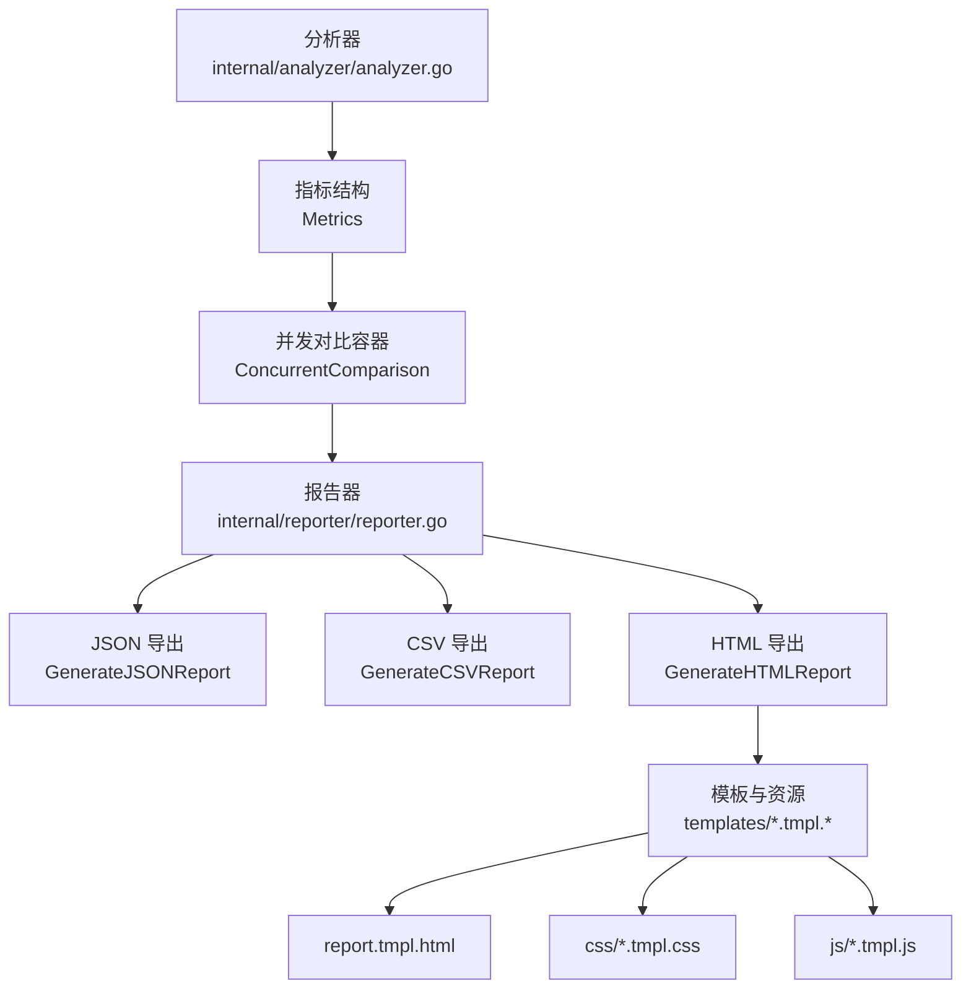
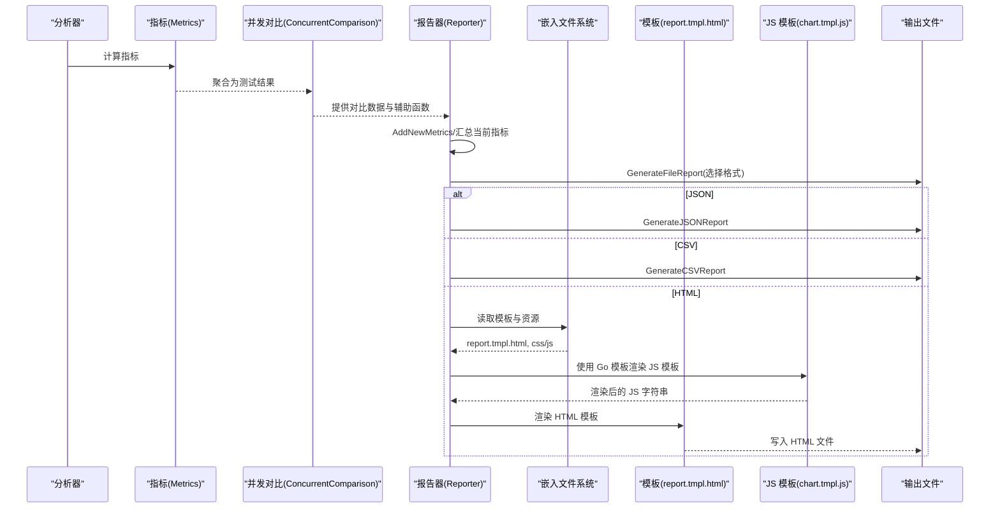
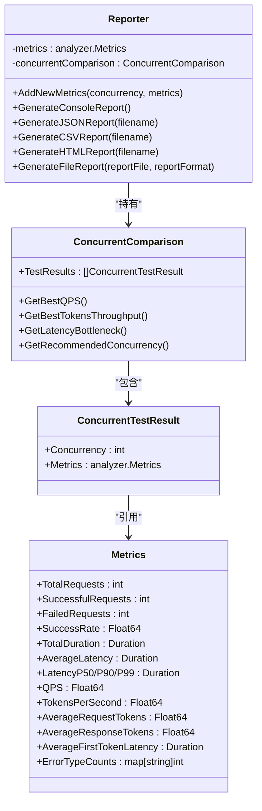
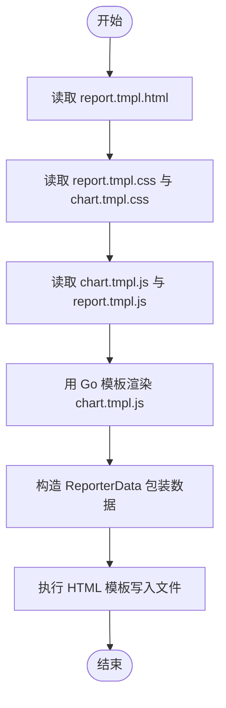
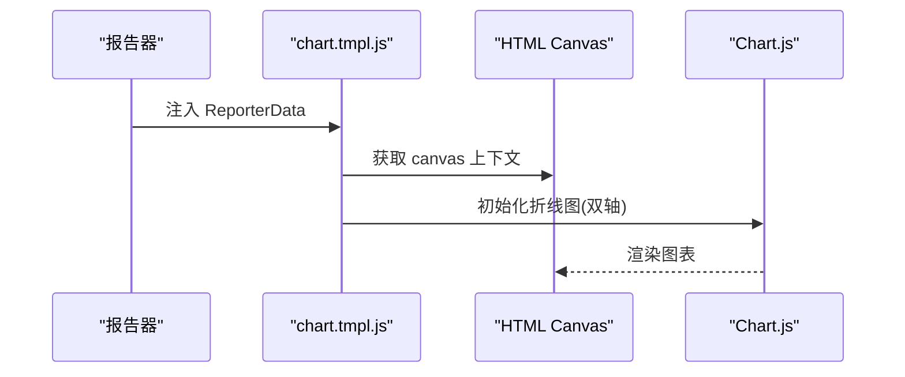
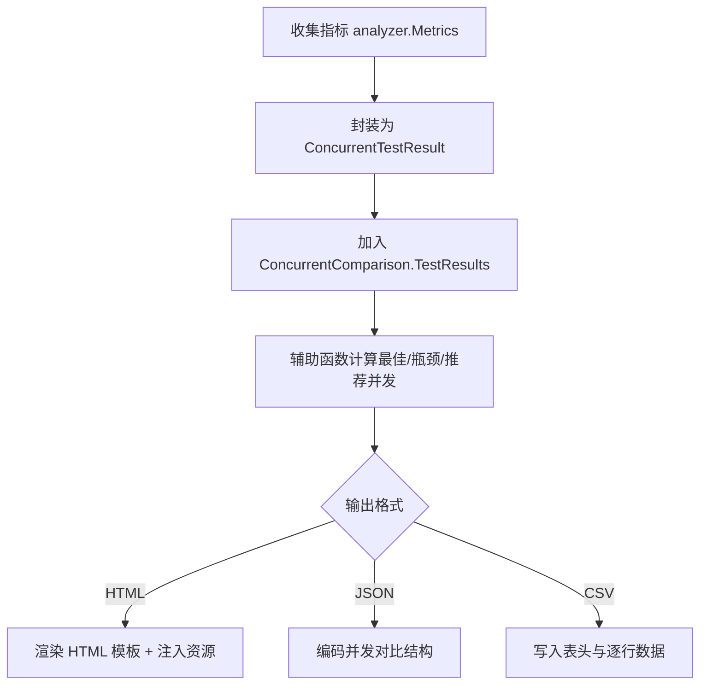
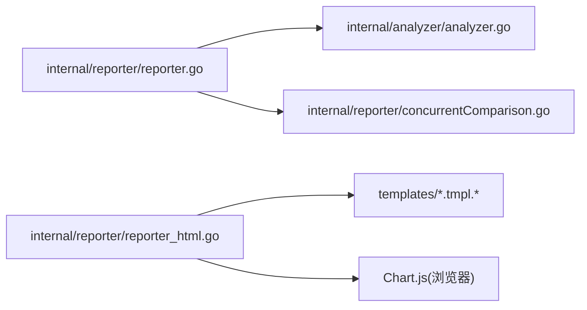

# 自定义报告格式

<cite>
**本文引用的文件**
- [internal/reporter/reporter.go](file://internal/reporter/reporter.go)
- [internal/reporter/reporter_html.go](file://internal/reporter/reporter_html.go)
- [internal/reporter/reporter_csv.go](file://internal/reporter/reporter_csv.go)
- [internal/reporter/reporter_table.go](file://internal/reporter/reporter_table.go)
- [internal/reporter/concurrentComparison.go](file://internal/reporter/concurrentComparison.go)
- [internal/reporter/bottleneck.go](file://internal/reporter/bottleneck.go)
- [internal/reporter/templates/report.tmpl.html](file://internal/reporter/templates/report.tmpl.html)
- [internal/reporter/templates/css/report.tmpl.css](file://internal/reporter/templates/css/report.tmpl.css)
- [internal/reporter/templates/css/chart.tmpl.css](file://internal/reporter/templates/css/chart.tmpl.css)
- [internal/reporter/templates/js/report.tmpl.js](file://internal/reporter/templates/js/report.tmpl.js)
- [internal/reporter/templates/js/chart.tmpl.js](file://internal/reporter/templates/js/chart.tmpl.js)
- [internal/analyzer/analyzer.go](file://internal/analyzer/analyzer.go)
- [configs/example.yaml](file://configs/example.yaml)
</cite>

## 目录
1. [简介](#简介)
2. [项目结构](#项目结构)
3. [核心组件](#核心组件)
4. [架构总览](#架构总览)
5. [详细组件分析](#详细组件分析)
6. [依赖分析](#依赖分析)
7. [性能考虑](#性能考虑)
8. [故障排查指南](#故障排查指南)
9. [结论](#结论)
10. [附录](#附录)

## 简介
本指南面向希望在 GoLLMPerf 中扩展或自定义报告格式的开发者。内容覆盖 Reporter 接口设计与实现、HTML 模板系统（模板语法、数据绑定、样式定制）、CSV/JSON 导出实现、图表生成机制（数据可视化与交互式图表），并提供完整的模板开发示例（HTML/CSS/JavaScript 集成）以及报告数据的组织结构与渲染流程。最后给出最佳实践与性能优化建议。

## 项目结构
GoLLMPerf 的报告子系统位于 internal/reporter 目录，围绕“分析结果 -> 报告生成器 -> 多格式输出”的分层设计展开。核心对象包括：
- 分析器：计算指标（内部类型 Duration/Float64 实现 JSON 序列化）
- 报告器：聚合并发对比数据，生成控制台/文件报告
- 模板系统：HTML 模板 + 嵌入式 CSS/JS；JS 模板通过 Go 模板引擎二次渲染
- 输出格式：JSON、CSV、HTML（默认）

**图示来源**
- [internal/analyzer/analyzer.go:43-75](file://internal/analyzer/analyzer.go#L43-L75)
- [internal/reporter/concurrentComparison.go:15-18](file://internal/reporter/concurrentComparison.go#L15-L18)
- [internal/reporter/reporter.go:25-29](file://internal/reporter/reporter.go#L25-L29)
- [internal/reporter/reporter_html.go:15-75](file://internal/reporter/reporter_html.go#L15-L75)
- [internal/reporter/reporter_csv.go:8-53](file://internal/reporter/reporter_csv.go#L8-L53)
- [internal/reporter/templates/report.tmpl.html:1-204](file://internal/reporter/templates/report.tmpl.html#L1-L204)

**章节来源**
- [internal/reporter/reporter.go:1-130](file://internal/reporter/reporter.go#L1-L130)
- [internal/analyzer/analyzer.go:1-198](file://internal/analyzer/analyzer.go#L1-L198)
- [configs/example.yaml:67-77](file://configs/example.yaml#L67-L77)

## 核心组件
- 报告器 Reporter
  - 职责：聚合并发测试结果，生成控制台与文件报告（JSON/CSV/HTML）
  - 关键方法：AddNewMetrics、GenerateConsoleReport、GenerateJSONReport、GenerateCSVReport、GenerateHTMLReport、GenerateFileReport
- 并发对比 ConcurrentComparison
  - 职责：保存多并发级别的测试结果，并提供瓶颈检测与推荐并发等辅助函数
  - 关键方法：GetBestQPS、GetBestTokensThroughput、GetLatencyBottleneck、GetRecommendedConcurrency 等
- 指标结构 analyzer.Metrics
  - 职责：承载请求总量、成功率、QPS、吞吐、延迟（均值/P50/P90/P99）、首 Token 延迟、Token 统计、错误分布等
  - 特性：Duration/Float64 自定义序列化，确保 JSON 输出精度与单位一致性

**章节来源**
- [internal/reporter/reporter.go:25-130](file://internal/reporter/reporter.go#L25-L130)
- [internal/reporter/concurrentComparison.go:9-288](file://internal/reporter/concurrentComparison.go#L9-L288)
- [internal/analyzer/analyzer.go:43-75](file://internal/analyzer/analyzer.go#L43-L75)

## 架构总览
下图展示从分析器到报告器再到多格式输出的整体流程，以及 HTML 模板与嵌入资源的交互方式。

**图示来源**
- [internal/analyzer/analyzer.go:89-197](file://internal/analyzer/analyzer.go#L89-L197)
- [internal/reporter/concurrentComparison.go:15-18](file://internal/reporter/concurrentComparison.go#L15-L18)
- [internal/reporter/reporter.go:38-129](file://internal/reporter/reporter.go#L38-L129)
- [internal/reporter/reporter_html.go:15-75](file://internal/reporter/reporter_html.go#L15-L75)
- [internal/reporter/templates/report.tmpl.html:1-204](file://internal/reporter/templates/report.tmpl.html#L1-L204)

## 详细组件分析

### Reporter 接口与实现
- 设计要点
  - 聚合层：ReporterData 包装并发对比数据与模板资源字符串，便于模板渲染时直接注入
  - 多格式统一入口：GenerateFileReport 根据后缀自动选择 JSON/CSV/HTML
  - 可扩展性：新增格式只需在 switch 中添加分支并实现对应生成函数
- 数据流
  - AddNewMetrics 将每次并发下的 Metrics 追加到 TestResults
  - GenerateFileReport 负责目录创建、后缀补全与格式分发
  - GenerateHTMLReport 会先用 Go 模板渲染 JS 模板，再渲染 HTML 模板

**图示来源**
- [internal/reporter/reporter.go:25-130](file://internal/reporter/reporter.go#L25-L130)
- [internal/reporter/concurrentComparison.go:9-18](file://internal/reporter/concurrentComparison.go#L9-L18)
- [internal/analyzer/analyzer.go:43-75](file://internal/analyzer/analyzer.go#L43-L75)

**章节来源**
- [internal/reporter/reporter.go:16-130](file://internal/reporter/reporter.go#L16-L130)
- [internal/reporter/concurrentComparison.go:15-288](file://internal/reporter/concurrentComparison.go#L15-L288)

### HTML 模板系统
- 模板加载与嵌入
  - 使用 go:embed 将 templates 目录整体嵌入，运行时通过 ReadFile 读取
  - HTML 模板中通过 {{.ReportTmplCSS}}、{{.ChartTmplCSS}}、{{.ChartTmplJS}}、{{.ReportTmplJS}} 注入样式与脚本
- JS 模板二次渲染
  - 先用 Go 模板解析并执行 chart.tmpl.js，得到带数据的 JS 字符串，再注入到 HTML 模板中
- 模板语法与数据绑定
  - 使用 range 遍历测试结果，使用条件判断高亮最佳/瓶颈项
  - 支持国际化标签 data-i18n，配合 report.tmpl.js 动态切换语言
- 样式定制
  - report.tmpl.css 定义主题色、卡片布局、表格样式、响应式规则
  - chart.tmpl.css 控制图表容器高度与移动端适配

**图示来源**
- [internal/reporter/reporter_html.go:15-75](file://internal/reporter/reporter_html.go#L15-L75)
- [internal/reporter/templates/report.tmpl.html:10-201](file://internal/reporter/templates/report.tmpl.html#L10-L201)
- [internal/reporter/templates/js/chart.tmpl.js:1-100](file://internal/reporter/templates/js/chart.tmpl.js#L1-L100)
- [internal/reporter/templates/css/report.tmpl.css:1-331](file://internal/reporter/templates/css/report.tmpl.css#L1-L331)
- [internal/reporter/templates/css/chart.tmpl.css:1-19](file://internal/reporter/templates/css/chart.tmpl.css#L1-L19)
- [internal/reporter/templates/js/report.tmpl.js:1-100](file://internal/reporter/templates/js/report.tmpl.js#L1-L100)

**章节来源**
- [internal/reporter/reporter_html.go:12-75](file://internal/reporter/reporter_html.go#L12-L75)
- [internal/reporter/templates/report.tmpl.html:1-204](file://internal/reporter/templates/report.tmpl.html#L1-L204)
- [internal/reporter/templates/js/chart.tmpl.js:1-100](file://internal/reporter/templates/js/chart.tmpl.js#L1-L100)
- [internal/reporter/templates/css/report.tmpl.css:1-331](file://internal/reporter/templates/css/report.tmpl.css#L1-L331)
- [internal/reporter/templates/css/chart.tmpl.css:1-19](file://internal/reporter/templates/css/chart.tmpl.css#L1-L19)
- [internal/reporter/templates/js/report.tmpl.js:1-100](file://internal/reporter/templates/js/report.tmpl.js#L1-L100)

### CSV 格式导出
- 表头字段覆盖并发、请求总数、成功/失败数、成功率、QPS、吞吐、各类延迟（均值/P50/P90/P99）、请求/响应平均 Token 数、首 Token 延迟及其分位数
- 逐行写入，数值格式化由调用方负责，确保可读性与一致性

**章节来源**
- [internal/reporter/reporter_csv.go:8-53](file://internal/reporter/reporter_csv.go#L8-L53)

### JSON 格式导出
- 直接以并发对比结构体为根进行 JSON 编码，缩进友好
- 指标中的 Duration/Float64 已实现精确序列化，保证数值与单位一致

**章节来源**
- [internal/reporter/reporter.go:85-101](file://internal/reporter/reporter.go#L85-L101)
- [internal/analyzer/analyzer.go:13-41](file://internal/analyzer/analyzer.go#L13-L41)

### 图表生成机制
- 数据准备
  - chart.tmpl.js 从 ReporterData.TestResults 读取并发、QPS、Tokens/sec，生成数组
- 图表配置
  - 使用 Chart.js 创建双轴折线图：左侧 Y 轴为 QPS，右侧 Y 轴为 Tokens/sec
  - 支持交互式提示、响应式布局、移动端适配
- 国际化与语言切换
  - report.tmpl.js 提供英文/中文翻译字典与切换逻辑，配合 HTML 模板中的 data-i18n 标签

**图示来源**
- [internal/reporter/templates/js/chart.tmpl.js:1-100](file://internal/reporter/templates/js/chart.tmpl.js#L1-L100)
- [internal/reporter/templates/report.tmpl.html:144-150](file://internal/reporter/templates/report.tmpl.html#L144-L150)

**章节来源**
- [internal/reporter/templates/js/chart.tmpl.js:1-100](file://internal/reporter/templates/js/chart.tmpl.js#L1-L100)
- [internal/reporter/templates/report.tmpl.html:144-150](file://internal/reporter/templates/report.tmpl.html#L144-L150)

### 报告数据组织与渲染流程
- 数据模型
  - ConcurrentTestResult：并发级别 + 对应 Metrics
  - ConcurrentComparison：TestResults 列表 + 辅助查询（最佳 QPS/吞吐、延迟瓶颈、推荐并发）
- 渲染流程
  - HTML：先渲染 JS 模板，再渲染 HTML 模板，注入 CSS/JS 资源
  - JSON/CSV：直接序列化/拼接文本

**图示来源**
- [internal/analyzer/analyzer.go:89-197](file://internal/analyzer/analyzer.go#L89-L197)
- [internal/reporter/concurrentComparison.go:15-288](file://internal/reporter/concurrentComparison.go#L15-L288)
- [internal/reporter/reporter.go:38-129](file://internal/reporter/reporter.go#L38-L129)

**章节来源**
- [internal/reporter/concurrentComparison.go:15-288](file://internal/reporter/concurrentComparison.go#L15-L288)
- [internal/analyzer/analyzer.go:43-75](file://internal/analyzer/analyzer.go#L43-L75)

### 自定义报告格式开发步骤
- 步骤一：定义数据载体
  - 在 ConcurrentComparison 或独立结构中组织需要导出的数据
- 步骤二：实现生成函数
  - 参考 GenerateCSVReport/GenerateJSONReport 的模式，创建新的导出函数
  - 注意：确保路径存在、权限正确、异常返回错误
- 步骤三：注册格式
  - 在 GenerateFileReport 的 switch 中增加新格式分支
- 步骤四：模板与资源（如需 HTML）
  - 若为 HTML，参考 report.tmpl.html 的结构，将数据绑定到模板标签
  - 如需动态 JS，按 chart.tmpl.js 的方式先用 Go 模板渲染，再注入 HTML
  - 样式与交互可复用 chart.tmpl.css 与 report.tmpl.css

**章节来源**
- [internal/reporter/reporter.go:103-129](file://internal/reporter/reporter.go#L103-L129)
- [internal/reporter/reporter_csv.go:8-53](file://internal/reporter/reporter_csv.go#L8-L53)
- [internal/reporter/reporter_html.go:15-75](file://internal/reporter/reporter_html.go#L15-L75)

## 依赖分析
- 组件耦合
  - Reporter 依赖 analyzer.Metrics 与 ConcurrentComparison
  - HTML 导出依赖嵌入式模板与 Chart.js（运行时）
- 外部依赖
  - go:embed：用于将模板与资源打包进二进制
  - text/template：用于 JS 模板的二次渲染
  - Chart.js：浏览器端图表渲染
- 潜在循环依赖
  - 当前未发现循环导入；各模块职责清晰

**图示来源**
- [internal/reporter/reporter.go:10-14](file://internal/reporter/reporter.go#L10-L14)
- [internal/reporter/reporter_html.go:3-13](file://internal/reporter/reporter_html.go#L3-L13)
- [internal/analyzer/analyzer.go:10](file://internal/analyzer/analyzer.go#L10)]

**章节来源**
- [internal/reporter/reporter.go:1-14](file://internal/reporter/reporter.go#L1-L14)
- [internal/reporter/reporter_html.go:1-13](file://internal/reporter/reporter_html.go#L1-L13)

## 性能考虑
- 模板渲染
  - JS 模板二次渲染仅在 HTML 导出时发生，避免重复计算
  - 建议保持模板简洁，减少复杂嵌套与重复变量
- 文件写入
  - JSON/CSV 写入采用逐行/逐段写入，避免大对象一次性缓冲
- 指标序列化
  - Duration/Float64 的自定义序列化已保证精度与单位一致性，避免额外转换开销
- 图表数据
  - 仅在 HTML 模式下生成图表，避免非必要计算

[本节为通用指导，不直接分析具体文件]

## 故障排查指南
- 常见问题
  - 模板读取失败：确认 go:embed 是否正确嵌入 templates 目录
  - HTML 模板渲染失败：检查 {{.}} 绑定字段是否存在，尤其是 ChartTmplJS/ReportTmplJS
  - JSON/CSV 写入失败：确认输出目录存在且有写权限
  - 图表不显示：确认浏览器可访问 Chart.js CDN 或本地资源
- 日志与错误
  - 所有错误均包装为可读的错误信息并返回，便于定位
  - 控制台报告用于快速验证指标是否正常

**章节来源**
- [internal/reporter/reporter_html.go:23-32](file://internal/reporter/reporter_html.go#L23-L32)
- [internal/reporter/reporter_html.go:34-37](file://internal/reporter/reporter_html.go#L34-L37)
- [internal/reporter/reporter.go:85-101](file://internal/reporter/reporter.go#L85-L101)
- [internal/reporter/reporter_csv.go:10-14](file://internal/reporter/reporter_csv.go#L10-L14)

## 结论
GoLLMPerf 的报告系统以清晰的分层设计与嵌入式模板为核心，既支持标准 JSON/CSV 导出，也提供了高度可定制的 HTML 报告能力。通过 ReporterData 包装与 Go 模板二次渲染，开发者可以轻松扩展新的报告格式，并结合 CSS/JS 实现丰富的可视化与交互体验。

## 附录
- 输出配置示例（来自配置文件）
  - 输出格式：json、csv、html
  - 输出路径：./results/report.html
  - 批结果路径：./results/batch_results.jsonl

**章节来源**
- [configs/example.yaml:67-77](file://configs/example.yaml#L67-L77)