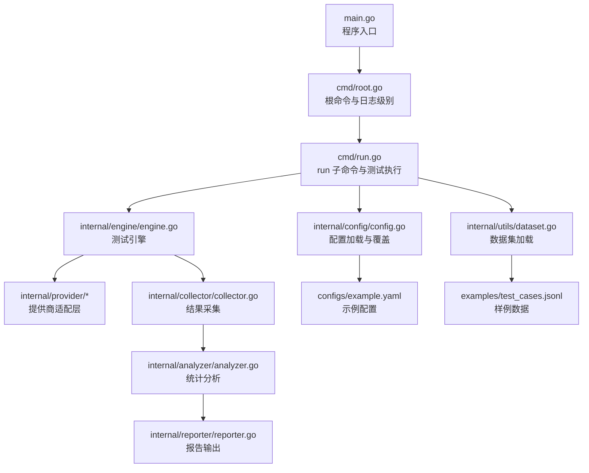
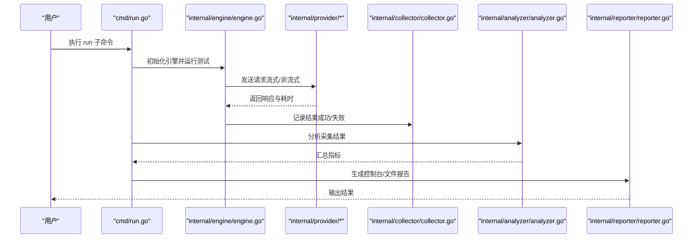
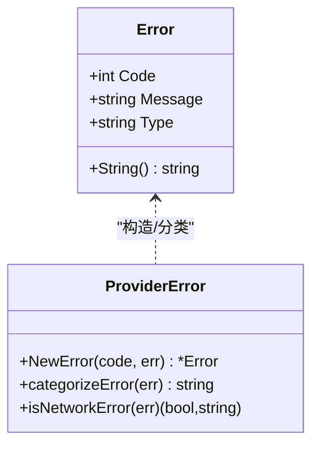
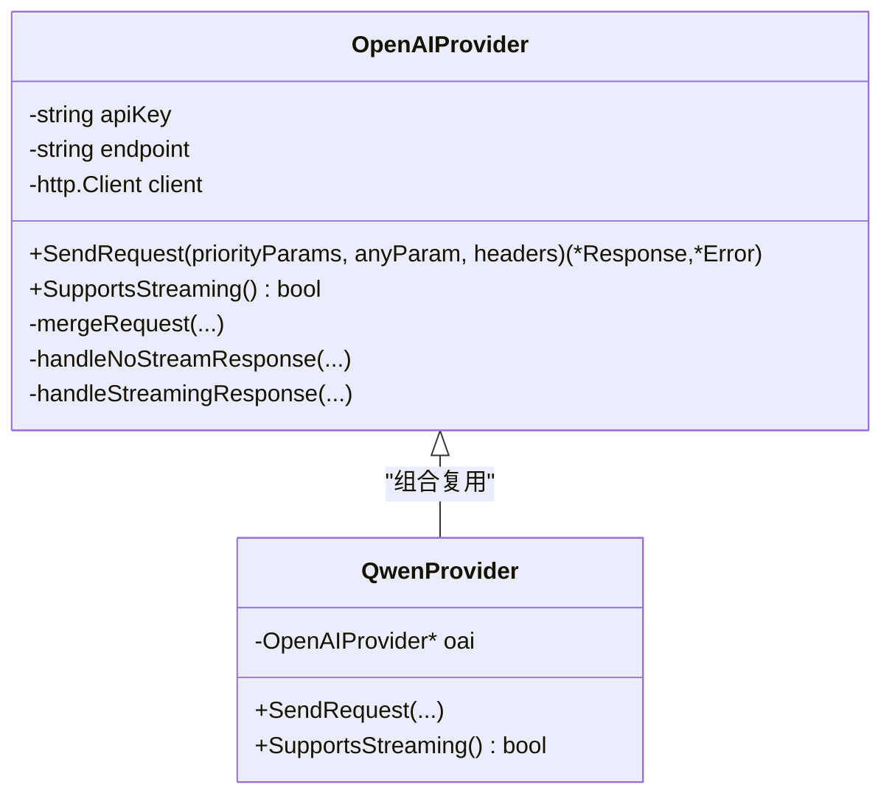
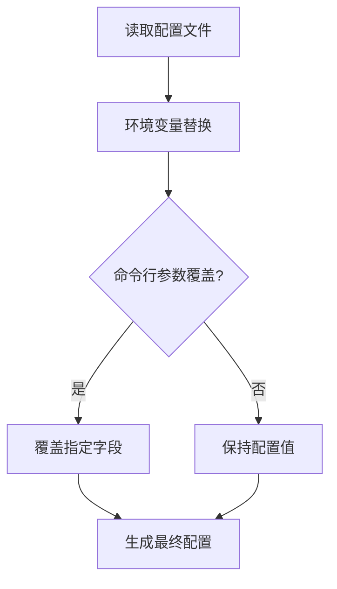
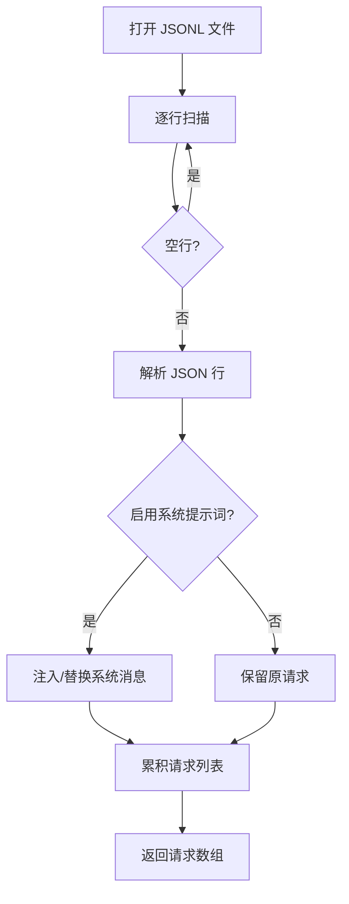
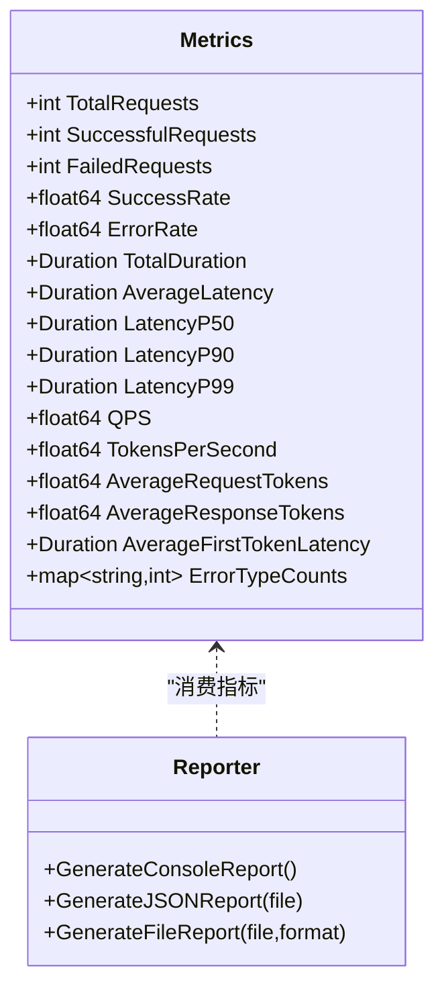
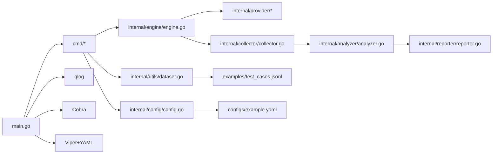

# 故障排除与常见问题

<cite>
**本文引用的文件**
- [main.go](file://main.go)
- [root.go](file://cmd/root.go)
- [run.go](file://cmd/run.go)
- [config.go](file://internal/config/config.go)
- [example.yaml](file://configs/example.yaml)
- [test_cases.jsonl](file://examples/test_cases.jsonl)
- [engine.go](file://internal/engine/engine.go)
- [collector.go](file://internal/collector/collector.go)
- [analyzer.go](file://internal/analyzer/analyzer.go)
- [reporter.go](file://internal/reporter/reporter.go)
- [openai.go](file://internal/provider/openai.go)
- [qwen.go](file://internal/provider/qwen.go)
- [error.go](file://internal/provider/error.go)
- [dataset.go](file://internal/utils/dataset.go)
- [go.mod](file://go.mod)
- [README.md](file://README.md)
- [CONTRIBUTING.md](file://CONTRIBUTING.md)
</cite>

## 目录
1. [简介](#简介)
2. [项目结构](#项目结构)
3. [核心组件](#核心组件)
4. [架构总览](#架构总览)
5. [详细组件分析](#详细组件分析)
6. [依赖关系分析](#依赖关系分析)
7. [性能问题排查与优化建议](#性能问题排查与优化建议)
8. [故障排除指南](#故障排除指南)
9. [结论](#结论)
10. [附录](#附录)

## 简介
本文件面向使用 gollmperf 的用户，提供系统化的故障排除与常见问题解答。内容覆盖配置错误、网络连接问题、性能异常、权限问题等场景，并给出诊断方法、调试技巧、错误类型与代码含义说明、性能排查步骤与优化建议，以及日志分析与问题定位方法。同时列出社区支持渠道与获取帮助的途径。

## 项目结构
gollmperf 采用模块化设计，命令行入口通过 Cobra 提供子命令，核心流程由“引擎-采集-分析-报表”链路组成；提供对 OpenAI/Qwen 等模型服务的统一抽象与错误分类。

图表来源
- [main.go:1-26](file://main.go#L1-L26)
- [root.go:1-28](file://cmd/root.go#L1-L28)
- [run.go:1-123](file://cmd/run.go#L1-L123)
- [engine.go:1-112](file://internal/engine/engine.go#L1-L112)
- [collector.go:1-97](file://internal/collector/collector.go#L1-L97)
- [analyzer.go:1-198](file://internal/analyzer/analyzer.go#L1-L198)
- [reporter.go:1-130](file://internal/reporter/reporter.go#L1-L130)
- [config.go:1-229](file://internal/config/config.go#L1-L229)
- [example.yaml:1-78](file://configs/example.yaml#L1-L78)
- [dataset.go:1-126](file://internal/utils/dataset.go#L1-L126)
- [test_cases.jsonl:1-6](file://examples/test_cases.jsonl#L1-L6)

章节来源
- [README.md:92-109](file://README.md#L92-L109)

## 核心组件
- 命令行与入口
  - 入口初始化日志系统，设置控制台彩色日志与默认级别；根命令提供持久日志级别标志位。
- 配置管理
  - 支持 YAML 配置文件加载、环境变量占位符替换、命令行参数覆盖。
- 引擎与执行
  - 执行预热、并发请求、统计耗时与首 token 耗时；失败时记录错误类型。
- 数据采集与分析
  - 统计总数、成功率、QPS、吞吐、平均/分位延迟、首 token 延迟、错误分布。
- 报表输出
  - 控制台、JSON、CSV、HTML 多格式输出。
- 提供商适配
  - OpenAI/Qwen 统一接口，支持流式与非流式响应处理。
- 数据集加载
  - JSONL 文件逐行解析，可注入系统提示词。

章节来源
- [main.go:11-26](file://main.go#L11-L26)
- [root.go:10-27](file://cmd/root.go#L10-L27)
- [config.go:136-188](file://internal/config/config.go#L136-L188)
- [engine.go:34-112](file://internal/engine/engine.go#L34-L112)
- [collector.go:9-97](file://internal/collector/collector.go#L9-L97)
- [analyzer.go:43-198](file://internal/analyzer/analyzer.go#L43-L198)
- [reporter.go:25-130](file://internal/reporter/reporter.go#L25-L130)
- [openai.go:21-253](file://internal/provider/openai.go#L21-L253)
- [qwen.go:5-35](file://internal/provider/qwen.go#L5-L35)
- [dataset.go:62-126](file://internal/utils/dataset.go#L62-L126)

## 架构总览
下图展示一次 run 测试从命令到结果输出的端到端流程。

图表来源
- [run.go:22-77](file://cmd/run.go#L22-L77)
- [engine.go:88-112](file://internal/engine/engine.go#L88-L112)
- [openai.go:84-144](file://internal/provider/openai.go#L84-L144)
- [collector.go:24-54](file://internal/collector/collector.go#L24-L54)
- [analyzer.go:89-198](file://internal/analyzer/analyzer.go#L89-L198)
- [reporter.go:47-130](file://internal/reporter/reporter.go#L47-L130)

## 详细组件分析

### 错误类型与错误码说明
- 错误封装
  - 内部定义错误结构体，包含 code、message、type 字段；支持将底层错误归类为网络类或原始字符串。
- 错误分类策略
  - 通过关键字匹配判断是否为网络相关错误（如连接被拒、超时、主机不可达等）。
  - 对 JSON 格式的错误体尝试解析，若命中则以 JSON 字符串形式作为错误类型。
- 使用场景
  - 引擎执行请求失败时，将错误写入结果；分析器据此统计错误类型分布。

图表来源
- [error.go:9-79](file://internal/provider/error.go#L9-L79)

章节来源
- [error.go:19-79](file://internal/provider/error.go#L19-L79)

### OpenAI/Qwen 提供商实现
- OpenAIProvider
  - 默认端点与模型名提示；合并请求体、设置鉴权头与自定义头；区分流式与非流式响应处理；记录端到端与首 token 耗时。
- QwenProvider
  - 基于 OpenAIProvider 的兼容实现，默认端点；透传请求与能力查询。

图表来源
- [openai.go:21-253](file://internal/provider/openai.go#L21-L253)
- [qwen.go:5-35](file://internal/provider/qwen.go#L5-L35)

章节来源
- [openai.go:28-48](file://internal/provider/openai.go#L28-L48)
- [openai.go:84-144](file://internal/provider/openai.go#L84-L144)
- [openai.go:146-247](file://internal/provider/openai.go#L146-L247)
- [qwen.go:10-19](file://internal/provider/qwen.go#L10-L19)
- [qwen.go:26-34](file://internal/provider/qwen.go#L26-L34)

### 配置加载与覆盖
- 加载顺序
  - 读取 YAML 配置文件；对 model.name/api_key/endpoint 的占位符进行环境变量替换；随后命令行参数可覆盖配置字段。
- 关键字段
  - test.duration/warmup/concurrency/timeout/perf_concurrency_group
  - model.provider/name/endpoint/api_key/headers/params_template/system_prompt_template
  - dataset.type/path
  - output.format/path/batch_result_path

图表来源
- [config.go:136-188](file://internal/config/config.go#L136-L188)
- [config.go:190-229](file://internal/config/config.go#L190-L229)

章节来源
- [config.go:14-75](file://internal/config/config.go#L14-L75)
- [config.go:136-188](file://internal/config/config.go#L136-L188)
- [config.go:190-229](file://internal/config/config.go#L190-L229)
- [example.yaml:3-78](file://configs/example.yaml#L3-L78)

### 数据集加载与系统提示词注入
- JSONL 解析
  - 逐行扫描与解析，跳过空行；支持大文件缓冲池优化。
- 系统提示词
  - 若启用且存在内容，将系统消息插入 messages 数组首位；若已有系统消息则替换其内容。

图表来源
- [dataset.go:62-126](file://internal/utils/dataset.go#L62-L126)
- [dataset.go:31-60](file://internal/utils/dataset.go#L31-L60)

章节来源
- [dataset.go:62-126](file://internal/utils/dataset.go#L62-L126)
- [test_cases.jsonl:1-6](file://examples/test_cases.jsonl#L1-L6)

### 报告生成与指标
- 指标计算
  - 成功/失败数、成功率/错误率、总时长、QPS、吞吐、平均/分位延迟、首 token 延迟、令牌数统计、错误类型分布。
- 输出格式
  - 控制台、JSON、CSV、HTML；支持并发对比结果聚合。

图表来源
- [analyzer.go:43-198](file://internal/analyzer/analyzer.go#L43-L198)
- [reporter.go:25-130](file://internal/reporter/reporter.go#L25-L130)

章节来源
- [analyzer.go:89-198](file://internal/analyzer/analyzer.go#L89-L198)
- [reporter.go:47-130](file://internal/reporter/reporter.go#L47-L130)

## 依赖关系分析
- 运行时依赖
  - 日志：qlog
  - CLI：Cobra
  - 配置：Viper + YAML
  - 并发：标准库 goroutine/channel
  - HTTP 客户端：标准库 net/http
- 版本与间接依赖
  - Go 版本要求与模块清单见 go.mod。

图表来源
- [go.mod:1-48](file://go.mod#L1-L48)
- [main.go:3-9](file://main.go#L3-L9)
- [root.go:3-6](file://cmd/root.go#L3-L6)
- [run.go:3-14](file://cmd/run.go#L3-L14)

章节来源
- [go.mod:1-48](file://go.mod#L1-L48)

## 性能问题排查与优化建议
- 排查步骤
  - 确认并发与持续时间设置是否合理；检查预热阶段是否通过。
  - 观察首 token 延迟与端到端延迟差异，判断是否为网络或模型侧瓶颈。
  - 查看错误分布，优先解决高频错误类型。
  - 检查输出格式与路径权限，避免 I/O 成为瓶颈。
- 优化建议
  - 合理设置并发组与每次并发的请求数，逐步逼近系统上限。
  - 减少不必要的头部与参数，降低请求体大小。
  - 使用流式响应提升感知延迟体验（若后端支持）。
  - 适当增大 HTTP 超时与连接池参数，避免因超时导致的失败。
  - 将数据集文件放置在本地高 IO 设备，减少磁盘抖动。
  - 在可控环境下开启 DEBUG_LLM_REQUEST/DEBUG_LLM_RESPONSE 以定位请求/响应问题。

章节来源
- [engine.go:49-86](file://internal/engine/engine.go#L49-L86)
- [analyzer.go:116-182](file://internal/analyzer/analyzer.go#L116-L182)
- [openai.go:169-247](file://internal/provider/openai.go#L169-L247)
- [reporter.go:103-130](file://internal/reporter/reporter.go#L103-L130)

## 故障排除指南

### 1. 配置错误
- 现象
  - 启动即报错，无法加载配置或参数不生效。
- 诊断要点
  - 检查配置文件路径与权限；确认 YAML 语法正确。
  - 确认环境变量占位符已被替换（如模型名、API 密钥、端点）。
  - 命令行参数是否覆盖了配置中的关键字段。
- 解决方案
  - 使用默认示例配置文件进行比对修正。
  - 通过命令行参数显式指定 provider/model/dataset/apikey/endpoint/report/format 等。
  - 重新生成默认配置文件用于对照。

章节来源
- [config.go:136-188](file://internal/config/config.go#L136-L188)
- [config.go:190-229](file://internal/config/config.go#L190-L229)
- [example.yaml:1-78](file://configs/example.yaml#L1-L78)
- [run.go:84-95](file://cmd/run.go#L84-L95)

### 2. 网络连接问题
- 现象
  - 请求失败、超时、连接被拒、主机不可达、I/O 超时、上下文超时等。
- 诊断要点
  - 错误类型会被识别为网络相关；检查提供商端点与代理设置。
  - 对比不同并发下的失败率，判断是否为资源限制。
- 解决方案
  - 更换或校验 API 端点；确保网络可达性。
  - 调整超时时间与重试策略；必要时配置代理。
  - 降低并发或分批执行，缓解上游限流/熔断。

章节来源
- [error.go:32-79](file://internal/provider/error.go#L32-L79)
- [openai.go:111-121](file://internal/provider/openai.go#L111-L121)

### 3. 权限与认证问题
- 现象
  - 401/403、鉴权失败、API Key 无效。
- 诊断要点
  - 确认 API Key 是否正确设置；检查提供商名称与端点是否匹配。
- 解决方案
  - 更新配置中的 api_key 或通过命令行覆盖。
  - 如使用自定义端点，请确保与提供商兼容。

章节来源
- [openai.go:100-105](file://internal/provider/openai.go#L100-L105)
- [config.go:157-180](file://internal/config/config.go#L157-L180)

### 4. 数据集加载问题
- 现象
  - JSONL 解析失败、行号错误、空行导致异常。
- 诊断要点
  - 检查文件是否存在、权限是否可读；逐行核对 JSON 结构。
- 解决方案
  - 使用示例数据集进行验证；修复 JSONL 中的非法行。

章节来源
- [dataset.go:82-126](file://internal/utils/dataset.go#L82-L126)
- [test_cases.jsonl:1-6](file://examples/test_cases.jsonl#L1-L6)

### 5. 报告生成与输出问题
- 现象
  - 报告文件未生成、格式不支持、目录无权限。
- 诊断要点
  - 检查输出路径与格式；确认目标目录存在且可写。
- 解决方案
  - 指定正确的 report 路径与 format；确保目录存在。

章节来源
- [reporter.go:103-130](file://internal/reporter/reporter.go#L103-L130)
- [run.go:52-64](file://cmd/run.go#L52-L64)

### 6. 日志与调试
- 日志级别
  - 通过根命令的 loglevel 标志动态调整日志等级。
- 调试开关
  - 开启 DEBUG_LLM_REQUEST/DEBUG_LLM_RESPONSE 可打印请求/响应详情。
- 建议
  - 在问题定位阶段临时提高日志级别，收集更细粒度信息。

章节来源
- [root.go:17-27](file://cmd/root.go#L17-L27)
- [main.go:11-18](file://main.go#L11-L18)
- [openai.go:17-19](file://internal/provider/openai.go#L17-L19)

### 7. 常见错误类型与含义
- 网络类错误
  - 包括连接被拒、超时、主机不可达、I/O 超时、上下文超时等；通常与网络环境或上游限流有关。
- 非网络类错误
  - 解析失败、状态码非 200、响应体解析异常等；需检查请求体与响应体格式。
- 错误类型统计
  - 分析器会按“错误码:类型”进行聚合统计，便于快速定位问题类别。

章节来源
- [error.go:32-79](file://internal/provider/error.go#L32-L79)
- [analyzer.go:184-194](file://internal/analyzer/analyzer.go#L184-L194)

### 8. 社区支持与获取帮助
- 提交 Issue
  - 清晰描述问题、复现步骤、期望与实际行为、截图或错误信息、环境信息。
- 功能建议
  - 在 GitHub 上提交新特性建议，说明收益与与项目目标契合度。
- 贡献代码
  - Fork 仓库、创建分支、遵循代码风格与测试规范、提交 PR。
- 联系方式
  - 项目维护者邮箱联系方式见贡献指南。

章节来源
- [CONTRIBUTING.md:5-56](file://CONTRIBUTING.md#L5-L56)

## 结论
通过上述系统化的问题排查与优化建议，用户可以快速定位并解决 gollmperf 使用过程中的配置、网络、性能与权限等问题。建议在日常使用中结合日志与调试开关，配合合理的并发与超时设置，获得稳定可靠的性能评估结果。

## 附录

### A. 常用命令与参数速查
- 运行压力测试/批量测试/性能模式
  - run 子命令支持 --batch/--perf/--config 等参数；命令行参数可覆盖配置文件字段。
- 日志级别
  - 通过根命令的 loglevel 标志设置全局日志等级。
- 报告输出
  - 支持 json/csv/html 格式；可指定输出路径与文件名。

章节来源
- [README.md:111-156](file://README.md#L111-L156)
- [run.go:84-95](file://cmd/run.go#L84-L95)
- [root.go:17-27](file://cmd/root.go#L17-L27)
- [reporter.go:103-130](file://internal/reporter/reporter.go#L103-L130)