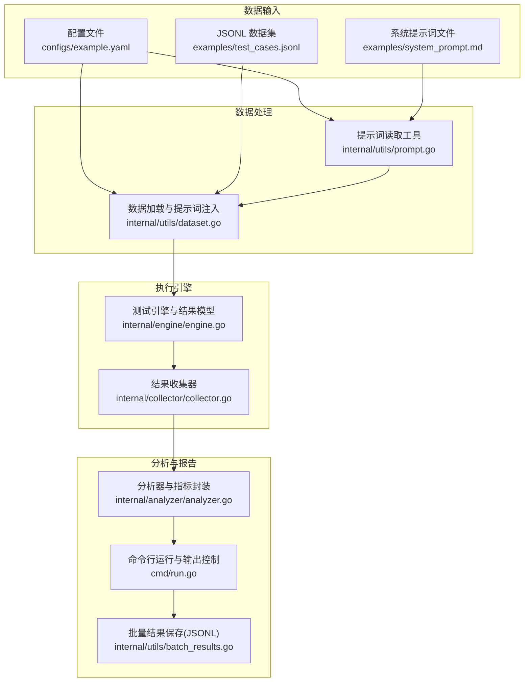
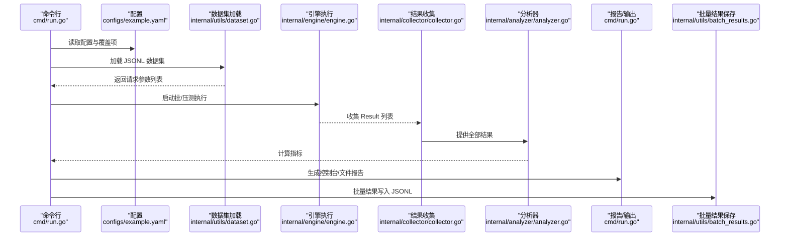
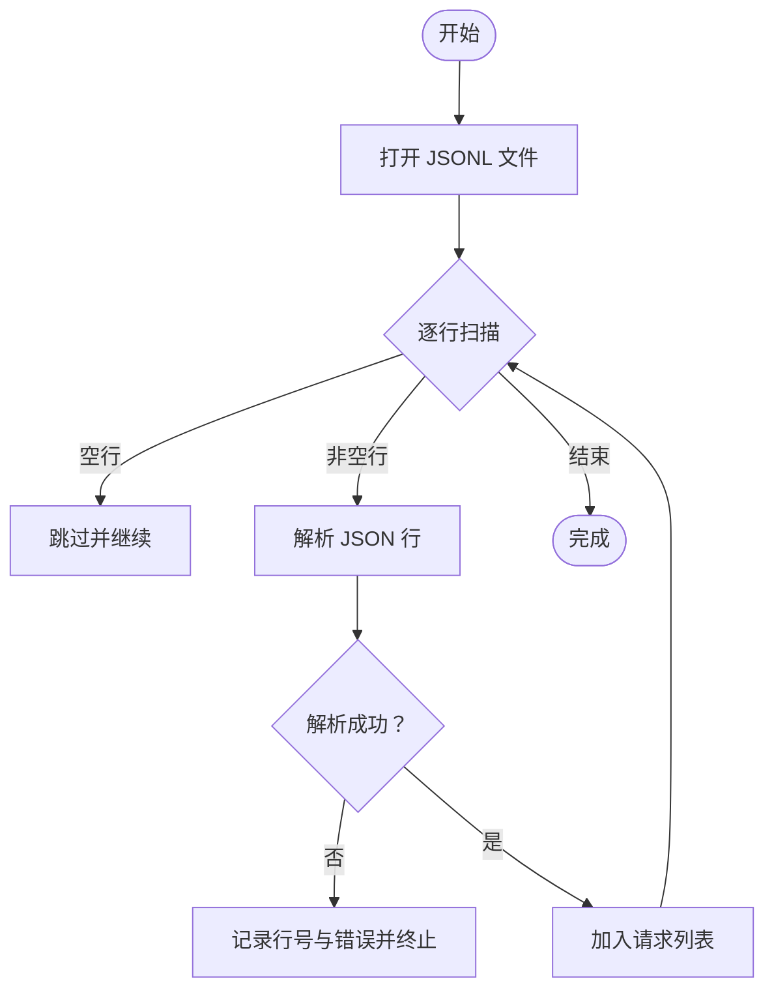
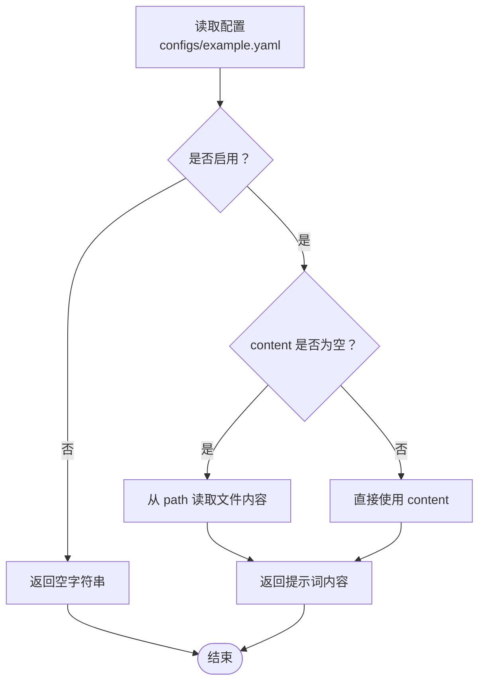
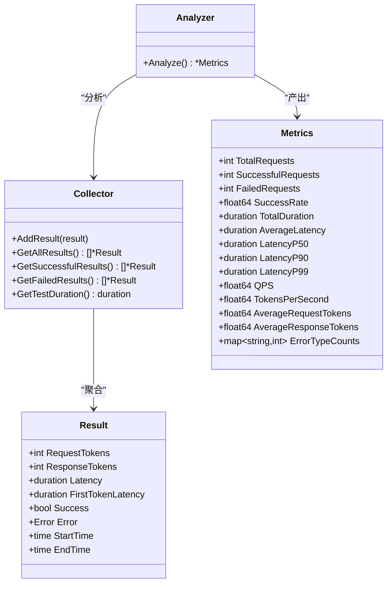
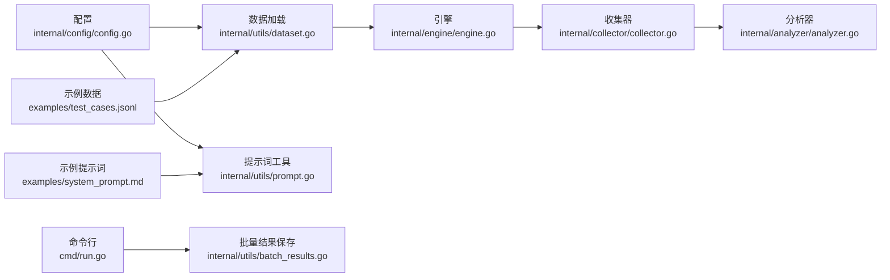

# 数据管理

<cite>
**本文引用的文件**
- [internal/utils/dataset.go](file://internal/utils/dataset.go)
- [internal/utils/batch_results.go](file://internal/utils/batch_results.go)
- [examples/test_cases.jsonl](file://examples/test_cases.jsonl)
- [examples/system_prompt.md](file://examples/system_prompt.md)
- [configs/example.yaml](file://configs/example.yaml)
- [internal/provider/provider.go](file://internal/provider/provider.go)
- [internal/engine/engine.go](file://internal/engine/engine.go)
- [internal/analyzer/analyzer.go](file://internal/analyzer/analyzer.go)
- [cmd/run.go](file://cmd/run.go)
- [internal/collector/collector.go](file://internal/collector/collector.go)
- [internal/config/config.go](file://internal/config/config.go)
- [internal/utils/prompt.go](file://internal/utils/prompt.go)
- [internal/utils/dataset_test.go](file://internal/utils/dataset_test.go)
- [internal/utils/prompt_test.go](file://internal/utils/prompt_test.go)
</cite>

## 目录
1. [简介](#简介)
2. [项目结构](#项目结构)
3. [核心组件](#核心组件)
4. [架构总览](#架构总览)
5. [详细组件分析](#详细组件分析)
6. [依赖分析](#依赖分析)
7. [性能考虑](#性能考虑)
8. [故障排查指南](#故障排查指南)
9. [结论](#结论)
10. [附录](#附录)

## 简介
本章节面向数据管理与测试执行流程，系统性阐述 GoLLMPerf 在 JSONL 测试数据集上的规范、提示词设计与应用、批处理结果的组织与存储，以及配置驱动下的数据流与输出策略。文档同时提供数据隐私与安全传输建议，并给出可操作的实践指南与参考路径。

## 项目结构
围绕“数据管理”的关键目录与文件如下：
- 数据集加载与提示词注入：internal/utils/dataset.go
- 批处理结果保存：internal/utils/batch_results.go
- 示例数据与提示词：examples/test_cases.jsonl、examples/system_prompt.md
- 配置样例：configs/example.yaml
- 请求参数与响应模型：internal/provider/provider.go
- 引擎与结果模型：internal/engine/engine.go
- 分析器与指标封装：internal/analyzer/analyzer.go
- 命令行运行与输出控制：cmd/run.go
- 结果收集器：internal/collector/collector.go
- 配置解析与默认值：internal/config/config.go
- 提示词读取工具：internal/utils/prompt.go
- 单元测试（数据集与提示词）：internal/utils/dataset_test.go、internal/utils/prompt_test.go

图表来源
- [configs/example.yaml:1-78](file://configs/example.yaml#L1-L78)
- [examples/test_cases.jsonl:1-6](file://examples/test_cases.jsonl#L1-L6)
- [examples/system_prompt.md:1-1](file://examples/system_prompt.md#L1-L1)
- [internal/utils/dataset.go:62-80](file://internal/utils/dataset.go#L62-L80)
- [internal/utils/prompt.go:13-41](file://internal/utils/prompt.go#L13-L41)
- [internal/engine/engine.go:13-47](file://internal/engine/engine.go#L13-L47)
- [internal/collector/collector.go:9-22](file://internal/collector/collector.go#L9-L22)
- [internal/analyzer/analyzer.go:77-87](file://internal/analyzer/analyzer.go#L77-L87)
- [cmd/run.go:16-78](file://cmd/run.go#L16-L78)
- [internal/utils/batch_results.go:11-39](file://internal/utils/batch_results.go#L11-L39)

章节来源
- [configs/example.yaml:1-78](file://configs/example.yaml#L1-L78)
- [examples/test_cases.jsonl:1-6](file://examples/test_cases.jsonl#L1-L6)
- [examples/system_prompt.md:1-1](file://examples/system_prompt.md#L1-L1)
- [internal/utils/dataset.go:62-80](file://internal/utils/dataset.go#L62-L80)
- [internal/utils/prompt.go:13-41](file://internal/utils/prompt.go#L13-L41)
- [internal/engine/engine.go:13-47](file://internal/engine/engine.go#L13-L47)
- [internal/collector/collector.go:9-22](file://internal/collector/collector.go#L9-L22)
- [internal/analyzer/analyzer.go:77-87](file://internal/analyzer/analyzer.go#L77-L87)
- [cmd/run.go:16-78](file://cmd/run.go#L16-L78)
- [internal/utils/batch_results.go:11-39](file://internal/utils/batch_results.go#L11-L39)

## 核心组件
- JSONL 数据集加载与提示词注入：支持从 JSONL 文件逐行解析请求参数，并在需要时将系统提示词注入到消息数组首部，确保与不同供应商的消息结构兼容。
- 批处理结果保存：按输入数据集顺序将每个用例的响应或错误以 JSONL 行式写入文件，便于后续离线分析。
- 配置驱动的数据管理：通过 YAML 配置文件统一声明数据集类型/路径、系统提示词模板、输出格式与路径等，支持环境变量替换与命令行覆盖。
- 结果模型与收集：引擎返回统一的 Result 结构，收集器聚合统计，分析器计算指标，最终由命令行流程触发报告生成与批量结果落盘。

章节来源
- [internal/utils/dataset.go:62-125](file://internal/utils/dataset.go#L62-L125)
- [internal/utils/batch_results.go:11-39](file://internal/utils/batch_results.go#L11-L39)
- [configs/example.yaml:49-77](file://configs/example.yaml#L49-L77)
- [internal/engine/engine.go:19-30](file://internal/engine/engine.go#L19-L30)
- [internal/collector/collector.go:9-97](file://internal/collector/collector.go#L9-L97)
- [internal/analyzer/analyzer.go:43-75](file://internal/analyzer/analyzer.go#L43-L75)
- [cmd/run.go:56-64](file://cmd/run.go#L56-L64)

## 架构总览
下图展示从配置到执行再到输出的关键数据流：

图表来源
- [cmd/run.go:16-78](file://cmd/run.go#L16-L78)
- [configs/example.yaml:49-77](file://configs/example.yaml#L49-L77)
- [internal/utils/dataset.go:62-80](file://internal/utils/dataset.go#L62-L80)
- [internal/engine/engine.go:88-111](file://internal/engine/engine.go#L88-L111)
- [internal/collector/collector.go:24-54](file://internal/collector/collector.go#L24-L54)
- [internal/analyzer/analyzer.go:89-197](file://internal/analyzer/analyzer.go#L89-L197)
- [internal/utils/batch_results.go:11-39](file://internal/utils/batch_results.go#L11-L39)

## 详细组件分析

### JSONL 测试数据集规范与最佳实践
- 数据结构定义
  - 每行一条 JSON 对象，表示一次请求的完整参数。
  - 典型字段包括但不限于：messages 数组（每条消息含 role 与 content）、temperature、max_tokens 等。
  - 参考示例文件中的字段与结构。
- 字段说明
  - messages：对话历史或提示序列，首条消息可为 system 角色；若启用系统提示词模板，系统提示会被注入至该数组首位。
  - temperature、max_tokens：采样参数，用于控制生成行为与长度。
- 验证规则
  - 忽略空行，逐行解析 JSON。
  - 解析失败需返回具体行号与错误信息，便于定位问题。
  - 若提供系统提示词，应确保 messages 存在且类型正确。
- 最佳实践
  - 将 messages 设计为最小必要上下文，避免冗余。
  - 为不同任务类型准备多条样例，覆盖边界场景（极短/极长、复杂/简单）。
  - 使用稳定的 temperature 与 max_tokens 组合，保证可重复性。
  - 保持 JSONL 的纯文本格式，避免隐藏字符与编码问题。

图表来源
- [internal/utils/dataset.go:82-125](file://internal/utils/dataset.go#L82-L125)

章节来源
- [examples/test_cases.jsonl:1-6](file://examples/test_cases.jsonl#L1-L6)
- [internal/utils/dataset.go:82-125](file://internal/utils/dataset.go#L82-L125)

### 系统提示词的设计原则与使用方法
- 设计原则
  - 明确角色与职责：限定助手身份、能力范围与交互风格。
  - 一致性：同一任务类型下，提示词风格与术语保持一致。
  - 可测试性：避免歧义，确保不同并发与模型版本下行为稳定。
- 使用方法
  - 配置中启用 system_prompt_template，并提供 content 或 path。
  - 若同时设置 content 与 path，content 优先。
  - 工具函数会读取内容并在需要时注入到 messages 首部。
- 模板示例
  - 参考示例文件中的提示词内容，作为基础模板进行任务适配。
  - 不同任务类型（如问答、摘要、代码生成）可分别维护独立模板文件。

图表来源
- [configs/example.yaml:49-57](file://configs/example.yaml#L49-L57)
- [internal/utils/prompt.go:13-41](file://internal/utils/prompt.go#L13-L41)
- [examples/system_prompt.md:1-1](file://examples/system_prompt.md#L1-L1)

章节来源
- [configs/example.yaml:49-57](file://configs/example.yaml#L49-L57)
- [internal/utils/prompt.go:13-41](file://internal/utils/prompt.go#L13-L41)
- [examples/system_prompt.md:1-1](file://examples/system_prompt.md#L1-L1)

### 批处理结果的组织与管理
- 结果数据结构
  - 引擎返回统一的 Result 结构，包含请求/响应令牌数、延迟、首次令牌延迟、成功标志与错误信息等。
  - 收集器聚合所有结果，提供统计查询接口。
  - 分析器基于收集器结果计算指标（成功率、QPS、延迟分位数、吞吐等）。
- 存储格式
  - 批处理结果以 JSONL 形式保存，每行对应输入数据集中相同序号的用例。
  - 成功用例写入响应 JSON 字符串，失败用例写入错误 JSON 字符串。
- 输出控制
  - 命令行运行流程根据模式（批/压测/性能）执行测试，生成控制台与文件报告，并在批模式下可选保存批量结果。

图表来源
- [internal/engine/engine.go:19-30](file://internal/engine/engine.go#L19-L30)
- [internal/collector/collector.go:9-97](file://internal/collector/collector.go#L9-L97)
- [internal/analyzer/analyzer.go:43-75](file://internal/analyzer/analyzer.go#L43-L75)

章节来源
- [internal/engine/engine.go:19-30](file://internal/engine/engine.go#L19-L30)
- [internal/collector/collector.go:9-97](file://internal/collector/collector.go#L9-L97)
- [internal/analyzer/analyzer.go:43-75](file://internal/analyzer/analyzer.go#L43-L75)
- [internal/utils/batch_results.go:11-39](file://internal/utils/batch_results.go#L11-L39)
- [cmd/run.go:56-64](file://cmd/run.go#L56-L64)

### 数据集创建、验证与优化指南
- 创建步骤
  - 准备 messages 列表，确保 role 与 content 合法。
  - 选择合适的 temperature 与 max_tokens，保证稳定性与可重复性。
  - 将每条用例写入单行 JSON，形成标准 JSONL 文件。
- 验证方法
  - 使用提供的加载函数逐行解析，检查空行与 JSON 语法。
  - 单元测试覆盖了基本加载逻辑与示例文件读取。
- 优化建议
  - 控制样本多样性与代表性，避免极端分布导致偏差。
  - 使用缓存与池化策略提升大文件读取性能（内部已采用缓冲池）。
  - 在注入系统提示词前先校验 messages 类型，避免运行期异常。

章节来源
- [internal/utils/dataset.go:62-125](file://internal/utils/dataset.go#L62-L125)
- [internal/utils/dataset_test.go:10-35](file://internal/utils/dataset_test.go#L10-L35)

### 配置驱动的数据管理
- 关键配置项
  - test：时长、预热、并发、超时、性能并发组等。
  - model：名称、提供商、端点、头信息、参数模板、系统提示词模板。
  - dataset：类型与路径。
  - output：报告格式与路径、批量结果路径。
- 默认值与环境变量
  - 默认值在配置生成函数中设定，支持通过环境变量替换敏感字段。
  - 命令行可覆盖部分配置项，便于快速试验。

章节来源
- [configs/example.yaml:4-77](file://configs/example.yaml#L4-L77)
- [internal/config/config.go:14-75](file://internal/config/config.go#L14-L75)
- [internal/config/config.go:136-188](file://internal/config/config.go#L136-L188)
- [internal/config/config.go:190-229](file://internal/config/config.go#L190-L229)

## 依赖分析
- 组件耦合
  - 数据加载依赖配置与提示词工具；执行引擎依赖模型参数模板与请求参数；收集器与分析器解耦于执行层。
- 外部依赖
  - YAML 解析、日志、并发控制等通用库。
- 潜在风险
  - JSONL 文件过大时的内存与 I/O 压力；系统提示词注入的类型校验；批量结果与输入数据集的行号一致性。

图表来源
- [internal/config/config.go:136-188](file://internal/config/config.go#L136-L188)
- [internal/utils/dataset.go:62-80](file://internal/utils/dataset.go#L62-L80)
- [internal/utils/prompt.go:13-41](file://internal/utils/prompt.go#L13-L41)
- [examples/test_cases.jsonl:1-6](file://examples/test_cases.jsonl#L1-L6)
- [examples/system_prompt.md:1-1](file://examples/system_prompt.md#L1-L1)
- [internal/engine/engine.go:88-111](file://internal/engine/engine.go#L88-L111)
- [internal/collector/collector.go:24-54](file://internal/collector/collector.go#L24-L54)
- [internal/analyzer/analyzer.go:89-197](file://internal/analyzer/analyzer.go#L89-L197)
- [cmd/run.go:56-64](file://cmd/run.go#L56-L64)
- [internal/utils/batch_results.go:11-39](file://internal/utils/batch_results.go#L11-L39)

## 性能考虑
- I/O 与内存
  - JSONL 逐行扫描与缓冲池复用有助于降低内存峰值与 GC 压力。
- 并发与吞吐
  - 通过配置并发度与预热阶段，减少冷启动影响；分析器按成功结果计算指标，避免失败干扰。
- 结果落盘
  - 批量结果按顺序写入，适合后续离线分析与对比。

章节来源
- [internal/utils/dataset.go:14-29](file://internal/utils/dataset.go#L14-L29)
- [internal/analyzer/analyzer.go:116-162](file://internal/analyzer/analyzer.go#L116-L162)
- [internal/utils/batch_results.go:11-39](file://internal/utils/batch_results.go#L11-L39)

## 故障排查指南
- JSONL 解析错误
  - 定位到具体行号，检查 JSON 语法与字段类型；确认 messages 存在且为数组。
- 系统提示词未生效
  - 检查配置中是否启用、content 与 path 的优先级；确认文件路径存在且可读。
- 批量结果缺失
  - 确认命令行是否处于批模式且启用了批量结果保存；检查输出路径权限与磁盘空间。
- 报告生成失败
  - 查看命令行日志中的错误信息，确认输出格式与路径有效。

章节来源
- [internal/utils/dataset.go:113-115](file://internal/utils/dataset.go#L113-L115)
- [internal/utils/prompt.go:28-38](file://internal/utils/prompt.go#L28-L38)
- [cmd/run.go:56-64](file://cmd/run.go#L56-L64)

## 结论
GoLLMPerf 通过配置驱动与清晰的数据流设计，实现了从 JSONL 数据集到执行、分析与输出的闭环。遵循本文规范与最佳实践，可在保证可重复性与可追溯性的前提下高效开展 LLM 性能评测与质量评估。

## 附录
- 实际案例与参考路径
  - 示例数据集与提示词：[examples/test_cases.jsonl:1-6](file://examples/test_cases.jsonl#L1-L6)、[examples/system_prompt.md:1-1](file://examples/system_prompt.md#L1-L1)
  - 配置样例：[configs/example.yaml:1-78](file://configs/example.yaml#L1-L78)
  - 数据加载与提示词注入：[internal/utils/dataset.go:62-80](file://internal/utils/dataset.go#L62-L80)
  - 批量结果保存：[internal/utils/batch_results.go:11-39](file://internal/utils/batch_results.go#L11-39)
  - 提示词读取工具：[internal/utils/prompt.go:13-41](file://internal/utils/prompt.go#L13-41)
  - 引擎与结果模型：[internal/engine/engine.go:19-30](file://internal/engine/engine.go#L19-L30)
  - 结果收集与分析：[internal/collector/collector.go:9-97](file://internal/collector/collector.go#L9-L97)、[internal/analyzer/analyzer.go:89-197](file://internal/analyzer/analyzer.go#L89-L197)
  - 命令行运行与输出：[cmd/run.go:16-78](file://cmd/run.go#L16-L78)