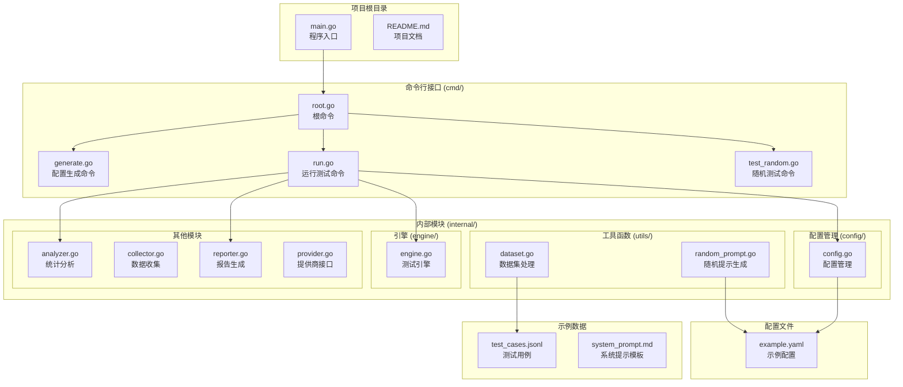
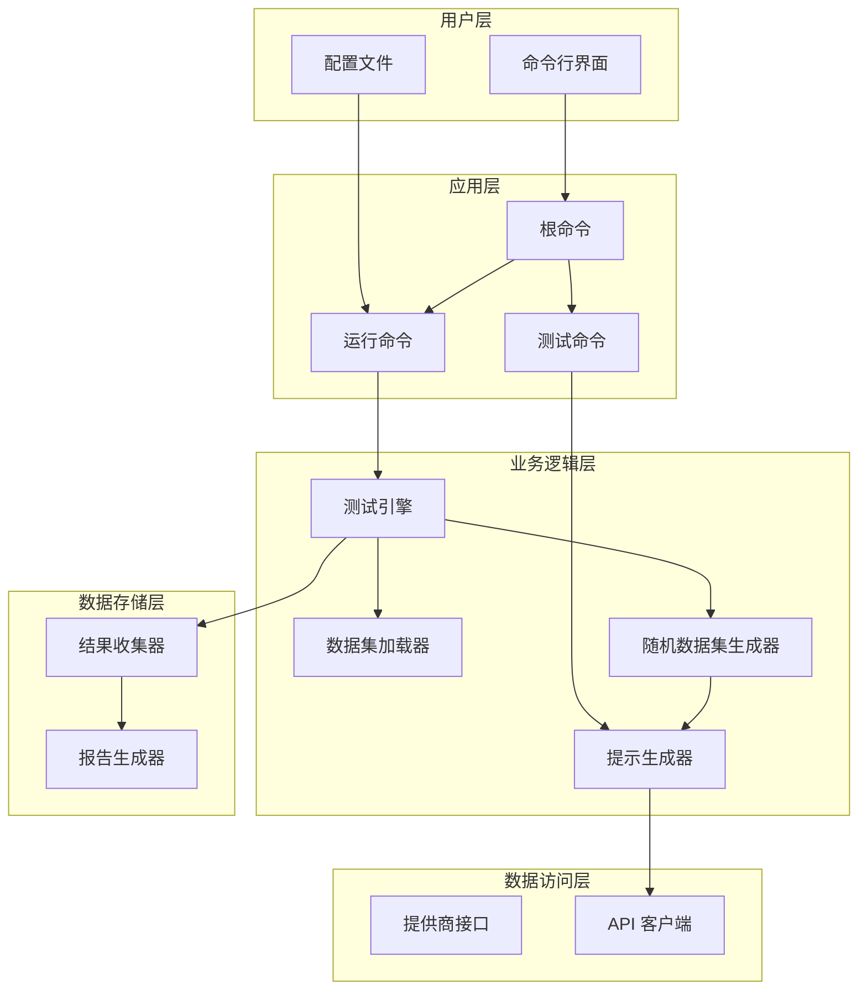
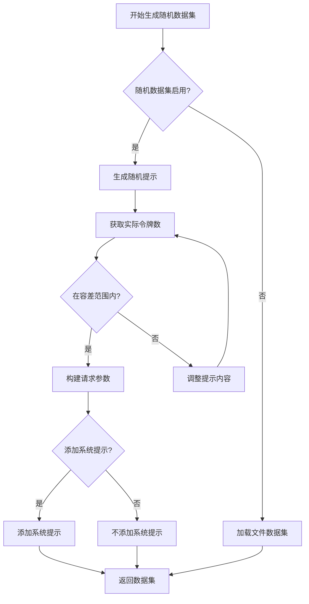
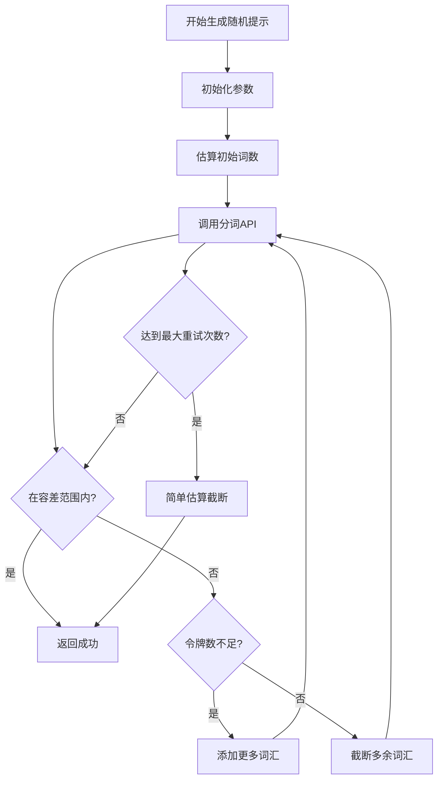
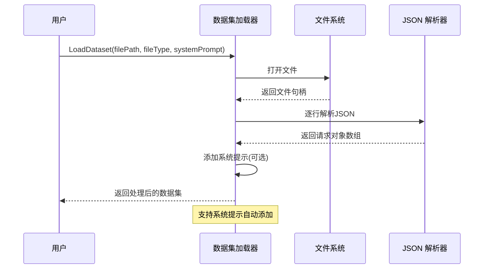
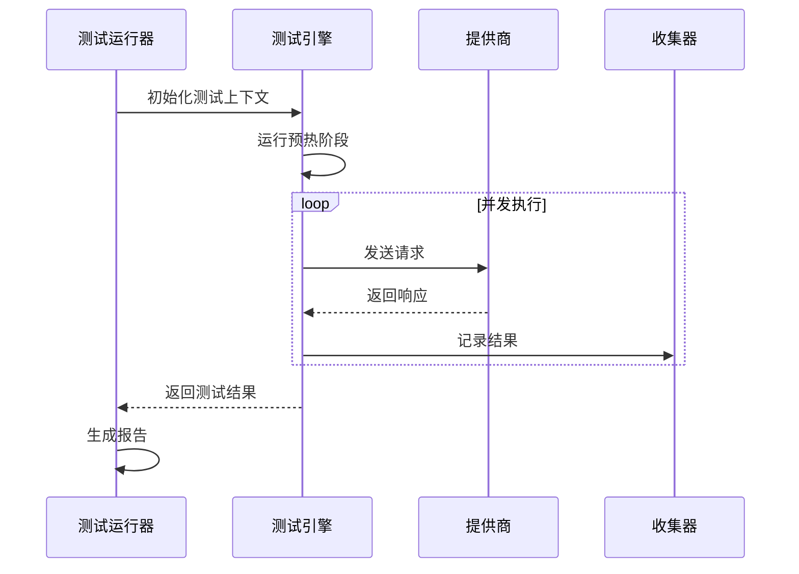
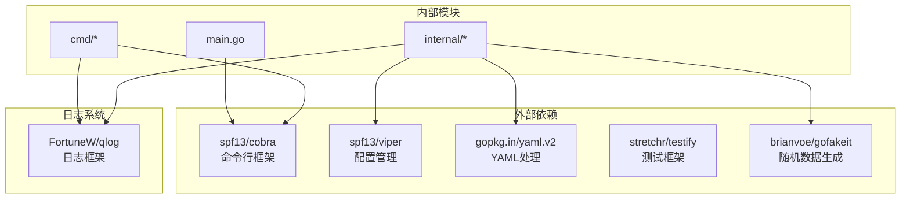

# 随机数据集生成

<cite>
**本文档引用的文件**
- [main.go](file://main.go)
- [root.go](file://cmd/root.go)
- [generate.go](file://cmd/generate.go)
- [run.go](file://cmd/run.go)
- [run_flags.go](file://cmd/run_flags.go)
- [test_random.go](file://cmd/test_random.go)
- [test_context.go](file://cmd/test_context.go)
- [config.go](file://internal/config/config.go)
- [dataset.go](file://internal/utils/dataset.go)
- [random_prompt.go](file://internal/utils/random_prompt.go)
- [engine.go](file://internal/engine/engine.go)
- [example.yaml](file://configs/example.yaml)
- [test_cases.jsonl](file://examples/test_cases.jsonl)
- [system_prompt.md](file://examples/system_prompt.md)
- [README.md](file://README.md)
</cite>

## 更新摘要
**变更内容**
- 新增 vLLM 性能测试专用的随机数据集生成功能
- 添加三个新的命令行标志：`--random-enable`、`--random-input-len`、`--random-output-len`
- 新增 `test-random` 命令用于测试随机提示生成功能
- 新增 `random_dataset_vllm` 配置部分
- 添加详细的使用示例和配置说明

## 目录
1. [简介](#简介)
2. [项目结构](#项目结构)
3. [核心组件](#核心组件)
4. [架构概览](#架构概览)
5. [详细组件分析](#详细组件分析)
6. [依赖关系分析](#依赖关系分析)
7. [性能考虑](#性能考虑)
8. [故障排除指南](#故障排除指南)
9. [结论](#结论)

## 简介

gollmperf 是一个专业的大型语言模型(LM) API 性能测试工具，专门用于准确评估和基准测试 LLM 的性能表现。该工具支持多种 LLM 提供商，提供多维度性能指标，并具备企业级测试能力。

**更新** 新增了 vLLM 性能测试专用的随机数据集生成功能，允许用户创建具有精确令牌数量控制的随机测试数据，特别适用于 vLLM 模型的性能基准测试。

本项目的核心功能包括：
- 多维度性能测试：吞吐量、延迟、质量、稳定性测试
- 多模型支持：OpenAI、Qwen、自定义 API 端点
- 先进的测试模式：基础测试、压力测试、性能测试、稳定性测试、对比测试
- 专业指标：TTFT、TPS、成功率、错误分析
- 多种报告输出：实时控制台输出、JSON、CSV、HTML 可视化报告
- **新增** 随机数据集生成：为 vLLM 性能测试生成精确令牌数量的随机提示

## 项目结构



**图表来源**
- [main.go:1-26](file://main.go#L1-L26)
- [root.go:1-28](file://cmd/root.go#L1-L28)
- [generate.go:1-26](file://cmd/generate.go#L1-L26)
- [run.go:1-131](file://cmd/run.go#L1-L131)
- [config.go:1-245](file://internal/config/config.go#L1-L245)

**章节来源**
- [main.go:1-26](file://main.go#L1-L26)
- [README.md:92-109](file://README.md#L92-L109)

## 核心组件

### 命令行界面 (CLI)

项目使用 Cobra 框架构建命令行界面，提供以下主要命令：

- **根命令**: `gollmperf` - 主要的 CLI 工具入口
- **generate**: 生成默认配置文件
- **run**: 运行批量或压力测试
- **test-random**: **新增** 测试随机提示生成功能

**更新** 新增了三个关键的命令行标志：
- `--random-enable`: 启用随机数据集生成功能
- `--random-input-len`: 设置随机输入的令牌长度
- `--random-output-len`: 设置随机输出的令牌长度

### 配置管理系统

配置系统基于 Viper 和 YAML，支持环境变量替换和灵活的配置覆盖机制。

**新增** 随机数据集配置部分 (`random_dataset_vllm`):
- `random-enable`: 是否启用随机数据集生成
- `random-input-len`: 输入令牌长度目标值
- `random-output-len`: 输出令牌长度目标值

### 数据集处理模块

提供 JSONL 格式数据集的加载和处理功能，支持系统提示的自动添加。

**更新** 新增随机数据集生成功能：
- 自动生成具有精确令牌数量的随机提示
- 支持 vLLM 特定的参数配置
- 自动添加系统提示（如果配置）

### 随机提示生成器

专为 vLLM 优化的随机提示生成器，能够精确控制生成文本的 token 数量。

**更新** 完全重写的随机提示生成器，支持：
- 精确的令牌计数控制（±2% 或 ±10 令牌容差）
- 实时 vLLM 分词 API 验证
- 自适应调整算法
- 安全截断机制

**章节来源**
- [root.go:10-27](file://cmd/root.go#L10-L27)
- [generate.go:8-25](file://cmd/generate.go#L8-L25)
- [run.go:90-103](file://cmd/run.go#L90-L103)
- [config.go:14-80](file://internal/config/config.go#L14-L80)
- [config.go:130-135](file://internal/config/config.go#L130-L135)
- [dataset.go:63-80](file://internal/utils/dataset.go#L63-L80)
- [random_prompt.go:32-113](file://internal/utils/random_prompt.go#L32-L113)

## 架构概览



**图表来源**
- [engine.go:13-47](file://internal/engine/engine.go#L13-L47)
- [run.go:16-82](file://cmd/run.go#L16-L82)
- [test_random.go:11-87](file://cmd/test_random.go#L11-L87)
- [test_context.go:106-142](file://cmd/test_context.go#L106-L142)

## 详细组件分析

### 随机数据集生成器

**新增** 随机数据集生成器是 vLLM 性能测试的核心组件，能够自动生成具有精确令牌数量控制的随机测试数据。

#### 核心算法流程



**图表来源**
- [test_context.go:106-142](file://cmd/test_context.go#L106-L142)
- [random_prompt.go:32-113](file://internal/utils/random_prompt.go#L32-L113)

#### 关键特性

1. **精确的令牌计数控制**: 使用 vLLM 的 `/tokenize` 端点进行实时验证
2. **自适应调整算法**: 根据实际分词结果动态调整生成内容
3. **容差控制**: 支持 ±2% 或 ±10 令牌的容差范围
4. **vLLM 优化**: 自动设置 `ignore_eos: true` 和适当的 `max_tokens` 参数
5. **安全截断**: 确保不会截断到单词中间

**章节来源**
- [test_context.go:106-142](file://cmd/test_context.go#L106-L142)
- [random_prompt.go:14-18](file://internal/utils/random_prompt.go#L14-L18)
- [random_prompt.go:32-113](file://internal/utils/random_prompt.go#L32-L113)
- [random_prompt.go:154-178](file://internal/utils/random_prompt.go#L154-L178)

### 随机提示生成器

随机提示生成器是本项目的核心组件之一，专为 vLLM 优化设计，能够精确控制生成文本的 token 数量。

#### 核心算法流程



**图表来源**
- [random_prompt.go:32-113](file://internal/utils/random_prompt.go#L32-L113)
- [random_prompt.go:154-178](file://internal/utils/random_prompt.go#L154-L178)

#### 关键特性

1. **精确的令牌计数控制**: 使用 vLLM 的 `/tokenize` 端点进行实时验证
2. **自适应调整算法**: 根据实际分词结果动态调整生成内容
3. **容差控制**: 支持 ±2% 或 ±10 令牌的容差范围
4. **安全截断**: 确保不会截断到单词中间

**章节来源**
- [random_prompt.go:14-18](file://internal/utils/random_prompt.go#L14-L18)
- [random_prompt.go:32-113](file://internal/utils/random_prompt.go#L32-L113)
- [random_prompt.go:154-178](file://internal/utils/random_prompt.go#L154-L178)

### 数据集处理模块

数据集处理模块负责加载和处理 JSONL 格式的测试数据集。

#### 数据集加载流程



**图表来源**
- [dataset.go:63-80](file://internal/utils/dataset.go#L63-L80)
- [dataset.go:82-125](file://internal/utils/dataset.go#L82-L125)

#### 缓冲池优化

为了提高内存使用效率，实现了自定义的缓冲池：

- 最大容量: 1MB
- 自动复用: 减少内存分配开销
- 安全回收: 确保缓冲区正确重置

**章节来源**
- [dataset.go:14-29](file://internal/utils/dataset.go#L14-L29)
- [dataset.go:63-125](file://internal/utils/dataset.go#L63-L125)

### 配置管理系统

配置管理系统提供了灵活的配置管理功能，支持 YAML 配置文件和环境变量。

#### 配置结构

```mermaid
classDiagram
class Config {
+TestConfig Test
+ModelConfig Model
+DatasetConfig Dataset
+RandomDatasetVLLMConfig RandomDatasetVLLM
+OutputConfig Output
}
class TestConfig {
+duration Duration
+warmup Duration
+concurrency int
+requestsPerConcurrency int
+timeout Duration
+perfConcurrencyGroup []int
}
class ModelConfig {
+name string
+provider string
+endpoint string
+headers map[string]string
+apiKey string
+paramsTemplate map[string]interface{}
+systemPromptTemplate SystemPromptTemplate
}
class RandomDatasetVLLMConfig {
+enable bool
+inputLength int
+outputLength int
}
Config --> TestConfig
Config --> ModelConfig
Config --> RandomDatasetVLLMConfig
```

**图表来源**
- [config.go:86-147](file://internal/config/config.go#L86-L147)
- [config.go:95-103](file://internal/config/config.go#L95-L103)
- [config.go:113-122](file://internal/config/config.go#L113-L122)
- [config.go:130-135](file://internal/config/config.go#L130-L135)

#### 环境变量支持

配置系统支持通过环境变量动态替换敏感信息：

- `LLM_MODEL_NAME`: 模型名称
- `LLM_API_ENDPOINT`: API 端点
- `LLM_API_KEY`: API 密钥

**章节来源**
- [config.go:149-201](file://internal/config/config.go#L149-L201)
- [config.go:170-192](file://internal/config/config.go#L170-L192)

### 测试执行引擎

测试执行引擎负责协调整个测试流程，包括预热、执行测试和结果收集。

#### 测试执行流程



**图表来源**
- [engine.go:49-86](file://internal/engine/engine.go#L49-L86)
- [engine.go:88-111](file://internal/engine/engine.go#L88-L111)

#### 预热机制

预热阶段确保系统达到稳定状态：

- 可配置的预热时长
- 多并发预热请求
- 错误检测和报告

**章节来源**
- [engine.go:49-86](file://internal/engine/engine.go#L49-L86)
- [engine.go:88-111](file://internal/engine/engine.go#L88-L111)

### 测试随机命令

**新增** `test-random` 命令用于独立测试随机提示生成功能，无需运行完整的测试流程。

#### 命令参数

- `-e, --endpoint`: vLLM 端点 URL（例如：http://localhost:63535/v1/chat/completions）
- `-t, --tokens`: 目标令牌数量（默认：1000）
- `-i, --iterations`: 测试迭代次数（默认：3）
- `-v, --verbose`: 显示详细输出，包括提示预览

#### 功能特性

1. **独立测试**: 不需要完整的测试配置即可测试随机生成功能
2. **统计分析**: 提供成功率、平均差异等统计信息
3. **容差验证**: 验证生成的提示是否在指定容差范围内
4. **详细日志**: 支持详细模式显示生成的提示内容

**章节来源**
- [test_random.go:11-95](file://cmd/test_random.go#L11-L95)

## 依赖关系分析



**图表来源**
- [go.mod:5-49](file://go.mod#L5-L49)
- [main.go:3-8](file://main.go#L3-L8)

### 核心依赖说明

1. **Cobra**: 提供命令行界面框架，支持子命令和标志管理
2. **Viper**: 提供配置管理，支持多种格式和环境变量
3. **gofakeit**: 提供高质量的随机数据生成
4. **qlog**: 提供统一的日志记录功能

**章节来源**
- [go.mod:5-49](file://go.mod#L5-L49)

## 性能考虑

### 内存优化策略

1. **缓冲池**: 使用 sync.Pool 减少内存分配开销
2. **流式处理**: JSONL 文件采用逐行扫描方式处理
3. **并发控制**: 通过配置参数精确控制并发度
4. **随机数据集缓存**: 避免重复生成相同的随机提示

### 网络优化

1. **连接复用**: 利用 HTTP 客户端的连接池
2. **超时控制**: 为每个请求设置合理的超时时间
3. **重试机制**: 对临时性错误进行智能重试
4. **分词 API 优化**: 减少不必要的分词调用

### 测试优化

1. **预热阶段**: 确保测试结果的准确性
2. **统计采样**: 收集足够的样本进行统计分析
3. **错误隔离**: 将错误分类和统计
4. **随机数据集生成**: 为 vLLM 性能测试提供标准化的数据

## 故障排除指南

### 常见问题及解决方案

#### 配置文件问题

**问题**: 配置文件加载失败
**解决方案**: 
- 检查 YAML 格式是否正确
- 验证文件路径是否有效
- 确认环境变量已正确设置

#### API 连接问题

**问题**: 无法连接到 LLM API
**解决方案**:
- 验证 API 端点 URL 格式
- 检查网络连接状态
- 确认 API 密钥有效

#### 随机提示生成问题

**问题**: 生成的提示不符合预期的令牌数量
**解决方案**:
- 检查 vLLM 分词服务是否正常
- 调整容差参数
- 增加重试次数

#### vLLM 集成问题

**问题**: vLLM 性能测试失败
**解决方案**:
- 确认 vLLM 端点可访问
- 验证分词端点 `/tokenize` 是否可用
- 检查模型是否正确加载

#### 随机数据集生成问题

**问题**: 随机数据集生成失败
**解决方案**:
- 检查 `--random-enable` 标志是否正确设置
- 验证 `--random-input-len` 和 `--random-output-len` 参数
- 确认 vLLM 端点配置正确

**章节来源**
- [config.go:150-201](file://internal/config/config.go#L150-L201)
- [random_prompt.go:32-113](file://internal/utils/random_prompt.go#L32-L113)
- [test_random.go:23-29](file://cmd/test_random.go#L23-L29)

## 结论

gollmperf 是一个功能完整、架构清晰的 LLM 性能测试工具。其核心优势包括：

1. **精确的随机数据生成**: 通过 vLLM 分词 API 实现精确的令牌数量控制
2. **灵活的配置管理**: 支持多种配置源和环境变量
3. **高效的并发处理**: 优化的内存使用和网络通信
4. **全面的测试覆盖**: 支持多种测试模式和指标
5. **vLLM 专用优化**: 专门为 vLLM 性能测试设计的随机数据集生成功能

**更新** 新增的随机数据集生成功能为 vLLM 性能测试提供了专业、准确且易于使用的解决方案，特别适合需要精确控制输入输出令牌数量的性能基准测试场景。

该项目为 LLM 性能测试提供了专业、准确且易于使用的解决方案，适合各种规模的测试需求。