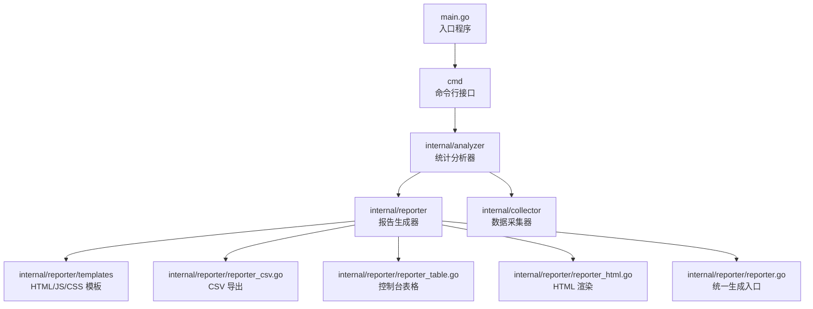
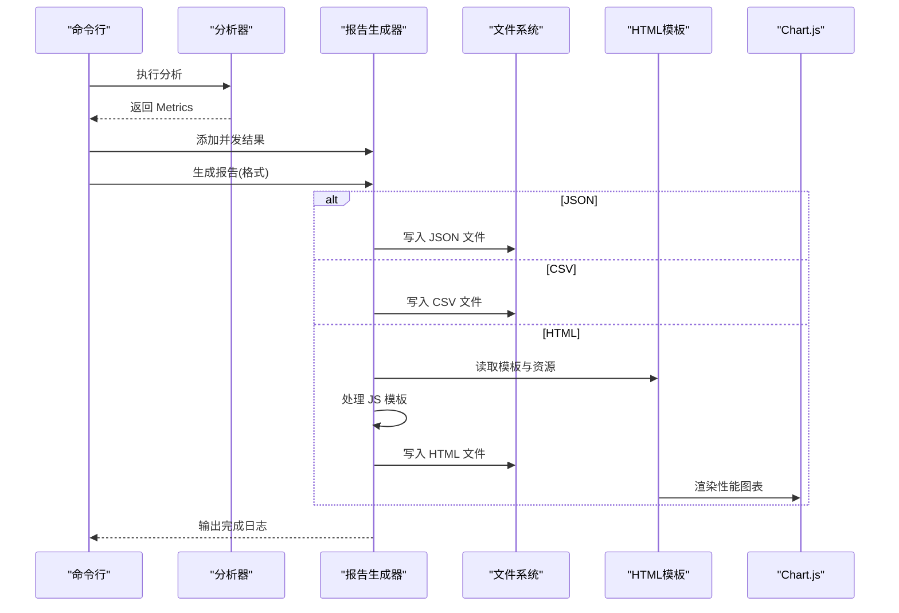
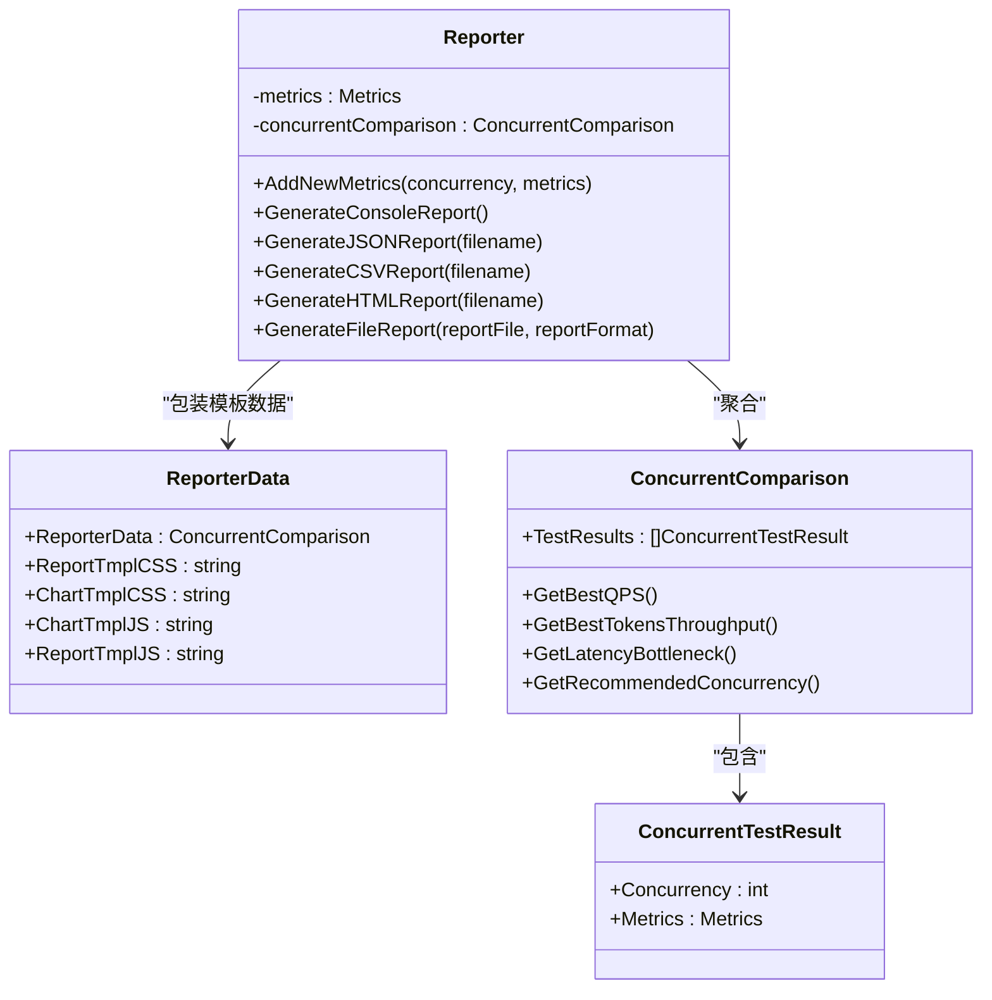
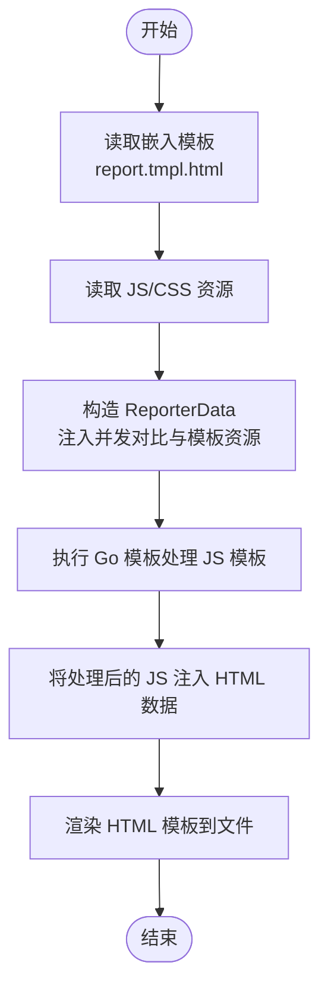
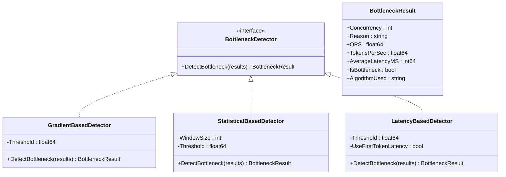
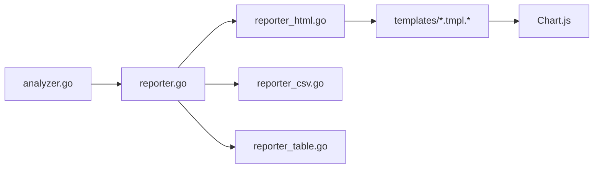

# 报告生成

<cite>
**本文引用的文件**
- [main.go](file://main.go)
- [reporter.go](file://internal/reporter/reporter.go)
- [reporter_html.go](file://internal/reporter/reporter_html.go)
- [reporter_csv.go](file://internal/reporter/reporter_csv.go)
- [reporter_table.go](file://internal/reporter/reporter_table.go)
- [bottleneck.go](file://internal/reporter/bottleneck.go)
- [concurrentComparison.go](file://internal/reporter/concurrentComparison.go)
- [analyzer.go](file://internal/analyzer/analyzer.go)
- [report.tmpl.html](file://internal/reporter/templates/report.tmpl.html)
- [chart.tmpl.js](file://internal/reporter/templates/js/chart.tmpl.js)
- [report.tmpl.js](file://internal/reporter/templates/js/report.tmpl.js)
- [chart.tmpl.css](file://internal/reporter/templates/css/chart.tmpl.css)
- [report.tmpl.css](file://internal/reporter/templates/css/report.tmpl.css)
- [example.yaml](file://configs/example.yaml)
- [test_cases.jsonl](file://examples/test_cases.jsonl)
- [README.md](file://README.md)
</cite>

## 目录
1. [简介](#简介)
2. [项目结构](#项目结构)
3. [核心组件](#核心组件)
4. [架构总览](#架构总览)
5. [详细组件分析](#详细组件分析)
6. [依赖分析](#依赖分析)
7. [性能考虑](#性能考虑)
8. [故障排查指南](#故障排查指南)
9. [结论](#结论)
10. [附录](#附录)

## 简介
本文件面向 GoLLMPerf 报告生成系统，系统性阐述报告生成器的整体架构与多格式支持能力（HTML、CSV、JSON、控制台），深入解析 HTML 报告的模板系统与可视化组件（图表生成、样式定制、交互功能），说明 CSV 与 JSON 的导出机制与数据结构设计，并解释瓶颈分析与并发对比等高级分析功能的实现原理。最后提供报告定制指南与 CI/CD 集成建议。

## 项目结构
- 入口程序负责初始化日志并委托命令行模块执行。
- 报告模块负责将分析结果转换为多种格式输出。
- 分析器模块负责从采集器结果计算各类性能指标。
- 模板系统通过嵌入式资源提供 HTML、JS、CSS 模板，用于渲染可视化报告。
- 配置与示例文件提供运行参数与输出路径示例。

图示来源
- [main.go:1-26](file://main.go#L1-L26)
- [reporter.go:1-130](file://internal/reporter/reporter.go#L1-L130)
- [analyzer.go:1-198](file://internal/analyzer/analyzer.go#L1-L198)

章节来源
- [main.go:1-26](file://main.go#L1-L26)
- [README.md:92-109](file://README.md#L92-L109)

## 核心组件
- 报告生成器（Reporter）：统一管理并发对比数据与多格式输出；提供控制台、JSON、CSV、HTML 输出方法；负责根据扩展名自动补全输出格式。
- 并发对比模型（ConcurrentComparison）：封装多个并发级别的测试结果，提供最佳指标查询与推荐并发算法。
- 瓶颈检测器（BottleneckDetector）：提供基于梯度、统计波动、端到端/首 Token 延迟比率的多种检测算法。
- 统计分析器（Analyzer）：从采集器结果计算基础/时延/吞吐/Token/错误等指标，并对时延进行分位点计算。
- 模板系统：通过 Go 内置 text/template 与 js 运行时模板组合，渲染 HTML 报告与交互脚本。

章节来源
- [reporter.go:25-130](file://internal/reporter/reporter.go#L25-L130)
- [concurrentComparison.go:15-288](file://internal/reporter/concurrentComparison.go#L15-L288)
- [bottleneck.go:8-355](file://internal/reporter/bottleneck.go#L8-L355)
- [analyzer.go:43-198](file://internal/analyzer/analyzer.go#L43-L198)

## 架构总览
报告生成流程从分析器产出 Metrics 开始，Reporter 聚合多并发级别结果，随后按用户选择的格式输出。HTML 报告通过嵌入式模板渲染，内含 Chart.js 图表与国际化脚本；CSV/JSON 则直接序列化结构化数据；控制台输出提供简洁的文本表格。

图示来源
- [reporter.go:85-130](file://internal/reporter/reporter.go#L85-L130)
- [reporter_html.go:15-76](file://internal/reporter/reporter_html.go#L15-L76)
- [reporter_csv.go:8-54](file://internal/reporter/reporter_csv.go#L8-L54)

## 详细组件分析

### 报告生成器（Reporter）
- 数据结构：ReporterData 包装并发对比数据与模板资源字符串；Reporter 维护当前指标与并发对比集合。
- 控制台输出：逐项打印总耗时、请求数、成功率、QPS、吞吐、各类时延与 Token 指标，以及错误分布。
- JSON 输出：使用标准编码器写入缩进格式的并发对比 JSON。
- CSV 输出：固定表头，逐行写入各并发级别的关键指标。
- 文件输出：根据扩展名自动补全格式并分派到对应生成器。

图示来源
- [reporter.go:16-130](file://internal/reporter/reporter.go#L16-L130)
- [concurrentComparison.go:9-18](file://internal/reporter/concurrentComparison.go#L9-L18)

章节来源
- [reporter.go:25-130](file://internal/reporter/reporter.go#L25-L130)

### HTML 报告模板系统与可视化
- 模板嵌入：通过 go:embed 将 report.tmpl.html、chart.tmpl.js、report.tmpl.js、chart.tmpl.css、report.tmpl.css 嵌入二进制。
- 模板数据：ReporterData 将并发对比数据与模板资源注入 HTML 模板；同时先用 Go 模板处理 JS 模板，再将结果回填到 HTML 模板中。
- 图表生成：chart.tmpl.js 读取测试数据，绘制 QPS 与 Tokens/sec 双轴折线图，使用 Chart.js。
- 样式与交互：report.tmpl.css 定义主题色与响应式布局；report.tmpl.js 提供中英双语切换与 i18n 标签替换。
- 报告页面：report.tmpl.html 组织仪表盘、对比表、图表区与错误统计区，配合样式与脚本渲染完整报告。

图示来源
- [reporter_html.go:15-76](file://internal/reporter/reporter_html.go#L15-L76)
- [report.tmpl.html:1-204](file://internal/reporter/templates/report.tmpl.html#L1-L204)
- [chart.tmpl.js:1-100](file://internal/reporter/templates/js/chart.tmpl.js#L1-L100)
- [report.tmpl.js:1-100](file://internal/reporter/templates/js/report.tmpl.js#L1-L100)
- [chart.tmpl.css:1-19](file://internal/reporter/templates/css/chart.tmpl.css#L1-L19)
- [report.tmpl.css:1-331](file://internal/reporter/templates/css/report.tmpl.css#L1-L331)

章节来源
- [reporter_html.go:15-76](file://internal/reporter/reporter_html.go#L15-L76)
- [report.tmpl.html:1-204](file://internal/reporter/templates/report.tmpl.html#L1-L204)

### CSV 导出机制与数据结构
- 表头字段：并发、总请求数、成功/失败数、成功率、QPS、吞吐、平均/分位时延、Token 相关指标等。
- 写入策略：先写入表头，再遍历并发对比结果逐行写入数值；时延与首 Token 时延以毫秒整数形式输出。
- 适用场景：便于导入电子表格或进一步批处理分析。

章节来源
- [reporter_csv.go:8-54](file://internal/reporter/reporter_csv.go#L8-L54)

### 控制台输出与表格
- 控制台直报：打印关键指标与错误分布，适合快速审阅。
- 表格输出：使用第三方库渲染带样式的对比表格，支持失败请求数提示与交替行颜色。

章节来源
- [reporter.go:47-83](file://internal/reporter/reporter.go#L47-L83)
- [reporter_table.go:11-88](file://internal/reporter/reporter_table.go#L11-L88)

### 统计分析器（Metrics 计算）
- 指标覆盖：总请求数、成功/失败数、成功率/错误率、总耗时、平均/分位时延、QPS、吞吐、平均请求/响应 Token 数、首 Token 时延及分位、错误类型分布。
- 时间与浮点精度：Duration/Float64 包装类型在 JSON 序列化时分别输出毫秒整数与时保留三位小数。
- 分位计算：对成功结果按升序排序后计算 P50/P90/P99。

章节来源
- [analyzer.go:43-198](file://internal/analyzer/analyzer.go#L43-L198)

### 瓶颈分析与并发对比
- 并发对比模型：提供最佳 QPS、最佳吞吐、最佳延迟、最佳首 Token 延迟等查询；提供推荐并发算法综合 QPS、吞吐与延迟瓶颈判断。
- 瓶颈检测器：
  - 梯度法：基于 QPS 对并发的斜率阈值判断瓶颈。
  - 统计法：基于滑动窗口系数变异阈值判断波动瓶颈。
  - 延迟比率法：基于端到端/首 Token 延迟增长速率与并发增长速率比值判断瓶颈。
- 推荐并发：综合多种瓶颈与最佳指标，给出“低于瓶颈”“平衡性能”“最大 QPS”等不同策略与理由。

图示来源
- [bottleneck.go:8-124](file://internal/reporter/bottleneck.go#L8-L124)
- [bottleneck.go:126-355](file://internal/reporter/bottleneck.go#L126-L355)

章节来源
- [concurrentComparison.go:111-288](file://internal/reporter/concurrentComparison.go#L111-L288)
- [bottleneck.go:38-124](file://internal/reporter/bottleneck.go#L38-L124)

## 依赖分析
- Reporter 依赖 Analyzer 的 Metrics 结果与并发对比模型。
- HTML 报告依赖嵌入式模板与 Chart.js；JS 模板在运行前由 Go 模板引擎预处理。
- CSV/JSON 输出依赖结构体的 JSON 序列化规则。
- 控制台输出依赖第三方表格与样式库。

图示来源
- [reporter.go:1-130](file://internal/reporter/reporter.go#L1-L130)
- [reporter_html.go:1-76](file://internal/reporter/reporter_html.go#L1-L76)
- [reporter_csv.go:1-54](file://internal/reporter/reporter_csv.go#L1-L54)
- [reporter_table.go:1-88](file://internal/reporter/reporter_table.go#L1-L88)
- [analyzer.go:1-198](file://internal/analyzer/analyzer.go#L1-L198)

章节来源
- [reporter.go:1-130](file://internal/reporter/reporter.go#L1-L130)
- [reporter_html.go:1-76](file://internal/reporter/reporter_html.go#L1-L76)

## 性能考虑
- HTML 模板处理：JS 模板在生成阶段一次性执行，避免运行时重复计算。
- 文件写入：CSV/JSON/HTML 采用顺序写入，注意磁盘 I/O；建议在高并发下合并写入或异步落盘。
- 图表数据规模：当并发级别较多时，JS 侧渲染可能成为瓶颈，可考虑减少数据点或延迟加载。
- 日志与控制台：控制台输出仅在需要时启用，避免在 CI 环境中产生冗余输出。

## 故障排查指南
- 生成失败：检查输出目录权限与路径是否存在；确认格式参数与文件扩展名匹配。
- HTML 报告空白：确认模板资源已正确嵌入且未被构建排除；浏览器控制台查看资源加载错误。
- 图表不显示：检查网络访问与 CDN 加载；确认 Chart.js 已正确引入。
- CSV/JSON 缺失字段：确认并发对比数据是否为空；检查指标计算逻辑是否触发分支（如无成功请求时首 Token 指标为空）。
- 错误统计为空：确认存在失败结果且错误类型可识别。

章节来源
- [reporter.go:103-130](file://internal/reporter/reporter.go#L103-L130)
- [reporter_html.go:15-76](file://internal/reporter/reporter_html.go#L15-L76)
- [reporter_csv.go:8-54](file://internal/reporter/reporter_csv.go#L8-L54)

## 结论
GoLLMPerf 报告生成系统以清晰的模块划分实现了多格式输出与高级分析能力。HTML 报告通过嵌入式模板与 Chart.js 实现可视化与交互；CSV/JSON 提供结构化数据便于二次处理；并发对比与多算法瓶颈检测为性能优化提供决策依据。整体架构易于扩展，可按需新增报告格式与分析维度。

## 附录

### 报告定制指南
- 修改 HTML 模板
  - 调整 report.tmpl.html 中的表格与图表区域布局与字段展示。
  - 修改 report.tmpl.css 自定义主题色、间距与响应式断点。
  - 在 chart.tmpl.css 中调整图表容器高度与移动端适配。
- 定制交互与国际化
  - 在 report.tmpl.js 中扩展翻译词条与语言切换逻辑。
  - 在 chart.tmpl.js 中调整图表类型、颜色与交互行为。
- 新增报告格式
  - 参考 reporter.go 的 GenerateFileReport 与 GenerateJSONReport/GenerateCSVReport 模式，新增格式分支与写入逻辑。
  - 若涉及模板渲染，参考 reporter_html.go 的模板读取与 JS 预处理流程。
- 控制台表格定制
  - 在 reporter_table.go 中调整表头、列宽与样式渲染逻辑。

章节来源
- [report.tmpl.html:1-204](file://internal/reporter/templates/report.tmpl.html#L1-L204)
- [report.tmpl.css:1-331](file://internal/reporter/templates/css/report.tmpl.css#L1-L331)
- [chart.tmpl.css:1-19](file://internal/reporter/templates/css/chart.tmpl.css#L1-L19)
- [report.tmpl.js:1-100](file://internal/reporter/templates/js/report.tmpl.js#L1-L100)
- [chart.tmpl.js:1-100](file://internal/reporter/templates/js/chart.tmpl.js#L1-L100)
- [reporter.go:103-130](file://internal/reporter/reporter.go#L103-L130)
- [reporter_html.go:15-76](file://internal/reporter/reporter_html.go#L15-L76)
- [reporter_csv.go:8-54](file://internal/reporter/reporter_csv.go#L8-L54)
- [reporter_table.go:11-88](file://internal/reporter/reporter_table.go#L11-L88)

### 示例：生成自定义报告
- 使用默认配置生成示例：参考示例配置文件与示例数据集。
- 指定输出格式与路径：在配置文件 output 段设置 format 与 path，或通过命令行参数覆盖。
- 运行测试并生成报告：执行运行命令后，系统会按配置输出对应格式的报告文件。

章节来源
- [example.yaml:67-78](file://configs/example.yaml#L67-L78)
- [test_cases.jsonl:1-6](file://examples/test_cases.jsonl#L1-L6)
- [README.md:111-157](file://README.md#L111-L157)

### 示例：集成到 CI/CD 流程
- 在流水线步骤中执行测试与报告生成，将 HTML/JSON/CSV 产物作为制品保存。
- 使用命令行参数覆盖配置中的关键字段（如 API Key、Endpoint、模型名、输出路径）。
- 在失败时保留报告以便问题复盘。

章节来源
- [README.md:140-157](file://README.md#L140-L157)