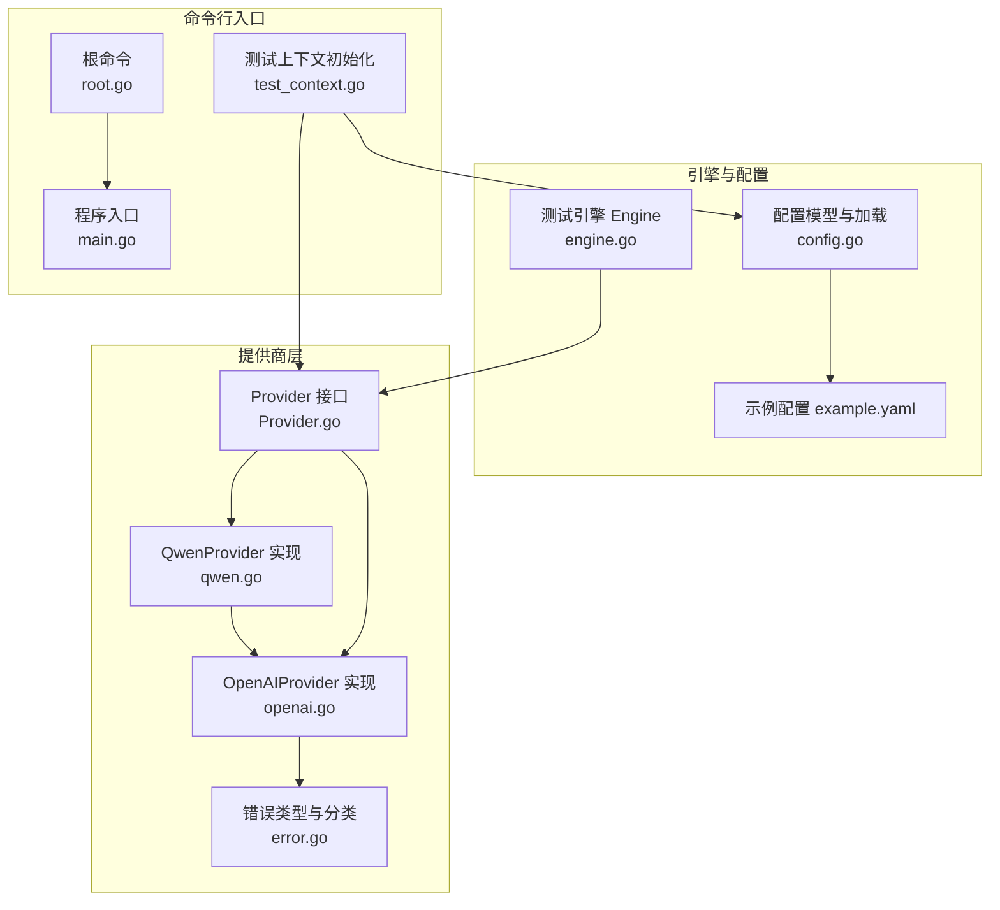
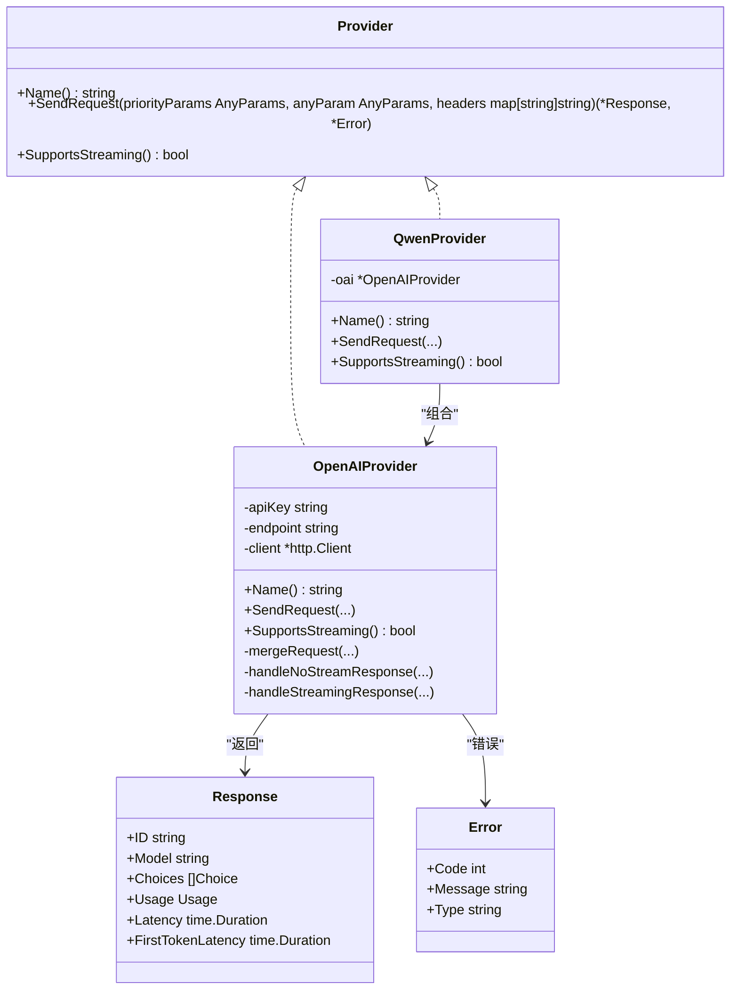
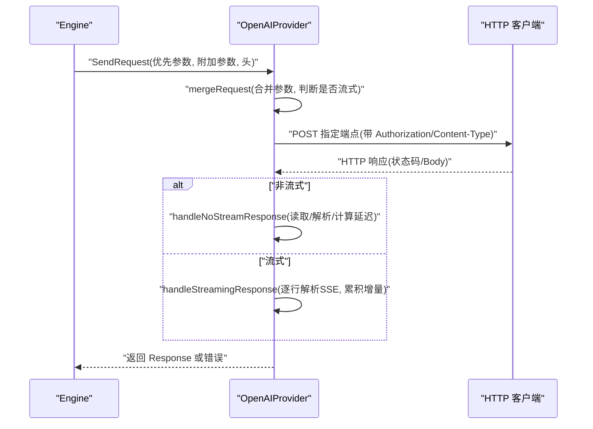
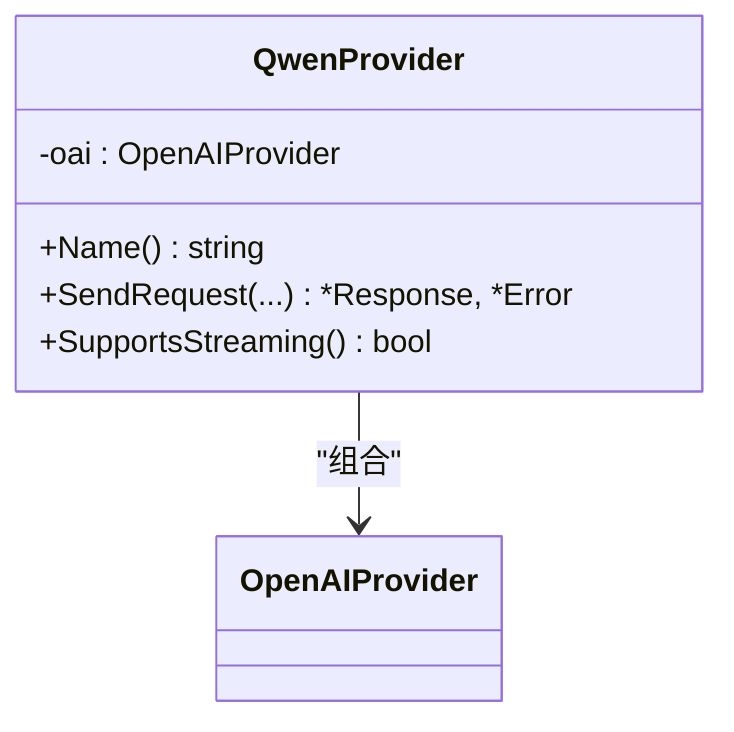
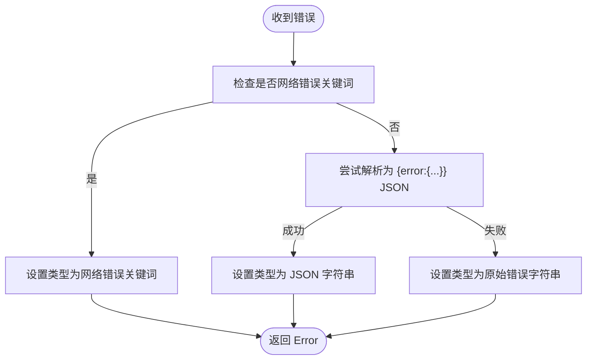
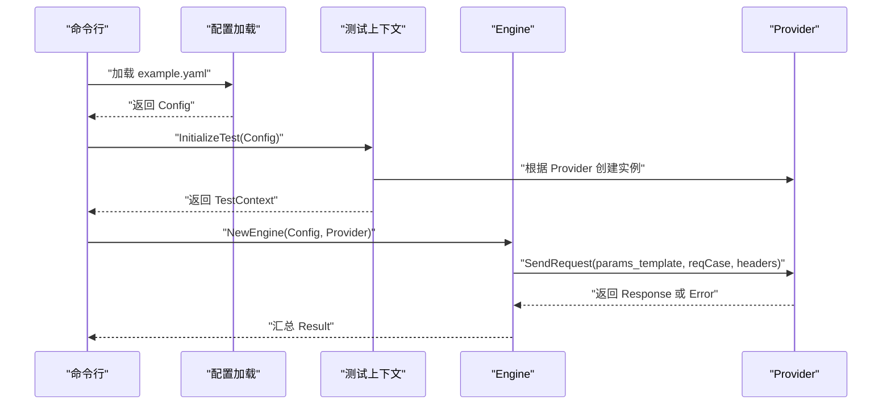
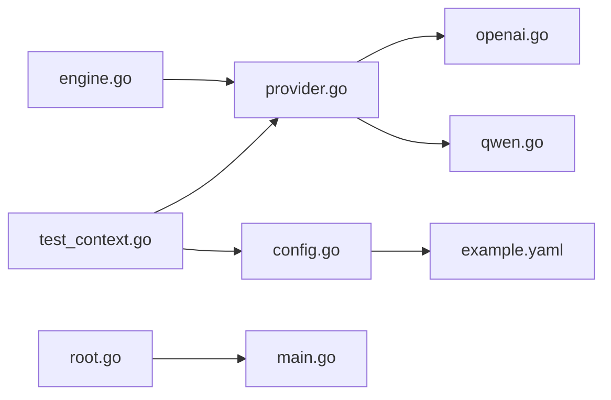

# 提供商接口

<cite>
**本文引用的文件**
- [internal/provider/provider.go](file://internal/provider/provider.go)
- [internal/provider/openai.go](file://internal/provider/openai.go)
- [internal/provider/qwen.go](file://internal/provider/qwen.go)
- [internal/provider/error.go](file://internal/provider/error.go)
- [internal/engine/engine.go](file://internal/engine/engine.go)
- [internal/config/config.go](file://internal/config/config.go)
- [configs/example.yaml](file://configs/example.yaml)
- [cmd/test_context.go](file://cmd/test_context.go)
- [cmd/root.go](file://cmd/root.go)
- [main.go](file://main.go)
- [internal/provider/provider_test.go](file://internal/provider/provider_test.go)
</cite>

## 目录
1. [简介](#简介)
2. [项目结构](#项目结构)
3. [核心组件](#核心组件)
4. [架构总览](#架构总览)
5. [详细组件分析](#详细组件分析)
6. [依赖分析](#依赖分析)
7. [性能考量](#性能考量)
8. [故障排查指南](#故障排查指南)
9. [结论](#结论)
10. [附录](#附录)

## 简介
本文件面向 GoLLMPerf 的“提供商接口”子系统，系统性阐述统一提供商抽象的设计理念、数据结构与方法规范；深入解析 OpenAI 与 Qwen 的具体实现及差异；给出自定义提供商的开发指南与最佳实践；并提供可直接定位到源码的示例路径，帮助快速集成新的 LLM 提供商。

## 项目结构
提供商接口位于 internal/provider 目录，核心由 Provider 接口、通用数据结构（消息、响应、用量）与错误类型组成；OpenAIProvider 与 QwenProvider 分别实现该接口；Engine 在测试执行时通过 Provider 发起请求；Config 与 example.yaml 定义了模型、端点、密钥、头信息与参数模板等配置项；命令行入口在 cmd 包中根据配置选择并初始化对应提供商。

图表来源
- [internal/provider/provider.go:10-20](file://internal/provider/provider.go#L10-L20)
- [internal/provider/openai.go:21-26](file://internal/provider/openai.go#L21-L26)
- [internal/provider/qwen.go:5-8](file://internal/provider/qwen.go#L5-L8)
- [internal/provider/error.go:9-13](file://internal/provider/error.go#L9-L13)
- [internal/engine/engine.go:14-17](file://internal/engine/engine.go#L14-L17)
- [internal/config/config.go:82-116](file://internal/config/config.go#L82-L116)
- [configs/example.yaml:24-48](file://configs/example.yaml#L24-L48)
- [cmd/root.go:10-15](file://cmd/root.go#L10-L15)
- [cmd/test_context.go:64-74](file://cmd/test_context.go#L64-L74)
- [main.go:20-25](file://main.go#L20-L25)

章节来源
- [internal/provider/provider.go:10-71](file://internal/provider/provider.go#L10-L71)
- [internal/provider/openai.go:21-253](file://internal/provider/openai.go#L21-L253)
- [internal/provider/qwen.go:5-35](file://internal/provider/qwen.go#L5-L35)
- [internal/provider/error.go:9-79](file://internal/provider/error.go#L9-L79)
- [internal/engine/engine.go:14-112](file://internal/engine/engine.go#L14-L112)
- [internal/config/config.go:82-188](file://internal/config/config.go#L82-L188)
- [configs/example.yaml:24-48](file://configs/example.yaml#L24-L48)
- [cmd/test_context.go:64-74](file://cmd/test_context.go#L64-L74)
- [cmd/root.go:10-27](file://cmd/root.go#L10-L27)
- [main.go:20-25](file://main.go#L20-L25)

## 核心组件
- 统一提供商接口 Provider：定义名称、发送请求、是否支持流式输出三个能力。
- 通用数据结构：
  - AnyParams：键值对形式的任意参数集合，用于优先参数与附加参数合并。
  - Message：对话消息，包含角色与内容。
  - Choice：一次推理的候选结果，含完整消息或流式增量 delta。
  - Usage：用量统计（提示词、补全、总计）。
  - Response：LLM 响应，包含基础字段与本地计时字段（总延迟、首 token 延迟）。
- 错误类型 Error：封装状态码、消息与类型（网络类或原始 JSON 错误），并提供分类与字符串化。
- 引擎 Engine：持有 Provider 并在执行阶段调用 SendRequest，收集请求/响应用量与延迟。

章节来源
- [internal/provider/provider.go:10-71](file://internal/provider/provider.go#L10-L71)
- [internal/engine/engine.go:19-30](file://internal/engine/engine.go#L19-L30)
- [internal/provider/error.go:9-49](file://internal/provider/error.go#L9-L49)

## 架构总览
提供商接口采用“统一抽象 + 多实现”的设计，OpenAIProvider 直接对接 OpenAI 兼容协议；QwenProvider 通过组合 OpenAIProvider，复用其逻辑，仅替换端点与行为差异（如额外参数）。Engine 通过 Provider 抽象发起请求，不关心具体实现细节。

图表来源
- [internal/provider/provider.go:10-20](file://internal/provider/provider.go#L10-L20)
- [internal/provider/openai.go:21-253](file://internal/provider/openai.go#L21-L253)
- [internal/provider/qwen.go:5-35](file://internal/provider/qwen.go#L5-L35)
- [internal/provider/provider.go:30-41](file://internal/provider/provider.go#L30-L41)
- [internal/provider/error.go:9-13](file://internal/provider/error.go#L9-L13)

## 详细组件分析

### 统一提供商接口与数据模型
- 接口职责清晰：Name 用于标识；SendRequest 负责实际调用；SupportsStreaming 决定是否启用流式处理。
- 参数合并策略：AnyParams 支持两层参数（优先级更高的一层与附加参数），通过映射合并实现覆盖与扩展。
- 响应模型：Response 同时兼容非流式与流式场景，Choice 中的 Delta 字段用于增量拼接；本地字段用于记录端到端延迟与首 token 延迟。

章节来源
- [internal/provider/provider.go:10-20](file://internal/provider/provider.go#L10-L20)
- [internal/provider/provider.go:22-71](file://internal/provider/provider.go#L22-L71)

### OpenAI 提供商实现
- 初始化与默认端点：若未指定 endpoint，则使用 OpenAI 默认聊天补全端点；设置 HTTP 客户端超时与重定向限制。
- 请求合并与发送：mergeRequest 将优先参数与附加参数合并，必要时识别 stream 字段；SendRequest 设置 Authorization 与 Content-Type 头，追加用户自定义头；按状态码判断成功与否。
- 非流式响应：读取完整响应体，解析为 Response，计算总延迟与首 token 延迟（非流式场景下首 token 延迟回填为总延迟）。
- 流式响应：逐行扫描 SSE 数据，解析每条事件，累计增量内容与角色、结束原因；记录首 token 延迟与总延迟；最终组装为单个 Choice 的完整消息。
- 调试开关：可通过环境变量开启请求/响应调试日志。

图表来源
- [internal/engine/engine.go:88-111](file://internal/engine/engine.go#L88-L111)
- [internal/provider/openai.go:84-144](file://internal/provider/openai.go#L84-L144)
- [internal/provider/openai.go:146-167](file://internal/provider/openai.go#L146-L167)
- [internal/provider/openai.go:169-247](file://internal/provider/openai.go#L169-L247)

章节来源
- [internal/provider/openai.go:28-48](file://internal/provider/openai.go#L28-L48)
- [internal/provider/openai.go:84-144](file://internal/provider/openai.go#L84-L144)
- [internal/provider/openai.go:146-167](file://internal/provider/openai.go#L146-L167)
- [internal/provider/openai.go:169-247](file://internal/provider/openai.go#L169-L247)

### Qwen 提供商实现
- 设计思路：Qwen 与 OpenAI 协议高度兼容，仅端点不同；因此采用组合模式，内部持有 OpenAIProvider 实例，委托其完成请求与响应处理。
- 端点默认值：若未指定 endpoint，则使用 Qwen 兼容模式端点。
- 行为一致性：Name、SendRequest、SupportsStreaming 均委托给底层 OpenAIProvider，确保行为一致。

图表来源
- [internal/provider/qwen.go:5-35](file://internal/provider/qwen.go#L5-L35)
- [internal/provider/openai.go:21-26](file://internal/provider/openai.go#L21-L26)

章节来源
- [internal/provider/qwen.go:10-19](file://internal/provider/qwen.go#L10-L19)
- [internal/provider/qwen.go:26-34](file://internal/provider/qwen.go#L26-L34)

### 错误处理与分类
- 错误封装：NewError 将原始错误转为 Error，包含状态码、消息与类型。
- 类型分类：
  - 网络类错误：基于错误字符串关键词匹配（连接拒绝、超时、主机不可达等）。
  - JSON 错误：尝试解析为 { error: {...} } 结构，若命中则以 JSON 字符串作为类型。
  - 其他：保留原始错误字符串。
- 字符串化：便于日志与报告输出。

图表来源
- [internal/provider/error.go:32-49](file://internal/provider/error.go#L32-L49)
- [internal/provider/error.go:51-78](file://internal/provider/error.go#L51-L78)

章节来源
- [internal/provider/error.go:19-49](file://internal/provider/error.go#L19-L49)

### 引擎与配置交互
- 引擎持有 Provider 并在执行阶段调用 SendRequest，从响应中提取用量与延迟，封装为 Result。
- 配置模型包含 Provider 名称、端点、API Key、头信息、参数模板、系统提示模板等；example.yaml 提供示例。
- 命令行入口根据配置选择提供商并初始化测试上下文。

图表来源
- [internal/config/config.go:136-188](file://internal/config/config.go#L136-L188)
- [configs/example.yaml:24-48](file://configs/example.yaml#L24-L48)
- [cmd/test_context.go:64-74](file://cmd/test_context.go#L64-L74)
- [internal/engine/engine.go:88-111](file://internal/engine/engine.go#L88-L111)

章节来源
- [internal/engine/engine.go:34-47](file://internal/engine/engine.go#L34-L47)
- [internal/config/config.go:82-116](file://internal/config/config.go#L82-L116)
- [configs/example.yaml:24-48](file://configs/example.yaml#L24-L48)
- [cmd/test_context.go:64-74](file://cmd/test_context.go#L64-L74)

## 依赖分析
- Provider 接口与数据结构位于 provider 包，被 OpenAIProvider、QwenProvider 与 Engine 引用。
- OpenAIProvider 依赖标准库 net/http、bufio、json、io、os、strings、time；内部通过环境变量控制调试日志。
- QwenProvider 依赖 OpenAIProvider，不引入新外部依赖。
- Engine 依赖 Provider 与 Config，负责执行与结果聚合。
- 配置加载依赖 viper 与 yaml，支持环境变量占位符替换。

图表来源
- [internal/provider/provider.go:10-20](file://internal/provider/provider.go#L10-L20)
- [internal/provider/openai.go:3-14](file://internal/provider/openai.go#L3-L14)
- [internal/provider/qwen.go:3](file://internal/provider/qwen.go#L3)
- [internal/engine/engine.go:8-11](file://internal/engine/engine.go#L8-L11)
- [internal/config/config.go:3-12](file://internal/config/config.go#L3-L12)
- [configs/example.yaml:1-78](file://configs/example.yaml#L1-L78)
- [cmd/test_context.go:3-12](file://cmd/test_context.go#L3-L12)
- [cmd/root.go:3-6](file://cmd/root.go#L3-L6)
- [main.go:3-9](file://main.go#L3-L9)

章节来源
- [internal/provider/openai.go:3-14](file://internal/provider/openai.go#L3-L14)
- [internal/provider/qwen.go:3](file://internal/provider/qwen.go#L3)
- [internal/engine/engine.go:8-11](file://internal/engine/engine.go#L8-L11)
- [internal/config/config.go:3-12](file://internal/config/config.go#L3-L12)
- [cmd/test_context.go:3-12](file://cmd/test_context.go#L3-L12)
- [cmd/root.go:3-6](file://cmd/root.go#L3-L6)
- [main.go:3-9](file://main.go#L3-L9)

## 性能考量
- 延迟度量：总延迟与首 token 延迟均以毫秒/微秒级时间差计算，非流式场景首 token 延迟回填为总延迟；流式场景首 token 延迟在首个增量到达时记录。
- 流式处理：逐行扫描 SSE，避免一次性加载大响应体；增量拼接减少内存峰值。
- 超时与重定向：HTTP 客户端设置超时与最多三次重定向限制，防止长时间阻塞。
- 参数合并：优先参数覆盖附加参数，减少无效字段传输，降低 API 响应开销。

章节来源
- [internal/provider/openai.go:146-167](file://internal/provider/openai.go#L146-L167)
- [internal/provider/openai.go:169-247](file://internal/provider/openai.go#L169-L247)
- [internal/provider/openai.go:38-47](file://internal/provider/openai.go#L38-L47)

## 故障排查指南
- 常见错误类型：
  - 网络错误：连接被拒、超时、主机不可达、I/O 超时、上下文超时等。
  - API 错误：当响应体为 JSON { error: {...} } 时，类型字段会保留该 JSON 字符串，便于定位。
- 调试建议：
  - 开启请求/响应调试：设置环境变量以打印原始请求与响应，辅助定位参数与权限问题。
  - 检查 API Key 与端点：确认配置文件中的 api_key、endpoint 是否正确，必要时通过命令行覆盖。
  - 校验参数模板：确保 params_template 与 provider 协议一致（例如 stream、stream_options、extra_body）。
- 单元测试参考：
  - provider_test.go 展示了 OpenAI 与 Qwen 的基本调用流程与断言，可作为集成新提供商的参考模板。

章节来源
- [internal/provider/error.go:51-78](file://internal/provider/error.go#L51-L78)
- [internal/provider/error.go:32-49](file://internal/provider/error.go#L32-L49)
- [internal/provider/openai.go:16-19](file://internal/provider/openai.go#L16-L19)
- [internal/config/config.go:165-179](file://internal/config/config.go#L165-L179)
- [internal/provider/provider_test.go:22-88](file://internal/provider/provider_test.go#L22-L88)

## 结论
GoLLMPerf 的提供商接口通过统一抽象屏蔽了不同 LLM 提供商的差异，OpenAIProvider 与 QwenProvider 分别实现了 OpenAI 兼容协议与阿里通义千问的兼容模式。Engine 通过 Provider 抽象实现稳定的测试执行流程。该设计易于扩展，新增提供商只需实现 Provider 接口并遵循参数与响应约定即可无缝接入。

## 附录

### 自定义提供商开发指南
- 必备步骤
  - 实现 Provider 接口：Name、SendRequest、SupportsStreaming。
  - 参数合并：参考 OpenAIProvider 的 mergeRequest，确保优先参数覆盖附加参数。
  - 响应处理：非流式与流式分别处理，保证 Response 中的用量与延迟字段正确填充。
  - 错误处理：使用 NewError 封装错误，必要时调用错误分类函数以区分网络与业务错误。
- 认证方式
  - 若需自定义鉴权头，可在 SendRequest 中设置；也可通过 headers 参数由上层传入。
- API 版本与兼容性
  - 对于与 OpenAI 协议兼容的提供商，可参考 QwenProvider 的组合模式，直接复用 OpenAIProvider 的流式与非流式处理逻辑。
  - 对于不兼容的协议，需自行实现请求构建与响应解析，但保持 Response 与 Error 的结构不变，以确保 Engine 与报告模块可用。
- 示例参考
  - OpenAIProvider 的 SendRequest 与流式处理流程：[internal/provider/openai.go:84-144](file://internal/provider/openai.go#L84-L144)、[internal/provider/openai.go:169-247](file://internal/provider/openai.go#L169-L247)
  - QwenProvider 的组合与委托：[internal/provider/qwen.go:26-34](file://internal/provider/qwen.go#L26-L34)
  - Engine 的调用方式：[internal/engine/engine.go:88-111](file://internal/engine/engine.go#L88-L111)
  - 配置模板与参数示例：[configs/example.yaml:24-48](file://configs/example.yaml#L24-L48)
  - 命令行初始化与提供商选择：[cmd/test_context.go:64-74](file://cmd/test_context.go#L64-L74)