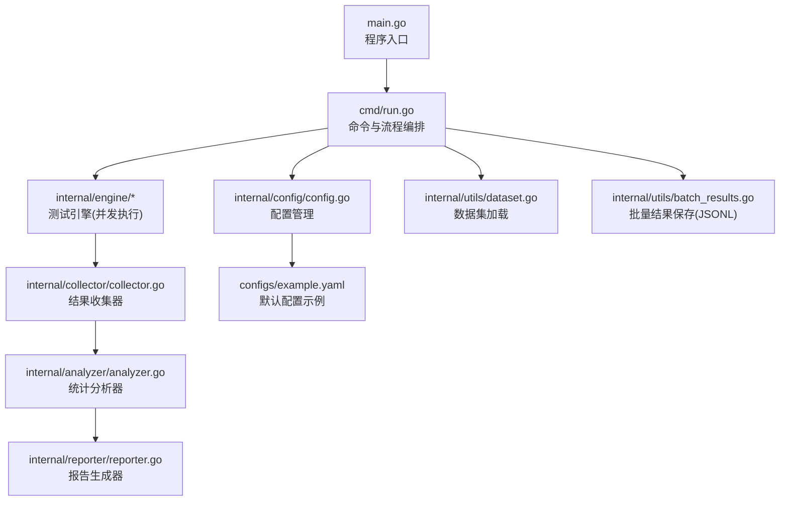
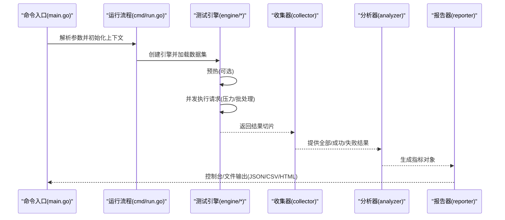
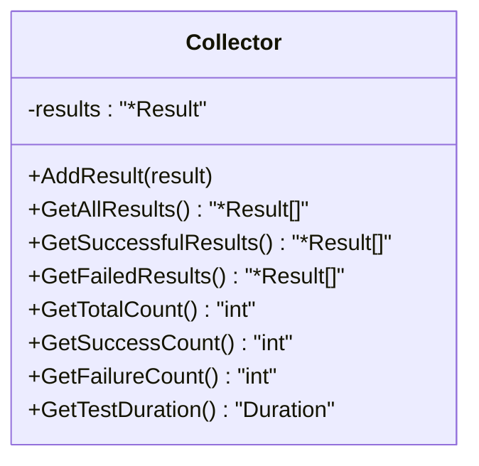
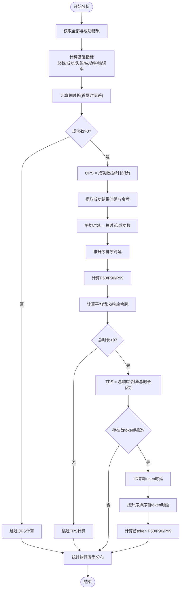
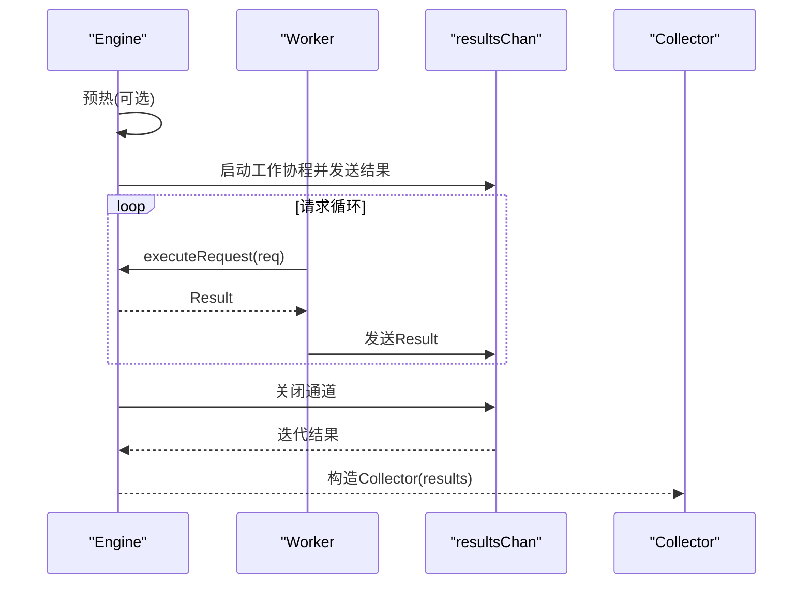
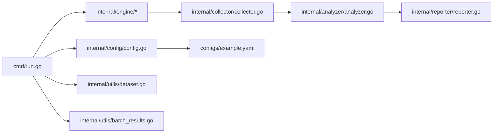
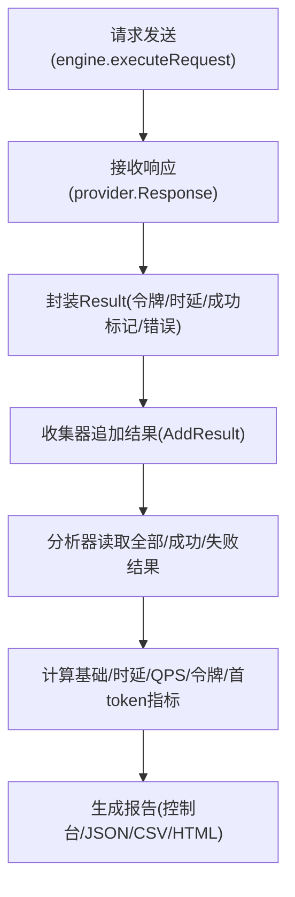

# 数据收集与分析

<cite>
**本文引用的文件**
- [main.go](file://main.go)
- [cmd/run.go](file://cmd/run.go)
- [internal/collector/collector.go](file://internal/collector/collector.go)
- [internal/analyzer/analyzer.go](file://internal/analyzer/analyzer.go)
- [internal/engine/engine.go](file://internal/engine/engine.go)
- [internal/engine/stress.go](file://internal/engine/stress.go)
- [internal/engine/batch.go](file://internal/engine/batch.go)
- [internal/reporter/reporter.go](file://internal/reporter/reporter.go)
- [internal/utils/batch_results.go](file://internal/utils/batch_results.go)
- [internal/config/config.go](file://internal/config/config.go)
- [internal/utils/dataset.go](file://internal/utils/dataset.go)
- [configs/example.yaml](file://configs/example.yaml)
- [go.mod](file://go.mod)
</cite>

## 目录
1. [引言](#引言)
2. [项目结构](#项目结构)
3. [核心组件](#核心组件)
4. [架构总览](#架构总览)
5. [详细组件分析](#详细组件分析)
6. [依赖分析](#依赖分析)
7. [性能考虑](#性能考虑)
8. [故障排查指南](#故障排查指南)
9. [结论](#结论)
10. [附录](#附录)

## 引言
本技术文档围绕 GoLLMPerf 的“数据收集与分析”子系统展开，重点解释数据收集器的设计架构、结果存储机制、内存管理与性能优化策略；并深入阐述统计分析器的实现原理，包括各类性能指标的计算方法、统计算法与数据聚合过程。文档还给出从原始响应到最终统计结果的完整数据流处理流程图，并提供可扩展的实践建议（以路径形式标注示例，避免直接粘贴代码）。

## 项目结构
GoLLMPerf 采用模块化分层设计：命令入口负责参数解析与流程编排，测试引擎负责并发执行与结果采集，收集器负责结果存储与过滤，分析器负责指标计算，报告器负责多格式输出与对比汇总。配置模块统一管理测试、模型、数据集与输出参数。

图表来源
- [main.go:1-26](file://main.go#L1-L26)
- [cmd/run.go:1-123](file://cmd/run.go#L1-L123)
- [internal/engine/engine.go:1-112](file://internal/engine/engine.go#L1-L112)
- [internal/collector/collector.go:1-97](file://internal/collector/collector.go#L1-L97)
- [internal/analyzer/analyzer.go:1-198](file://internal/analyzer/analyzer.go#L1-L198)
- [internal/reporter/reporter.go:1-130](file://internal/reporter/reporter.go#L1-L130)
- [internal/config/config.go:1-229](file://internal/config/config.go#L1-L229)
- [internal/utils/dataset.go:1-126](file://internal/utils/dataset.go#L1-L126)
- [internal/utils/batch_results.go:1-40](file://internal/utils/batch_results.go#L1-L40)
- [configs/example.yaml:1-78](file://configs/example.yaml#L1-L78)

章节来源
- [main.go:1-26](file://main.go#L1-L26)
- [cmd/run.go:1-123](file://cmd/run.go#L1-L123)
- [internal/config/config.go:1-229](file://internal/config/config.go#L1-L229)
- [configs/example.yaml:1-78](file://configs/example.yaml#L1-L78)

## 核心组件
- 测试引擎：封装并发执行、预热阶段、请求执行与结果封装，支持压力测试与批处理两种模式。
- 数据收集器：对结果进行聚合、计数、过滤与时长统计，提供成功/失败结果分离与总时长计算。
- 统计分析器：基于收集器结果计算基础指标、时延指标、吞吐量、令牌指标、首 token 时延指标以及错误类型统计。
- 报告生成器：支持控制台、JSON、CSV、HTML 多格式输出，并支持并发对比汇总。
- 配置管理：提供默认配置生成、YAML 加载、环境变量替换与命令行覆盖。
- 工具库：数据集加载（JSONL）、批量结果保存（JSONL）、缓冲池复用以降低内存分配。

章节来源
- [internal/engine/engine.go:1-112](file://internal/engine/engine.go#L1-L112)
- [internal/collector/collector.go:1-97](file://internal/collector/collector.go#L1-L97)
- [internal/analyzer/analyzer.go:1-198](file://internal/analyzer/analyzer.go#L1-L198)
- [internal/reporter/reporter.go:1-130](file://internal/reporter/reporter.go#L1-L130)
- [internal/config/config.go:1-229](file://internal/config/config.go#L1-L229)
- [internal/utils/dataset.go:1-126](file://internal/utils/dataset.go#L1-L126)
- [internal/utils/batch_results.go:1-40](file://internal/utils/batch_results.go#L1-L40)

## 架构总览
下图展示了从命令入口到最终报告输出的端到端流程，涵盖数据采集、聚合与分析的关键节点。

图表来源
- [main.go:1-26](file://main.go#L1-L26)
- [cmd/run.go:1-123](file://cmd/run.go#L1-L123)
- [internal/engine/stress.go:1-79](file://internal/engine/stress.go#L1-L79)
- [internal/engine/batch.go:1-65](file://internal/engine/batch.go#L1-L65)
- [internal/collector/collector.go:1-97](file://internal/collector/collector.go#L1-L97)
- [internal/analyzer/analyzer.go:1-198](file://internal/analyzer/analyzer.go#L1-L198)
- [internal/reporter/reporter.go:1-130](file://internal/reporter/reporter.go#L1-L130)

## 详细组件分析

### 数据收集器（Collector）
职责与能力
- 存储所有测试结果，支持追加新结果。
- 提供全量、成功、失败结果的筛选。
- 计算总数、成功数、失败数与总时长（首尾时间差）。
- 时间复杂度：追加 O(1)，统计 O(n)；空间复杂度 O(n)。

关键点
- 成功/失败过滤通过一次遍历完成，避免重复扫描。
- 总时长通过线性扫描首尾时间确定，边界为空时返回零时长。

图表来源
- [internal/collector/collector.go:9-97](file://internal/collector/collector.go#L9-L97)

章节来源
- [internal/collector/collector.go:1-97](file://internal/collector/collector.go#L1-L97)

### 统计分析器（Analyzer）
职责与能力
- 基于收集器结果计算多项指标：请求数、成功率、错误率、总时长、平均/百分位时延、QPS、令牌相关指标、首 token 时延与百分位、错误类型分布。
- 对时延与首 token 时延进行排序后计算 P50/P90/P99。
- 对空集合与零时长进行健壮性处理。

计算公式与要点
- 成功率 = 成功数 / 总数 × 100%
- 错误率 = 100% − 成功率
- QPS = 成功数 / 总时长(秒)
- 平均时延 = 总时延 / 成功数
- 令牌每秒 = 总响应令牌 / 总时长(秒)
- 平均请求/响应令牌 = 对应令牌总和 / 成功数
- 首 token 时延仅在可用时参与统计与百分位计算

图表来源
- [internal/analyzer/analyzer.go:89-198](file://internal/analyzer/analyzer.go#L89-L198)

章节来源
- [internal/analyzer/analyzer.go:1-198](file://internal/analyzer/analyzer.go#L1-L198)

### 测试引擎（Engine）与执行模式
- 执行模型：goroutine + channel，使用带缓冲通道收集结果，避免阻塞。
- 预热阶段：按并发数启动工作协程，在限定时间内轮询数据集发送请求，失败即记录首个错误并终止。
- 压力测试：根据持续时间或每并发最大请求数限制，动态调度工作协程；结束后关闭通道并汇总结果。
- 批处理：固定容量切片+索引回填，保证顺序一致性；通过 jobs 通道分发任务，完成后关闭通道并按索引合并结果。
- 结果封装：Result 包含请求/响应令牌、总时延、首 token 时延、成功标志与错误信息，以及起止时间戳。

图表来源
- [internal/engine/stress.go:15-79](file://internal/engine/stress.go#L15-L79)
- [internal/engine/batch.go:12-65](file://internal/engine/batch.go#L12-L65)
- [internal/engine/engine.go:88-112](file://internal/engine/engine.go#L88-L112)
- [internal/collector/collector.go:14-22](file://internal/collector/collector.go#L14-L22)

章节来源
- [internal/engine/engine.go:1-112](file://internal/engine/engine.go#L1-L112)
- [internal/engine/stress.go:1-79](file://internal/engine/stress.go#L1-L79)
- [internal/engine/batch.go:1-65](file://internal/engine/batch.go#L1-L65)

### 报告生成器（Reporter）
- 支持控制台与文件输出（JSON/CSV/HTML），并维护并发对比数据结构以便跨并发级别的指标对比。
- 控制台输出包含总时长、请求数、成功率、QPS、时延分布、令牌统计与错误类型分布。
- 文件输出根据目标格式调用对应生成函数，并自动补齐扩展名。

章节来源
- [internal/reporter/reporter.go:1-130](file://internal/reporter/reporter.go#L1-L130)

### 配置管理（Config）
- 默认配置生成：提供测试时长、预热、并发、每并发请求数、超时、性能并发组等默认值。
- YAML 加载与环境变量替换：支持从文件读取并替换模型名称、密钥、端点等字段。
- 命令行覆盖：优先级高于配置文件，便于快速调试与定制。

章节来源
- [internal/config/config.go:14-229](file://internal/config/config.go#L14-L229)
- [configs/example.yaml:1-78](file://configs/example.yaml#L1-L78)

### 数据集与批量结果工具
- 数据集加载：支持 JSONL，逐行解析，可选注入系统提示消息。
- 批量结果保存：将每个请求的结果写入 JSONL 文件，逐行输出，便于离线分析与归档。

章节来源
- [internal/utils/dataset.go:62-126](file://internal/utils/dataset.go#L62-L126)
- [internal/utils/batch_results.go:11-40](file://internal/utils/batch_results.go#L11-L40)

## 依赖分析
模块间依赖关系清晰，遵循单向数据流：命令层驱动引擎层，引擎层产出结果给收集器，分析器消费收集器数据，报告器消费分析器结果并输出。

图表来源
- [cmd/run.go:1-123](file://cmd/run.go#L1-L123)
- [internal/engine/engine.go:1-112](file://internal/engine/engine.go#L1-L112)
- [internal/collector/collector.go:1-97](file://internal/collector/collector.go#L1-L97)
- [internal/analyzer/analyzer.go:1-198](file://internal/analyzer/analyzer.go#L1-L198)
- [internal/reporter/reporter.go:1-130](file://internal/reporter/reporter.go#L1-L130)
- [internal/config/config.go:1-229](file://internal/config/config.go#L1-L229)
- [internal/utils/dataset.go:1-126](file://internal/utils/dataset.go#L1-L126)
- [internal/utils/batch_results.go:1-40](file://internal/utils/batch_results.go#L1-L40)
- [configs/example.yaml:1-78](file://configs/example.yaml#L1-L78)

章节来源
- [cmd/run.go:1-123](file://cmd/run.go#L1-L123)
- [go.mod:1-48](file://go.mod#L1-L48)

## 性能考虑
- 并发与通道
  - 使用带缓冲通道收集结果，避免生产者阻塞，提升吞吐。
  - 工作协程数量由配置并发决定，压力测试中结合持续时间与每并发上限控制负载。
- 内存管理
  - 批处理模式预先分配结果切片，减少扩容开销。
  - JSONL 批量结果写入逐行落盘，避免一次性大块内存拼接。
  - 数据集加载使用共享缓冲池，降低频繁分配/回收成本。
- 精度与时延
  - 结果中包含总时延与首 token 时延，便于区分网络与服务端处理耗时。
  - 分析阶段对时延数组排序后计算百分位，确保分布统计准确。
- 可扩展性
  - 分析器与报告器解耦，便于新增指标与输出格式。
  - 引擎通过 Provider 接口抽象不同供应商，便于扩展新提供商。

章节来源
- [internal/engine/stress.go:34-79](file://internal/engine/stress.go#L34-L79)
- [internal/engine/batch.go:16-65](file://internal/engine/batch.go#L16-L65)
- [internal/utils/dataset.go:14-30](file://internal/utils/dataset.go#L14-L30)
- [internal/analyzer/analyzer.go:124-182](file://internal/analyzer/analyzer.go#L124-L182)

## 故障排查指南
- 预热失败
  - 现象：预热阶段出现首个错误即终止压力测试。
  - 排查：检查模型名称、API 密钥、端点与网络连通性。
  - 参考路径：[internal/engine/stress.go:49-86](file://internal/engine/stress.go#L49-L86)
- 结果为空或时长异常
  - 现象：总时长为 0 或指标缺失。
  - 排查：确认是否存在成功结果；检查起止时间戳是否正确填充。
  - 参考路径：[internal/collector/collector.go:77-96](file://internal/collector/collector.go#L77-L96)
- 报告生成失败
  - 现象：文件创建或编码失败。
  - 排查：确认输出目录权限与路径；检查报告格式是否受支持。
  - 参考路径：[internal/reporter/reporter.go:85-130](file://internal/reporter/reporter.go#L85-L130)
- 配置加载问题
  - 现象：环境变量未替换或字段解析失败。
  - 排查：核对 YAML 字段与环境变量名；确认覆盖顺序。
  - 参考路径：[internal/config/config.go:136-188](file://internal/config/config.go#L136-L188)

章节来源
- [internal/engine/stress.go:49-86](file://internal/engine/stress.go#L49-L86)
- [internal/collector/collector.go:77-96](file://internal/collector/collector.go#L77-L96)
- [internal/reporter/reporter.go:85-130](file://internal/reporter/reporter.go#L85-L130)
- [internal/config/config.go:136-188](file://internal/config/config.go#L136-L188)

## 结论
GoLLMPerf 的数据收集与分析体系以清晰的模块划分与稳定的并发执行模型为基础，实现了从原始响应到多维度指标的高效转换。通过可扩展的分析器与报告器，用户可以便捷地评估 LLM API 的吞吐、时延与稳定性，并支持多种输出格式满足不同场景需求。未来可在指标粒度、可视化与企业特性方面进一步增强。

## 附录

### 关键性能指标定义与计算公式
- 总请求数：收集器统计总数
- 成功/失败请求数：分别统计成功与失败结果数量
- 成功率：成功数 / 总数 × 100%
- 错误率：100% − 成功率
- 总时长：首尾结果时间差（若无结果则为 0）
- QPS：成功数 / 总时长(秒)
- 平均/百分位时延：对成功结果时延排序后计算
- 平均请求/响应令牌：对应令牌总和 / 成功数
- 令牌每秒：总响应令牌 / 总时长(秒)
- 首 token 时延：仅在可用时计算平均与百分位
- 错误类型分布：按错误码与类型聚合统计

章节来源
- [internal/analyzer/analyzer.go:44-75](file://internal/analyzer/analyzer.go#L44-L75)
- [internal/analyzer/analyzer.go:89-198](file://internal/analyzer/analyzer.go#L89-L198)

### 数据流处理流程图（从原始响应到统计结果）

图表来源
- [internal/engine/engine.go:88-112](file://internal/engine/engine.go#L88-L112)
- [internal/collector/collector.go:24-32](file://internal/collector/collector.go#L24-L32)
- [internal/analyzer/analyzer.go:89-198](file://internal/analyzer/analyzer.go#L89-L198)
- [internal/reporter/reporter.go:47-130](file://internal/reporter/reporter.go#L47-L130)

### 扩展与自定义实践（以路径示例）
- 新增指标计算方法
  - 在分析器中扩展 Metrics 结构体字段与计算逻辑，参考：
    - [internal/analyzer/analyzer.go:44-75](file://internal/analyzer/analyzer.go#L44-L75)
    - [internal/analyzer/analyzer.go:89-198](file://internal/analyzer/analyzer.go#L89-L198)
- 自定义分析逻辑
  - 在分析器 Analyze 中增加条件分支与聚合步骤，参考：
    - [internal/analyzer/analyzer.go:122-182](file://internal/analyzer/analyzer.go#L122-L182)
- 新增报告格式
  - 在报告器中添加生成函数并在主流程调用，参考：
    - [internal/reporter/reporter.go:103-130](file://internal/reporter/reporter.go#L103-L130)
- 新增数据集格式
  - 在工具库中扩展加载函数并更新入口调用，参考：
    - [internal/utils/dataset.go:62-80](file://internal/utils/dataset.go#L62-L80)
- 新增 LLM 供应商
  - 实现 Provider 接口并在命令入口注册，参考：
    - [internal/provider/provider.go:10-20](file://internal/provider/provider.go#L10-L20)
    - [cmd/run.go:22-77](file://cmd/run.go#L22-L77)