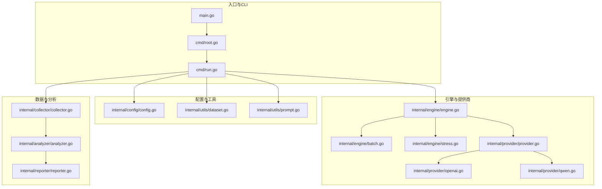
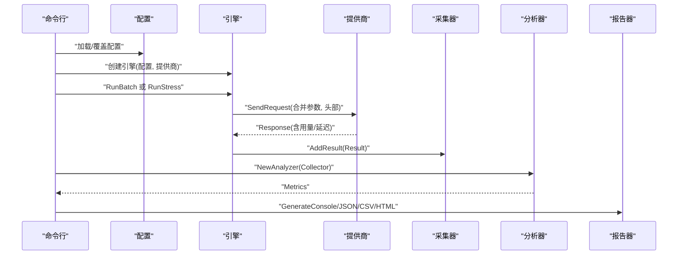
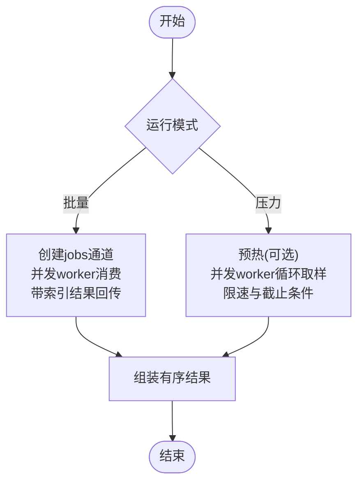
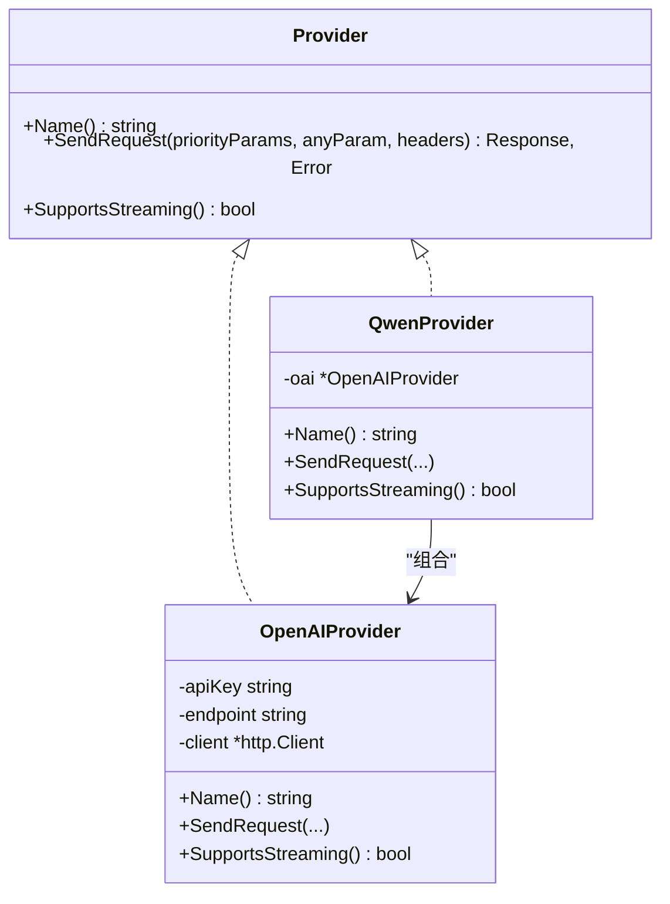
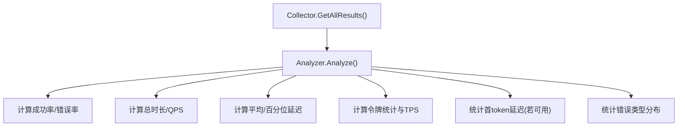
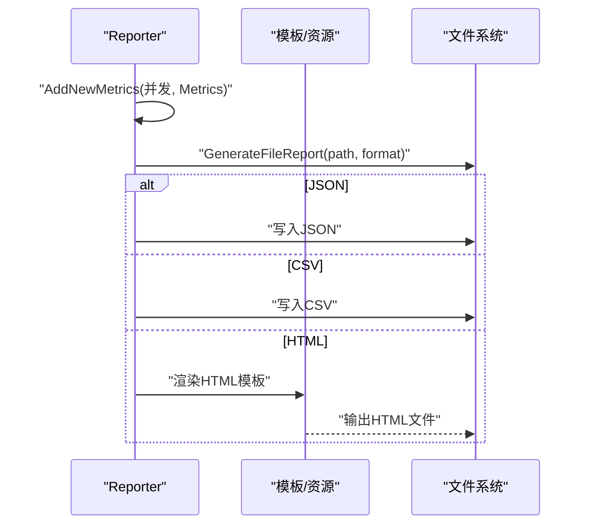
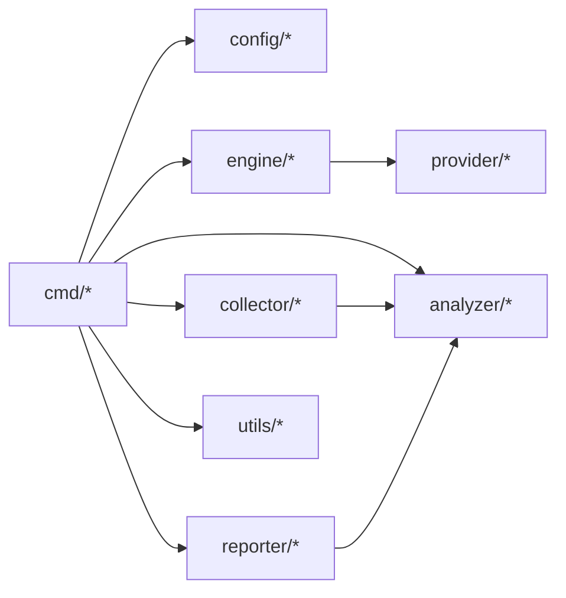

# 核心功能模块

<cite>
**本文引用的文件**
- [main.go](file://main.go)
- [root.go](file://cmd/root.go)
- [run.go](file://cmd/run.go)
- [engine.go](file://internal/engine/engine.go)
- [batch.go](file://internal/engine/batch.go)
- [stress.go](file://internal/engine/stress.go)
- [provider.go](file://internal/provider/provider.go)
- [openai.go](file://internal/provider/openai.go)
- [qwen.go](file://internal/provider/qwen.go)
- [collector.go](file://internal/collector/collector.go)
- [analyzer.go](file://internal/analyzer/analyzer.go)
- [reporter.go](file://internal/reporter/reporter.go)
- [config.go](file://internal/config/config.go)
- [dataset.go](file://internal/utils/dataset.go)
- [prompt.go](file://internal/utils/prompt.go)
</cite>

## 目录
1. [简介](#简介)
2. [项目结构](#项目结构)
3. [核心组件](#核心组件)
4. [架构总览](#架构总览)
5. [详细组件分析](#详细组件分析)
6. [依赖分析](#依赖分析)
7. [性能考虑](#性能考虑)
8. [故障排查指南](#故障排查指南)
9. [结论](#结论)
10. [附录](#附录)

## 简介
本文件聚焦 GoLLMPerf 的核心功能模块，系统性阐述测试引擎的设计与实现、并发控制机制、请求管理与性能优化策略；解释提供商接口的抽象设计及对不同 LLM 提供商的统一接入方式；说明数据采集与分析模块的工作流程（结果收集、指标计算与统计分析）；阐述报告生成系统的多格式支持与定制能力；并提供模块间交互关系图与数据流说明，最后给出扩展开发指南与插件集成方法。

## 项目结构
GoLLMPerf 采用分层与按职责划分的组织方式：
- 入口与命令行：main.go 负责初始化日志与启动命令；cmd 包提供 CLI 子命令与参数解析。
- 引擎层：engine 包含批量与压力测试执行逻辑，负责并发调度、请求执行与结果封装。
- 提供商层：provider 抽象不同 LLM 提供商的统一接口，openai/qwen 作为具体实现。
- 数据工具层：utils 负责数据集加载、系统提示注入与批量结果保存等。
- 配置层：config 提供配置读取、默认值生成与环境变量替换。
- 数据采集与分析：collector 收集结果，analyzer 计算指标，reporter 生成控制台与文件报告。
- 报告模板与样式：reporter 模块内嵌模板与静态资源，支持 HTML/CSS/JS 输出。

图表来源
- [main.go:1-26](file://main.go#L1-L26)
- [root.go:1-28](file://cmd/root.go#L1-L28)
- [run.go:1-123](file://cmd/run.go#L1-L123)
- [engine.go:1-112](file://internal/engine/engine.go#L1-L112)
- [batch.go:1-65](file://internal/engine/batch.go#L1-L65)
- [stress.go:1-79](file://internal/engine/stress.go#L1-L79)
- [provider.go:1-72](file://internal/provider/provider.go#L1-L72)
- [openai.go:1-253](file://internal/provider/openai.go#L1-L253)
- [qwen.go:1-35](file://internal/provider/qwen.go#L1-L35)
- [collector.go:1-97](file://internal/collector/collector.go#L1-L97)
- [analyzer.go:1-198](file://internal/analyzer/analyzer.go#L1-L198)
- [reporter.go:1-130](file://internal/reporter/reporter.go#L1-L130)
- [config.go:1-229](file://internal/config/config.go#L1-L229)
- [dataset.go:1-126](file://internal/utils/dataset.go#L1-L126)
- [prompt.go:1-42](file://internal/utils/prompt.go#L1-L42)

章节来源
- [main.go:1-26](file://main.go#L1-L26)
- [root.go:1-28](file://cmd/root.go#L1-L28)
- [run.go:1-123](file://cmd/run.go#L1-L123)

## 核心组件
- 测试引擎（Engine）
  - 职责：封装并发控制、请求执行、预热阶段、结果封装与返回。
  - 关键点：通过 Provider 接口屏蔽不同提供商差异；在批量模式下使用带索引的通道收集有序结果；在压力模式下基于时间或请求数上限进行限速与并发控制。
- 并发控制与请求管理
  - 批量模式：固定并发数，将所有请求入队到 jobs 通道，工作协程从 jobs 出队处理，结果通过带索引的 resultsChan 回传，最终按原始顺序组装。
  - 压力模式：支持预热阶段；并发由配置决定；每个 worker 在时间或请求数限制内循环取样请求，小延迟避免瞬时过载。
- 提供商抽象与实现
  - Provider 接口定义名称、发送请求与是否支持流式输出；OpenAIProvider 实现 HTTP 请求、非流式与流式响应解析、首 token 延迟统计；QwenProvider 以组合方式复用 OpenAIProvider。
- 数据采集与分析
  - Collector 统一存储结果，提供成功/失败过滤与测试时长计算。
  - Analyzer 基于 Collector 结果计算成功率、QPS、平均/百分位延迟、吞吐、令牌统计与错误类型分布。
- 报告生成
  - Reporter 支持控制台、JSON、CSV、HTML 多格式输出；可聚合不同并发下的对比结果。
- 配置与数据工具
  - Config 支持 YAML 加载、默认值生成、环境变量替换与并发组配置；Dataset 工具支持 JSONL 加载与系统提示注入；Prompt 工具支持内容或文件路径两种来源。

章节来源
- [engine.go:1-112](file://internal/engine/engine.go#L1-L112)
- [batch.go:1-65](file://internal/engine/batch.go#L1-L65)
- [stress.go:1-79](file://internal/engine/stress.go#L1-L79)
- [provider.go:1-72](file://internal/provider/provider.go#L1-L72)
- [openai.go:1-253](file://internal/provider/openai.go#L1-L253)
- [qwen.go:1-35](file://internal/provider/qwen.go#L1-L35)
- [collector.go:1-97](file://internal/collector/collector.go#L1-L97)
- [analyzer.go:1-198](file://internal/analyzer/analyzer.go#L1-L198)
- [reporter.go:1-130](file://internal/reporter/reporter.go#L1-L130)
- [config.go:1-229](file://internal/config/config.go#L1-L229)
- [dataset.go:1-126](file://internal/utils/dataset.go#L1-L126)
- [prompt.go:1-42](file://internal/utils/prompt.go#L1-L42)

## 架构总览
整体流程自上而下：CLI 解析参数与配置 → 初始化引擎与提供商 → 执行批量/压力测试 → 采集结果 → 分析指标 → 生成报告。

图表来源
- [run.go:97-123](file://cmd/run.go#L97-L123)
- [engine.go:88-112](file://internal/engine/engine.go#L88-L112)
- [provider.go:10-20](file://internal/provider/provider.go#L10-L20)
- [collector.go:24-27](file://internal/collector/collector.go#L24-L27)
- [analyzer.go:82-87](file://internal/analyzer/analyzer.go#L82-L87)
- [reporter.go:38-130](file://internal/reporter/reporter.go#L38-L130)

## 详细组件分析

### 引擎与并发控制
- 批量模式（RunBatch）
  - 使用 jobs 通道将全部请求入队；并发工作协程从 jobs 取出请求执行；结果通过带索引的 resultsChan 回传，最终按原顺序组装。
  - 优点：保证结果顺序与输入一一对应；适合全量跑完场景。
- 压力模式（RunStress）
  - 支持预热阶段（once 控制仅一次）；并发由配置决定；每个 worker 在时间或请求数限制内循环取样请求；通过小休眠限速，避免瞬时过载。
  - 优点：稳定压测，便于观察系统稳定性与瓶颈。
- 预热（runWarmup）
  - 多 worker 同时向数据集轮询发送请求，失败即中止并返回首个错误，确保后续压测环境稳定。

图表来源
- [batch.go:12-65](file://internal/engine/batch.go#L12-L65)
- [stress.go:15-79](file://internal/engine/stress.go#L15-L79)
- [engine.go:49-86](file://internal/engine/engine.go#L49-L86)

章节来源
- [batch.go:12-65](file://internal/engine/batch.go#L12-L65)
- [stress.go:15-79](file://internal/engine/stress.go#L15-L79)
- [engine.go:49-112](file://internal/engine/engine.go#L49-L112)

### 提供商接口抽象与实现
- Provider 接口
  - 定义名称、发送请求（含优先参数与通用参数合并）、是否支持流式。
- OpenAIProvider
  - 合并优先参数与附加参数；设置 Authorization 与 Content-Type；根据 stream 字段选择非流式或流式处理；记录端到端延迟与首 token 延迟；支持调试开关打印请求/响应。
- QwenProvider
  - 通过组合 OpenAIProvider 实现，适配阿里 DashScope 兼容端点，保持一致行为。

图表来源
- [provider.go:10-20](file://internal/provider/provider.go#L10-L20)
- [openai.go:21-48](file://internal/provider/openai.go#L21-L48)
- [qwen.go:5-19](file://internal/provider/qwen.go#L5-L19)

章节来源
- [provider.go:10-72](file://internal/provider/provider.go#L10-L72)
- [openai.go:55-144](file://internal/provider/openai.go#L55-L144)
- [qwen.go:21-35](file://internal/provider/qwen.go#L21-L35)

### 数据采集与分析
- Collector
  - 提供添加结果、获取全部/成功/失败、统计总数/成功数/失败数、计算测试总时长（首尾时间差）。
- Analyzer
  - 计算基础指标（总请求数、成功/失败数、成功率/错误率）、时延指标（总时长、平均、P50/P90/P99）、吞吐（QPS）、令牌指标（平均请求/响应令牌数、每秒令牌数）、首 token 时延（若可用）与错误类型分布。

图表来源
- [collector.go:29-96](file://internal/collector/collector.go#L29-L96)
- [analyzer.go:89-197](file://internal/analyzer/analyzer.go#L89-L197)

章节来源
- [collector.go:9-97](file://internal/collector/collector.go#L9-L97)
- [analyzer.go:43-198](file://internal/analyzer/analyzer.go#L43-L198)

### 报告生成系统
- 控制台报告：输出总时长、总/成功/失败请求数、成功率、QPS、令牌统计、延迟分位数与首 token 延迟（若可用）、错误类型分布。
- 文件报告：支持 JSON、CSV、HTML 三种格式；HTML 报告包含模板与样式脚本资源；可按并发组聚合对比结果。

图表来源
- [reporter.go:38-130](file://internal/reporter/reporter.go#L38-L130)

章节来源
- [reporter.go:25-130](file://internal/reporter/reporter.go#L25-L130)

### 配置与数据工具
- 配置（Config）
  - 默认值生成、YAML 加载、环境变量替换（模型名、API Key、端点）、系统提示模板（内容或文件路径二选一）、并发组、输出格式与路径。
- 数据集工具（Dataset）
  - JSONL 加载，使用缓冲池减少内存峰值；支持为每条消息注入系统提示（若未存在则插入首条）。
- 系统提示工具（Prompt）
  - 优先使用内容字段，其次读取文件路径内容，二者均为空则返回空串。

章节来源
- [config.go:14-229](file://internal/config/config.go#L14-L229)
- [dataset.go:62-126](file://internal/utils/dataset.go#L62-L126)
- [prompt.go:13-42](file://internal/utils/prompt.go#L13-L42)

## 依赖分析
- 模块耦合
  - CLI 依赖配置、引擎、采集器、分析器与报告器；引擎依赖提供商；分析器依赖采集器；报告器依赖分析器与模板资源。
- 外部依赖
  - Cobra（CLI）、Viper/YAML（配置）、HTTP 客户端（提供商）、JSON/Scanner（数据解析与流式处理）。
- 潜在环路
  - 当前模块间为单向依赖，未见循环依赖。

图表来源
- [run.go:16-95](file://cmd/run.go#L16-L95)
- [engine.go:1-112](file://internal/engine/engine.go#L1-L112)
- [provider.go:1-72](file://internal/provider/provider.go#L1-L72)
- [collector.go:1-97](file://internal/collector/collector.go#L1-L97)
- [analyzer.go:1-198](file://internal/analyzer/analyzer.go#L1-L198)
- [reporter.go:1-130](file://internal/reporter/reporter.go#L1-L130)
- [config.go:1-229](file://internal/config/config.go#L1-L229)
- [dataset.go:1-126](file://internal/utils/dataset.go#L1-L126)

章节来源
- [run.go:16-95](file://cmd/run.go#L16-L95)

## 性能考虑
- 并发与限速
  - 批量模式：固定并发，结果回传带索引，避免乱序；压力模式：worker 循环取样并加入小休眠，防止瞬时过载。
- 缓冲与内存
  - JSONL 加载使用缓冲池，降低大文件扫描时的内存分配开销。
- 流式响应
  - OpenAIProvider 对流式响应进行增量解析，记录首 token 延迟，提升可观测性。
- 统计精度
  - Analyzer 对延迟与首 token 延迟进行排序后计算分位数，保证指标稳健性。
- I/O 与序列化
  - 报告生成采用缩进编码与模板渲染，兼顾可读性与可维护性。

## 故障排查指南
- 常见问题定位
  - 提供商错误：检查 API Key、端点、网络连通性；OpenAIProvider 在非 200 状态码时会返回错误；启用调试环境变量可查看请求/响应。
  - 配置错误：确认 YAML 文件路径与字段正确；环境变量替换是否生效；系统提示模板内容与路径二选一。
  - 数据集问题：JSONL 行解析失败时会返回行号与错误；确保消息数组结构符合预期。
- 日志与追踪
  - 全局日志初始化与级别设置；各模块使用独立记录器；CLI 中对 RunBatch/RunStress 进行耗时跟踪。
- 错误类型统计
  - Analyzer 将失败结果按错误类型与代码聚合，便于快速定位问题类别。

章节来源
- [openai.go:117-144](file://internal/provider/openai.go#L117-L144)
- [config.go:136-188](file://internal/config/config.go#L136-L188)
- [dataset.go:110-115](file://internal/utils/dataset.go#L110-L115)
- [analyzer.go:184-194](file://internal/analyzer/analyzer.go#L184-L194)
- [main.go:11-18](file://main.go#L11-L18)
- [run.go:104-107](file://cmd/run.go#L104-L107)

## 结论
GoLLMPerf 通过清晰的分层与抽象设计，实现了对不同 LLM 提供商的统一接入，并提供了稳定的批量与压力测试能力。其并发控制策略、流式响应解析与全面的指标统计，使得性能评估具备高精度与可复现性。报告系统支持多格式输出，满足多样化交付需求。整体架构易于扩展，便于新增提供商与报告格式。

## 附录

### 扩展开发指南
- 新增提供商
  - 实现 Provider 接口（名称、发送请求、是否支持流式），并在 CLI 中注册选择项；如需兼容 OpenAI 协议，可参考 OpenAIProvider 的合并参数、流式解析与延迟统计模式。
  - 参考路径：[provider.go:10-20](file://internal/provider/provider.go#L10-L20)，[openai.go:55-144](file://internal/provider/openai.go#L55-L144)
- 新增报告格式
  - 在 Reporter 中增加格式分支与生成函数，必要时引入模板与静态资源；参考现有 JSON/CSV/HTML 的实现模式。
  - 参考路径：[reporter.go:103-130](file://internal/reporter/reporter.go#L103-L130)
- 新增指标或统计方法
  - 在 Analyzer 中扩展 Metrics 字段与计算逻辑，确保与 Collector 的数据结构匹配。
  - 参考路径：[analyzer.go:43-198](file://internal/analyzer/analyzer.go#L43-L198)
- 插件集成建议
  - 将新提供商以独立包形式实现，通过接口解耦；在 CLI 层通过工厂或注册表方式动态选择；保持 Provider 接口稳定，避免破坏既有实现。