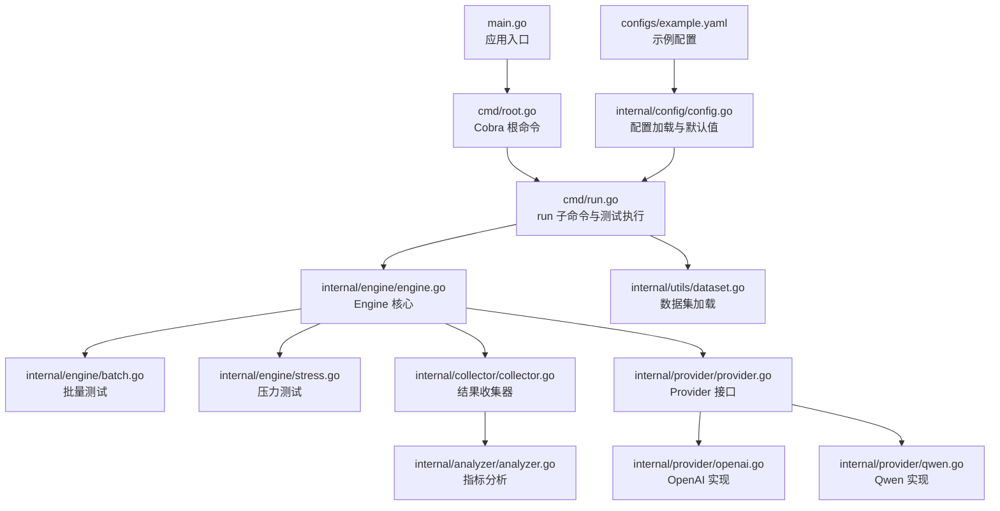
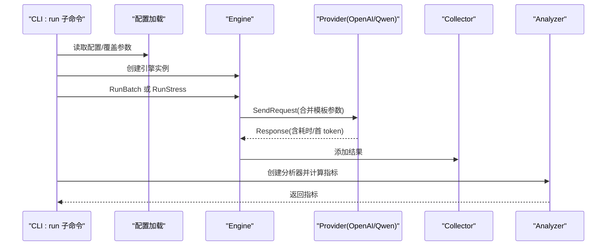
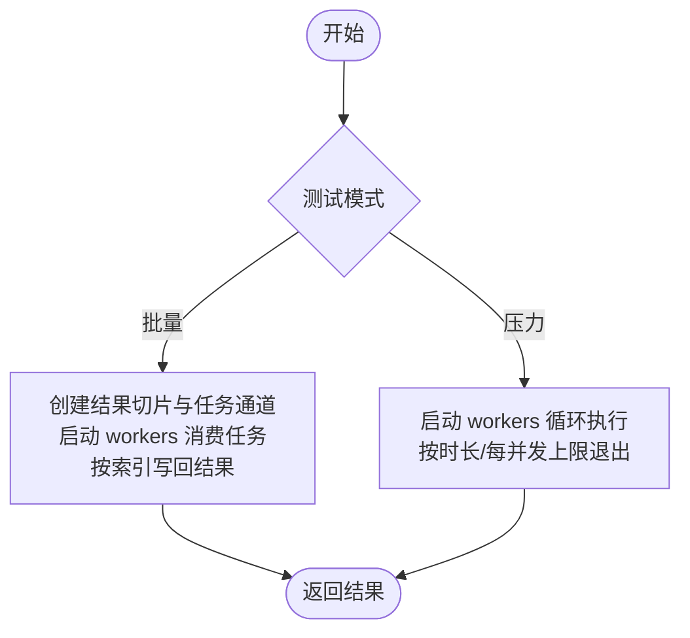
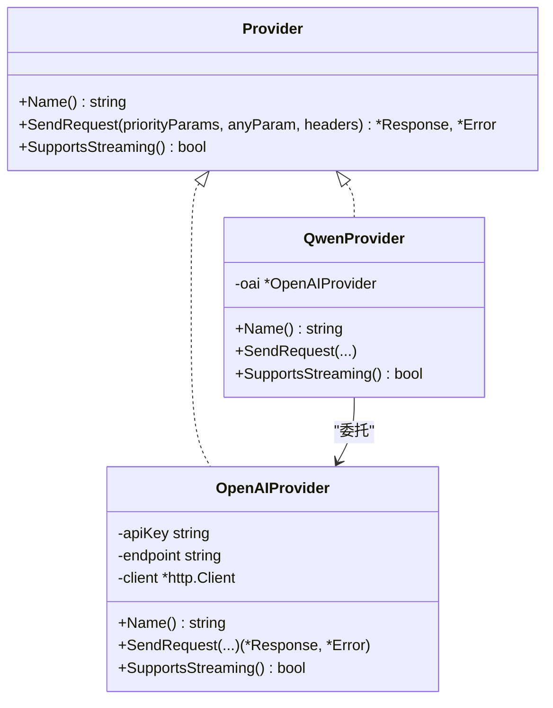
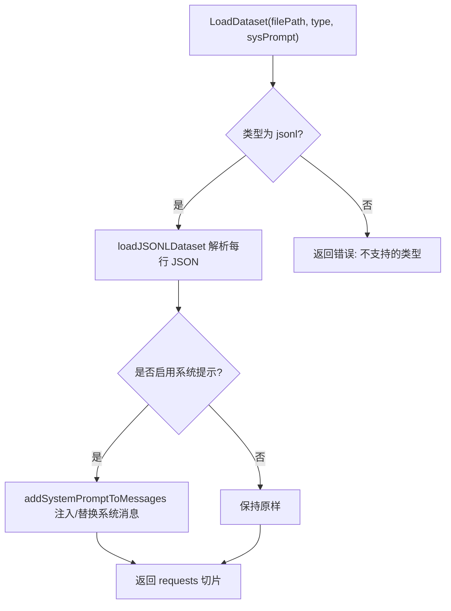
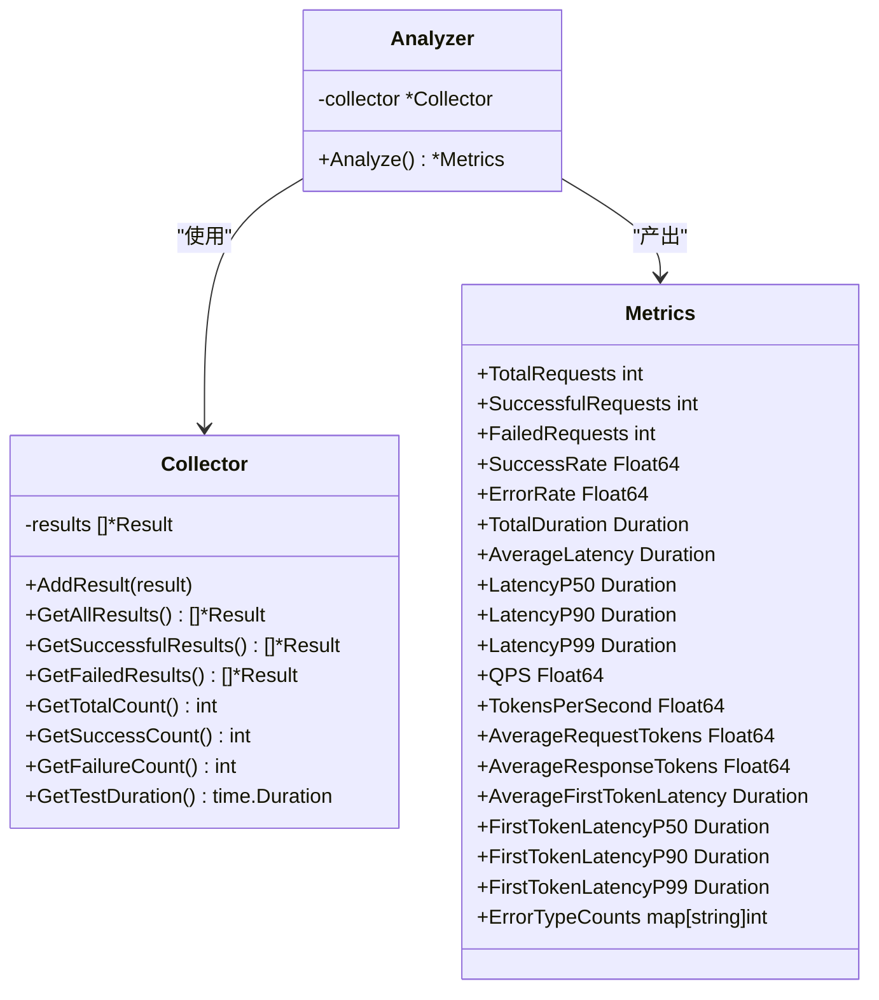
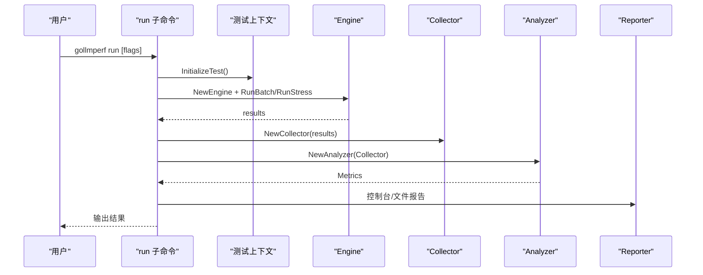
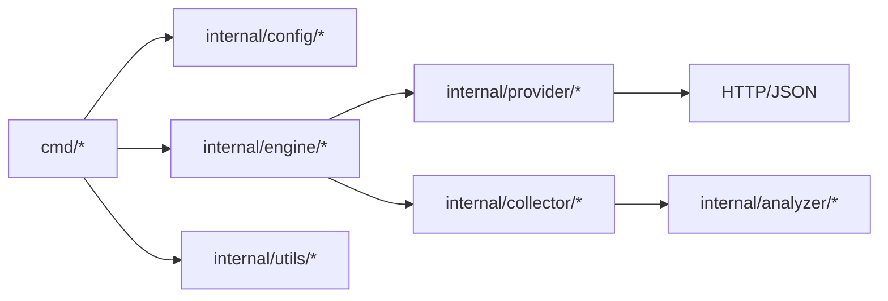

# 测试引擎

<cite>
**本文引用的文件**
- [main.go](file://main.go)
- [root.go](file://cmd/root.go)
- [run.go](file://cmd/run.go)
- [run_flags.go](file://cmd/run_flags.go)
- [engine.go](file://internal/engine/engine.go)
- [batch.go](file://internal/engine/batch.go)
- [stress.go](file://internal/engine/stress.go)
- [config.go](file://internal/config/config.go)
- [example.yaml](file://configs/example.yaml)
- [provider.go](file://internal/provider/provider.go)
- [openai.go](file://internal/provider/openai.go)
- [qwen.go](file://internal/provider/qwen.go)
- [collector.go](file://internal/collector/collector.go)
- [analyzer.go](file://internal/analyzer/analyzer.go)
- [dataset.go](file://internal/utils/dataset.go)
</cite>

## 目录
1. [简介](#简介)
2. [项目结构](#项目结构)
3. [核心组件](#核心组件)
4. [架构总览](#架构总览)
5. [详细组件分析](#详细组件分析)
6. [依赖分析](#依赖分析)
7. [性能考虑](#性能考虑)
8. [故障排查指南](#故障排查指南)
9. [结论](#结论)
10. [附录](#附录)

## 简介
本文件面向 GoLLMPerf 测试引擎，系统性阐述其架构设计与实现细节，重点覆盖以下方面：
- 并发控制机制：批量与压力两种模式下的并发调度策略
- 请求执行流程：从数据集到结果采集的完整链路
- 性能优化策略：缓冲池、流式响应处理、预热阶段等
- 两种测试模式：批量测试（批内顺序执行）与压力测试（持续并发）
- 生命周期管理：预热、执行、清理与报告生成
- 结果收集与分析：指标计算、错误分类与输出格式化
- 使用示例：如何通过配置与命令行参数完成不同类型的性能测试

## 项目结构
GoLLMPerf 采用模块化分层组织，CLI 命令入口位于 cmd，核心引擎在 internal/engine，配置与工具在 internal/config 与 internal/utils，结果分析与报告在 internal/analyzer 与 internal/reporter，HTTP 提供者在 internal/provider。

图示来源
- [main.go:1-26](file://main.go#L1-L26)
- [root.go:1-28](file://cmd/root.go#L1-L28)
- [run.go:1-123](file://cmd/run.go#L1-L123)
- [engine.go:1-112](file://internal/engine/engine.go#L1-L112)
- [batch.go:1-65](file://internal/engine/batch.go#L1-L65)
- [stress.go:1-79](file://internal/engine/stress.go#L1-L79)
- [collector.go:1-97](file://internal/collector/collector.go#L1-L97)
- [analyzer.go:1-198](file://internal/analyzer/analyzer.go#L1-L198)
- [dataset.go:1-126](file://internal/utils/dataset.go#L1-L126)
- [provider.go:1-72](file://internal/provider/provider.go#L1-L72)
- [openai.go:1-253](file://internal/provider/openai.go#L1-L253)
- [qwen.go:1-35](file://internal/provider/qwen.go#L1-L35)
- [config.go:1-229](file://internal/config/config.go#L1-L229)
- [example.yaml:1-78](file://configs/example.yaml#L1-L78)

章节来源
- [main.go:1-26](file://main.go#L1-L26)
- [root.go:1-28](file://cmd/root.go#L1-L28)
- [run.go:1-123](file://cmd/run.go#L1-L123)
- [config.go:1-229](file://internal/config/config.go#L1-L229)
- [example.yaml:1-78](file://configs/example.yaml#L1-L78)

## 核心组件
- 引擎 Engine：封装并发控制、预热、请求执行与结果封装，支持批量与压力两种模式
- Provider 接口及实现：抽象不同 LLM 提供商的请求发送逻辑，当前包含 OpenAI 与 Qwen
- 数据集加载：支持 JSONL 文件，可注入系统提示
- 结果收集器 Collector：聚合所有请求结果，提供统计查询
- 分析器 Analyzer：基于 Collector 计算成功率、延迟分布、吞吐量、首 token 延迟等指标
- CLI run 命令：解析配置与标志，驱动测试执行与报告生成

章节来源
- [engine.go:1-112](file://internal/engine/engine.go#L1-L112)
- [provider.go:1-72](file://internal/provider/provider.go#L1-L72)
- [openai.go:1-253](file://internal/provider/openai.go#L1-L253)
- [qwen.go:1-35](file://internal/provider/qwen.go#L1-L35)
- [dataset.go:1-126](file://internal/utils/dataset.go#L1-L126)
- [collector.go:1-97](file://internal/collector/collector.go#L1-L97)
- [analyzer.go:1-198](file://internal/analyzer/analyzer.go#L1-L198)
- [run.go:1-123](file://cmd/run.go#L1-L123)

## 架构总览
下图展示了从 CLI 到引擎、提供者与分析器的整体交互路径。

图示来源
- [run.go:97-122](file://cmd/run.go#L97-L122)
- [engine.go:88-111](file://internal/engine/engine.go#L88-L111)
- [openai.go:84-144](file://internal/provider/openai.go#L84-L144)
- [collector.go:24-27](file://internal/collector/collector.go#L24-L27)
- [analyzer.go:89-197](file://internal/analyzer/analyzer.go#L89-L197)

## 详细组件分析

### 引擎 Engine 与并发控制
- 预热阶段：按并发数启动多个 goroutine，循环从数据集中取样请求，直到达到预热时长或出现首个失败
- 批量测试：固定容量切片 + 有界工作队列通道，每个 worker 消费任务并按索引回填结果，保证有序输出
- 压力测试：多 worker 并发执行，支持按时长或每并发请求数上限停止；使用带缓冲通道收集结果，避免阻塞
- 请求执行：统一调用 Provider.SendRequest，封装成功/失败、耗时、首 token 耗时、token 数量等信息

图示来源
- [engine.go:49-86](file://internal/engine/engine.go#L49-L86)
- [batch.go:12-65](file://internal/engine/batch.go#L12-L65)
- [stress.go:15-79](file://internal/engine/stress.go#L15-L79)

章节来源
- [engine.go:13-112](file://internal/engine/engine.go#L13-L112)
- [batch.go:12-65](file://internal/engine/batch.go#L12-L65)
- [stress.go:13-79](file://internal/engine/stress.go#L13-L79)

### Provider 抽象与实现
- Provider 接口定义名称、发送请求与是否支持流式的能力
- OpenAIProvider：合并优先参数与附加参数，构造 HTTP 请求，支持流式与非流式响应解析，记录端到端与首 token 耗时
- QwenProvider：复用 OpenAIProvider 的实现，适配特定端点

图示来源
- [provider.go:10-72](file://internal/provider/provider.go#L10-L72)
- [openai.go:21-253](file://internal/provider/openai.go#L21-L253)
- [qwen.go:5-35](file://internal/provider/qwen.go#L5-L35)

章节来源
- [provider.go:10-72](file://internal/provider/provider.go#L10-L72)
- [openai.go:84-144](file://internal/provider/openai.go#L84-L144)
- [qwen.go:26-34](file://internal/provider/qwen.go#L26-L34)

### 数据集加载与系统提示注入
- 支持 JSONL 类型，逐行解析为 AnyParams
- 可选系统提示：若启用，自动将系统消息插入 messages 数组首位，如已有则替换内容
- 使用缓冲池减少大文件扫描内存占用

图示来源
- [dataset.go:62-126](file://internal/utils/dataset.go#L62-L126)
- [dataset.go:31-60](file://internal/utils/dataset.go#L31-L60)

章节来源
- [dataset.go:62-126](file://internal/utils/dataset.go#L62-L126)

### 结果收集与分析
- Collector：维护结果切片，提供全量、成功、失败、统计与测试时长等查询
- Analyzer：计算总请求数、成功/失败率、总时长、平均/百分位延迟、QPS、TPS、平均请求/响应 token 数、首 token 百分位等，并对错误类型进行计数

图示来源
- [collector.go:9-97](file://internal/collector/collector.go#L9-L97)
- [analyzer.go:43-198](file://internal/analyzer/analyzer.go#L43-L198)

章节来源
- [collector.go:24-96](file://internal/collector/collector.go#L24-L96)
- [analyzer.go:89-197](file://internal/analyzer/analyzer.go#L89-L197)

### CLI 运行流程与报告生成
- run 子命令：解析标志、初始化上下文、选择批量/压力/性能模式、执行测试、生成控制台与文件报告、保存批量结果（仅批量模式）
- 性能模式：遍历并发组，依次运行单次测试并汇总指标

图示来源
- [run.go:16-78](file://cmd/run.go#L16-L78)
- [run.go:97-122](file://cmd/run.go#L97-L122)

章节来源
- [run.go:22-77](file://cmd/run.go#L22-L77)
- [run.go:97-122](file://cmd/run.go#L97-L122)

## 依赖分析
- CLI 层依赖配置与工具模块，驱动引擎执行
- 引擎依赖 Provider 接口，屏蔽具体提供商差异
- 分析器依赖收集器，不直接访问底层结果存储
- Provider 依赖 HTTP 客户端与 JSON 解析，实现流式与非流式响应处理

图示来源
- [run.go:1-123](file://cmd/run.go#L1-L123)
- [engine.go:1-112](file://internal/engine/engine.go#L1-L112)
- [provider.go:1-72](file://internal/provider/provider.go#L1-L72)
- [collector.go:1-97](file://internal/collector/collector.go#L1-L97)
- [analyzer.go:1-198](file://internal/analyzer/analyzer.go#L1-L198)

章节来源
- [run.go:1-123](file://cmd/run.go#L1-L123)
- [engine.go:1-112](file://internal/engine/engine.go#L1-L112)
- [provider.go:1-72](file://internal/provider/provider.go#L1-L72)
- [collector.go:1-97](file://internal/collector/collector.go#L1-L97)
- [analyzer.go:1-198](file://internal/analyzer/analyzer.go#L1-L198)

## 性能考虑
- 并发模型
  - 批量测试：使用固定容量切片与带缓冲通道，避免额外拷贝与死锁
  - 压力测试：使用 once 保证预热只执行一次，workder 内部循环+sleep 控制节奏
- I/O 优化
  - JSONL 加载使用缓冲池，提升大文件扫描效率
  - HTTP 客户端设置超时与重定向限制，避免连接泄漏
- 流式响应
  - OpenAIProvider 对 SSE 流进行增量解析，记录首 token 时间，降低感知延迟
- 统计精度
  - Analyzer 对延迟与首 token 延迟进行排序后计算分位数，确保指标稳健

章节来源
- [dataset.go:14-30](file://internal/utils/dataset.go#L14-L30)
- [openai.go:38-47](file://internal/provider/openai.go#L38-L47)
- [openai.go:169-247](file://internal/provider/openai.go#L169-L247)
- [analyzer.go:146-154](file://internal/analyzer/analyzer.go#L146-L154)

## 故障排查指南
- 配置问题
  - 确认配置文件路径与字段正确，必要时通过命令行覆盖
  - 环境变量占位符会被替换，检查环境变量是否已设置
- Provider 错误
  - HTTP 状态码非 200 将被包装为错误返回；检查端点、密钥与网络连通性
  - 流式解析异常会跳过错误事件但仍继续处理后续数据
- 并发与超时
  - 压力测试中可通过并发与每并发请求数控制资源占用；超时时间影响单次请求等待
  - 预热失败会中断后续测试，需先定位预热阶段错误
- 结果与报告
  - 若未生成报告，请检查输出路径权限与格式；批量模式可导出原始结果 JSONL

章节来源
- [config.go:137-188](file://internal/config/config.go#L137-L188)
- [openai.go:118-121](file://internal/provider/openai.go#L118-L121)
- [openai.go:227-229](file://internal/provider/openai.go#L227-L229)
- [engine.go:49-86](file://internal/engine/engine.go#L49-L86)
- [run.go:52-64](file://cmd/run.go#L52-L64)

## 结论
GoLLMPerf 以清晰的分层架构实现了对 LLM 的批量与压力测试，具备良好的扩展性与可观测性。通过 Provider 抽象与统一的请求执行流程，引擎可在不同提供商间无缝切换；通过 Collector 与 Analyzer 的分离，指标计算与报告生成解耦，便于二次开发与集成。

## 附录

### 配置与命令行参数速查
- 配置文件字段（节选）
  - test.duration：测试时长（0 表示无限）
  - test.warmup：预热时长
  - test.concurrency：并发数
  - test.requests_per_concurrency：每并发最大请求数（0 表示无限）
  - test.timeout：请求超时
  - test.perf_concurrency_group：性能模式并发组
  - model.name/provider/endpoint/api_key/headers/params_template/system_prompt_template
  - dataset.type/path
  - output.format/path/batch_result_path
- 命令行标志（run 子命令）
  - --batch/-b：批量模式
  - --perf/-p：性能模式（遍历并发组）
  - --no-report/-n：禁用报告
  - --show-table/-s：控制台表格显示
  - --config/-c：配置文件路径
  - --provider/-P、--model/-m、--dataset/-d、--apikey/-k、--endpoint/-e
  - --report/-r、--format/-f、--batch-result：输出路径与格式

章节来源
- [example.yaml:4-78](file://configs/example.yaml#L4-L78)
- [run_flags.go:9-25](file://cmd/run_flags.go#L9-L25)
- [run.go:80-95](file://cmd/run.go#L80-L95)

### 使用示例（步骤说明）
- 准备测试数据
  - 在 dataset.path 指定 JSONL 文件路径，每行一条请求参数对象
  - 如启用 system_prompt_template，系统提示将自动注入 messages 首条
- 编写配置
  - test 节：设置并发、时长、预热、超时与性能并发组
  - model 节：填写提供商、端点、密钥、请求模板与系统提示
  - output 节：指定报告格式与输出路径
- 执行批量测试
  - 使用 run 子命令并传入 --batch，引擎按并发消费数据集，完成后输出报告与（可选）批量结果 JSONL
- 执行压力测试
  - 使用 run 子命令并传入 --perf，引擎遍历 perf_concurrency_group，分别运行压力测试并输出对比报告
- 调优建议
  - 先开启预热，观察首 token 延迟与成功率
  - 逐步提高并发，监控失败率与尾部延迟
  - 对于流式模型，关注首 token 延迟与吞吐量的平衡

章节来源
- [dataset.go:62-126](file://internal/utils/dataset.go#L62-L126)
- [config.go:137-229](file://internal/config/config.go#L137-L229)
- [run.go:22-77](file://cmd/run.go#L22-L77)