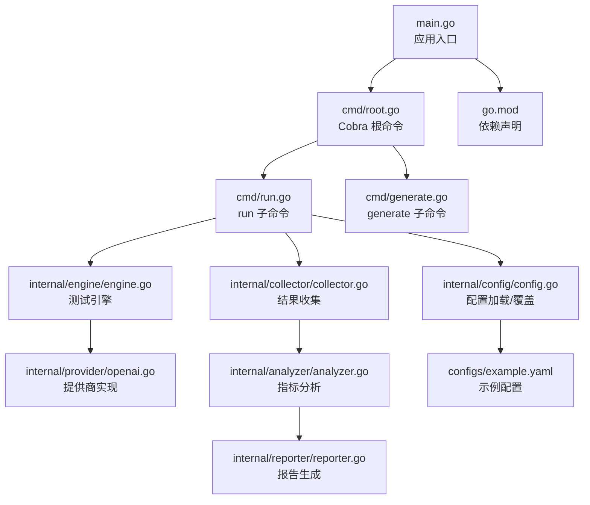
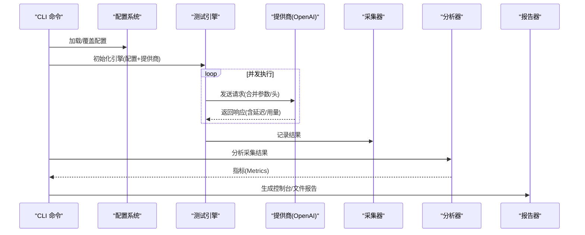
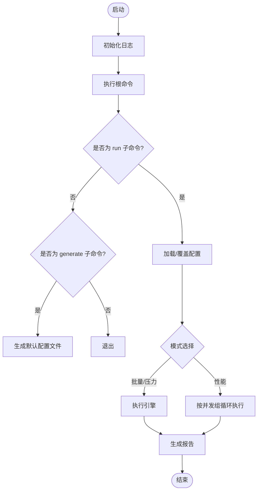
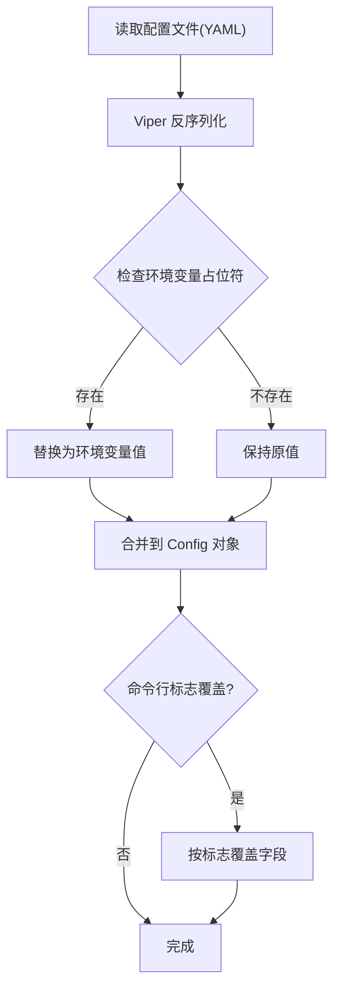
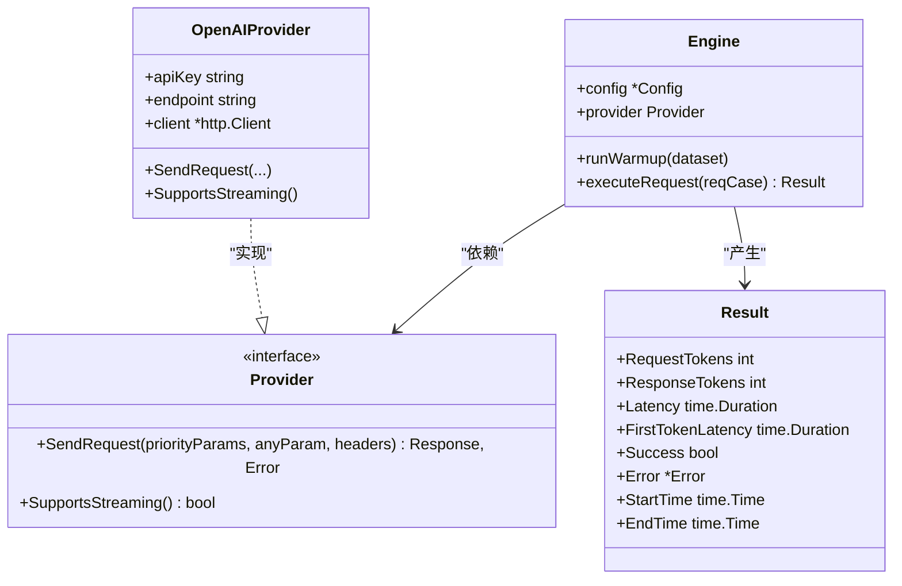
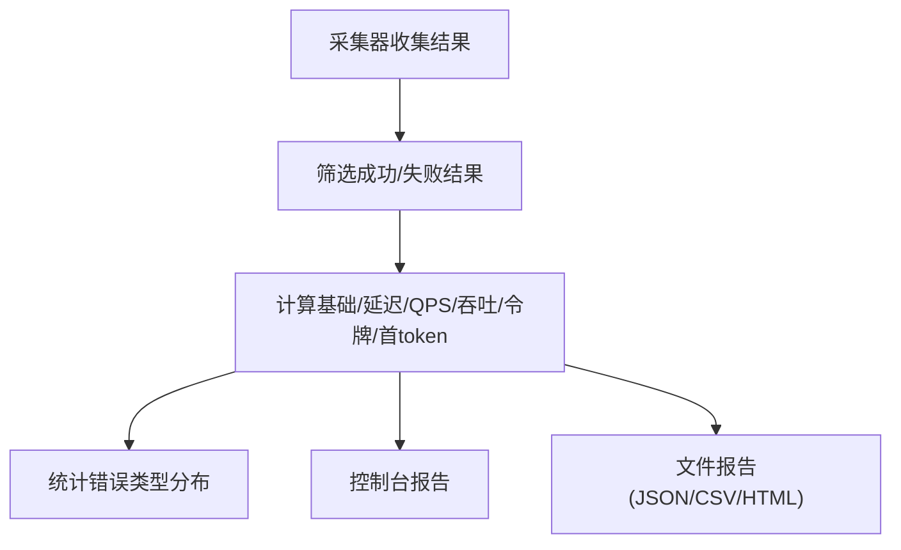
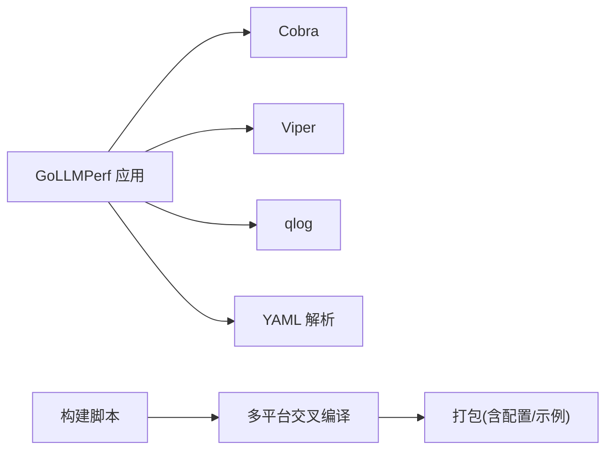

# 部署与运维

<cite>
**本文引用的文件**
- [main.go](file://main.go)
- [go.mod](file://go.mod)
- [configs/example.yaml](file://configs/example.yaml)
- [build.sh](file://build.sh)
- [cmd/root.go](file://cmd/root.go)
- [cmd/run.go](file://cmd/run.go)
- [cmd/generate.go](file://cmd/generate.go)
- [internal/config/config.go](file://internal/config/config.go)
- [internal/engine/engine.go](file://internal/engine/engine.go)
- [internal/provider/openai.go](file://internal/provider/openai.go)
- [internal/reporter/reporter.go](file://internal/reporter/reporter.go)
- [internal/collector/collector.go](file://internal/collector/collector.go)
- [internal/analyzer/analyzer.go](file://internal/analyzer/analyzer.go)
</cite>

## 目录
1. [简介](#简介)
2. [项目结构](#项目结构)
3. [核心组件](#核心组件)
4. [架构总览](#架构总览)
5. [详细组件分析](#详细组件分析)
6. [依赖分析](#依赖分析)
7. [性能考虑](#性能考虑)
8. [故障排查指南](#故障排查指南)
9. [结论](#结论)
10. [附录](#附录)

## 简介
本指南面向生产环境的 GoLLMPerf 部署与运维，覆盖以下主题：
- 容器化部署（Docker）与 Kubernetes 部署（Helm/Kustomize）
- 传统服务器部署（二进制分发与 systemd 管理）
- 监控与告警（性能指标、错误监控、日志管理）
- 故障排查方法与常用工具
- 备份恢复与灾难恢复策略
- 性能优化与资源管理最佳实践
- CI/CD 流水线与自动化部署方案

GoLLMPerf 是一个用于大语言模型性能测试与基准评测的专业工具，支持批量测试、压力测试与多并发性能寻优，并输出多种格式的报告。

## 项目结构
仓库采用模块化设计，命令行入口通过 Cobra 提供子命令；配置由 Viper 与 YAML 驱动；核心执行引擎封装了请求发送、结果采集、分析与报告生成。

图表来源
- [main.go:1-26](file://main.go#L1-L26)
- [cmd/root.go:1-28](file://cmd/root.go#L1-L28)
- [cmd/run.go:1-123](file://cmd/run.go#L1-L123)
- [cmd/generate.go:1-26](file://cmd/generate.go#L1-L26)
- [internal/config/config.go:1-229](file://internal/config/config.go#L1-L229)
- [internal/engine/engine.go:1-112](file://internal/engine/engine.go#L1-L112)
- [internal/provider/openai.go:1-253](file://internal/provider/openai.go#L1-L253)
- [internal/collector/collector.go:1-97](file://internal/collector/collector.go#L1-L97)
- [internal/analyzer/analyzer.go:1-198](file://internal/analyzer/analyzer.go#L1-L198)
- [configs/example.yaml:1-78](file://configs/example.yaml#L1-L78)
- [go.mod:1-48](file://go.mod#L1-L48)

章节来源
- [main.go:1-26](file://main.go#L1-L26)
- [cmd/root.go:1-28](file://cmd/root.go#L1-L28)
- [configs/example.yaml:1-78](file://configs/example.yaml#L1-L78)
- [go.mod:1-48](file://go.mod#L1-L48)

## 核心组件
- 命令行与入口
  - 应用入口初始化日志并委托给根命令执行。
  - 根命令提供持久标志以设置日志级别。
- 运行命令
  - 支持批量、压力与性能模式；可选择是否生成报告、控制台表格展示、指定配置文件等。
- 配置系统
  - 使用 Viper 加载 YAML 配置，支持环境变量占位符替换；提供默认配置生成能力。
- 引擎与提供商
  - 引擎负责预热、并发执行、结果收集；提供商实现具体 LLM 接口调用（如 OpenAI），支持流式与非流式响应。
- 结果采集与分析
  - 采集器保存所有结果；分析器计算成功率、延迟、吞吐、首 token 延迟、令牌统计与错误分布。
- 报告生成
  - 控制台报告与 JSON/CSV/HTML 文件报告；支持并发对比数据聚合。

章节来源
- [main.go:1-26](file://main.go#L1-L26)
- [cmd/root.go:1-28](file://cmd/root.go#L1-L28)
- [cmd/run.go:1-123](file://cmd/run.go#L1-L123)
- [cmd/generate.go:1-26](file://cmd/generate.go#L1-L26)
- [internal/config/config.go:1-229](file://internal/config/config.go#L1-L229)
- [internal/engine/engine.go:1-112](file://internal/engine/engine.go#L1-L112)
- [internal/provider/openai.go:1-253](file://internal/provider/openai.go#L1-L253)
- [internal/collector/collector.go:1-97](file://internal/collector/collector.go#L1-L97)
- [internal/analyzer/analyzer.go:1-198](file://internal/analyzer/analyzer.go#L1-L198)
- [internal/reporter/reporter.go:1-130](file://internal/reporter/reporter.go#L1-L130)

## 架构总览
下图展示了从 CLI 到引擎、提供商、采集与分析、再到报告的整体流程。

图表来源
- [cmd/run.go:97-123](file://cmd/run.go#L97-L123)
- [internal/engine/engine.go:88-112](file://internal/engine/engine.go#L88-L112)
- [internal/provider/openai.go:84-144](file://internal/provider/openai.go#L84-L144)
- [internal/collector/collector.go:14-22](file://internal/collector/collector.go#L14-L22)
- [internal/analyzer/analyzer.go:89-197](file://internal/analyzer/analyzer.go#L89-L197)
- [internal/reporter/reporter.go:103-129](file://internal/reporter/reporter.go#L103-L129)

## 详细组件分析

### 命令行与入口
- 入口初始化日志（控制台彩色输出），随后交由根命令执行。
- 根命令提供持久日志级别标志，运行命令在执行前根据该标志动态调整日志级别。
- 运行命令支持多种模式与输出选项；generate 命令用于生成默认配置文件。

图表来源
- [main.go:11-25](file://main.go#L11-L25)
- [cmd/root.go:17-27](file://cmd/root.go#L17-L27)
- [cmd/run.go:16-78](file://cmd/run.go#L16-L78)
- [cmd/generate.go:8-21](file://cmd/generate.go#L8-L21)

章节来源
- [main.go:1-26](file://main.go#L1-L26)
- [cmd/root.go:1-28](file://cmd/root.go#L1-L28)
- [cmd/run.go:1-123](file://cmd/run.go#L1-L123)
- [cmd/generate.go:1-26](file://cmd/generate.go#L1-L26)

### 配置系统
- 配置文件使用 YAML；Viper 负责读取与反序列化；支持对模型名称、API 密钥、端点进行环境变量替换。
- 提供默认配置生成函数，便于快速产出可运行的初始配置。
- 运行命令可通过标志覆盖部分配置项。

图表来源
- [internal/config/config.go:136-188](file://internal/config/config.go#L136-L188)
- [internal/config/config.go:190-229](file://internal/config/config.go#L190-L229)
- [configs/example.yaml:1-78](file://configs/example.yaml#L1-L78)

章节来源
- [internal/config/config.go:1-229](file://internal/config/config.go#L1-L229)
- [configs/example.yaml:1-78](file://configs/example.yaml#L1-L78)

### 测试引擎与提供商
- 引擎在执行前进行预热（按并发数循环发送请求），随后进入正式阶段。
- 执行单次请求时，将优先参数与附加参数合并，构造最终请求体；根据是否流式决定处理路径。
- OpenAI 提供商实现 HTTP 请求、状态码校验、流式/非流式响应解析，并记录端到端延迟与首 token 延迟。

图表来源
- [internal/engine/engine.go:13-47](file://internal/engine/engine.go#L13-L47)
- [internal/engine/engine.go:88-112](file://internal/engine/engine.go#L88-L112)
- [internal/provider/openai.go:21-48](file://internal/provider/openai.go#L21-L48)
- [internal/provider/openai.go:84-144](file://internal/provider/openai.go#L84-L144)

章节来源
- [internal/engine/engine.go:1-112](file://internal/engine/engine.go#L1-L112)
- [internal/provider/openai.go:1-253](file://internal/provider/openai.go#L1-L253)

### 结果采集、分析与报告
- 采集器维护结果列表，提供成功/失败过滤与统计。
- 分析器基于成功结果计算成功率、延迟分布、QPS、吞吐、平均令牌数与首 token 延迟分布，并统计错误类型。
- 报告器支持控制台输出与文件报告（JSON/CSV/HTML），并聚合并发对比数据。

图表来源
- [internal/collector/collector.go:9-97](file://internal/collector/collector.go#L9-L97)
- [internal/analyzer/analyzer.go:77-198](file://internal/analyzer/analyzer.go#L77-L198)
- [internal/reporter/reporter.go:25-130](file://internal/reporter/reporter.go#L25-L130)

章节来源
- [internal/collector/collector.go:1-97](file://internal/collector/collector.go#L1-L97)
- [internal/analyzer/analyzer.go:1-198](file://internal/analyzer/analyzer.go#L1-L198)
- [internal/reporter/reporter.go:1-130](file://internal/reporter/reporter.go#L1-L130)

## 依赖分析
- 语言与构建：Go 1.23；CGO 关闭构建以获得更小体积与更好移植性。
- 外部依赖：Cobra（命令行）、Viper（配置）、qlog（日志）、YAML 解析等。
- 平台打包：脚本支持多平台交叉编译与打包，包含示例配置与文档资源。

图表来源
- [go.mod:5-12](file://go.mod#L5-L12)
- [build.sh:108-155](file://build.sh#L108-L155)

章节来源
- [go.mod:1-48](file://go.mod#L1-L48)
- [build.sh:1-215](file://build.sh#L1-L215)

## 性能考虑
- 并发与预热
  - 合理设置并发度与预热时长，避免过早饱和导致测量偏差。
  - 预热阶段应使用真实数据集片段，确保连接与模型加载稳定。
- 请求参数与头
  - 优先参数与附加参数合并时注意键冲突；确保 Content-Type 与鉴权头正确。
- 流式与非流式
  - 流式响应可获取首 token 延迟；非流式响应首 token 延迟等于端到端延迟。
- 指标计算
  - 成功率、延迟百分位、QPS、吞吐与令牌统计需基于成功样本计算，避免异常值影响。
- 资源与网络
  - 控制超时时间，避免长时间阻塞；合理设置连接池与重定向限制。
- 日志与调试
  - 生产环境建议降低日志级别；必要时启用请求/响应调试开关定位问题。

[本节为通用指导，无需特定文件引用]

## 故障排查指南
- 常见问题定位
  - 配置加载失败：检查配置文件路径与权限；确认环境变量占位符已正确替换。
  - API 调用失败：检查鉴权头、端点、超时设置；查看提供商返回的状态码与错误体。
  - 结果为空或不完整：确认并发度与请求数设置；检查预热是否成功。
  - 报告生成失败：确认输出目录存在且有写权限；检查报告格式支持。
- 日志与调试
  - 使用持久日志级别标志调整全局日志等级。
  - 开启请求/响应调试环境变量以输出详细交互信息。
- 工具与命令
  - 使用 generate 子命令生成默认配置作为基线。
  - 使用 run 子命令的 no-report 选项仅验证执行链路。
  - 使用 show-table 选项在控制台查看表格形式的中间结果。

章节来源
- [cmd/root.go:17-27](file://cmd/root.go#L17-L27)
- [cmd/generate.go:8-21](file://cmd/generate.go#L8-L21)
- [internal/provider/openai.go:16-19](file://internal/provider/openai.go#L16-L19)

## 结论
本指南提供了 GoLLMPerf 在生产环境中的部署与运维实践，涵盖容器化、Kubernetes 与传统服务器部署路径，结合监控、告警、日志与故障排查方法，以及备份恢复与性能优化建议。通过规范化的配置管理与 CI/CD 自动化，可显著提升稳定性与可维护性。

[本节为总结，无需特定文件引用]

## 附录

### A. 生产环境部署步骤

- 容器化部署（Docker）
  - 基础镜像：建议使用最小化 Linux 基础镜像（如 distroless 或 alpine）。
  - 构建产物：使用构建脚本生成跨平台二进制与打包包，或直接在容器内编译。
  - 配置挂载：将示例配置映射到容器内路径，设置必要的环境变量（模型名、API 密钥、端点）。
  - 运行参数：通过命令行标志覆盖配置项；设置日志级别与输出格式。
  - 健康检查：可暴露轻量健康端点或通过日志/进程状态判断。
  - 安全：只读文件系统、非 root 用户运行、最小权限原则。

- Kubernetes 部署（Helm/Kustomize）
  - Deployment：定义副本数、资源限制与请求；挂载配置卷与密钥卷。
  - ConfigMap：存放示例配置；Secret：存放 API 密钥与敏感参数。
  - Service/Ingress：按需暴露服务；注意限流与超时配置。
  - Job/CronJob：批量任务或定时压测；注意并发与资源配额。
  - HPA/VPA：根据 CPU/内存或自定义指标自动扩缩容。
  - PodSecurityPolicy/SecurityContext：遵循最小权限与安全基线。

- 传统服务器部署
  - 二进制分发：使用构建脚本生成目标平台二进制；复制示例配置与文档资源。
  - systemd 单元：定义 ExecStart、Restart、Environment、EnvironmentFile 等。
  - 目录结构：独立的配置、结果与日志目录；权限与磁盘配额。
  - 监控集成：Prometheus Exporter 或日志采集器对接监控系统。

[本节为通用实践，无需特定文件引用]

### B. 监控与告警集成

- 性能指标监控
  - 指标来源：应用内部日志与外部系统（如 Prometheus Pushgateway）。
  - 关键指标：QPS、成功率、延迟 P50/P90/P99、吞吐、首 token 延迟、令牌使用量。
  - 告警规则：成功率低于阈值、延迟突增、错误类型异常、资源使用率过高。
- 错误监控
  - 统计错误类型分布与趋势；区分网络错误、鉴权错误、上游限流与业务错误。
- 日志管理
  - 结构化日志：统一字段（时间戳、级别、模块、traceId、消息）。
  - 日志轮转：大小/时间轮转；保留周期与压缩策略。
  - 集中化：ELK/EFK 或 Loki/Grafana；建立查询与仪表板。

[本节为通用实践，无需特定文件引用]

### C. 备份恢复与灾难恢复

- 备份策略
  - 配置与密钥：版本化存储于私有仓库；定期导出与校验。
  - 结果数据：定期归档报告与原始批次结果；保留历史版本。
  - 日志：短期本地、长期远程对象存储。
- 恢复演练
  - 恢复时间目标（RTO）与恢复点目标（RPO）；定期演练验证。
- 灾难恢复
  - 多可用区/多云部署；自动故障转移与数据同步。
  - 降级策略：限流、缓存、只读模式与降级接口。

[本节为通用实践，无需特定文件引用]

### D. CI/CD 流水线与自动化部署

- 构建与测试
  - 触发条件：push、PR、tag；矩阵构建（多平台/多架构）。
  - 步骤：安装 Go、依赖缓存、单元测试、静态检查、构建二进制、打包。
- 发布与分发
  - 上传制品：二进制包、容器镜像、Helm Chart。
  - 版本标签：语义化版本与 Git 描述符。
- 部署与回滚
  - 蓝绿/金丝雀发布；自动回滚策略。
  - 声明式配置：Kubernetes 清单与 Helm Values 管理。
- 安全与合规
  - 依赖扫描、容器镜像漏洞扫描、密钥泄露检测。
  - 最小权限与审计日志。

[本节为通用实践，无需特定文件引用]