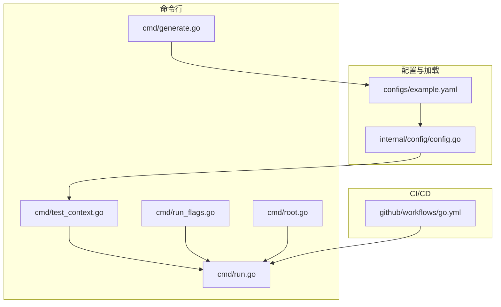
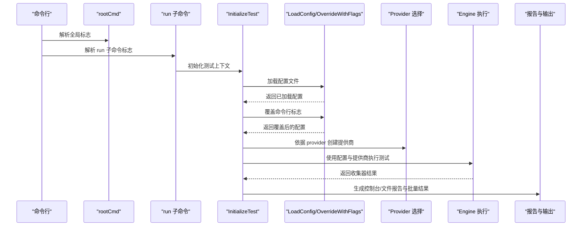
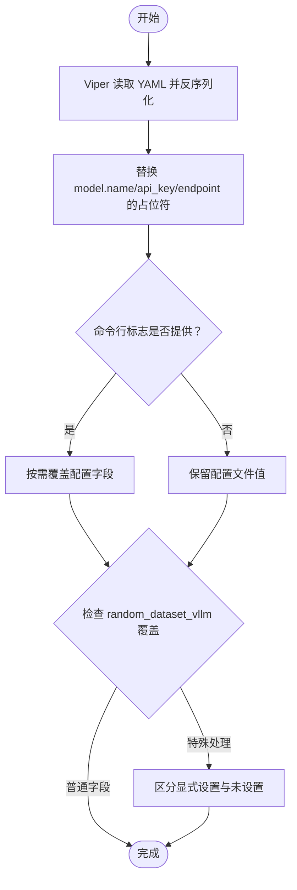
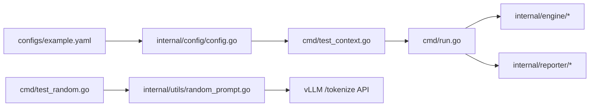

# 配置管理

<cite>
**本文引用的文件列表**
- [configs/example.yaml](file://configs/example.yaml)
- [internal/config/config.go](file://internal/config/config.go)
- [internal/config/config_test.go](file://internal/config/config_test.go)
- [cmd/root.go](file://cmd/root.go)
- [cmd/run.go](file://cmd/run.go)
- [cmd/run_flags.go](file://cmd/run_flags.go)
- [cmd/generate.go](file://cmd/generate.go)
- [cmd/test_context.go](file://cmd/test_context.go)
- [.github/workflows/go.yml](file://.github/workflows/go.yml)
</cite>

## 目录
1. [简介](#简介)
2. [项目结构](#项目结构)
3. [核心组件](#核心组件)
4. [架构总览](#架构总览)
5. [详细组件分析](#详细组件分析)
6. [依赖关系分析](#依赖关系分析)
7. [性能考量](#性能考量)
8. [故障排查指南](#故障排查指南)
9. [结论](#结论)
10. [附录](#附录)

## 简介
本章节系统性阐述 GoLLMPerf 的配置管理机制，覆盖配置文件结构与 YAML 规范、环境变量支持与优先级、配置加载与合并策略、配置验证与错误处理、CI/CD 集成与自动化测试、以及配置迁移与版本兼容建议。目标是帮助使用者在本地与流水线中稳定地使用配置驱动的性能测试流程。

## 项目结构
GoLLMPerf 将配置管理集中在内部模块中，并通过命令行子命令与工具函数暴露能力：
- 配置文件：configs/example.yaml 提供示例配置
- 配置加载与模型：internal/config/config.go 定义配置结构、加载与覆盖逻辑
- 命令行入口与参数：cmd 下各子命令负责解析参数、加载配置并执行测试
- 测试与验证：internal/config/config_test.go 用于验证配置加载行为
- CI/CD：.github/workflows/go.yml 展示了测试与打包流程

图表来源
- [internal/config/config.go:136-188](file://internal/config/config.go#L136-L188)
- [configs/example.yaml:1-84](file://configs/example.yaml#L1-L84)
- [cmd/test_context.go:21-81](file://cmd/test_context.go#L21-L81)
- [cmd/run.go:16-95](file://cmd/run.go#L16-L95)
- [.github/workflows/go.yml:1-117](file://.github/workflows/go.yml#L1-L117)

章节来源
- [configs/example.yaml:1-84](file://configs/example.yaml#L1-L84)
- [internal/config/config.go:136-188](file://internal/config/config.go#L136-L188)
- [cmd/root.go:10-27](file://cmd/root.go#L10-L27)
- [cmd/run.go:16-95](file://cmd/run.go#L16-L95)
- [cmd/generate.go:8-25](file://cmd/generate.go#L8-L25)
- [cmd/test_context.go:21-81](file://cmd/test_context.go#L21-L81)
- [.github/workflows/go.yml:1-117](file://.github/workflows/go.yml#L1-L117)

## 核心组件
- 配置结构体
  - Config：顶层配置，包含 test、model、dataset、random_dataset_vllm、output 五个子配置
  - TestConfig：测试时长、预热、并发、每并发请求数、超时、性能并发组等
  - ModelConfig：模型名、提供商、端点、请求头、API 密钥、参数模板、系统提示模板
  - DatasetConfig：数据集类型与路径
  - RandomDatasetVLLMConfig：vLLM 随机数据集生成配置，包含 Enable、InputLength、OutputLength 参数
  - OutputConfig：报告格式、输出路径、批量结果保存路径
  - SystemPromptTemplate：系统提示模板，支持直接内容或文件路径，二者同时存在时以内容优先
- 加载与覆盖
  - LoadConfig：基于 Viper 读取 YAML 并反序列化；对 model.name、model.api_key、model.endpoint 支持环境变量占位符替换
  - OverrideWithFlags：将命令行标志覆盖到已加载的配置上
  - GenerateDefaultConfig：生成带默认值的配置文件（含合理默认与占位符）
- 命令行集成
  - run 子命令：加载配置、初始化测试上下文、执行批测/压力测/性能模式、生成报告与保存批量结果
  - generate 子命令：生成默认配置文件
  - test_context：校验 provider、加载数据集、选择提供商并返回测试上下文

章节来源
- [internal/config/config.go:81-129](file://internal/config/config.go#L81-L129)
- [internal/config/config.go:136-188](file://internal/config/config.go#L136-L188)
- [internal/config/config.go:14-75](file://internal/config/config.go#L14-L75)
- [cmd/run.go:16-95](file://cmd/run.go#L16-L95)
- [cmd/generate.go:8-25](file://cmd/generate.go#L8-L25)
- [cmd/test_context.go:21-81](file://cmd/test_context.go#L21-L81)

## 架构总览
下图展示从命令行到配置加载、覆盖与执行的整体流程。

图表来源
- [cmd/root.go:17-27](file://cmd/root.go#L17-L27)
- [cmd/run.go:22-77](file://cmd/run.go#L22-L77)
- [cmd/test_context.go:21-81](file://cmd/test_context.go#L21-L81)
- [internal/config/config.go:136-188](file://internal/config/config.go#L136-L188)

## 详细组件分析

### 配置文件结构与 YAML 规范
- 文件位置与用途
  - configs/example.yaml：示例配置，包含 test、model、dataset、random_dataset_vllm、output 五个顶层键
- 字段定义与约束
  - test
    - duration：测试时长，支持时间单位（如 s），0 表示无限
    - warmup：预热时长，0 表示不预热
    - concurrency：并发数，用于批测/压力测
    - perf_concurrency_group：性能模式下的并发级别数组
    - requests_per_concurrency：每个并发级别的请求数，0 表示无限
    - timeout：单次请求超时，0 表示无限
  - model
    - name：模型名，支持环境变量占位符
    - provider：提供商（如 openai、qwen）
    - endpoint：API 端点，支持环境变量占位符
    - api_key：API 密钥，支持环境变量占位符
    - headers：HTTP 请求头映射
    - params_template：请求参数模板（如 stream、stream_options、extra_body）
    - system_prompt_template：系统提示模板，支持 enable、content、path；二者同时设置时以 content 为准
  - dataset
    - type：数据集类型（如 jsonl）
    - path：数据集文件路径
  - random_dataset_vllm
    - random-enable：启用 vLLM 随机数据集生成功能，默认为 false
    - random-input-len：随机输入的 token 长度，默认为 1000
    - random-output-len：随机输出的 token 长度，默认为 100
  - output
    - format：报告格式（json、csv、html）
    - path：报告输出路径
    - batch_result_path：批量结果保存路径（JSONL）

**更新** 新增了 random_dataset_vllm 配置块，用于支持 vLLM 随机数据集生成功能

章节来源
- [configs/example.yaml:4-82](file://configs/example.yaml#L4-L82)
- [internal/config/config.go:89-129](file://internal/config/config.go#L89-L129)

### 环境变量支持与优先级规则
- 占位符语法
  - 在 YAML 中使用形如 ${ENV_VAR} 的占位符，加载时由 Viper 读取后，再由程序进行环境变量替换
- 替换范围
  - model.name、model.api_key、model.endpoint 支持占位符替换
- 优先级顺序
  - 命令行标志覆盖已加载的配置
  - 配置文件中的占位符在加载阶段被环境变量替换
  - 因此最终生效顺序为：命令行标志 > 配置文件（含占位符替换） > 默认值
- 注意事项
  - 当 system_prompt_template 同时设置了 content 与 path，将以 content 为准

章节来源
- [internal/config/config.go:157-185](file://internal/config/config.go#L157-L185)
- [internal/config/config.go:190-216](file://internal/config/config.go#L190-L216)
- [configs/example.yaml:26,32,35,53-57:26-35](file://configs/example.yaml#L26-L35)
- [configs/example.yaml:53-57](file://configs/example.yaml#L53-L57)

### 配置加载与合并策略
- 加载流程
  - 使用 Viper 设置配置文件并读取
  - 反序列化为 Config 结构体
  - 对指定字段执行环境变量替换
- 合并策略
  - 命令行标志仅在提供时才覆盖对应字段
  - 未提供的标志保持配置文件中的值
  - **新增**：random_dataset_vllm 配置的命令行覆盖具有特殊处理，需要区分"未设置"和"显式设置为 false"的情况
- 默认值生成
  - GenerateDefaultConfig 生成包含合理默认值与占位符的配置文件，便于快速开始

**更新** 新增了 random_dataset_vllm 配置的特殊覆盖处理逻辑

图表来源
- [internal/config/config.go:136-188](file://internal/config/config.go#L136-L188)
- [internal/config/config.go:190-216](file://internal/config/config.go#L190-L216)
- [internal/config/config.go:14-75](file://internal/config/config.go#L14-L75)
- [cmd/test_context.go:47-58](file://cmd/test_context.go#L47-L58)

章节来源
- [internal/config/config.go:136-188](file://internal/config/config.go#L136-L188)
- [internal/config/config.go:190-216](file://internal/config/config.go#L190-L216)
- [internal/config/config.go:14-75](file://internal/config/config.go#L14-L75)
- [cmd/test_context.go:47-58](file://cmd/test_context.go#L47-L58)

### 配置验证与错误处理
- 运行前验证
  - InitializeTest 在加载配置后检查 provider 是否为空，若为空则记录错误并退出
- 加载期错误
  - LoadConfig 在读取/反序列化失败时返回错误
- 系统提示模板冲突
  - 当 system_prompt_template 同时设置 content 与 path 时发出警告，以 content 为准
- 报告生成与保存
  - run 子命令在生成文件报告或保存批量结果失败时记录错误信息
- **新增**：随机数据集生成验证
  - 当 random_dataset_vllm.enable 为 true 时，会调用 generateRandomDataset 函数生成随机数据集
  - 如果随机数据集生成失败，会记录警告并回退到最佳努力模式

**更新** 新增了随机数据集生成相关的验证和错误处理

章节来源
- [cmd/test_context.go:48-51](file://cmd/test_context.go#L48-L51)
- [internal/config/config.go:153-155](file://internal/config/config.go#L153-L155)
- [internal/config/config.go:181-185](file://internal/config/config.go#L181-L185)
- [cmd/run.go:52-63](file://cmd/run.go#L52-L63)
- [cmd/test_context.go:106-142](file://cmd/test_context.go#L106-L142)

### CI/CD 集成与自动化测试
- 流水线任务
  - go.yml：在打标签时触发构建与发布，包含测试步骤与多平台打包
- 测试执行
  - go test -v ./...：在流水线中执行所有包的测试用例
- 配置文件分发
  - 打包阶段复制 configs/example.yaml 到发布包，便于用户直接使用
- 建议实践
  - 在 CI 中使用环境变量注入敏感配置（如 API 密钥），并在本地使用配置文件占位符
  - 将 generate 子命令纳入 CI，自动生成默认配置文件作为基线
  - **新增**：对于 vLLM 随机数据集测试，可以在 CI 中添加 test-random 命令进行验证

**更新** 新增了 vLLM 随机数据集测试的 CI 集成建议

章节来源
- [.github/workflows/go.yml:1-117](file://.github/workflows/go.yml#L1-L117)
- [cmd/generate.go:8-25](file://cmd/generate.go#L8-L25)
- [cmd/test_random.go:14-95](file://cmd/test_random.go#L14-L95)

### 配置示例与常用场景模板
- 示例配置
  - 参考 configs/example.yaml，包含测试、模型、数据集、随机数据集和输出的完整示例
- 常用场景
  - 批测：设置 batch 模式，配置并发与超时
  - 压力测：设置 stress 模式，观察系统稳定性
  - 性能模式：配置 perf_concurrency_group，自动遍历不同并发级别
  - 自定义系统提示：启用 system_prompt_template 并提供 content 或 path
  - **新增**：vLLM 随机数据集测试：启用 random_dataset_vllm.random-enable，设置合适的输入输出长度
- 命令行覆盖
  - 使用 run 子命令的标志覆盖配置文件中的相应字段，无需修改配置文件
  - **新增**：使用 --random-enable、--random-input-len、--random-output-len 覆盖随机数据集配置

**更新** 新增了 vLLM 随机数据集测试的配置示例和命令行覆盖说明

章节来源
- [configs/example.yaml:1-84](file://configs/example.yaml#L1-L84)
- [cmd/run.go:80-95](file://cmd/run.go#L80-L95)
- [cmd/run.go:100-102](file://cmd/run.go#L100-L102)

### 配置迁移与版本兼容
- 占位符迁移
  - 若从旧版配置迁移到新版，确保将敏感字段（如 api_key、endpoint、model.name）改为占位符形式，避免硬编码
- 字段演进
  - 新增字段建议提供合理的默认值，保证向后兼容
  - **新增**：random_dataset_vllm 配置块的默认值为 false、1000、100，向后兼容现有配置
- 版本控制
  - 在 CI 中使用 generate 子命令生成默认配置，作为版本基线，便于追踪变更
- 兼容性建议
  - 保持 YAML 键名稳定，必要时通过别名映射（如 mapstructure）兼容旧字段名
  - **新增**：新配置块不会影响现有配置文件的解析和运行

**更新** 新增了 random_dataset_vllm 配置的版本兼容性说明

章节来源
- [internal/config/config.go:14-75](file://internal/config/config.go#L14-L75)
- [cmd/generate.go:8-25](file://cmd/generate.go#L8-L25)
- [internal/config/config.go:58-61](file://internal/config/config.go#L58-L61)

## 依赖关系分析
- 组件耦合
  - 配置模块与命令行模块松耦合：通过 RunFlags 传递覆盖参数
  - 配置模块与引擎/报告模块解耦：通过 TestContext 传递配置对象
  - **新增**：配置模块与随机数据集生成模块耦合：当 random_dataset_vllm.enable 为 true 时，会调用 generateRandomDataset 函数
- 外部依赖
  - Viper：用于配置文件读取与反序列化
  - qlog：日志记录
  - **新增**：gofakeit：用于生成随机英文单词
- 关键依赖链
  - configs/example.yaml → internal/config/config.go → cmd/test_context.go → cmd/run.go → internal/engine/* 与 internal/reporter/*
  - **新增**：cmd/test_random.go → internal/utils/random_prompt.go → vLLM /tokenize API

**更新** 新增了随机数据集生成相关的依赖关系图

图表来源
- [configs/example.yaml:1-84](file://configs/example.yaml#L1-L84)
- [internal/config/config.go:136-188](file://internal/config/config.go#L136-L188)
- [cmd/test_context.go:21-81](file://cmd/test_context.go#L21-L81)
- [cmd/run.go:16-95](file://cmd/run.go#L16-L95)
- [cmd/test_random.go:14-95](file://cmd/test_random.go#L14-L95)
- [internal/utils/random_prompt.go:14-197](file://internal/utils/random_prompt.go#L14-L197)

章节来源
- [internal/config/config.go:136-188](file://internal/config/config.go#L136-L188)
- [cmd/test_context.go:21-81](file://cmd/test_context.go#L21-L81)
- [cmd/run.go:16-95](file://cmd/run.go#L16-L95)
- [cmd/test_random.go:14-95](file://cmd/test_random.go#L14-L95)
- [internal/utils/random_prompt.go:14-197](file://internal/utils/random_prompt.go#L14-L197)

## 性能考量
- 配置加载开销
  - Viper 读取与反序列化开销极小，适合在启动阶段一次性完成
- 环境变量替换
  - 仅对少数字段进行替换，且仅在占位符存在时发生，影响可忽略
- 命令行覆盖
  - 仅在提供标志时覆盖，避免不必要的写操作
- **新增**：随机数据集生成性能
  - 随机数据集生成涉及 vLLM /tokenize API 调用，可能增加测试启动时间
  - 生成算法包含重试机制，最多尝试 10 次以达到目标 token 数量

**更新** 新增了随机数据集生成的性能考量

章节来源
- [internal/config/config.go:145-155](file://internal/config/config.go#L145-L155)
- [internal/config/config.go:157-185](file://internal/config/config.go#L157-L185)
- [cmd/test_context.go:48-51](file://cmd/test_context.go#L48-L51)
- [cmd/run.go:52-63](file://cmd/run.go#L52-L63)
- [internal/utils/random_prompt.go:34-113](file://internal/utils/random_prompt.go#L34-L113)

## 故障排查指南
- 配置文件无法读取
  - 检查路径是否正确，确认文件权限与格式
- 反序列化失败
  - 检查 YAML 缩进与键名拼写，确保类型匹配
- 环境变量未生效
  - 确认占位符格式为 ${ENV_VAR}，且环境变量已导出
- provider 为空导致退出
  - 在配置文件中设置 provider，或通过命令行标志覆盖
- system_prompt_template 冲突
  - 同时设置 content 与 path 会发出警告，建议仅保留一种方式
- 报告生成失败
  - 检查输出路径是否存在可写权限，确认格式支持
- **新增**：随机数据集生成问题
  - vLLM /tokenize API 调用失败：检查 endpoint 配置和网络连接
  - 随机数据集生成超时：调整 random_input_len 和 random_output_len 参数
  - 令牌计数不准确：检查 vLLM 模型的分词器配置

**更新** 新增了随机数据集生成相关的故障排查指南

章节来源
- [internal/config/config.go:145-155](file://internal/config/config.go#L145-L155)
- [internal/config/config.go:157-185](file://internal/config/config.go#L157-L185)
- [cmd/test_context.go:48-51](file://cmd/test_context.go#L48-L51)
- [cmd/run.go:52-63](file://cmd/run.go#L52-L63)
- [internal/utils/random_prompt.go:154-178](file://internal/utils/random_prompt.go#L154-L178)

## 结论
GoLLMPerf 的配置管理以清晰的 YAML 结构、灵活的环境变量占位符、严格的加载与覆盖流程为核心，辅以命令行标志覆盖与完善的错误处理，既满足本地开发需求，也适配 CI/CD 自动化。通过默认配置生成与示例文件，用户可以快速上手并安全地扩展到生产环境。新增的 vLLM 随机数据集生成功能进一步增强了工具的灵活性，支持更广泛的性能测试场景。

## 附录
- 常用命令
  - 生成默认配置：go run main.go generate <输出路径>
  - 运行测试：go run main.go run -c <配置文件> [-b|-s|-p] [--provider|--model|--dataset|--apikey|--endpoint|--report|--format|--batch-result]
  - **新增**：测试随机数据集生成：go run main.go test-random --endpoint <vLLM端点> --tokens <目标token数> --iterations <迭代次数>
- 最佳实践
  - 将敏感信息放入环境变量并通过占位符注入
  - 使用 generate 子命令维护默认配置基线
  - 在 CI 中统一执行 go test 并打包包含示例配置文件
  - **新增**：使用 test-random 命令验证 vLLM 随机数据集生成的准确性
  - **新增**：合理设置 random_input_len 和 random_output_len 参数以平衡测试精度和性能

**更新** 新增了随机数据集测试命令和相关最佳实践