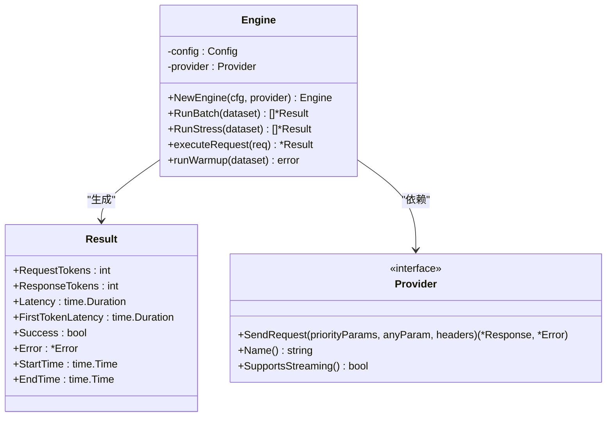
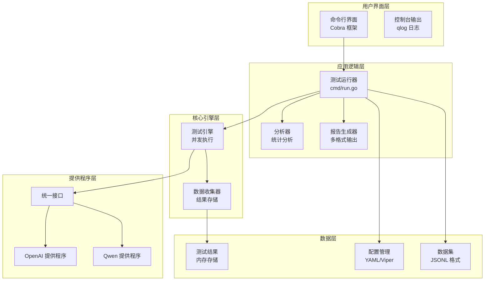
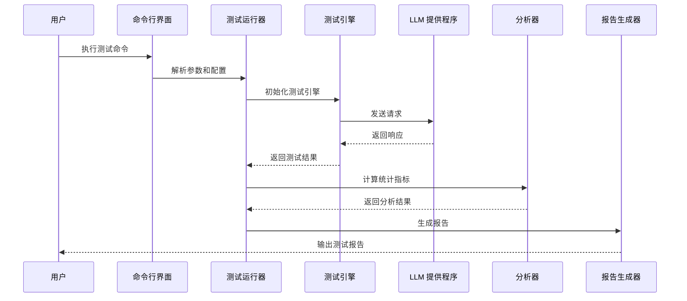
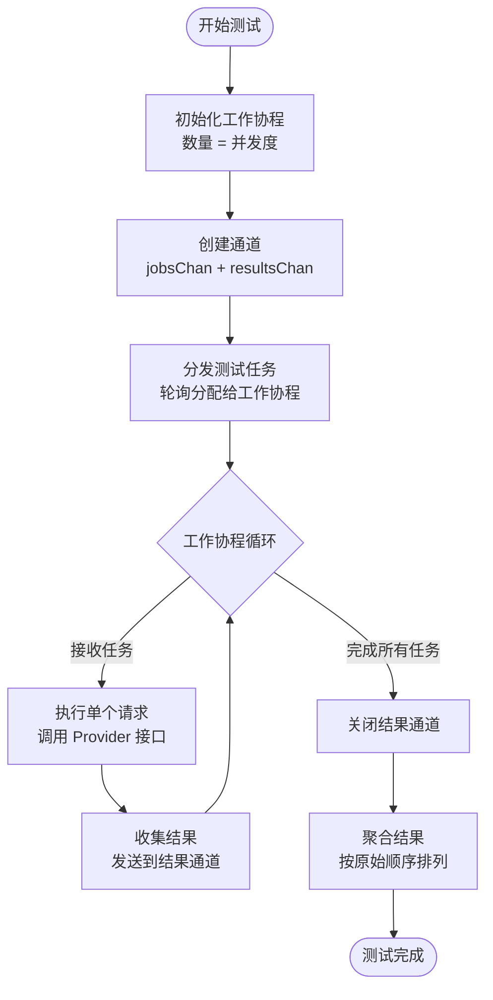
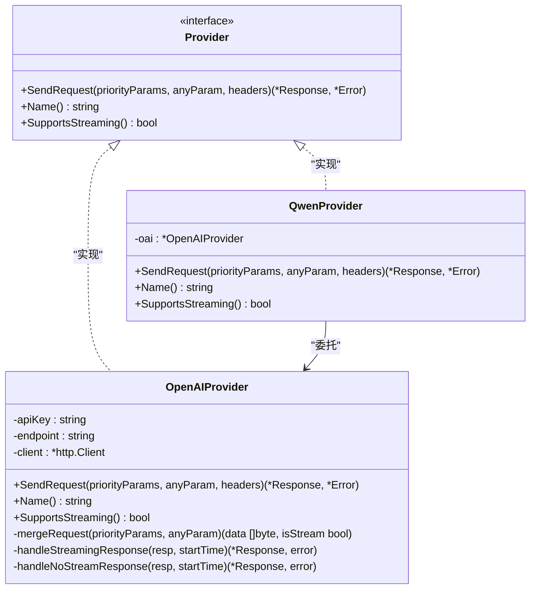
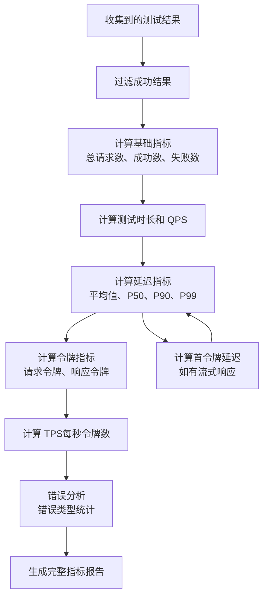
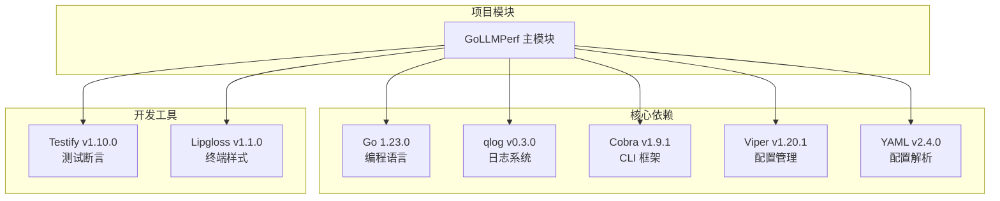

# 项目概述

<cite>
**本文档引用的文件**
- [main.go](file://main.go)
- [root.go](file://cmd/root.go)
- [run.go](file://cmd/run.go)
- [engine.go](file://internal/engine/engine.go)
- [batch.go](file://internal/engine/batch.go)
- [stress.go](file://internal/engine/stress.go)
- [openai.go](file://internal/provider/openai.go)
- [qwen.go](file://internal/provider/qwen.go)
- [analyzer.go](file://internal/analyzer/analyzer.go)
- [reporter.go](file://internal/reporter/reporter.go)
- [config.go](file://internal/config/config.go)
- [example.yaml](file://configs/example.yaml)
- [go.mod](file://go.mod)
- [README.md](file://README.md)
</cite>

## 目录
1. [简介](#简介)
2. [项目结构](#项目结构)
3. [核心组件](#核心组件)
4. [架构总览](#架构总览)
5. [详细组件分析](#详细组件分析)
6. [依赖关系分析](#依赖关系分析)
7. [性能考虑](#性能考虑)
8. [故障排除指南](#故障排除指南)
9. [结论](#结论)

## 简介

GoLLMPerf 是一个专业的大型语言模型（LLM）API 性能测试工具，专为准确性和精确性而设计。该工具支持多种 LLM 提供商，提供多维度性能指标，并具备企业级测试能力。

### 核心价值主张

- **专业级性能测试**：提供吞吐量、延迟、质量、稳定性等多维度性能评估
- **多提供商支持**：原生支持 OpenAI 和 Qwen（通义千问），可扩展支持其他 LLM 提供商
- **多样化测试模式**：支持基础测试、压力测试、性能测试、稳定性测试等多种测试场景
- **专业指标计算**：提供 TTFT（首个令牌时间）、TPS（每秒令牌数）、成功率等关键指标
- **丰富报告输出**：支持实时控制台输出、JSON、CSV、HTML 可视化报告

### 技术定位

GoLLMPerf 在 LLM 性能测试领域提供了独特的解决方案，通过模块化设计和清晰的架构，不仅满足当前测试需求，还具备良好的可扩展性以适应未来测试场景和需求。

## 项目结构

项目采用清晰的分层架构设计，主要包含以下核心目录：

```mermaid
graph TB
subgraph "项目根目录"
A[main.go<br/>程序入口点]
B[go.mod<br/>依赖管理]
C[README.md<br/>项目文档]
end
subgraph "命令行接口"
D[cmd/<br/>CLI 命令实现]
D1[root.go<br/>根命令定义]
D2[run.go<br/>运行命令实现]
D3[*.go<br/>其他命令]
end
subgraph "内部核心模块"
E[internal/<br/>核心业务逻辑]
subgraph "引擎层"
E1[engine/<br/>测试引擎]
E11[engine.go<br/>引擎核心]
E12=batch.go<br/>批量测试]
E13[stress.go<br/>压力测试]
end
subgraph "提供程序层"
E2[provider/<br/>LLM 提供程序]
E21[provider.go<br/>接口定义]
E22[openai.go<br/>OpenAI 实现]
E23[qwen.go<br/>Qwen 实现]
end
subgraph "分析层"
E3[analyzer/<br/>统计分析]
E31[analyzer.go<br/>指标计算]
end
subgraph "报告层"
E4[reporter/<br/>报告生成]
E41[reporter.go<br/>报告核心]
end
subgraph "配置层"
E5[config/<br/>配置管理]
E51[config.go<br/>配置处理]
end
subgraph "工具层"
E6[utils/<br/>工具函数]
end
end
subgraph "配置和示例"
F[configs/<br/>配置示例]
G[examples/<br/>测试数据示例]
end
A --> D
D --> E
E --> E1
E --> E2
E --> E3
E --> E4
E --> E5
E --> E6
```

**图表来源**
- [main.go:1-26](file://main.go#L1-L26)
- [root.go:1-28](file://cmd/root.go#L1-L28)
- [engine.go:1-112](file://internal/engine/engine.go#L1-L112)

**章节来源**
- [main.go:1-26](file://main.go#L1-L26)
- [go.mod:1-48](file://go.mod#L1-L48)
- [README.md:92-109](file://README.md#L92-L109)

## 核心组件

### 测试引擎（Engine）

测试引擎是整个系统的核心执行单元，负责协调各种测试任务并精确控制并发请求和负载。



**图表来源**
- [engine.go:13-47](file://internal/engine/engine.go#L13-L47)
- [engine.go:19-30](file://internal/engine/engine.go#L19-L30)

### 配置管理系统

配置管理系统提供灵活的配置加载和覆盖机制，支持 YAML 文件配置和命令行参数覆盖。

```mermaid
classDiagram
class Config {
+Test : TestConfig
+Model : ModelConfig
+Dataset : DatasetConfig
+Output : OutputConfig
+LoadConfig(path) *Config
+OverrideWithFlags(flags) void
}
class TestConfig {
+Duration : time.Duration
+Warmup : time.Duration
+Concurrency : int
+RequestsPerConcurrency : int
+Timeout : time.Duration
+PerfConcurrencyGroup : []int
}
class ModelConfig {
+Name : string
+Provider : string
+Endpoint : string
+Headers : map[string]string
+ApiKey : string
+ParamsTemplate : map[string]interface{}
}
Config --> TestConfig : "包含"
Config --> ModelConfig : "包含"
```

**图表来源**
- [config.go:81-134](file://internal/config/config.go#L81-L134)
- [config.go:89-122](file://internal/config/config.go#L89-L122)

**章节来源**
- [engine.go:13-112](file://internal/engine/engine.go#L13-L112)
- [config.go:131-229](file://internal/config/config.go#L131-L229)

## 架构总览

GoLLMPerf 采用模块化的分层架构设计，各层职责明确，耦合度低，便于维护和扩展。



**图表来源**
- [run.go:16-78](file://cmd/run.go#L16-L78)
- [engine.go:1-112](file://internal/engine/engine.go#L1-L112)
- [openai.go:21-53](file://internal/provider/openai.go#L21-L53)

### 技术栈特色

- **编程语言**: Go 1.23.0，充分利用 Go 的高并发特性和优秀的 goroutine 支持
- **并发模型**: 基于 goroutine + channel 的并发设计，确保高性能和低延迟
- **HTTP 客户端**: 使用标准库 net/http，保证稳定性和兼容性
- **CLI 框架**: 集成 Cobra，提供丰富的命令行功能和参数支持
- **配置管理**: 结合 Viper 和 YAML，支持环境变量注入和灵活配置
- **数据格式**: 支持 JSON、JSONL 等多种数据格式

**章节来源**
- [README.md:83-91](file://README.md#L83-L91)
- [go.mod:5-12](file://go.mod#L5-L12)

## 详细组件分析

### 测试执行流程

GoLLMPerf 的测试执行采用流水线式设计，从配置加载到结果输出形成完整的测试生命周期。



**图表来源**
- [run.go:22-77](file://cmd/run.go#L22-L77)
- [engine.go:88-111](file://internal/engine/engine.go#L88-L111)

### 并发执行机制

系统采用生产者-消费者模式实现高效的并发测试执行：



**图表来源**
- [batch.go:12-64](file://internal/engine/batch.go#L12-L64)
- [stress.go:15-78](file://internal/engine/stress.go#L15-L78)

### 多提供商接口设计

系统通过统一的 Provider 接口抽象不同 LLM 提供程序的差异：



**图表来源**
- [openai.go:21-253](file://internal/provider/openai.go#L21-L253)
- [qwen.go:5-35](file://internal/provider/qwen.go#L5-L35)

**章节来源**
- [batch.go:12-65](file://internal/engine/batch.go#L12-L65)
- [stress.go:15-79](file://internal/engine/stress.go#L15-L79)
- [openai.go:21-253](file://internal/provider/openai.go#L21-L253)
- [qwen.go:5-35](file://internal/provider/qwen.go#L5-L35)

### 统计分析和指标计算

系统提供全面的性能指标计算，涵盖延迟、吞吐量、错误率等多个维度：



**图表来源**
- [analyzer.go:89-197](file://internal/analyzer/analyzer.go#L89-L197)

**章节来源**
- [analyzer.go:43-198](file://internal/analyzer/analyzer.go#L43-L198)

## 依赖关系分析

GoLLMPerf 的依赖关系清晰明确，主要外部依赖包括：



**图表来源**
- [go.mod:5-19](file://go.mod#L5-L19)

### 关键依赖说明

- **qlog**: 提供结构化日志记录，支持彩色控制台输出和调试追踪
- **Cobra**: 提供强大的命令行界面框架，支持子命令、参数解析、帮助文档
- **Viper**: 结合 YAML 配置文件和环境变量，提供灵活的配置管理
- **Testify**: 提供测试断言和模拟对象，确保代码质量

**章节来源**
- [go.mod:1-48](file://go.mod#L1-L48)

## 性能考虑

### 并发优化策略

GoLLMPerf 在设计时充分考虑了性能优化：

- **goroutine 池管理**: 通过 WaitGroup 精确控制工作协程生命周期
- **缓冲通道**: 使用带缓冲的通道避免阻塞，提高并发效率
- **内存优化**: 批量测试中预分配结果切片，减少内存分配开销
- **流式处理**: 支持流式响应处理，降低内存占用

### 时间精度控制

系统实现了微秒级的时间测量精度：

- **高精度计时**: 使用 time.Now() 获取纳秒级时间戳
- **网络分离测量**: 区分网络传输时间和处理时间
- **GC 影响排除**: 通过预热阶段和多次测量取平均值

### 资源管理

- **连接池复用**: HTTP 客户端复用连接，减少连接建立开销
- **内存回收**: 合理的垃圾回收策略，避免长时间阻塞
- **文件句柄管理**: 自动关闭文件句柄，防止资源泄漏

## 故障排除指南

### 常见问题诊断

#### 配置相关问题

**问题**: 环境变量未正确替换
**解决**: 检查环境变量是否已设置，确认 YAML 中的占位符格式

**问题**: 配置文件路径错误
**解决**: 使用绝对路径或确保相对路径正确

#### 网络连接问题

**问题**: API 请求超时
**解决**: 检查网络连接、防火墙设置、API 密钥有效性

**问题**: HTTP 状态码异常
**解决**: 查看错误响应内容，检查请求格式和认证信息

#### 性能问题

**问题**: 测试结果不准确
**解决**: 增加预热时间，检查系统资源使用情况

**问题**: 内存占用过高
**解决**: 调整并发度，启用流式响应处理

**章节来源**
- [config.go:157-187](file://internal/config/config.go#L157-L187)
- [openai.go:117-121](file://internal/provider/openai.go#L117-L121)

## 结论

GoLLMPerf 作为一个专业的 LLM 性能测试工具，在架构设计、功能实现和技术选型方面都体现了高度的专业性和前瞻性。通过模块化的设计理念和清晰的分层架构，该工具不仅能够满足当前的性能测试需求，还为未来的功能扩展和技术演进奠定了坚实的基础。

### 主要优势

1. **架构清晰**: 分层设计使得各模块职责明确，易于维护和扩展
2. **性能优异**: 基于 Go 语言的高并发特性，提供高效的测试执行能力
3. **功能全面**: 支持多种测试模式和丰富的性能指标
4. **易用性强**: 提供简洁的命令行接口和详细的配置选项
5. **可扩展性好**: 模块化设计便于添加新的 LLM 提供程序和测试功能

### 发展前景

随着大语言模型技术的不断发展，GoLLMPerf 将继续在以下方向进行优化和扩展：

- 进一步提升测试工具自身的性能表现
- 增加更多的测试模式和指标维度
- 扩展对更多 LLM 提供程序的支持
- 提供更丰富的可视化图表和仪表板
- 增强企业级功能，如多用户支持、权限控制等

通过持续的改进和优化，GoLLMPerf 将成为 LLM 性能测试领域的标杆工具，为大语言模型的研发和部署提供强有力的技术支撑。